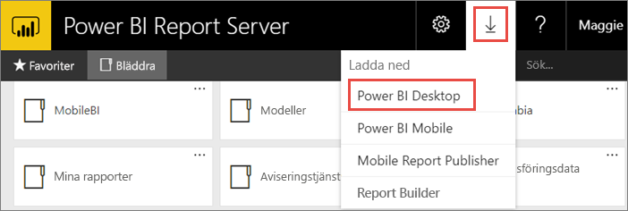
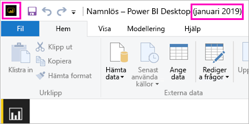
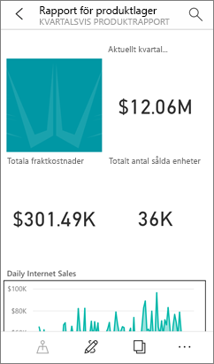

# Installera Power BI Desktop som har optimerats för Power BI-rapportservern
Lär dig att installera Power BI Desktop som har optimerats för Power BI-rapportservern.

Om du vill skapa Power BI-rapporter för Power BI-rapportservern måste du hämta och installera Power BI Desktop optimerad för Power BI-rapportserver. Den här versionen skiljer sig från Power BI Desktop som används med Power BI-tjänsten. Versionen av Power BI Desktop för Power BI-tjänsten innehåller till exempel förhandsgranskningsfunktioner som inte är tillgängliga i Power BI-rapportserverversionen förrän de släpps. Om du använder den här versionen, se till att rapportservern kan interagera med en känd version av rapporter och modeller. 

Den bra nyheten är att du kan installera Power BI Desktop och Power BI Desktop som har optimerats för Power BI-rapportservern sida vid sida på samma dator.

## Ladda ner och installera Power BI Desktop

Det enklaste sättet att se till att du har den senaste versionen av Power BI Desktop optimerad för Power BI-rapportserver är att starta från webbportalen för din rapportserver.

1. I webbportalen för rapportservern väljer du pilen **Hämta** > **Power BI Desktop**.

    

    Eller så du kan gå direkt till [Microsoft Power BI Desktop](https://go.microsoft.com/fwlink/?linkid=2055039) (optimerad för Power BI-rapportserver – januari 2019) i Microsoft Download Center.

2. På sidan Download Center väljer du **Hämta**.

3. Beroende på din dator, väljer du: 

    - **PBIDesktopRS.msi** (32-bitarsversionen) eller

    - **PBIDesktopRS_x64.msi** (64-bitarsversionen).

1. När du har hämtat installationsprogrammet kör du installationsguiden för Power BI Desktop (januari 2019).

2. I slutet av installationen, markerar du **Starta Power BI Desktop nu**.
   
    Det startar automatiskt och du är redo att sätta igång.

## Kontrollera att du använder rätt version
Det är enkelt att kontrollera att du använder rätt version av Power BI Desktop: Titta på startskärmen eller namnlisten i Power BI Desktop. Namnlisten visar månad och år för versionen. Power BI-logotypens färger är dessutom spegelvända, gult på svart istället för svart på gult.

Power BI Desktop-versionen för Power BI-tjänsten har inte månaden och året i namnlisten.

## Association för filtillägg
Om du installerar både Power BI Desktop och Power BI Desktop som har optimerats för Power BI-rapportservern på samma dator har den senaste installationen av Power BI Desktop en filassociation med .pbix-filer. Det innebär att den Power BI Desktop-version som installerades senast öppnas när du dubbelklickar på en pbix-fil.

Om du har Power BI Desktop och sedan installerar Power BI Desktop som har optimerats för Power BI-rapportservern öppnas alla pbix-filer i Power BI Desktop som är optimerat för Power BI-rapportservern som standard. Om du hellre vill att Power BI Desktop ska vara standard för att öppna pbix-filer kan du installera om [Power BI Desktop från Microsoft Store](http://aka.ms/pbidesktopstore).

Du kan alltid öppna den version av Power BI Desktop som du vill använda först. Och sedan öppna filen i Power BI Desktop.

När du redigerar en Power BI-rapport från Power BI-rapportservern eller skapar en ny Power BI-rapport från webbportalen öppnas alltid rätt version av Power BI Desktop.

## Överväganden och begränsningar
Power BI-rapporter i Power BI-rapportserver, i Power BI-tjänsten (http://app.powerbi.com) och i Power BI-mobilappen fungerar nästan likadant men några funktioner skiljer sig).

### I en webbläsare
Rapporter i Power BI-rapportservern har stöd för alla visualiseringar, inklusive:

* Anpassade visuella objekt

Rapporter i Power BI-rapportservern stöder inte:

* R-visualiseringar
* ArcGIS-mappar
* Synliga sökvägar
* Power BI Desktop-förhandsgranskningsfunktioner

### I Power BI-mobilappar
Rapporter i Power BI-rapportservern stöder alla de grundläggande funktionerna i [Power BI-mobilappar](../consumer/mobile/mobile-apps-for-mobile-devices.md), inklusive:

* [Telefonrapportlayout](../desktop-create-phone-report.md): Du kan optimera en rapport för Power BI-mobilappar. Optimerade rapporter på din mobiltelefon har en särskild ikon,  och en särskild layout.
  
    

Rapporter i Power BI-rapportservern stöder inte de här funktionerna i Power BI-mobilappar:

* R-visualiseringar
* ArcGIS-mappar
* Anpassade visuella objekt
* Synliga sökvägar
* Geofiltering eller streckkoder

## Power BI Desktop för tidigare versioner av Power BI-rapportserver

Om din rapportserver är en tidigare version behöver du motsvarande version av Power BI Desktop. Här är den tidigare versionen.

- Microsoft Power BI Desktop ([som har optimerats för Power BI-rapportservern – augusti 2018](https://www.microsoft.com/download/details.aspx?id=57271))

## Nästa steg
Nu när du har installerat Power BI Desktop kan du börja skapa Power BI-rapporter.

[Skapa en Power BI-rapport för Power BI-rapportservern](quickstart-create-powerbi-report.md)  
[Vad är Power BI-rapportservern?](get-started.md)

Har du fler frågor? [Fråga Power BI Community](https://community.powerbi.com/)

