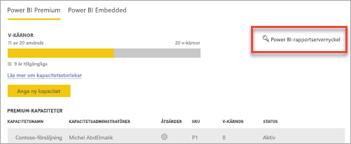
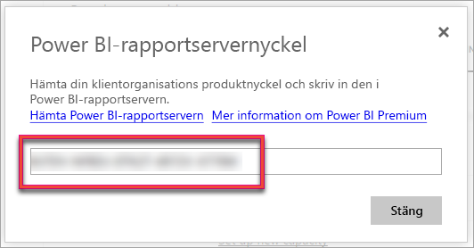
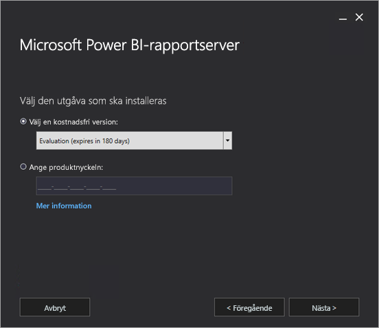
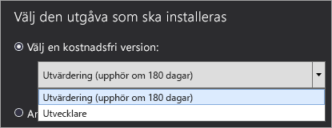
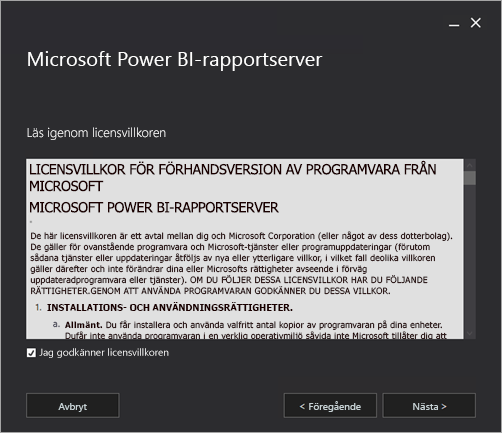
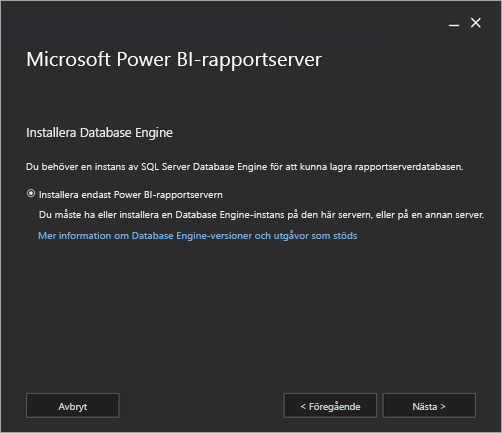
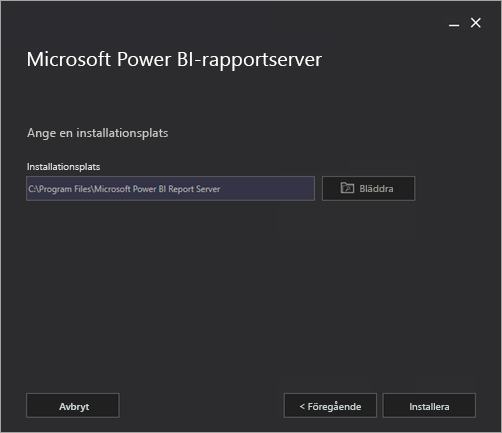
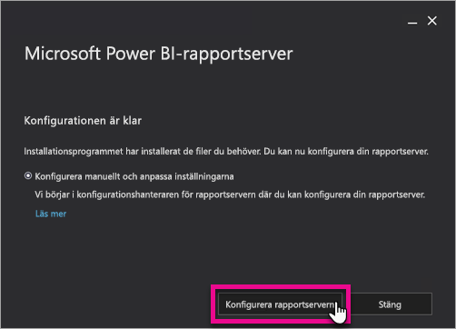
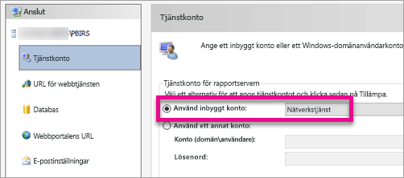

# Installera Power BI-rapportserver

Läs mer om att installera Power BI-rapportserver.

## Hämta Power BI-rapportservern

Gå till sidan [Lokal rapportering med Power BI-rapportserver](https://powerbi.microsoft.com/report-server/) och välj **Hämta en gratis utvärderingsversion**.

När du kör filen PowerBIReportServer.exe väljer du den kostnadsfria utvärderingsversionen eller anger produktnyckeln. Läs vidare om du vill veta mer.

## Innan du installerar

Innan du installerar Power BI-rapportservern rekommenderar vi att du granskar [maskin- och programvarukraven för att installera Power BI-rapportservern](system-requirements.md).

 > [!IMPORTANT]
 > Power BI-rapportservern kan installeras i en miljö som har en skrivskyddad domänkontrollant (RODC) men Microsoft Power BI-rapportservern behöver åtkomst till en domänkontrollant som inte är skrivskyddad för att fungera korrekt. Om Microsoft Power BI-rapportservern bara har åtkomst till en RODC, kan det uppstå fel när du försöker administrera tjänsten.

### Produktnyckel för Power BI-rapportserver

Du kan hämta produktnyckeln för Power BI-rapportserver från två olika källor:

- Power BI Premium
- SQL Server Enterprise Software Assurance (SA)

Läs vidare om du vill veta mer.

#### Power BI Premium

Om du har köpt Power BI Premium hittar du din produktnyckel för Power BI-rapportservern på fliken **Premium-inställningar** i Power BI-administratörsportalen. Administratörsportalen är endast tillgänglig för globala administratörer eller användare som har tilldelats rollen Power BI-tjänstadministratör.

Om du väljer **Power BI-rapportservernyckel** så visas en dialogruta med din produktnyckel. Du kan kopiera den och använda den med installationen.

#### SQL Server Enterprise Software Assurance (SA)

Om du har ett SQL Server Enterprise SA-avtal, kan du få din produktnyckel från [Volume Licensing Service Center](https://www.microsoft.com/Licensing/servicecenter/).

## Installera din rapportserver

Det är enkelt att installera Power BI-rapportservern. Det krävs endast några få steg för att installera filerna.

Du behöver inte en SQL Server Database Engine-server tillgänglig vid tidpunkten för installationen. Du behöver bara en för att konfigurera Reporting Services efter installationen.

1. Hitta platsen för PowerBIReportServer.exe och starta installationsprogrammet.

2. Välj **installera Power BI-rapportservern**.

    
3. Välj en utgåva att installera och välj sedan **nästa**.

    

    Välj antingen Utvärdering eller Developer edition.

    

    Annars anger du produktnyckeln du fått antingen från Power BI-tjänsten eller Volume License Service Center. Mer information om hur du hämtar din produktnyckel finns i avsnittet [Innan du installerar](#before-you-install) ovan.
4. Läs och godkänn licensvillkoren och välj sedan **Nästa**.

    
5. Du måste ha en databasmotor som är tillgänglig för att lagra rapportserverdatabasen. Välj **nästa** för att enbart installera rapportservern.

    
6. Ange installationsplatsen för rapportservern. Välj **installera** för att fortsätta.

    

    Standardsökvägen är C:\Program Files\Microsoft Power BI Report Server.

7. När installationen är slutförd, kan du välja **konfigurera rapportservern** för att starta konfigurationshanteraren för Reporting Services.

    

## Konfigurera rapportservern

När du har valt **Konfigurera rapportservern** i installationsprogrammet, visas du konfigurationshanteraren för Reporting Services. Mer information finns i [konfigurationshanteraren för Reporting Services](https://docs.microsoft.com/sql/reporting-services/install-windows/reporting-services-configuration-manager-native-mode).

[Skapa en rapportserverdatabas](https://docs.microsoft.com/sql/reporting-services/install-windows/ssrs-report-server-create-a-report-server-database) för att slutföra den inledande konfigurationen av Reporting Services. En SQL Server Database-server krävs för att slutföra det här steget.

### Skapa en databas på en annan server

Om du skapar rapportserverdatabasen på en databasserver på en annan dator, ändrar du tjänstkontot för rapportservern till en autentiseringsuppgift som kan identifieras på databasservern. 

Som standard använder rapportservern det virtuella tjänstkontot. Om du försöker skapa en databas på en annan server, kan du få följande fel i steget tillämpar anslutningsrättigheter.

`System.Data.SqlClient.SqlException (0x80131904): Windows NT user or group '(null)' not found. Check the name again.`

Du kan kringgå felet genom att ändra kontot till antingen nätverkstjänst eller ett domänkonto. Om du ändrar kontot till nätverkstjänst så tillämpas rättigheter i kontexten för datorkontot för rapportservern.

Mer information finns i [konfigurera tjänstkontot för rapportservern](https://docs.microsoft.com/sql/reporting-services/install-windows/configure-the-report-server-service-account-ssrs-configuration-manager).

## Windows-tjänsten

En windows-tjänst skapas som en del av installationen. Den visas som **Power BI-rapportserver**. Tjänstnamnet är **PowerBIReportServer**.

## Standard-URL-reservationer

URL-reservationer består av ett prefix, värdnamn, port och en virtuell katalog:

| Del | Beskrivning |
| --- | --- |
| Prefix |Standardprefixet är HTTP. Om du tidigare har installerat ett certifikat för Secure Sockets Layer (SSL) görs ett försök att skapa URL-reservationer som använder HTTPS-prefixet. |
| Värddatornamn |Standardvärdnamnet är ett starkt jokertecken (+). Det anger att rapportservern godkänner alla HTTP-begäranden på den angivna porten för alla värdnamn som matchas till datorn, inklusive `https://<computername>/reportserver`, `https://localhost/reportserver` eller`https://<IPAddress>/reportserver.` |
| Port |Standardporten är 80. Om du använder någon annan port än port 80 så måste du uttryckligen lägga till den till URL:en när du öppnar webbportalen i ett webbläsarfönster. |
| Virtuell katalog |Som standard skapas virtuella kataloger i formatet ReportServer för webbtjänsten rapportserver och rapporter för webbportalen. För webbtjänsten rapportserver, är den virtuella standardkatalogen **rapportserver**. För webbportalen är den virtuella standardkatalogen **rapporter**. |

Ett exempel på den fullständiga URL-strängen kan vara följande:

* `https://+:80/reportserver`, ger åtkomst till rapportservern.
* `https://+:80/reports`, ger åtkomst till webbportalen.

## Brandväggen

Om du ansluter till rapportservern från en fjärrdator kontrollerar du att du har konfigurerat brandväggsregler om det finns en brandvägg.

Öppna TCP-porten som du har konfigurerat för din webbtjänst-URL och webbportals-URL. De är konfigurerade på TCP-port 80 som standard.

## Ytterligare konfiguration

* Om du vill konfigurera integration med Power BI-tjänsten så att du kan fästa rapportobjekt i en Power BI-instrumentpanel, se [integrera med Power BI-tjänsten](https://docs.microsoft.com/sql/reporting-services/install-windows/power-bi-report-server-integration-configuration-manager).
* Om du vill konfigurera e-post för prenumerationsbearbetning, se [e-postinställningar](https://docs.microsoft.com/sql/reporting-services/install-windows/e-mail-settings-reporting-services-native-mode-configuration-manager) och [e-postleverans i en rapportserver](https://docs.microsoft.com/sql/reporting-services/subscriptions/e-mail-delivery-in-reporting-services).
* Om du vill konfigurera webbportalen så att du kan komma åt den på en rapportdator för att visa och hantera rapporter, se [konfigurera en brandvägg för reportserveråtkomst](https://docs.microsoft.com/sql/reporting-services/report-server/configure-a-firewall-for-report-server-access) och [konfigurera en rapportserver för fjärradministration](https://docs.microsoft.com/sql/reporting-services/report-server/configure-a-report-server-for-remote-administration).

## Nästa steg

[Administratörsöversikt](admin-handbook-overview.md)  
[Så här hittar du rapportserverns produktnyckel](find-product-key.md)  
[Installera Power BI Desktop som har optimerats för Power BI-rapportservern](install-powerbi-desktop.md)  
[Verifiera en Reporting Services-installation](https://docs.microsoft.com/sql/reporting-services/install-windows/verify-a-reporting-services-installation)  
[Konfigurera tjänstkontot för rapportservern](https://docs.microsoft.com/sql/reporting-services/install-windows/configure-the-report-server-service-account-ssrs-configuration-manager)  
[Konfigurera rapportserverns URL:er](https://docs.microsoft.com/sql/reporting-services/install-windows/configure-report-server-urls-ssrs-configuration-manager)  
[Konfigurera en databasanslutning för rapportservern](https://docs.microsoft.com/sql/reporting-services/install-windows/configure-a-report-server-database-connection-ssrs-configuration-manager)  
[Initiera en rapportserver](https://docs.microsoft.com/sql/reporting-services/install-windows/ssrs-encryption-keys-initialize-a-report-server)  
[Konfigurera SSL-anslutningar på en rapportserver](https://docs.microsoft.com/sql/reporting-services/security/configure-ssl-connections-on-a-native-mode-report-server)  
[Konfigurera Windows-tjänstekonton och -behörigheter](https://docs.microsoft.com/sql/database-engine/configure-windows/configure-windows-service-accounts-and-permissions)  
[Webbläsarstöd för Power BI-rapportserver](browser-support.md)

Har du fler frågor? [Fråga Power BI Community](https://community.powerbi.com/)