# <a name="quickstart-embed-a-power-bi-report-server-report-using-an-iframe-in-sharepoint-server"></a>Snabbstart: Bädda in en Power BI Report Server-rapport med iFrame i SharePoint Server

I den här snabbstarten lär du dig att bädda in en Power BI Report Server-rapport med iFrame i en SharePoint-sida. Om du arbetar med SharePoint Online, måste Power BI Report Server vara allmänt tillgänglig. I SharePoint Online fungerar inte Power BI-webbdel som fungerar med Power BI-tjänsten med Power BI Report Server. 

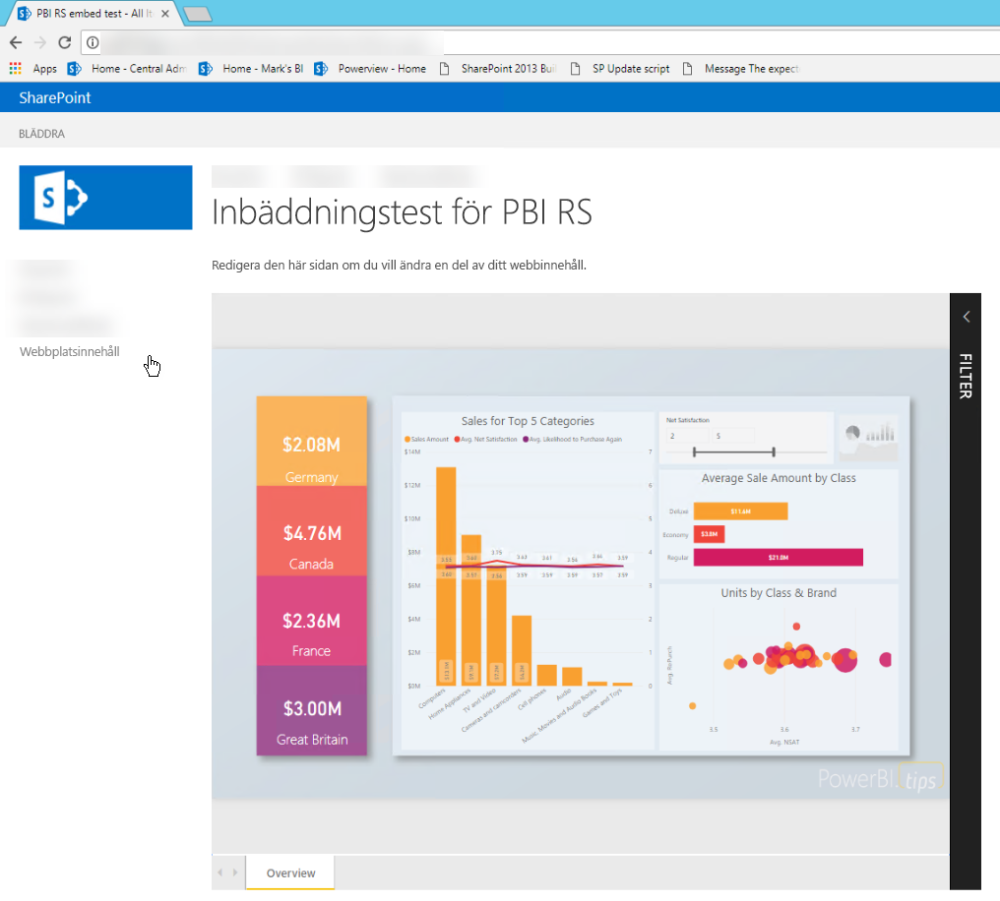
## <a name="prerequisites"></a>Förutsättningar
* Du måste ha [Power BI-rapportservern](https://powerbi.microsoft.com/en-us/report-server/) installerad och konfigurerad.
* Du måste ha [Power BI Desktop som har optimerats för Power BI-rapportservern](install-powerbi-desktop.md) installerad.
* Du måste ha en [SharePoint](https://docs.microsoft.com/sharepoint/install/install)-miljö installerad och konfigurerad.

## <a name="creating-the-power-bi-report-server-report-url"></a>Skapa Power BI-rapportserverns rapport-URL

1. Hämta exemplet från GitHub – [Bloggdemo](https://github.com/Microsoft/powerbi-desktop-samples).

    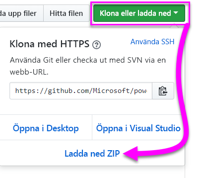

2. Öppna PBIX-exempelfilen från GitHub i **Power BI Desktop optimerad för Power BI Report Server**.

    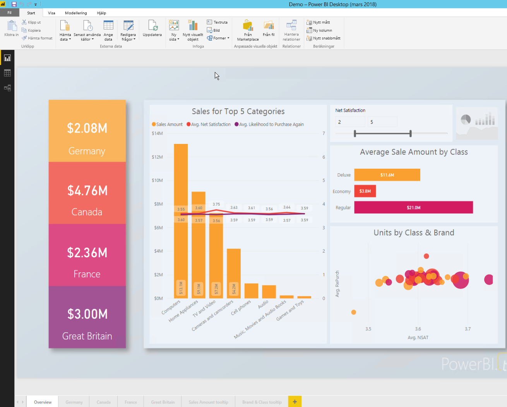

3. Spara rapporten till **Power BI-rapportservern**. 

    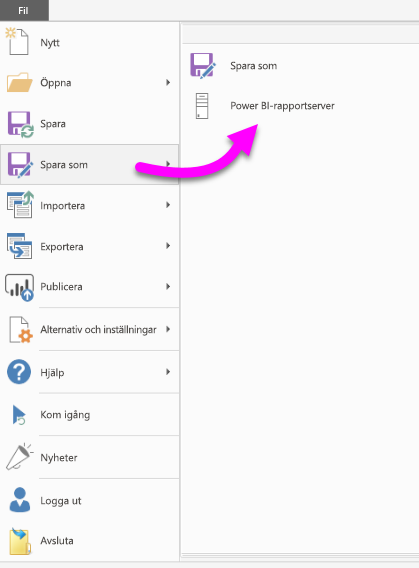

4. Visa rapporten i **webbportalen**.

    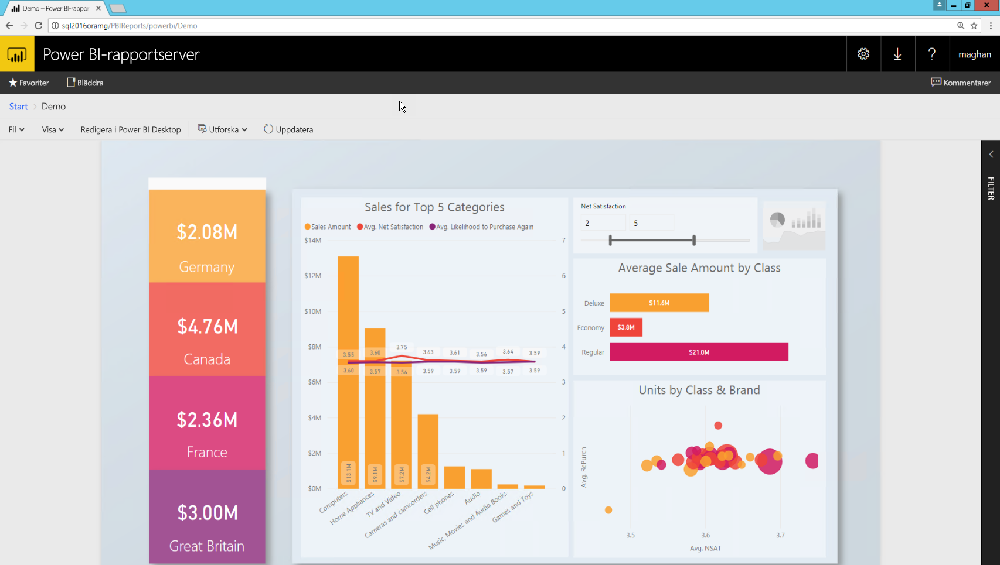

### <a name="capturing-the-url-parameter"></a>Samla in URL-parametern

När du har din URL kan du skapa en iFrame på en SharePoint-sida som värd för rapporten. För en Power BI-rapportserves rapport-URL kan du lägga till en querystring-parameter av `?rs:embed=true` för att bädda in rapporten i en iFrame. 

   Till exempel:
    ``` 
    http://myserver/reports/powerbi/Sales?rs:embed=true
    ```
## <a name="embedding-a-power-bi-report-server-report-in-a-sharepoint-iframe"></a>Bädda in en Power BI Report Server-rapport i en SharePoint iFrame

1. Navigera till en SharePoint **webbplatsinnehåll**-sida.

    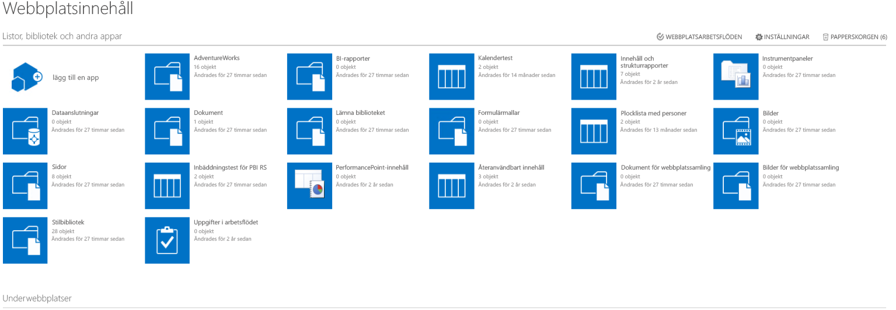

2. Välj sidan där du vill lägga till en rapport.

    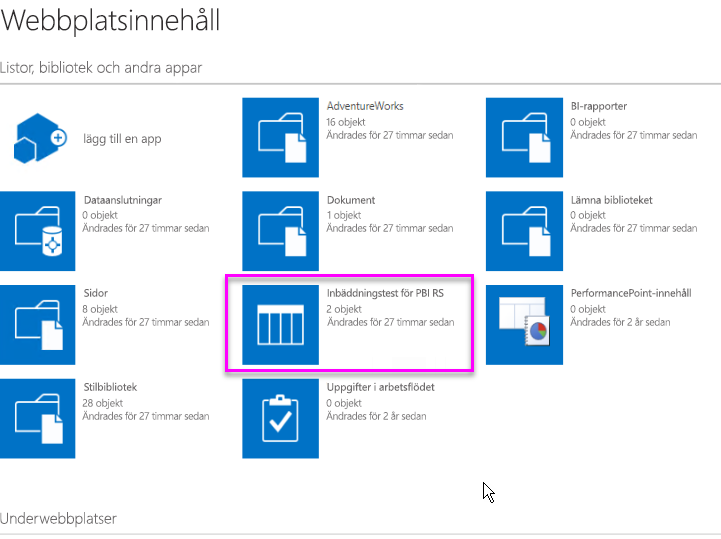

3. Välj kugghjulet längst upp till höger och välj **Redigera sida**.

    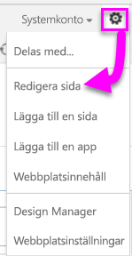

4. Välj **Lägg till webbdel**.

    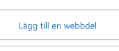

5. Under **Kategorier** välj **Media och innehåll**, under **Delar**, välj **Innehållsredigerare** och välj sedan **Lägg till** .

    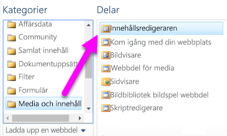 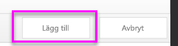

6. Välj **Klicka här för att lägga till nytt innehåll**.

    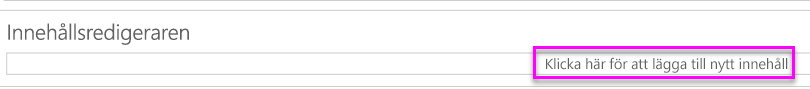

7. Välj i menyfliksområdet fliken **Formatera text** och välj sedan **Redigera källa**.

     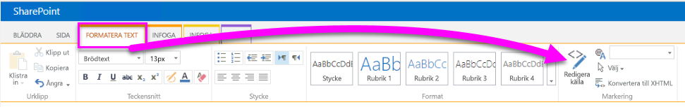

8. I fönstret Redigera datakällan klistrar du in iFrame-koden och klickar på OK.

    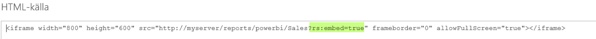

     Till exempel:
     ```
     <iframe width="800" height="600" src="http://myserver/reports/powerbi/Sales?rs:embed=true" frameborder="0" allowFullScreen="true"></iframe>
     ```

9. Välj i menyfliksområdet i´fliken **Sida** och markera **Sluta redigera**.

    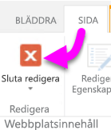

10. Du bör nu se rapporten på sidan.

    

## <a name="next-steps"></a>Nästa steg

[Snabbstart: Skapa en Power BI-rapport för Power BI-rapportservern](quickstart-create-powerbi-report.md)  
[Snabbstart: Skapa en sidnumrerad rapport för Power BI-rapportservern](quickstart-create-paginated-report.md)  

Har du fler frågor? [Fråga Power BI Community](https://community.powerbi.com/) 