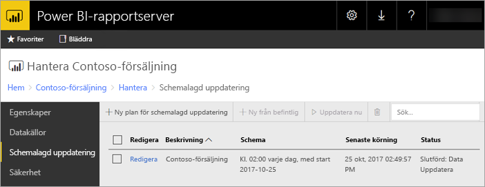

# Schemalagd uppdatering av Power BI-rapport i Power BI-rapportserver
Schemalagd uppdatering för Power BI-rapporter gör att data för en rapport hålls uppdaterad.

Schemalagd uppdatering är specifik för Power BI-rapporter med en inbäddad modell. Det innebär att du importerat data in i rapporten istället för att använda en live-anslutning eller DirectQuery. När du importerar dina data, kopplas de bort från den ursprungliga datakällan och måste uppdateras för att hålla data uppdaterade. Schemalagd uppdatering är sättet som du håller dina data uppdaterade.

Schemalagd uppdatering konfigureras i hanteringsavsnittet för en rapport. Mer information om hur du konfigurerar schemalagd uppdatering finns i [så här konfigurerar du schemalagd uppdatering för Power BI-rapporter](configure-scheduled-refresh.md).

## Så här fungerar det
Flera komponenter ingår när du använder schemalagd uppdatering för Power BI-rapporter.

* SQL Server Agent som en timer för att skapa schemalagda händelser.
* Schemalagda jobb läggs till i en kö med händelser och meddelanden i rapportserverdatabasen. I en utskalningsdistribution, delas kön över alla rapportservrar i distributionen.
* All rapportbearbetning som sker som ett resultat av en schemahändelse, utförs som en bakgrundsprocess.
* Datamodellen laddas i en Analysis Services-instans.
* För vissa datakällor, används Power Query Mashup Engine för att ansluta till datakällor och transformera data. Andra datakällor går att ansluta till direkt från en Analysis Services-tjänst som används som värd för datamodellerna för Power BI-rapportserver.
* Nya data laddas i datamodellen i Analysis Services.
* Analysis Services bearbetar data och utför nödvändiga beräkningar.

Power BI-rapportserver har en händelsekö för alla schemalagda åtgärder. Den frågar kön med jämna mellanrum för att söka efter nya händelser. Som standard genomsöks kön i 10-sekundersintervall. Du kan ändra intervallet genom att ändra konfigurationsinställningarna **PollingInterval**, **IsNotificationService** och **IsEventService** i filen RSReportServer.config. **IsDataModelRefreshService** kan också användas för att ange om en rapportserver bearbetar schemalagda händelser.

### Analysis Services
Att återge en Power BI-rapport och att utföra en schemalagd uppdatering, kräver att Power BI-rapportens datamodell laddas i Analysis Services. En Analysis Services-process körs med Power BI-rapportserver.

## Överväganden och begränsningar
### När schemalagd uppdatering inte kan användas
Alla Power BI-rapporter kan inte ha en schemalagd uppdateringsplan skapad för sig. Följande är en lista över Power BI-rapporter som du inte kan skapa en schemalagd uppdateringsplan för.

* Din rapport innehåller en eller flera Analysis Services-datakällor som använder en live-anslutning.
* Din rapport innehåller en eller flera datakällor som använder DirectQuery.
* Din rapport innehåller inte någon datakällan. Data kanske anges manuellt via *ange data* eller så innehåller en rapport endast statiskt innehåll som bilder, text osv.

Förutom listan ovan finns det specifika scenarier med datakällor i *importera*-läge, där du inte kan skapa uppdateringsplaner.

* Om en *fil*- eller *mapp*-datakälla används och sökvägen är en lokal sökväg (t.ex. C:\Users\user\Documents) så går det inte att skapa en uppdateringsplan. Sökvägen måste vara en sökväg som rapportservern kan ansluta till som en nätverksresurs. Till exempel, *\\myshare\Documents*.
* Om datakällan enbart kan anslutas till med OAuth (t.ex. Facebook, Google Analytics, Salesforce osv.) så går det inte att skapa en plan för cacheuppdatering. För tillfället stöder RS inte OAuth-autentisering för några datakällor, oavsett om det är för sidnumrerade, mobila eller Power BI-rapporter.

### Minnesbegränsningar
Traditionell arbetsbelastning för en rapportserver liknar ett webbprogram. Möjligheten att läsa in rapporter med importerade data eller DirectQuery och möjligheten att utföra schemalagd uppdatering är beroende av en Analysis Services-instans som finns vid sidan av rapportservern. Det kan därför orsaka oväntade minnesbelastningar på servern. Planera din serverdistribution därefter och i vetskapen att Analysis Services kan komma att förbruka minne tillsammans med rapportservern.

Information om hur du övervakar en Analysis Services-instans finns i [Övervaka en Analysis Services-instans](https://docs.microsoft.com/sql/analysis-services/instances/monitor-an-analysis-services-instance).

Information om inställningar för minne i Analysis Services finns i [Minnesegenskaper](https://docs.microsoft.com/sql/analysis-services/server-properties/memory-properties).

### Autentisering och Kerberos
Om din datakälla är konfigurerad att använda Windows-autentiseringsuppgifter, kan Kerberos-begränsad delegering behöva konfigureras för att fungera. Mer information finns i [konfigurera Windows-autentisering på rapportservern](https://docs.microsoft.com/sql/reporting-services/security/configure-windows-authentication-on-the-report-server).

## Nästa steg
Konfigurera [schemalagd uppdatering](configure-scheduled-refresh.md) på en Power BI-rapport.

Har du fler frågor? [Fråga Power BI Community](https://community.powerbi.com/)

