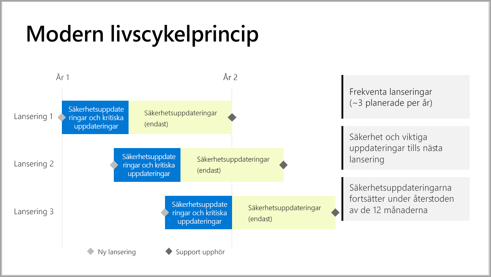

# Supporttider för Power BI-rapportservern

Power BI-rapportservern släpps ett par gånger per år. Säkerhetsuppdateringar och viktiga uppdateringar är tillgängliga tills nästa utgåva blir allmänt tillgänglig (GA). När nästa version har släppts fortsätter den föregående versionen att ta emot uppdateringar under återstoden av 12-månadsperioden.

Med den här supportpolicyn kan vi leverera nyheter till kunderna snabbt samt ge dem flexibiliteten att införa dem i sin egen takt.

* Servicefas för säkerhetsuppdateringar och viktiga uppdateringar – När du kör den senaste aktuella versionen av Power BI-rapportservern får du både säkerhetsuppdateringar och viktiga uppdateringar.
* Servicefas för (enbart) säkerhetsuppdateringar – När en ny version släpps begränsas stödet för äldre versioner till att enbart omfatta säkerhetsuppdateringar under resten av 12-månadsperioden (visas på bild 1).

    

## Versionshistorik

| **Version** | **Tillgänglighetsdatum** | **Slutdatum för support** |
| --- | --- | --- |
| Juni 2017 |12 juni 2017 |Stöds inte längre |
| Oktober 2017 |31 oktober 2017 | Stöds inte längre |
| Mars 2018 | 19 mars 2018 | 19 mars 2019 |
| Augusti 2018 | 15 augusti 2018 | 15 augusti 2019 |
| Januari 2019 | 23 januari 2019 | 23 januari 2020 |
| Maj 2019 | 22 maj 2019 | 22 maj 2020 |

Om du vill ladda ned Power BI-rapportservern och Power BI Desktop som är optimerat för Power BI-rapportserver, går du till [Lokal rapportering med Power BI-rapportserver](https://powerbi.microsoft.com/report-server/).

## Nästa steg
[Nyheter i Power BI-rapportserver](whats-new.md)  
[Vad är Power BI-rapportservern? ](get-started.md) 
 [Administratörsöversikt](admin-handbook-overview.md)  
[Installera Power BI-rapportserver](install-report-server.md)  

Har du fler frågor? [Fråga Power BI Community](https://community.powerbi.com/)