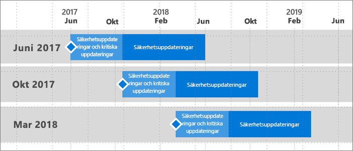

# Supporttider för Power BI-rapportservern
Power BI-rapportservern kommer att släppas ett par gånger per år. Säkerhets- och kritiska uppdateringar kommer vara tillgängliga tills nästa utgåva blir allmänt tillgänglig (GA). Efter nästa utgåva fortsätter den föregående versionen att ta emot uppdateringar under återstoden av 12-månadsversionen.

Med den här supportpolicyn kan vi leverera nyheter till kunderna snabbt samt ge dem flexibiliteten att införa dem i sin egen takt.

* Servicefas för säkerhets- och kritiska uppdateringar – När du kör den senaste aktuella versionen av Power BI-rapportservern, får du både säkerhets- och kritiska uppdateringar.
* Servicefas för säkerhetsuppdateringar (endast) – När en ny version släpps minskas stödet för äldre versioner till enbart säkerhetsuppdateringar under resten av tolvmånadersperiodens supportcykel (visas i bild 1).

    

## Versionshistorik
| **Version** | **Tillgänglighetsdatum** | **Slutdatum för support** |
| --- | --- | --- |
| Juni 2017 |12 juni 2017 |12 juni 2018 |
| Oktober 2017 |31 oktober 2017 |31 oktober 2018 |
| Mars 2018 | 19 mars 2018 | 19 mars 2019 |

Om du vill ladda ned Power BI-rapportservern och Power BI Desktop som är optimerat för Power BI-rapportserver, går du till [Lokal rapportering med Power BI-rapportserver](https://powerbi.microsoft.com/report-server/).

## Nästa steg
[Nyheter i Power BI-rapportserver](whats-new.md)  
[Vad är Power BI-rapportservern? ](get-started.md) 
 [Administratörsöversikt](admin-handbook-overview.md)  
[Installera Power BI-rapportserver](install-report-server.md)  

Har du fler frågor? [Fråga Power BI Community](https://community.powerbi.com/)

