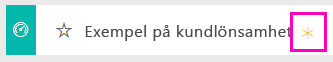
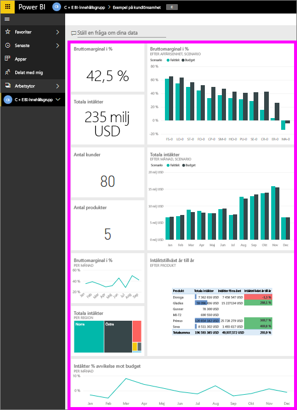
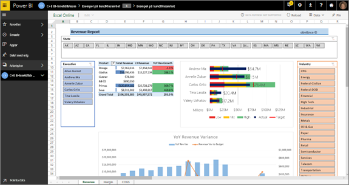
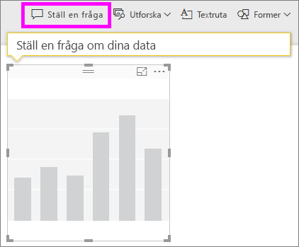
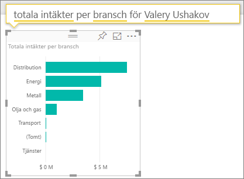
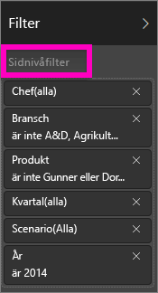
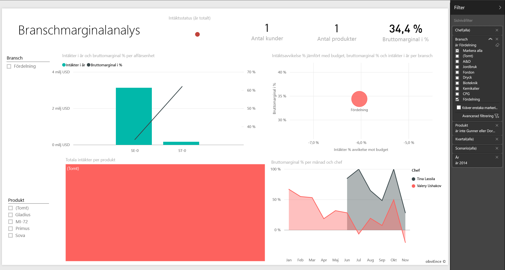
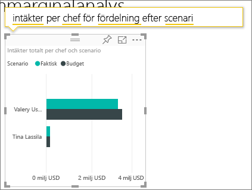

# Exempel på kundlönsamhet för Power BI: Ta en rundtur

## Översikt av exemplet för kundlönsamhet
Innehållspaketet ”Exempel på kundlönsamhet” innehåller en instrumentpanel, en rapport och en datauppsättning för ett företag som tillverkar marknadsföringsmaterial. Den här instrumentpanelen skapades av en ekonomichef för att visa en statistiköversikt för hennes 5 enhetschefer, produkter, kunder och bruttomarginal. I korthet kan hon se vilka faktorer som påverkar lönsamheten.

Det här exemplet ingår i en serie som illustrerar hur du kan använda Power BI med affärsorienterade data, rapporter och instrumentpaneler. Det här är verkliga data från obviEnce ([www.obvience.com](http://www.obvience.com/)) som har anonymiserats. Data är tillgängliga i flera format: innehållsförpackning/-app, Excel-arbetsbok eller PBIX-fil för Power BI Desktop. Se [Exempeldatauppsättningar](sample-datasets.md).

## Förutsättningar
Vill du hänga på? Den här självstudien använder Power BI-tjänsten och exempelinnehållspaketet ”Kundlönsamhet”.  Eftersom rapportupplevelserna är så lika kan följa du med även via Power BI Desktop och PBIX-exempelfilen. Instruktioner för att ansluta till innehållspaketet och PBIX-filen finns nedan.

### Hämta innehållspaketet för det här exemplet

1. Öppna Power BI-tjänsten (app.powerbi.com) och logga in.
2. Längst ned i vänster hörn väljer du **Hämta data**.

    
3. På sidan Hämta data väljer du ikonen **Exempel**.

   
4. Välj **Exempel på kundlönsamhet** och välj **Anslut**.  

   
5. Power BI importerar innehållspaketet och lägger till en ny instrumentpanel, rapport och datauppsättning till din aktuella arbetsyta. Det nya innehållet markeras med en gul asterisk. Använd exemplen för att ta en testtur i Power BI.  

   

### Hämta .pbix-filen för det här exemplet

Du kan även hämta exemplet som en .pbix-fil som är avsedd för användning med Power BI Desktop.
[Exempel på kundlönsamhet](http://download.microsoft.com/download/6/A/9/6A93FD6E-CBA5-40BD-B42E-4DCAE8CDD059/Customer Profitability Sample PBIX.pbix)

### Hämta Excel-arbetsboken för det här exemplet

Om du vill gå djupare in i datakällan för det här exemplet, är det också tillgängligt som en [(Excel-arbetsbok)](http://go.microsoft.com/fwlink/?LinkId=529781). Arbetsboken innehåller Power View-blad som du kan visa och ändra. Om du vill se rådata, väljer du **Power Pivot > Hantera**.

## Vad kan vi utläsa från instrumentpanelen?

Under **Min arbetsyta**, hittar du instrumentpanelen för Exemplet på kundlönsamhet:

### Instrumentpaneler för hela företaget
1. Öppna instrumentpanelen i Power BI-tjänsten. Dessa paneler på instrumentpanelen ger vår ekonomichef en överblick över de mått för företaget på hög nivå som är viktiga för henne.  När hon ser något intressant, kan hon välja en panel för att granska närmare.

2. Granska panelerna på vänster sida av instrumentpanelen.

    

- Vårt företags bruttomarginal är 42,5 %.
- Vi har 80 kunder.
- Vi säljer 5 olika produkter.
- Vi hade våra lägsta intäktsavvikelse % i förhållande till budget i februari, följt av vår högsta i mars.
- De flesta av våra intäkter kommer från regionerna öst och norr. Bruttomarginalen överskred aldrig budgeten, men ER 0 och MA-0 kräver något närmare granskning.
- Totala intäkter för året ligger nära budgeten.

### Chefspecifika instrumentpaneler
Panelerna på höger sida av instrumentpanelen ger ett poängkort för teamet. Det är viktigt för ekonomichefen att kunna följa cheferna och dessa paneler ger henne en översikt över vinsten med hjälp av bruttomarginal i %. Om trenden för bruttomarginalen % är oväntad för någon chef kan hon undersöka detta närmare.

- Alla chefer utom Carlos, har redan passerat försäljningsmålet. Men Carlos faktiska försäljning är den högsta.
- Annelies bruttomarginal % är lägst, men det syns en konstant ökning sedan mars.
- Å andra sidan har Valerys bruttomarginal % avtagit avsevärt.
- Anders har haft ett varierande år.

## Utforska instrumentpanelens underliggande data
Den här instrumentpanelen innehåller paneler som länkar till en rapport och till en Excel-arbetsbok.

### Öppna Excel Online-datakällan
Två paneler på den här instrumentpanelen ”Mål kontra faktisk” och ”Tillväxt år för år” har fästs från en Excel-arbetsbok. När du väljer någon av dessa paneler, så öppnas datakällan – i det här fallet Excel Online Power BI.

1. Välj någon av panelerna som fästs från Excel. Excel Online öppnas i Power BI-tjänsten.
2. Observera att arbetsboken har 3 flikar med data. Öppna ”Intäkter”.
3. Nu ska vi undersöka varför Carlos inte har nått sitt mål ännu.  
    a. Från skjutreglaget ”Executive”, välj **Carlos Grilo**.   
    b. Första pivottabellen talar om för oss att Carlos intäkter för hans topprodukt Primus, har gått ner 152 % från föregående år. Och YoY-diagrammet visar att han är under budget de flesta månaderna.  

    

    

4. Fortsätt att utforska och om du hittar något intressant väljer du ikonen **Fäst**  från det övre högra hörnet för att [fästa det på en instrumentpanel](service-dashboard-pin-tile-from-excel.md).

5. Använd din webbläsares bakåtpil för att gå tillbaka till instrumentpanelen.

### Öppna den underliggande Power BI-rapporten
Merparten av panelerna på instrumentpanelen med exempel på Kundlönsamhet har fästs från underliggande exempelrapport om Kundlönsamhet.

1. Välj en av dessa paneler för att öppna rapporten i läsvyn.

2. Rapporten har 3 sidor. Varje flik längst ned på rapporten representerar en sida.

    

    * ”Teamresultatkort” fokuserar på de 5 chefernas prestation och deras ”räkenskaper”.
    * ”Branschmarginalanalys” är ett sätt att analysera vår lönsamhet jämfört med hela branschen.
    * ”Chefresultatkort” ger en överblick över var och en av våra chefer och formateras för visning i Cortana.

### Sidan teamresultatkort

Nu ska vi titta på två teammedlemmar i detalj och se vilka insikter som kan uppnås. Med hjälp av delaren till vänster kan du välja Andrews namn för att filtrera rapportsidan så att endast information om Andrew visas.

* För en snabb KPI, titta på Anders **intäktstatus** – det är grönt. Han presterar bra.
* Ytdiagrammet ”Intäkter Var % mot budget per månad” visar att Anders presterar ganska bra överlag, förutom en svacka i februari. Hans starka region är Öst och han hanterar 49 kunder och 5 (av 7) produkter. Hans bruttomarginal % är varken högst eller lägst.
* ”RevenueTY och intäkter Var % budget per månad” visar stadig och jämn tillväxt. Men när du filtrerar genom att klicka på rutan för **centrala** i träddiagrammet för regioner ser du att Andrew endast har intäkter för mars och endast i Indiana. Är det avsiktligt eller är detta något du behöver titta på?

Vi fortsätter till Valery. Med hjälp av delaren kan du välja Valerys namn för att filtrera rapportsidan så att endast information om Valery visas.  

* Lägg märke till röd KPI för **RevenueTY Status**. Detta måste definitivt undersökas närmare.
* Hennes intäktvarians är också oroande – hon möter inte sina intäktsmarginaler.
* Valery har bara 9 kunder, hanterar endast 2 produkter och arbetar nästan uteslutande med kunder i norr. Den här specialiseringen kan förklara varför hennes mått fluktuerar så mycket.
* När du öppnar rutan **Nord** i träddiagrammet ser du att Valerys bruttomarginal i regionen Nord överensstämmer med hennes övergripande marginal.
* När du väljer de andra **Region**-rutorna framgår en intressant berättelse: hennes bruttomarginaler i % sträcker sig från 23 % 79 % och hennes intäkter i alla regioner utom Nord är mycket säsongsbaserade.

Fortsätt att granska på djupet för att ta reda på varför Valerys område inte presterar bra. Titta på regioner, andra affärsenheter och nästa sida i rapporten – ”branschmarginalanalysen”.

### Branschmarginalanalys
Den här rapporten innehåller ett annat datasnitt. Den ser ut på bruttomarginalen för hela branschen, uppdelat efter segment. Ekonomichefen använder den här sidan för att jämföra företaget och verksamhetens enhetsmått samt branschstatistiken för att förklara hennes trender och lönsamhet. Du kanske undrar varför ytdiagrammet ”bruttomarginal per månad och chef” är på den här sidan eftersom det gäller team. När den är här kan vi filtrera sidan efter enhetschefen.  

Hur varierar lönsamheten i olika branscher? Hur fördelas produkter och kunder i olika branscher? Välj en eller flera branscher upp till vänster. (börja ed CPG-branschen) Använd ikonen Radera för att ta bort filtret.

Ekonomichefen letar efter de största bubblorna på bubbeldiagrammet eftersom det är dessa som har störst inverkan på intäkterna. Genom att filtrera sidan enligt chef genom att klicka på deras namn i ytdiagrammet är det lätt att se chefens inverkan för varje branschsegment.

* Andrews inflytande omfattar många olika branschsegment med vitt spridda ändringar % (de flesta är positiva) och Var %.
* Annelies diagram är liknande, förutom att hon endast koncentrerar sig på en handfull branschsegment med fokus på federala segment och fokus på Gladius-produkten.
* Carlos har ett tydligt fokus på tjänstsegmentet, med god vinst. Han har en avsevärt bättre varians % för tekniksegmentet och hans nya segment, industriell, presterar exceptionellt bra jämfört med budget.
* Tina arbetar med en handfull segment och har högst bruttomarginal i %, men de förhållandevis små bubblorna visar att hennes inverkan på företagets slutresultat är minimal.
* Valery som endast är ansvarig för en produkt, arbetar endast i 5 branschsegment. Hennes branschpåverkan är säsongsbaserat, men skapar alltid en stor bubbla, vilket anger en betydande inverkan på företagets slutresultat. Förklarar branschen hennes sämre prestanda?

### Chefresultatkort
Den här sidan formateras som en svarskort för Cortana. Läs mer i [skapa Svarskort för Cortana](service-cortana-answer-cards.md)

## Prova data genom att ställa frågor med frågor och svar
För vår analys skulle det vara bra att avgöra vilken bransch som står för den största omsättningen för Valery. Vi kan använda frågor och svar.

1. Öppna rapporten i redigeringsvyn genom att välja **Redigera rapport**. Redigeringsvyn är endast tillgänglig om du ”äger” rapporten. Detta är kallas ibland **skapar**läge. Om den här rapporten hade delats med dig istället, skulle du inte ha kunna öppna den i redigeringsvyn.

2.  Från den översta menyraden väljer du **Ställ en fråga** för att öppna dialogrutan Frågor och svar.

    

3. Skriv **total intäkter per bransch för Valery**. Observera hur visualiseringen uppdateras när du skriver frågan.

    

   Distributionen är det största intäktsområdet för Valery.

### Granska djupare genom att lägga till filter
Låt oss ta en titt på branschen *Distribution*.  

1. Öppna rapportsidan ”Branschmarginalanalys”.
2. Expandera filterfönstret till höger utan att välja någon visualisering på rapportsidan (om den inte redan är expanderad). Fönstret filter bör endast visa filter på sidonivå.  

   
3. Gå till filtret för **Bransch** och välj pilen för att expandera listan. Lägg till ett sidfilter för distributionsbranschen. Avmarkera först alla kryssrutor genom att avmarkera kryssrutan **Markera alla**. Välj sedan endast **Distribution.**  

   
4. I ytdiagrammet ”Bruttomarginal per månad och namn på chef” er vi att endast Valery och Tina har kunder i den här branschen och Valery har endast arbetat med den här branschen från juni till november.   
5. Välj **Tina** och sedan **Valery** i diagramförklaringen för ”Bruttomarginal per månad och namn på chef”. Observera att Tinas del av ”Totala intäkter per produkt” är mycket liten jämfört med Valery.
6. För att se faktiska intäkter, använd frågor och svar för att fråga **total intäkt av verkställande för distribution enligt scenariot**.  

     

    Vi kan utforska andra branscher och till och med lägga till kunder i våra visuella objekt för att förstå grunden till Valerys prestationer.

Det här är en säker miljö att leka runt i. Du kan alltid välja att inte spara ändringarna. Men om du sparar dem, kan du alltid gå till **Hämta data** för en ny kopia av det här exemplet.

Du kan också [hämta enbart datauppsättningen (Excel-arbetsboken) för det här exemplet](http://go.microsoft.com/fwlink/?LinkId=529781).

## Nästa steg: anslut till dina data
Vi hoppas att denna rundtur har visat hur Power BI-instrumentpaneler, frågor och svar, samt rapporter kan ge insikter om kunddata. Nu är det din tur – anslut till dina egna data. Med Power BI kan du ansluta till en mängd olika datakällor. Läs mer om att [komma igång med Power BI](service-get-started.md).

[Tillbaka till exempel i Power BI](sample-datasets.md)  
