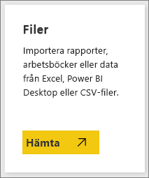
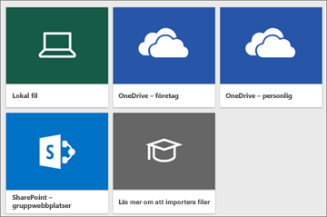
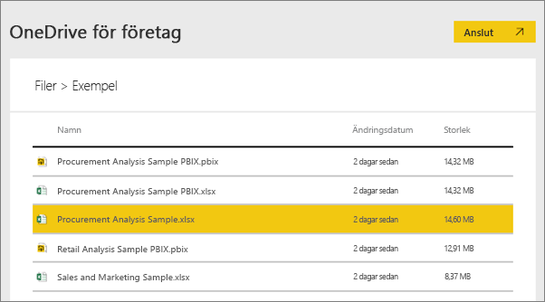
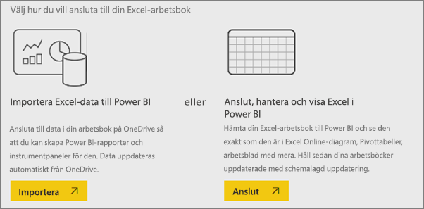
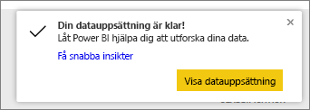
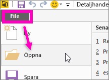

# Vilka exempeldata är tillgängliga för användning med Power BI?
Säg att du har använt Power BI och vill prova men inte har några data.  Eller så har du en datauppsättning men eftersom du inte förstår (ännu) hur Power BI fungerar oroar du dig för att du på något sätt ska skada din datauppsättning.

Du behöver inte känna dig stressad! obviEnce ([www.obvience.com](http://www.obvience.com/)) och Microsoft har skapat exempel att använda tills du känner dig bekvämade med Power BI.  Dessa data är anonyma och representerar olika branscher: ekonomi, HR, försäljning med mera. När du läser igenom våra onlinedokumentation kommer du att hitta självstudier och exempel som använder dessa dataexempel så att du kan följa med.      

   

Vart och ett av de här exemplen finns i olika format: som ett innehållspaketet, som en enskild Excel-arbetsbok och som en PBX-fil. Om du inte vet vad dessa saker är eller hur du skaffa dem, oroa dig inte. Vi förklarar det senare i den här artikeln. För varje exempel har vi skapat en *rundtur* som är en typ av artikel som talar om historien bakom exemplet och vägleder dig genom olika scenarier. Ett scenario kanske besvarar frågor för din chef, ett annat kanske söker efter konkurrenskraftiga insikter eller skapar rapporter och instrumentpaneler att dela eller förklarar en företagsförändring.   

Men innan vi sätter igång, läs igenom dessa juridiska riktlinjer för att använda exemplen. När du är klar introducerar vi exemplen för dig och visar hur du ska använda dem.   

## Riktlinjer för användning av Excel-arbetsböckerna för Power BI-exemplen
Läs informationen innan du använder Power BI-exemplen.

©2015 Microsoft Corporation. Med ensamrätt. Dokument och arbetsböcker tillhandahålls ”i befintligt skick”. Information och åsikter som uttrycks i arbetsböcker, inklusive webbadresser och andra webbplatsreferenser, kan ändras utan föregående meddelande. Du ansvarar för risken med att använda den. Några exempel är enbart för illustration och är fiktiva. Ingen verklig företeelse är avsedd eller härledd. Microsoft lämnar inga garantier, uttryckliga eller underförstådda, avseende informationen som visas här.

Arbetsböckerna ger dig inga juridiska rättigheter till någon immateriell egendom i någon Microsoft-produkt. Du kan kopiera och använda den här arbetsboken som intern referens.

Arbetsböcker och relaterade data tillhandahålls av obviEnce. [www.obvience.com](http://www.obvience.com)

ObviEnce är en inkubator för ISV och immateriell egendom (IP) som fokuserar på Microsoft Business Intelligence. ObviEnce fungerar i nära samarbete med Microsoft för att utveckla bästa praxis och överväganden för ledarskap för snabbstart och distribution av Microsoft Business Intelligence-lösningar.

Arbetsböcker och data tillhör obviEnce, LLC och har delats enbart för att demonstrera Power BI-funktioner med branschspecifika-exempeldata.

Användningsområden för arbetsböckerna och/eller data måste innefatta ovan tillskrivningar (även innefattade på informationskalkylbladet i varje arbetsbok). Arbetsboken och alla visualiseringar måste åtföljas av följande upphovsrättsmeddelande: obviEnce ©.

Genom att klicka på någon av länkarna nedan för att hämta Excel-arbetsböcker eller PBIX-filer, accepterar du villkoren ovan.

## Tillgängliga exempel
Åtta exempel är tillgängliga som du kan använda.  Vart och ett representerar olika branscher.

### Exempel på kundlönsamhet
[Ta en rundtur i exemplet för kundlönsamhet](sample-customer-profitability.md)

Det här branschexemplet analyserar en ekonomichefs nyckelmått för hennes ledning, produkter och kunder. Du kan undersöka vilka faktorer som påverkar företagets lönsamhet.

### Exempel på personalfrågor 
[Ta en rundtur i exemplet för personalfrågor](sample-human-resources.md)

Det här branschexemplet fokuserar på anställningsstrategin för ett företag genom att analysera nyanställda, aktiva medarbetare och anställda som har slutat.  Genom att utforska data kan du hitta trender i frivilliga separeringar och eventuella fördomar i anställningsstrategin.

### Exempel på IT-utgiftsanalys
[Ta en rundtur i exemplet för IT-utgiftsanalys](sample-it-spend.md)

I det här branschexemplet analyserar vi planerade kontra faktiska kostnader för ett företags IT-avdelning. Den här jämförelsen hjälper oss att förstå hur väl företaget planerade för året och undersöka områden med stora avvikelser från planen. Företaget i det här exemplet går igenom en årlig planeringscykel och sedan genererar de en ny senaste uppskattning (LE) kvartalsvis för att analysera förändringar i IT-utgifter över räkenskapsåret.

### Exempel på analys av affärsmöjligheter
[Ta en rundtur i exemplet för analys av affärsmöjligheter](sample-opportunity-analysis.md)

Det här branschexemplet utforskar ett programvaruföretags försäljningskanaler. Säljare övervaka sina direkta och partnerförsäljningskanaler genom spårning av affärsmöjligheter och intäkter efter region, avtalsstorlek och kanal.

### Exempel på anskaffningsanalys 
[Ta en rundtur i exemplet för anskaffningsanalys](sample-procurement.md)

Det här branschexemplet analyserar en ekonomichefs nyckelmått för hennes ledning, produkter och kunder. Du kan undersöka vilka faktorer som påverkar företagets lönsamhet

### Exempel på detaljhandelsanalys 
[Ta en rundtur i exemplet för detaljhandelsanalys](sample-retail-analysis.md)

Det här branschexemplet analyserar försäljningsdata för sålda artiklar över flera butiker och distrikt. Måtten jämför årets resultat med förra årets inom följande områden: försäljning, enheter, bruttomarginal och skillnader, samt lagringsanalys.

### Exempel på försäljning och marknadsföring 
[Ta en rundtur i exemplet för försäljning och marknadsföring](sample-sales-and-marketing.md)

Det här branschexemplet analyserar ett tillverkningsföretag, VanArsdel Ltd. Det tillåter marknadschefen att titta på branschen och VanArsdels marknadsandel.  Genom att utforska exemplet hittar du företagets marknadsandel, produktvolym, försäljning och omdöme.

### Exempel på leverantörskvalitet 
[Ta en rundtur i exemplet för leverantörskvalitet](sample-supplier-quality.md)

Branschexemplet fokuserar på en av de mest typiska utmaningarna i leveranskedjan – analys av leverantörskvalitet. Två primära mått används i den här analysen: det totala antalet defekter och den totala stilleståndstid som dessa defekter har orsakat. Det här exemplet har två huvudmål: förstå vilka som är de bästa respektive sämsta leverantörerna med avseende på kvalitet, och identifiera vilka anläggningar som är bäst på att hitta och avvisa fel, för att minimera driftavbrotten.

Nu vet du vad som är tillgängligt. Nu är det dags att lära sig hur du får tag på de här exemplen.  

## Så här hämtar du exemplen
Såsom angetts ovan finns exemplen i olika format: innehållspaket, Excel-arbetsböcker och PBIX-filer. Vi kommer att beskriva hur du använder vart och ett av dessa och vi börjar med innehållspaket.

## Power BI-exemplen som innehållspaket
Innehållspaket är de enda exempelformat som är tillgängliga inne i Power BI; du behöver inte lämna Power BI för att hitta dem. Ett innehållspaketet är i stort sett ett paket med en eller flera instrumentpaneler, datauppsättningar och rapporter som någon har skapat och som kan användas med Power BI-tjänsten. Personer skapar innehållspaket för att dela dem med kollegor. Varje innehållspaket för Power BI-exemplen innehåller en datauppsättning, en rapport och en instrumentpanel.  Det finns inte innehållspaket för Power BI Desktop. Om du vill veta mer om innehållspaket kan du läsa [Introduktion till innehållspaket i Power BI](service-organizational-content-pack-introduction.md).

### Hämta och öppna ett exempel på innehållspaket i Power BI-tjänsten
1. Öppna Power BI-tjänsten (app.powerbi.com) och logga in.
2. Längst ned i vänster hörn väljer du **Hämta data**.

    
3. På sidan Hämta data väljer du ikonen **Exempel**.

   
4. Välj ett av exemplen för att öppna en beskrivning av exemplet. Välj sedan **Anslut**.  

   
5. Power BI importerar innehållspaketet och lägger till en ny instrumentpanel, rapport och datauppsättning till din aktuella arbetsyta. Det nya innehållet markeras med en gul asterisk. Använd exemplen för att ta en testtur i Power BI.  

   

Nu när du har dessa data är du på god väg.  Prova några av våra självstudier med exemplen på innehållspaket eller öppna helt enkelt Power BI-tjänsten och utforska den.

## Power BI-exemplen som Excel-filer
Varje exempel på innehållspaket är också tillgängligt som en Excel-arbetsbok. Excel-arbetsböcker är avsedda att användas med Power BI-tjänsten.  

1. Hämta filer en och en med länkarna nedan, eller [hämta en zip-fil med alla exempelfilerna](http://go.microsoft.com/fwlink/?LinkId=535020). Om du är en avancerad användare kanske du vill hämta Excel-arbetsböcker för att utforska eller redigera datamodellerna.

   * [Exempel på detaljhandelsanalys](http://go.microsoft.com/fwlink/?LinkId=529778)
   * [Exempel på leverantörskvalitetsanalys](http://go.microsoft.com/fwlink/?LinkId=529779)
   * [Exempel på personalfrågor](http://go.microsoft.com/fwlink/?LinkId=529780)
   * [Exempel på kundlönsamhet](http://go.microsoft.com/fwlink/?LinkId=529781)
   * [Exempel på spårning av affärsmöjligheter](http://go.microsoft.com/fwlink/?LinkId=529782)
   * [Exempel på IT-utgiftsanalys](http://go.microsoft.com/fwlink/?LinkId=529783)
   * [Exempel på anskaffningsanalys](http://go.microsoft.com/fwlink/?LinkId=529784)
   * [Exempel på försäljning och marknadsföring](http://go.microsoft.com/fwlink/?LinkId=529785)
2. Spara den hämtade filen. Det har betydelse var du sparar filen.

   *   **Lokalt** – om du sparar filen till en lokal enhet på datorn eller en annan plats i din organisation, från Power BI, kan du importera filen till Power BI. Filen kommer att finnas kvar på den lokala enheten, så hela filen har i själva verket inte importerats till Power BI. Det som händer är att en ny datauppsättning skapas på din Power BI-webbplats samt att data och i vissa fall datamodellen läses in i datauppsättningen. Om din fil har några rapporter kommer de att visas på Power BI-webbplatsen under Rapporter.
   * **OneDrive – företag** – om du har OneDrive för företag och du loggar in med samma konto som du loggar in i Power BI med, är detta det mest effektiva sättet att hålla ditt arbete i Excel, Power BI eller en CSV-fil synkroniserat med din datauppsättning, dina rapporter och dina instrumentpaneler i Power BI. Eftersom både Power BI och OneDrive finns i molnet, ansluter Power BI till din fil på OneDrive ungefär en gång per timme. Om det finns ändringar uppdateras dina datauppsättningar, rapporter och instrumentpaneler i Power BI automatiskt.
   * **OneDrive – privat** – om du sparar filer på ditt eget OneDrive-konto får du många av de fördelar som du får med OneDrive för företag. Den största skillnaden är att när du ansluter till din fil (med Hämta data > Filer > OneDrive – personlig) måste du logga in på ditt OneDrive med ditt Microsoft-konto som vanligtvis skiljer sig från det du använder för att logga in på Power BI. När du loggar in i OneDrive med ditt Microsoft-konto, måste du markera alternativet Jag vill förbli inloggad. På så sätt kan Power BI ansluta till din fil ungefär en gång i timmen och kontrollera att din datauppsättning i Power BI är synkroniserad.
   * **SharePoint-gruppwebbplatser** Spara dina Power BI-filer på SharePoint-gruppwebbplatser på ungefär samma sätt som för OneDrive för företag. Den största skillnaden är hur du ansluter till filen från Power BI. Du kan ange en URL eller ansluta till rotmappen.
3. Öppna Power BI-tjänsten (app.powerbi.com) och logga in.

   > [!TIP]
   > Nu kanske du vill skapa en ny instrumentpanel och ge den namnet efter den fil som du tänker importera.  Annars kommer Power BI, när du importerar Excel-datauppsättningen, inte att skapa en ny instrumentpanel som har samma namn som exemplet utan lägger i stället till en panel på den instrumentpanel som du för närvarande har öppen. Att välja den panelen tar dig vidare till datauppsättningens rapport. Det här är inte jätteviktigt då du alltid kan skapa en ny instrumentpanel, men om du börjar med en ny instrumentpanel sparar du ett eller två steg.
   >
   >
4. Längst ned i vänster hörn väljer du **Hämta data**.

    
5. På sidan Hämta data väljer du **Filer > Hämta**.

     
6. Navigera till den plats där du laddade ned och sparade exemplet.

   
7. Markera filen, i det här fallet **Procurement Analysis Sample.xlsx** som har sparats på OneDrive för företag och välj **Anslut**.

   
8. Välj om du vill importera data eller ta arbetsboken till Power BI och se den exakt som den är i Excel online.

    
9. Om du väljer **Importera**, importerar Power BI exempelarbetsboken och lägger till den som en ny datauppsättning med namnet **Exempel på anskaffningsanalys**.  Om arbetsboken har Power View-blad, -tabeller eller -områden eller en datamodell, skapar Power BI även en rapport (med samma namn). Och om du inte redan har en instrumentpanel öppen, skapar Power BI en ny instrumentpanel. (Om du hade en instrumentpanel öppen när du klickade på **Hämta data**, visas en ny tom panel på instrumentpanelen.  Om du klickar på denna panel kommer du till rapporten för den datauppsättning som du just lagt till). Det nya innehållet är döpt efter exemplet och är markerat med en gul asterisk.
10. När skärmen **Datauppsättningen är klar!** visas, väljer du **Visa datauppsättning** eller **Hämta Quick Insights** eller använder bara Power BI:s vänstra navigeringsfält för att hitta och öppna den associerade rapporten eller instrumentpanelen.  

     

### (Valfritt) Ta en titt på Excel-exempel från själva Excel
Vill du förstå hur data i en Excel-arbetsbok konverteras till Power BI-datauppsättningar och -rapporter? Öppna Excel-exemplen ***i Excel*** och utforska kalkylbladen som innehåller några av svaren.

* När du först öppnar en exempelarbetsbok i Excel kan två varningar visas. Den första säger att arbetsboken är i Skyddad vy. Välj **Aktivera redigering**. Den andra kan säga att arbetsboken har externa dataanslutningar. Välj **Aktivera innehåll**.
* Varje arbetsbok innehåller flera blad. Eftersom alla Excel-exemplen har minst ett Power View-blad med visualiseringar kommer du, när du importerar filen till Power BI, att få en datauppsättning **och** en rapport.

   Du kan behöva [aktivera Power View-tillägget](https://support.office.com/article/Create-a-Power-View-sheet-in-Excel-2013-B23D768D-7586-47FE-97BD-89B80967A405#__toc328591957).
* Så var är de faktiska data? De är i Power Pivot-datamodellen. På fliken **PowerPivot** väljer du **hantera datamodell** för att visa data.

    Ser du inte PowerPivot-fliken? [Aktivera tillägget Power Pivot](https://support.office.com/article/Start-Power-Pivot-in-Microsoft-Excel-2013-add-in-A891A66D-36E3-43FC-81E8-FC4798F39EA8).
* Informationsfliken innehåller information om obviEnce, det företag som skapat exemplet.

## Power BI-exemplen som PBIX-filer
Varje exempel på innehållspaket är också tillgängligt som en Power BI PBIX-fil. PBIX-filerna är avsedda att användas med Power BI Desktop.  

1. Hämta filer en och en via länkarna nedan.

   * [Exempel på detaljhandelsanalys](http://download.microsoft.com/download/9/6/D/96DDC2FF-2568-491D-AAFA-AFDD6F763AE3/Retail-Analysis-Sample-PBIX.pbix)
   * [Exempel på leverantörskvalitetsanalys](http://download.microsoft.com/download/8/C/6/8C661638-C102-4C04-992E-9EA56A5D319B/Supplier-Quality-Analysis-Sample-PBIX.pbix)
   * [Exempel på personalfrågor](http://download.microsoft.com/download/6/9/5/69503155-05A5-483E-829A-F7B5F3DD5D27/Human-Resources-Sample-PBIX.pbix)
   * [Exempel på kundlönsamhet](http://download.microsoft.com/download/6/A/9/6A93FD6E-CBA5-40BD-B42E-4DCAE8CDD059/Customer-Profitability-Sample-PBIX.pbix)
   * [Exempel på spårning av affärsmöjligheter](http://download.microsoft.com/download/9/1/5/915ABCFA-7125-4D85-A7BD-05645BD95BD8/Opportunity-Analysis-Sample-PBIX.pbix)
   * [Exempel på IT-utgiftsanalys](http://download.microsoft.com/download/E/9/8/E98CEB6D-CEBB-41CF-BA2B-1A1D61B27D87/IT-Spend-Analysis-Sample-PBIX.pbix)
   * [Exempel på anskaffningsanalys](http://download.microsoft.com/download/D/5/3/D5390069-F723-413B-8D27-5888500516EB/Procurement-Analysis-Sample-PBIX.pbix)
   * [Exempel på försäljning och marknadsföring](http://download.microsoft.com/download/9/7/6/9767913A-29DB-40CF-8944-9AC2BC940C53/Sales-and-Marketing-Sample-PBIX.pbix)
2. Spara den hämtade filen.
3. Från skrivbordet väljer du **Arkiv > Öppna** och navigerar till den plats där du sparade exemplet PBIX.

   
4. Välj PBIX-filen för att öppna den på skrivbordet.

## Nästa steg
[Grundläggande begrepp för Power BI](service-basic-concepts.md)

[Självstudier: Ansluta till Power BI-exempel](sample-tutorial-connect-to-the-samples.md)

[Datakällor för Power BI](service-get-data.md)

Har du fler frågor? [Prova Power BI Community](http://community.powerbi.com/)
