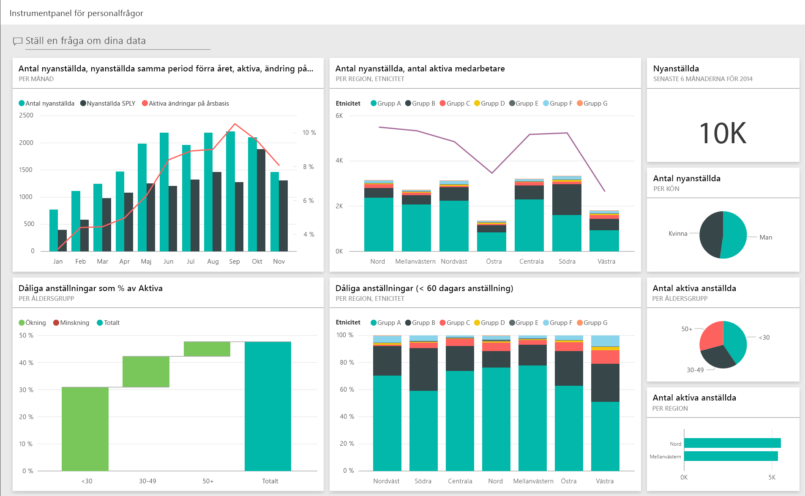
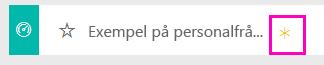
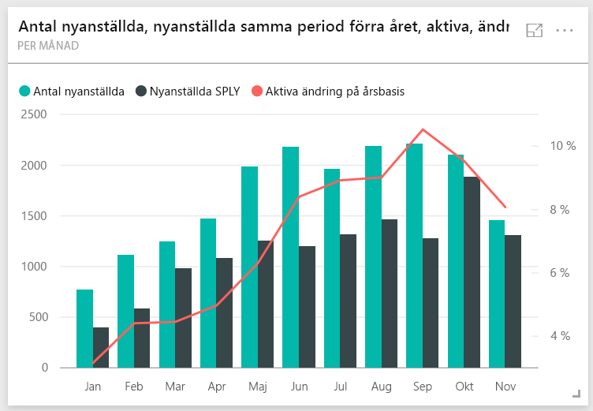
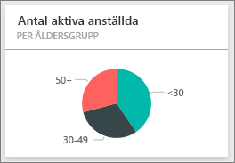
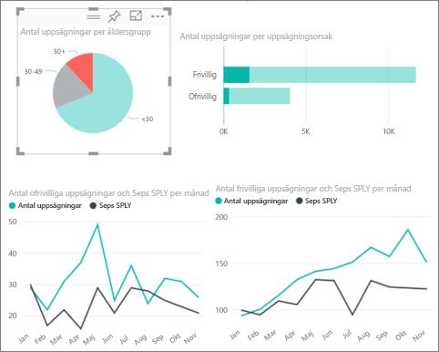
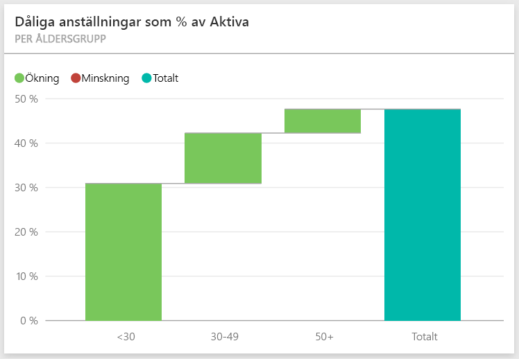
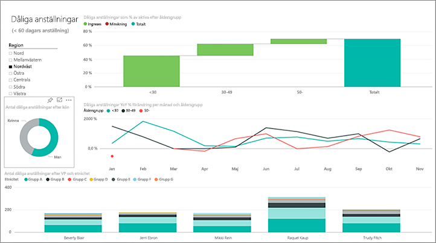
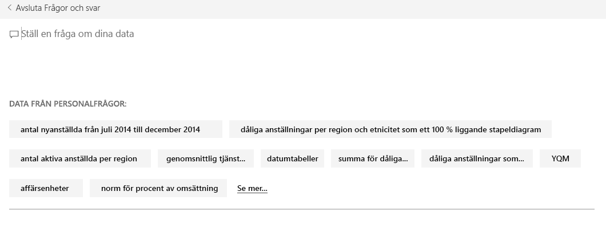
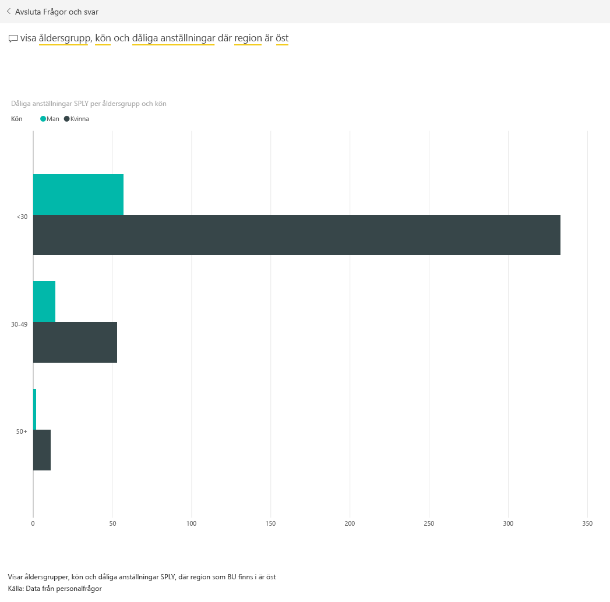

# Exempel på personalfrågor för Power BI: Ta en rundtur

## Översikt över Personalfrågeexemplet
Personalavdelningen har samma rapporteringsmodell för olika företag, även om de är olika för olika branscher och storlekar. Det här exemplet granskar nya anställningar, aktiva medarbetare, och medarbetare som har lämnat och försöker att hitta trender i anställningsstrategin. Vårt huvudmål är att förstå:

* Vem vi anställer
* Eventuella fördomar i vår anställningsstrategi
* Trender i frivilliga avgångar

Det här exemplet ingår i en serie som illustrerar hur du kan använda Power BI med verksamhetsorienterade data, rapporter och instrumentpaneler. Det här är verkliga data från obviEnce ([www.obvience.com](http://www.obvience.com/)) som har anonymiserats. Data är tillgängliga i flera format: innehållsförpackning/-app, Excel-arbetsbok eller PBIX-fil för Power BI Desktop. Läs mer i [exempeldatauppsättningar](sample-datasets.md).

## Förutsättningar

 Innan du kan använda exemplet, måste du först hämta det som ett innehållspaket, en .pbix-fil eller en Excel-arbetsbok.

### Hämta innehållspaketet för det här exemplet

1. Öppna Power BI-tjänsten (app.powerbi.com) och logga in.
2. Längst ned i vänster hörn väljer du **Hämta data**.
   
    
3. På sidan Hämta data väljer du ikonen **Exempel**.
   
   
4. Välj **Personalfrågeexempel** och sedan **Anslut**.  
   
   
5. Power BI importerar innehållspaketet och lägger till en ny instrumentpanel, rapport och datauppsättning till din aktuella arbetsyta. Det nya innehållet markeras med en gul asterisk. 
   
   
  
### Hämta .pbix-filen för det här exemplet

Du kan även hämta exemplet som en .pbix-fil som är avsedd för användning med Power BI Desktop. 

 * [Exempel på personalfrågor](http://download.microsoft.com/download/6/9/5/69503155-05A5-483E-829A-F7B5F3DD5D27/Human Resources Sample PBIX.pbix)

### Hämta Excel-arbetsboken för det här exemplet
Du kan också [hämta enbart datauppsättningen (Excel-arbetsboken) för det här exemplet](http://go.microsoft.com/fwlink/?LinkId=529780). Arbetsboken innehåller Power View-blad som du kan visa och ändra. För att se rådata väljer du **Power Pivot > Hantera**.

## Nyanställda
Låt oss utforska nyanställda först.

1. På arbetsytan väljer du fliken **instrumentpaneler** och öppnar instrumentpanelen personal.
2. På instrumentpanelen, väljer du panelen **Antal nyanställda, nyanställda samma period förra året, aktiva, ändring på årsbasis** **Enligt månad**.  
     

   Exempelrapporten för personal öppnas på sidan **Nyanställda**.  

   

Observera följande:

* Kombinationsdiagrammet **Ändring per månad, anställa och nyanställda SPLY och aktiva på årsbasis %** visar vi har anlitat fler personer varje månad i år jämfört med föregående år &#151; betydligt fler personer under vissa månader.
* I kombinationsdiagrammet **Antal nyanställa och aktivt antal medarbetare per region och etnicitet** kan man notera att vi anställde färre personer i regionen **Öst**.
* Vattenfallsdiagrammet **Varians av nyanställda på årsbasis per åldersgrupp** att vi i huvudsak anställer yngre personer. Detta kan bero på att tjänsterna i huvudsak är på deltid.
* Cirkeldiagrammet **Antal nyanställda enligt kön** visar en ganska jämn fördelning.

Kan du hitta mer insikter, till exempel en region där könsfördelningen är ojämn? Välj olika ålder grupper och könen i diagram och utforska relationerna mellan ålder, kön, region och etnisk grupp.

Välj namnet på instrumentpanelen från det övre navigeringsfältet för att återgå till instrumentpanelen.

## Jämför aktuella aktiva och tidigare anställda
Låt oss utforska data för aktuella aktiva medarbetare och anställda som inte längre arbetar för företaget.

På instrumentpanelen väljer du panelen **Antal aktiva medarbetare per åldersgrupp**.  

Exempelrapporten för personal öppnas på sidan **Aktiva anställda jämfört med. Uppsägningar**.  

**Objekt av intresse**:

* Kombinationsdiagram till vänster visar årsvis ändring för aktiva medarbetare och uppsägningar. Vi har mer aktivitet i år på grund av snabb anställning men även fler uppsägningar än förra året.
* I augusti hade vi fler uppsägningar än andra månader. Välj olika åldersgrupper, kön eller regioner för att se om du hittar några avvikare.
* Om vi tittar på cirkeldiagrammen ser vi en tydlig köns- och åldersfördelning bland våra aktiva medarbetare. Välj olika ålder grupper om du vill se könsfördelningen ändras i olika åldersgrupper. Har vi en ojämn könsfördelning i alla åldersgrupper?

## Orsaker till fördelning
Öppna rapporten i Redigeringsvyn. Välj **Redigera rapporten** i det övre vänstra hörnet.

Ändra cirkeldiagrammet så att uppsägningar visas istället för aktiva.

1. Välj cirkeldiagrammet **Antal aktiva medarbetare per åldersgrupp**.
2. I **Fält** markerar du pilen bredvid **anställda** för att expandera tabellen med anställda. Avmarkera kryssrutan bredvid **Antal aktiva medarbetare** för att ta bort fältet.
3. Markera kryssrutan bredvid **Antal uppsägningar** i tabellen anställda till rutan **Värden** i fältbrunnen.
4. När du är tillbaka på rapportarbetsytan väljer du stapeln **Frivilligt** i stapeldiagrammet **Antal uppsägningar efter uppsägningsorsak**. Detta markerar dem som lämnade företaget frivilligt i andra visuella objekt i rapporten.
5. Klicka på sektorn 50+ i cirkeldiagrammet Antal uppsägningar per åldersgrupp.

   Titta på linjediagrammet Uppsägning per orsak i den nedre högra hörnet. Diagrammet är filtrerat för att visa frivilliga uppsägningar.  
   

   Ser du trenden i åldersgruppen 50+? Under den senare delen av året lämnar fler anställda över 50 frivilligt. Detta kan vara ett område som behöver närmare efterforskning med mer data.
6. Du kan följa samma steg för cirkeldiagrammet **Antal aktiva medarbetare efter kön** och ändra den till uppsägningar istället för aktiva medarbetare. Titta på data för frivillig uppsägning efter kön för att se om du kan hitta andra insikter.
7. Klicka på **Power BI** i det övre navigeringsfältet att återgå till instrumentpanelen. Du kan spara de ändringar du har gjort i rapporten eller inte.

## Dåliga anställningar
Det senaste området att utforska är dåliga anställningar. Dåliga anställningar definieras som medarbetare som inte stannade längre än 60 dagar. Vi har hög personalomsättning. Anställer vi bra kandidater?

1. Välj instrumentpanelen **Dåliga anställningar som % av aktiva efter åldersgrupp**. Rapporten öppnas på sidan 3, ”Dåliga anställningar”.

     
2. Välj kryssrotan **Northwest** i utsnittet Region till vänster och segmentet **män** i ringdiagrammet Antal dåliga anställningar efter kön.  Titta på andra diagram på sidan ”dåliga anställningar”. Fler dåliga anställningar för män än kvinnor och många dåliga anställningar i grupp A.
     
3. Om vi tittar på toroiden **Dåliga anställningar efter kön** och klickar på utsnittet **Region** ser vi att Öst är den enda regionen med fler kvinnliga än manliga dåliga anställningar.  
4. Välj namnet på instrumentpanelen från det övre navigeringsfältet för att återgå till instrumentpanelen.

## Ställer en fråga i rutan Frågor och svar
I rutan [Frågor och svar](power-bi-tutorial-q-and-a.md) kan du skriva en fråga med naturligt språk. Frågor och svar kan identifiera de ord du skriver och var svaret finns i din databas.

1. Klicka på rutan Frågor och svar Observera att rutan Frågor och svar innehåller förslag redan innan du börjar skriva:

   
2. Du kan välja något av dessa förslag eller skriva: **Visa åldersgrupp, kön och dåliga anställningar SPLY där regionen är Öst**.  

   

   Lägg märke till att majoriteten av dåliga kvinnliga anställningar är under 30.

Det här är en säker miljö att leka runt i. Du kan alltid välja att inte spara ändringarna. Fast du sparar dem kan du alltid gå till **Hämta data** för en ny kopia av det här exemplet.

## Nästa steg: anslut till dina data
Vi hoppas att denna rundtur har visat hur Power BI-instrumentpaneler, frågor och svar, samt rapporter kan ge insikter om personalfrågor. Nu är det din tur – anslut till dina egna data. Med Power BI kan du ansluta till en mängd olika datakällor. Läs mer om att [komma igång med Power BI](service-get-started.md).  
