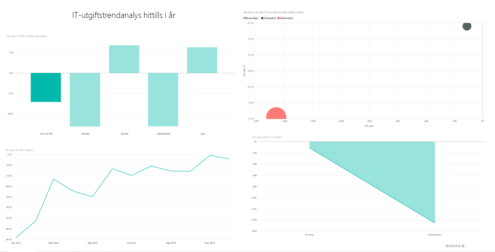
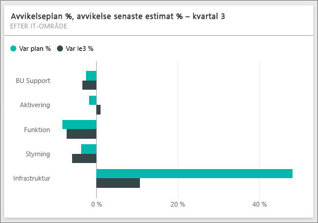
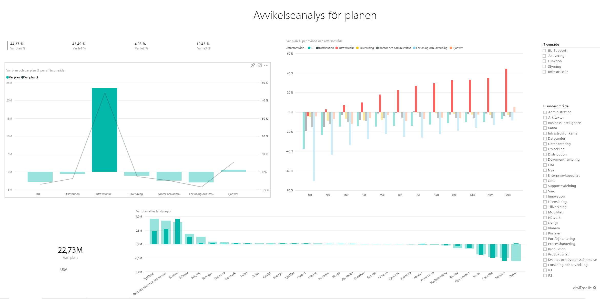

# Exempel på IT-utgiftsanalys för Power BI: Ta en rundtur

Innehållspaketet Exempel på IT-utgiftsanalys innehåller en instrumentpanel, en rapport och en datamängd som analyserar de planerade kontra faktiska kostnaderna för IT-avdelningen. Den här jämförelsen hjälper oss att förstå hur väl företaget planerat för året och undersöka områden med stora avvikelser från planen. Företaget i det här exemplet går igenom en årlig planeringscykel och skapar kvartalsvis en ny senaste uppskattning (LE) för att analysera förändringar i IT-utgifter över räkenskapsåret.

Det här exemplet ingår i en serie som visar hur du kan använda Power BI med verksamhetsorienterade data, rapporter och instrumentpaneler. Det har skapats med verkliga data från [obviEnce](http://www.obvience.com/), som har anonymiserats. Dessa data är tillgängliga i flera format: innehållsförpackning/-app, .pbix-fil för Power BI Desktop eller Excel-arbetsbok. Se [Exempel för Power BI](sample-datasets.md). 

De här självstudierna använder Power BI-tjänsten och innehållspaketet för Exempel på IT-utgiftsanalys. Eftersom rapportupplevelserna är så lika kan du även följa med via Power BI Desktop och .pbix-exempelfilen.

## Förutsättningar

 Innan du kan använda exemplet, måste du först hämta det som ett [innehållspaket](#get-the-content-pack-for-this-sample), en [.pbix-fil](#get-the-pbix-file-for-this-sample) eller en [Excel-arbetsbok](#get-the-excel-workbook-for-this-sample).

### Hämta innehållspaketet för det här exemplet

1. Öppna Power BI-tjänsten (app.powerbi.com), logga in och öppna den arbetsyta där du vill spara exemplet.

2. Längst ned i vänster hörn väljer du **Hämta data**.
   
   
3. På sidan **Hämta data** väljer du **Exempel**.
   
4. Välj **Exempel på IT-utgiftsanalys** och sedan **Anslut**.  
  
   
   
5. Power BI importerar innehållspaketet och lägger sedan till en ny instrumentpanel, rapport och datamängd till din aktuella arbetsyta.
   
   
  
### Hämta .pbix-filen för det här exemplet

Du kan även ladda ned Exempel på IT-utgiftsanalys som en [.pbix-fil](http://download.microsoft.com/download/E/9/8/E98CEB6D-CEBB-41CF-BA2B-1A1D61B27D87/IT%20Spend%20Analysis%20Sample%20PBIX.pbix) som är avsedd för användning med Power BI Desktop.

### Hämta Excel-arbetsboken för det här exemplet

Om du vill visa i datakällan för det här exemplet är det även tillgängligt som en [Excel-arbetsbok](http://go.microsoft.com/fwlink/?LinkId=529783). Arbetsboken innehåller Power View-blad som du kan visa och ändra. Om du vill se rådata aktiverar du dataanalystilläggen och väljer **Power Pivot > Hantera**. Aktivering av tilläggen för Power View och Power Pivot beskrivs i avsnittet om att [titta på Excel-exemplen inuti själva Excel](sample-datasets.md#optional-take-a-look-at-the-excel-samples-from-inside-excel-itself).

## Instrumentpanelen för Exempel på IT-utgiftsanalys
De två sifferpanelerna på instrumentpanelens vänstra sida, **Var Plan %** och **Avvikelse senaste uppskattning i %, kvartal 3**, ger oss en översikt över hur bra det går jämfört med planen och jämfört med senaste kvartalsuppskattningen (LE3 = senaste uppskattningen för kvartal 3). Generellt sett är vi ungefär 6 % över planen. Vi ska undersöka orsaken till den här avvikelsen – när, var, och i vilken kategori.

## Sidan IT-utgiftstrendanalys i år
När du väljer instrumentpanelen **Var Plan % efter försäljningsregion**, visas sidan **IT-utgiftstrendanalys i år** i rapporten Exempel på IT-utgiftsanalys. Vi kan direkt se att vi har en positiv avvikelse i USA och Europa och en negativ avvikelse i Kanada, Latinamerika och Australien. USA har cirka 6 % +LE-avvikelse och Australien har cirka 7 % -LE-avvikelse.

Men det kan vara vilseledande att bara titta på det här diagrammet och dra slutsatser. Vi behöver titta på faktiska dollarbelopp för att få lite perspektiv.

1. Välj **Aus och NZ** i diagrammet **Var Plan % efter försäljningsregion** och notera sedan diagrammet **Var Plan efter IT-område**.

   
2. Välj nu **USA**. Observera att Australien och Nya Zeeland utgör en mycket liten andel av våra totala utgifter jämfört med USA.

    Nu tar vi och undersöker vilken kategori i USA som orsakar avvikelsen.

## Ställ frågor om dina data
1. Välj **Exempel på IT-utgiftsanalys** i det övre navigeringsfältet för att återgå till exemplets instrumentpanel.
2. Välj **Ställ en fråga om dina data**.
3. Välj **vad är planen efter IT-område** i listan **Frågor för att komma igång** till vänster.

   

4. Rensa föregående inmatning i rutan Frågor och svar och ange *visa stapeldiagram för IT-områden, var plan % och var le3 %* .

   

   Notera i det första IT-området, **Infrastruktur**, att procentandelen har ändrats dramatiskt mellan den inledande avvikelseplanen avvikelseplanens senaste uppskattning.

## Sidan Utgifter i år efter kostnadselement

1. Återgå till instrumentpanelen och titta på panelen **Avvikelseplan %, Avvikelse senaste uppskattning i % – Kvartal 3** på instrumentpanelen.

   

   Observera att infrastruktursområdet står ut med en stor positiv skillnad i förhållande till planen.

1. Välj den här panelen för att öppna rapporten och visa sidan **Utgifter i år efter kostnadselement**.
2. Välj stapeln **Infrastruktur** i diagrammet **Var Plan % och Var LE3 % efter IT-område** längre ned till höger och notera avvikelsen mot planen i diagrammet **Var Plan % efter försäljningsregion** längre ned till vänster.

    
3. Välj varje namn i tur och ordning i utsnittet **Kostnadselementgrupp** för att hitta kostnadselementet med störst avvikelse.
4. Med **Andra** markerat, väljer du **Infrastruktur** i utsnittet **IT-område** och sedan underområden i utsnittet **IT-underområde** för att hitta underområdet med störst avvikelse.  

   Lägg märke till den stora avvikelsen för **Nätverk**. Uppenbarligen har företaget bestämt sig för att ge sina anställda telefontjänster som förmån, men oplanerat.

## Sidan Avvikelseanalys för planen

1. Välj fliken **Avvikelseanalys för planen** längst ned på sidan.

2. I diagrammet **Var Plan % och Var Plan % efter affärsområde** till vänster, klickar du på kolumnen **Infrastruktur** för att markera infrastrukturvärdena för affärsområdet på resten av sidan.

    

   Notera att affärsområdet infrastruktur inledde en positiv avvikelse i februari enligt diagrammet **Var plan % per månad och affärsområde**. Observera också hur avvikelsen mot planerat värde för affärsområdet varierar efter land, jämfört med alla andra affärsområden. 

3. Använd utsnitten **IT-område** och **IT-underområde** till höger för att filtrera värdena på resten av sidan och för att utforska dessa data. 

## Redigera rapporten
Välj **Redigera rapporten** i det övre vänstra hörnet för utforska i redigeringsvyn:

* Se hur sidorna är uppbyggda – fälten i varje diagram och filtren på sidorna.
* Lägg till sidor och diagram baserat på samma data.
* Ändra visualiseringstypen för varje diagram.
* Fäst diagram av intresse på instrumentpanelen.

## Nästa steg: Anslut till dina data
Den här miljön är säker att leka i eftersom du kan välja att inte spara dina ändringar. Men om du sparar dem kan du alltid välja **Hämta data** för att få en ny kopia av exemplet.

Vi hoppas att den här rundturen har visat hur Power BI-instrumentpaneler, frågor och svar, samt rapporter kan ge insikter om IT-utgiftsdata. Nu är det din tur – anslut till dina egna data. Med Power BI kan du ansluta till en mängd olika datakällor. Läs mer i [Kom igång med Power BI-tjänsten](service-get-started.md).
