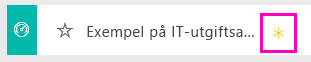

# Exempel på IT-utgiftsanalys för Power BI: Ta en rundtur

## Översikt för exemplet för IT-utgiftsanalys
[Innehållspaketet](service-organizational-content-pack-introduction.md) IT-utgiftsanalys (instrumentpanel, rapport och datauppsättning) analyserar de planerade kontra faktiska kostnaderna för IT-avdelningen. Den här jämförelsen hjälper oss att förstå hur väl företaget planerat för året och undersöka områden med stora avvikelser från planen. Företaget i det här exemplet går igenom en årlig planeringscykel och skapar kvartalsvis en ny senaste uppskattning (LE) för att analysera förändringar i IT-utgifter över räkenskapsåret.

Det här exemplet ingår i en serie som illustrerar hur du kan använda Power BI med affärsorienterade data, rapporter och instrumentpaneler. Det här är verkliga data från obviEnce (<http://obvience.com/>) som har anonymiserats.

## Förutsättningar

 Innan du kan använda exemplet, måste du först hämta det som ett [innehållspaket](https://docs.microsoft.com/power-bi/sample-it-spend#get-the-content-pack-for-this-sample), en [.pbix-fil](http://download.microsoft.com/download/E/9/8/E98CEB6D-CEBB-41CF-BA2B-1A1D61B27D87/IT%20Spend%20Analysis%20Sample%20PBIX.pbix) eller en [Excel-arbetsbok](http://go.microsoft.com/fwlink/?LinkId=529783).

### Hämta innehållspaketet för det här exemplet

1. Öppna Power BI-tjänsten (app.powerbi.com) och logga in.
2. Längst ned i vänster hörn väljer du **Hämta data**.
   
    
3. På sidan Hämta data väljer du ikonen **Exempel**.
   
   
4. Välj **Exempel på IT-utgiftsanalys** och sedan **Anslut**.  
  
   
   
5. Power BI importerar innehållspaketet och lägger till en ny instrumentpanel, rapport och datauppsättning till din aktuella arbetsyta. Det nya innehållet markeras med en gul asterisk. 
   
   
  
### Hämta .pbix-filen för det här exemplet

Du kan även hämta exemplet som en .pbix-fil som är avsedd för användning med Power BI Desktop. 

 * [Exempel på IT-utgiftsanalys](http://download.microsoft.com/download/E/9/8/E98CEB6D-CEBB-41CF-BA2B-1A1D61B27D87/IT%20Spend%20Analysis%20Sample%20PBIX.pbix)

### Hämta Excel-arbetsboken för det här exemplet
Du kan också [hämta enbart datauppsättningen (Excel-arbetsboken) för det här exemplet](http://go.microsoft.com/fwlink/?LinkId=529783). Arbetsboken innehåller Power View-blad som du kan visa och ändra. För att se rådata väljer du **Power Pivot > Hantera**.

## Exempelinstrumentpanelen IT-utgiftsanalys
De två sifferpanelerna på instrumentpanelen, **Var Plan %** och **varians senaste uppskattning % kvartal 3**, ger oss en översikt över hur bra det går jämfört med planen och jämfört med senaste kvartalsuppskattningen (LE3 = senaste uppskattning kvartal 3). Generellt sett är vi ungefär 6% över planen. Vi ska undersöka orsaken till den här avvikelsen – när, var, och vilken kategori?

## Sidan IT-utgiftstrendanalys i år
Om du väljer instrumentpanelen **Var Plan % efter försäljningsregion** kommer du till sidan IT-utgiftstrendanalys av exempelrapporten IT-utgiftsanalys. Vi kan se att vi har en positiv avvikelse i USA och Europa och en negativ avvikelse i Kanada, Latinamerika och Australien. USA hade cirka 6% + LE-avvikelse och Australien hade cirka 7% -LE-avvikelse.

Men det kan vara vilseledande att bara titta på det här diagrammet och dra slutsatser. Vi behöver titta på faktiska dollarbelopp för att få lite perspektiv.

1. Välj diagrammet **Aus och NZ** i Var Plan % efter försäljningsregion och notera diagrammet Var Plan efter IT-område.

   
2. Välj nu **USA**. Du ser, Australien är en jätteliten del av totala utgifter jämfört med USA.

    Så vi har begränsat det till USA, nu då? Vi tar och undersöker vilken kategori i USA som orsakar avvikelsen.

## Ställ frågor om dina data
1. Välj **IT-utgiftsanalysexempel** i det övre navigeringsfältet för att återgå till instrumentpanelerna.
2. I frågerutan skriver du visa IT-områden, var plan % och var le3% stapeldiagram.

   

   I det första IT-området **infrastruktur**, har procentandelen ändrats dramatiskt mellan den inledande avvikelseplanen avvikelseplanens senaste uppskattning.

## Sidan utgifter i år efter kostnadselement
Gå tillbaka till instrumentpanelen och titta på instrumentpanelen **Var Plan %, Var LE3%** .

Infrastrukturen står ut med en stor positiv avvikelse jämfört med planen.

1. Klicka på den här panelen för att gå till sidan utgifter i år efter kostnadselement från exempelrapporten IT-utgiftsanalys.
2. Klicka på menyraden **infrastruktur** i diagrammet Var Plan % och Var LE3 % efter IT-område i det undre vänstre och notera avvikelsen mot planen i Var Plan % efter säljregion till vänster.

    
3. Klicka på namnet för varje kostnadselementgrupp i utsnitt för att hitta kostnadselement med en stor avvikelse.
4. Med **andra** markerat, klickar du på **infrastruktur** i IT-området och klickar på underavsnitten utsnittet IT-underområde för att hitta det underområde som har störst avvikelse.  

   Vi ser en enorm avvikelse i **nätverk**.

   Uppenbarligen har företaget bestämt sig för att ge sina anställda telefontjänster som en förmån, men det var inte planerat.

## Sidan avvikelseanalys för planen
I rapporten, klickar du på fliken avvikelseanalys för planen längst ner i rapporten för att gå till sida 3 i rapporten.

I kombinationsdiagrammet Var Plan % och Var Plan % efter affärsområde till vänster, klickar du på infrastruktur-kolumnen för att markera infrastrukturvärden på resten av sidan.

Observera att på diagrammet Var plan % av månad och affärsområde att infrastruktur har börjat ha en positiv avvikelse runt februari och fortsätter därefter att öka. Observera också hur avvikelsen mot planerat värde för infrastruktur varierar efter land, jämfört med värdet för alla affärsområden. Använd utsnitten IT-område och IT-underområden till höger för att filtrera värdena i resten av sidan istället för att markera dem. Klicka på de olika IT-områdena till höger för att utforska data på ett annat sätt. Du kan också klicka på IT-underområden och se avvikelsen på den nivån.

## Redigera rapporten
Klicka på **redigera rapporten** i det övre vänstra hörnet och utforska i redigeringsvyn.

* Se hur sidorna är uppbyggda – fälten i varje diagram, filter på sidorna
* Lägg till sidor och diagram baserat på samma data
* Ändra visualiseringstypen för varje diagram
* Fäst dem på din instrumentpanel

Det här är en säker miljö att leka runt i. Du kan alltid välja att inte spara ändringarna. Fast du sparar dem kan du alltid gå till Hämta data för att få en ny kopia av exemplet.

## Nästa steg: Anslut till dina data
Vi hoppas att den här rundturen har visat hur Power BI-instrumentpaneler, frågor och svar, samt rapporter kan ge insikter om IT-utgiftsdata. Nu är det din tur – anslut till dina egna data. Med Power BI kan du ansluta till en mängd olika datakällor. Läs mer om att [komma igång med Power BI](service-get-started.md).
