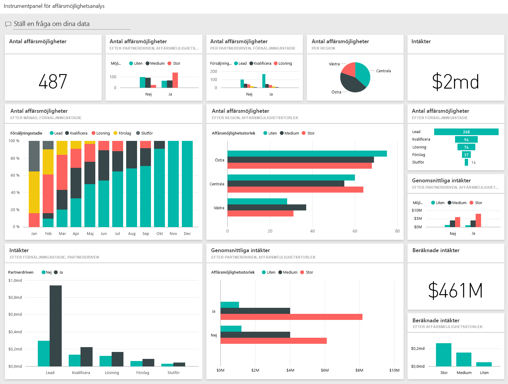
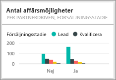

# Exempel på affärsmöjlighetsanalys för Power BI: Ta en rundtur
**Exemplet på affärsmöjlighetsspårning** innehåller en instrumentpanel (och associerade rapport) för ett programvaruföretag som har 2 försäljningskanaler: *direkt* och *partner*. Säljchefen skapade den här instrumentpanelen för att spåra affärsmöjligheter och intäkter efter region, avtalsstorlek och kanal.

Säljchefen förlitar sig på 2 intäktsmått:

* **Intäkter** – detta är en säljares uppskattning av vad han tror att intäkten kommer att bli.
* **Inberäknade intäkter** – detta beräknas som intäkter X sannolikhetsprocent och anses allmänt ge en mer rättvisande prognos om faktiska försäljningsintäkter. Sannolikheten bestäms av avtalets aktuella ***försäljningsteg***.
  * Lead – 10%  
  * Kvalificera – 20%  
  * Lösning – 40%  
  * Förslag – 60%  
  * Slutför – 80%

Det här exemplet ingår i en serie som illustrerar hur du kan använda Power BI med affärsorienterade data, rapporter och instrumentpaneler. Det här är verkliga data från obviEnce ([www.obvience.com](http://www.obvience.com/)) som har anonymiserats.

Du kan också [ladda ned enbart datauppsättningen (Excel-arbetsboken) för det här exemplet](http://go.microsoft.com/fwlink/?LinkId=529782).  

## Vad kan vi utläsa från instrumentpanelen?
Vår säljchef har skapat en instrumentpanel för att spåra de mått som är viktigast för henne. När hon ser något intressant, kan hon välja en panel för att granska närmare.

1. Företagets intäkter är 2 miljarder dollar och de beräknade intäkterna är 461 miljoner dollar.
2. Antalet affärsmöjligheter och intäkter följer en bekant trattmönster där summorna minskar för varje efterföljande steg.
3. De flesta affärsmöjligheterna är i region öst. 
4. De stora affärsmöjligheterna genererar mer intäkter än de medelstora eller små affärsmöjligheterna.
5. Stora partneravtal genererar mer intäkter: 8 miljoner dollar i genomsnitt jämfört med 6 miljoner dollar direkt försäljning. 

Eftersom ansträngningen för att få till ett avtal är samma oavsett om avtalet klassas som stort, medelstort eller litet, bör vårt företag analysera data för att lära sig mer om stora affärsmöjligheter. 

Välj panelen **antal affärsmöjligheter efter partnerdrivna och försäljningsfas** för att öppna sida 1 i rapporten.  

## Utforska sidorna i rapporten
### Sida 1 i vår rapport heter översikt över antal affärsmöjligheter.

* Öst är vår största region när det gäller antal affärsmöjligheter.  
* I cirkeldiagrammet markerar du varje region en åt gången för att filtrera sidan. För varje region, går partners efter betydligt fler stora affärsmöjligheter.   
* Stapeldiagrammet antal affärsmöjligheter efter partnerdrivna och storlek på affärsmöjligheter visar tydligt att de flesta av de stora affärsmöjligheterna är partnerdrivna och flera av de små och medelstora affärsmöjligheterna inte är partnerdrivna. 
* Markera varje försäljningssteg i stapeldiagrammet i nedre vänstra hörnet för att se skillnaden i regionala antal och notera att även om öst är vår största region vad det gäller antal så har stegen lösning, förslag och slutför i alla 3 regioner jämförbara antal. Det här betyder att vi väljer en högre procentandel avtal i central och väst. 

### Sida 2 av vår rapport heter intäktsöversikt.
Den här sidan tar en liknande titt på data, men med ett intäktsperspektiv istället för antal.  

* Öst är vår största region inte bara när det gäller antal affärsmöjligheter, men även intäkter.  
* Filtrering efter partnerdriven (välj **ja** i teckenförklaringen uppe till höger) visar intäkter på 1,5 miljarder dollar och 294 miljoner dollar. Jämför det här med 644 miljarder dollar och 166 miljoner dollar för icke-partnerdrivna intäkter.  
* Genomsnittliga intäkter för stora konton är större (8 miljoner) om affärsmöjligheten är partnerdriven jämfört med 6 miljoner för icke-partnerdrivna företag.  
* För partnerdrivna verksamheter är de genomsnittliga intäkterna för stora affärsmöjligheter nästan dubbelt jämfört med medelstora affärsmöjligheter (4 miljoner).  
* Genomsnittlig intäkt för små och medelstora företag är jämförbara för både partnerdrivna och icke-partnerdrivna företag.   

Våra samarbetspartners gör uppenbart ett bättre jobb med att sälja till kunder.  Det kan vara klokt att styra fler affärer via våra partners.

### Sida 3 av vår rapport heter antal regionssteg
Den här sidan visar liknande data men delar upp dem efter region och steg.  

* Om du filtrerar efter öst (välj **öst** i cirkeldiagrammet) så ser du att affärsmöjligheterna i öst nästan är helt jämt uppdelade mellan partnerdrivna och icke-partnerdrivna. 
* Stora affärsmöjligheter är vanligast i den centrala regionen, små affärsmöjligheter är vanligast i region öst och medelstora affärsmöjligheter är vanligast i region väst. 

### Sida 4 i vår rapport heter kommande affärsmöjligheter
Vi tittar än en gång på liknande faktorer, men den här gången från perspektivet datum/tid.  

Vår ekonomichef använder den här sidan för att hantera arbetsbelastning. Genom att titta på intäktsmöjligheter efter säljsteg och månad, kan hon planera på lämpligt sätt.

* Genomsnittliga intäkter för steget slutför är högst. Det är av högsta vikt att slutföra de här avtalen.
* Filtrering per månad (genom att välja månadsnamnet i det vänstra utsnittet) visar att januari har en hög andel stora avtal i slutför-steget med beräknade intäkter på 75 miljoner dollar. Å andra sidan hade februari främst medelstora avtal i lösnings- och förslagstegen.
* Generellt sätt, varierar de beräknade intäktssiffrorna baserat på säljsteg, antal affärsmöjligheter och avtalsstorlek. Lägg till filter (med filterfönstret till höger) för de här faktorerna för att upptäcka ytterligare insikter.

Det här är en säker miljö att leka runt i. Du kan alltid välja att inte spara ändringarna. Men om du sparar dem, kan du alltid gå till **hämta data** för en ny kopia av det här exemplet.

## Nästa steg: anslut till dina data
Vi hoppas att den här rundturen har visat hur Power BI-instrumentpaneler, frågor och svar, samt rapporter kan ge insikter om data för affärsmöjlighetsspårning. Nu är det din tur – anslut till dina egna data. Med Power BI kan du ansluta till en mängd olika datakällor. Läs mer om att [komma igång med Power BI](service-get-started.md).

[Hämta exempel](sample-datasets.md)  

