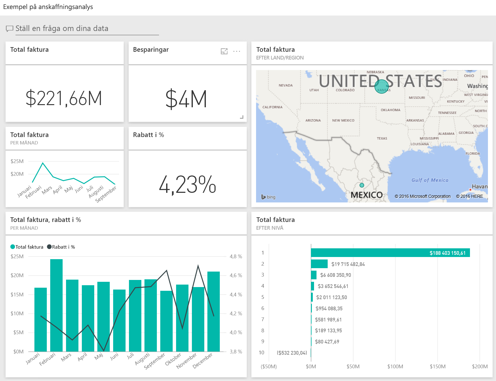
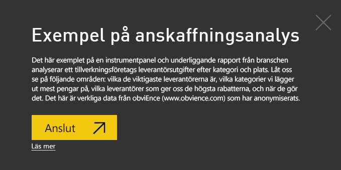
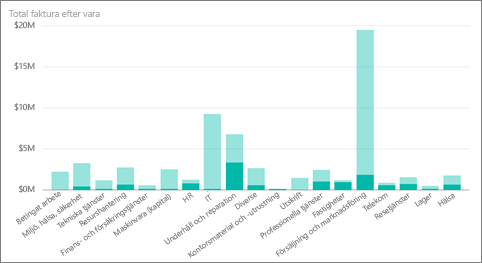
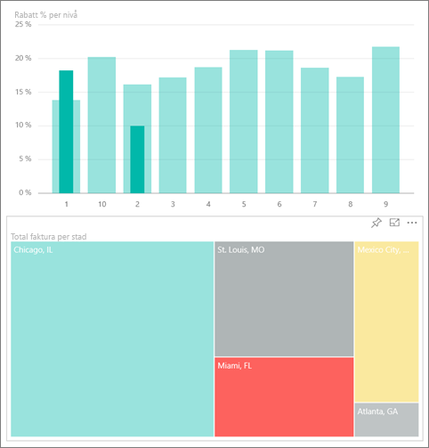
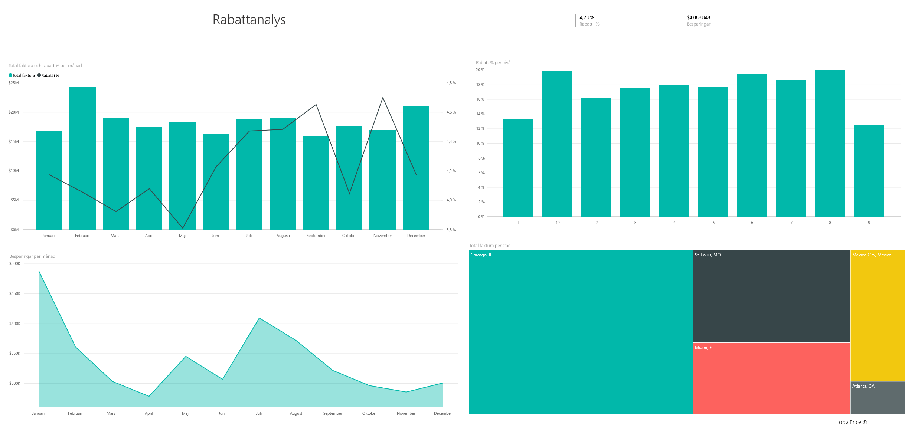
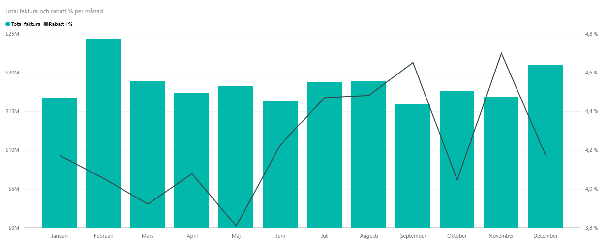
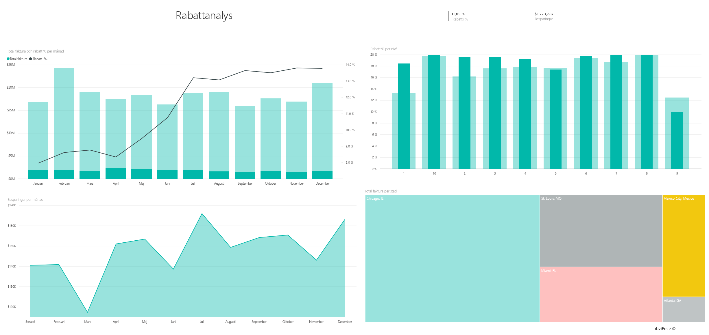

# Exempel på anskaffningsanalys för Power BI: Ta en rundtur

## Översikt över Exemplet för anskaffningsanalys
Detta exempel på en instrumentpanel och dess underliggande rapport analyserar ett tillverkningsföretags leverantörsutgifter efter kategori och plats. I det här exemplet utforskar vi dessa områden:

* Vilka de viktigaste leverantörerna är
* Vilka kategorier vi lägger ut mest pengar på
* Vilka leverantörer som ger oss de högsta rabatterna och när

Det här exemplet ingår i en serie som illustrerar hur du kan använda Power BI med affärsorienterade data, rapporter och instrumentpaneler. Det här är verkliga data från obviEnce ([www.obvience.com](http://www.obvience.com/)) som har anonymiserats.

## Förutsättningar

 Innan du kan använda exemplet, måste du först hämta det som ett [innehållspaket](https://docs.microsoft.com/power-bi/sample-procurement#get-the-content-pack-for-this-sample), en [.pbix-fil](http://download.microsoft.com/download/D/5/3/D5390069-F723-413B-8D27-5888500516EB/Procurement-Analysis-Sample-PBIX.pbix) eller en [Excel-arbetsbok](http://go.microsoft.com/fwlink/?LinkId=529784).

### Hämta innehållspaketet för det här exemplet

1. Öppna Power BI-tjänsten (app.powerbi.com) och logga in.
2. Längst ned i vänster hörn väljer du **Hämta data**.
   
    
3. På sidan Hämta data väljer du ikonen **Exempel**.
   
   
4. Välj **Exempel på anskaffningsanalys** och sedan **Anslut**.  
  
   
   
5. Power BI importerar innehållspaketet och lägger till en ny instrumentpanel, rapport och datauppsättning till din aktuella arbetsyta. Det nya innehållet markeras med en gul asterisk. 
   
   
  
### Hämta .pbix-filen för det här exemplet

Du kan även hämta exemplet som en .pbix-fil som är avsedd för användning med Power BI Desktop. 

 * [Exempel på anskaffningsanalys](http://download.microsoft.com/download/D/5/3/D5390069-F723-413B-8D27-5888500516EB/Procurement%20Analysis%20Sample%20PBIX.pbix)

### Hämta Excel-arbetsboken för det här exemplet
Du kan också [hämta enbart datauppsättningen (Excel-arbetsboken) för det här exemplet](http://go.microsoft.com/fwlink/?LinkId=529784). Arbetsboken innehåller Power View-blad som du kan visa och ändra. För att se rådata väljer du **Power Pivot > Hantera**.

## Utgiftstrender
Börja med att söka trender i utgifter efter kategori och plats.  

1. Från arbetsytan, öppna fliken **Instrumentpaneler** och välj instrumentpanelen Anskaffningsanalys.
2. Välj fönstret **Totalfaktura efter land/region** i instrumentpanelen. Det öppnar sidan ”Utgiftsöversikt” i exempelrapporten ”Anskaffningsanalys”.

    

Lägg märke till några saker:

* I linjediagrammet **Summa faktura per månad och kategori**: kategorin **Direkt** kategorin har ganska konsekventa utgifter **Logistik** har en topp i december och  **Övrigt** har en topp i februari.
* På kartan **Summa faktura efter land/Region**: de flesta av våra utgifter är i USA.
* I stapeldiagrammet **Summa faktura efter underkategori** : **maskinvara** och **indirekta varor och tjänster** är de största utgiftskategorierna.
* I det liggande diagrammet Total faktura enligt nivå: Merparten av vår verksamhet bedrivs med våra leverantörer på nivå 1 (topp 10). Detta hjälper oss att bättre hantera våra leverantörsrelationer.

## Utgifter i Mexiko
Låt oss se på utgiftsområden i Mexiko.

1. I diagrammet väljer du bubblan **Mexiko** på kartan. I stapeldiagrammet ”Summa faktura efter underkategori” är merparten i underkategorin **Indirekta varor och tjänster**.

   
2. Öka detaljnivån i kolumnen **Indirekta varor och tjänster**:

   * Välj nedåtpilen  i det övre högra hörnet i diagrammet.
   * Välj kolumnen **Indirekta varor och tjänster**:

      De största utgifterna i den här kategorin är försäljning och marknadsföring.
   * Välj **Mexiko** på kartan igen.

      Den största utgiften i den här kategorin i Mexiko är underhåll och reparationer.

      
3. Välj uppåtpilen i det övre vänstra hörnet i diagrammet för att öka detaljnivån.
4. Markera pilen igen för att inaktivera funktionen.  
5. Välj **Power BI** i det övre navigeringsfältet att återgå till din arbetsyta.

## Utvärdera olika städer
Vi kan använda markering för att utvärdera olika städer.

1. Välj rutan **Totalfaktura, rabatt % enligt månad** i instrumentpanelen. Rapporten öppnar sidan ”rabattanalys”.
2. Välj olika städer på trädkartan **Total faktura efter stad** för att jämföra. Nästan alla Miamis fakturor är från nivå 1-leverantörer.

   

## Leverantörsrabatter
Vi kan också utforska leverantörernas rabatter och de tidsperioder då vi får flest rabatter.

Mer specifikt, följande frågor:

* Skiljer sig rabatterna per månad eller är de samma varje månad?
* Får vissa städer fler rabatter än andra?

### Rabatt per månad
Om vi tittar på kombinationsdiagrammet **Total faktura och rabatt % per månad** ser vi att **februari** är den vanligaste månaden och **september** har minst aktivitet. Nu vill titta på rabatten i procent under dessa månader.
Observera att rabatten minskar när volymen går upp och att den ökar när volymen går ner. Ju mer behöver vi rabatten desto sämre erbjudanden får vi.

### Rabatt per stad
Ett annat område att utforska är rabatt efter ort. Markera varje stad på trädkartan och hur andra diagram ändras.

* St. Louis såg en stor topp i antalet fakturor i februari och ett stort fall i rabattbesparingar i april.
* Mexiko City har den största rabatten (11,05%) och Stockholm har den minsta (0.08%).

### Redigera rapporten
Välj **Redigera rapporten** i det övre vänstra hörnet och utforska i redigeringsvyn.

* Se hur sidorna skapas
* Lägga till sidor och diagram baserat på samma data
* Ändra typen av visualisering för ett diagram – till exempel ändra ett träddiagram till en toroid
* Fäst dem på din instrumentpanel

Det här är en säker miljö att leka runt i. Du kan alltid välja att inte spara ändringarna. Fast du sparar dem kan du alltid gå till **Hämta data** för en ny kopia av det här exemplet.

## Nästa steg: anslut till dina data
Vi hoppas att denna rundtur har visat hur Power BI-instrumentpaneler, samt rapporter kan ge insikter om upphandlingsdata. Nu är det din tur &#151; anslut till dina egna data. Med Power BI kan du ansluta till en mängd olika datakällor. Läs mer om att [komma igång med Power BI](service-get-started.md).
