# Exempel på detaljhandelsanalys för Power BI: Ta en rundtur

Exempelinnehållspaketet detaljhandelsanalys innehåller en instrumentpanel, rapport och datamängd och analyserar försäljningsdata för detaljhandeln som har sålts i flera butiker och distrikt. Måtten jämför årets resultat med förra årets inom försäljning, enheter, bruttomarginal och skillnader, samt lagringsanalys. 

Det här exemplet ingår i en serie som visar hur du kan använda Power BI med verksamhetsorienterade data, rapporter och instrumentpaneler. Det skapades av [obviEnce](http://www.obvience.com/) med verkliga data, som har anonymiserats. Dessa data är tillgängliga i flera format: innehållsförpackning, .pbix-fil för Power BI Desktop eller Excel-arbetsbok. Se [Exempel för Power BI](sample-datasets.md). 

De här självstudierna använder Power BI-tjänsten och utforskar innehållspaketet med detaljhandelsanalys. Eftersom rapportupplevelserna är så lika i Power BI Desktop och tjänsten kan du även följa med via .pbix-exempelfilen i Power BI Desktop. 

Du behöver inte en licens för Power BI för att utforska exempel i Power BI Desktop. Om du inte har en Power BI Pro-licens kan du spara exemplet på Min arbetsyta i Power BI-tjänsten. 

## Hämta exemplet

 Innan du kan använda exemplet, måste du först hämta det som ett [innehållspaket](#get-the-content-pack-for-this-sample), en [.pbix-fil](#get-the-pbix-file-for-this-sample) eller en [Excel-arbetsbok](#get-the-excel-workbook-for-this-sample).

### Hämta innehållspaketet för det här exemplet

1. Öppna Power BI-tjänsten (app.powerbi.com), logga in och öppna den arbetsyta där du vill spara exemplet. 

    Om du inte har en Power BI Pro-licens kan du spara exemplet på Min arbetsyta.

2. Längst ned i vänster hörn väljer du **Hämta data**.

    
3. På sidan **Hämta data** väljer du **Exempel**.
   
4. Välj **Exempel på detaljhandelsanalys** och sedan **Anslut**.  
  
   
   
5. Power BI importerar innehållspaketet och lägger sedan till en ny instrumentpanel, rapport och datamängd till din aktuella arbetsyta.
   
   
  
### Hämta .pbix-filen för det här exemplet

Du kan även ladda ned Exempel på detaljhandelsanalys som en [.pbix-fil](https://download.microsoft.com/download/9/6/D/96DDC2FF-2568-491D-AAFA-AFDD6F763AE3/Retail%20Analysis%20Sample%20PBIX.pbix) som är avsedd för användning med Power BI Desktop. 

### Hämta Excel-arbetsboken för det här exemplet

Om du vill visa i datakällan för det här exemplet är det även tillgängligt som en [Excel-arbetsbok](https://go.microsoft.com/fwlink/?LinkId=529778). Arbetsboken innehåller Power View-blad som du kan visa och ändra. Om du vill se rådata aktiverar du dataanalystilläggen och väljer **Power Pivot > Hantera**. Aktivering av tilläggen för Power View och Power Pivot beskrivs i avsnittet om att [titta på Excel-exemplen inuti själva Excel](sample-datasets.md#optional-take-a-look-at-the-excel-samples-from-inside-excel-itself).

## Starta på instrumentpanelen och öppna rapporten

1. I arbetsytan där du sparade exemplet öppnar du fliken **Instrumentpaneler**. Hitta sedan instrumentpanelen **Detaljhandelsanalys** och välj den. 
2. På instrumentpanelen väljer du panelen **Totalt antal butiker nya och befintliga butiker** vilket öppnar sidan **Översikt över butiksförsäljning** i rapporten Exempel på detaljhandelsanalys. 

     

   På den här rapportsidan visas 104 butiker, varav 10 är helt nya. Vi har två kedjor, Fashions Direct och Lindseys. Fashions Directs butiker är större i genomsnitt.
3. I cirkeldiagrammet **Förra årets försäljning per kedja**, väljer du **Fashions Direct**.

   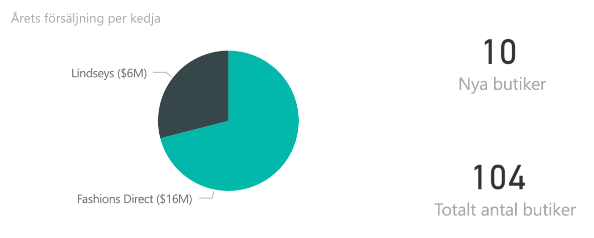  

   Observera resultatet i bubbeldiagrammet **Totalförsäljningsvarians %** :

     

   Distriktet **FD-01** har den högsta genomsnittliga **försäljningen per kvadratfot**, FD-02 har den lägsta **avvikelsen i försäljning** jämfört med föregående år. FD-03 och FD-04 har de övergripande sämsta resultaten.
4. Välj enskilda bubblor eller andra diagram för att se korsmarkering och effekten av dina val.
5. Välj **Exempel på detaljhandelsanalys** i det övre navigeringsfönstret för att återgå till instrumentpanelen.

   
6. På instrumentpanelen väljer du panelen **Årsförsäljning för nya och befintliga butiker**, vilket är samma sak som att skriva *Årsförsäljning* i fältet frågor och svar.

   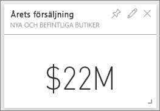

   Resultaten för frågor och svar visas:

   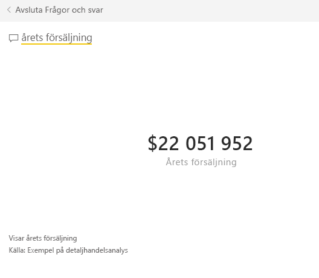

## Granska en panel som skapats med Frågor och svar i Power BI
Låt oss bli lite mer specifika.

1. Ändra frågan till _årets försäljning **per distrikt**_ . Se resultatet: Frågor och svar placerar automatiskt svaret i ett stapeldiagram och ger förslag på andra fraser:

   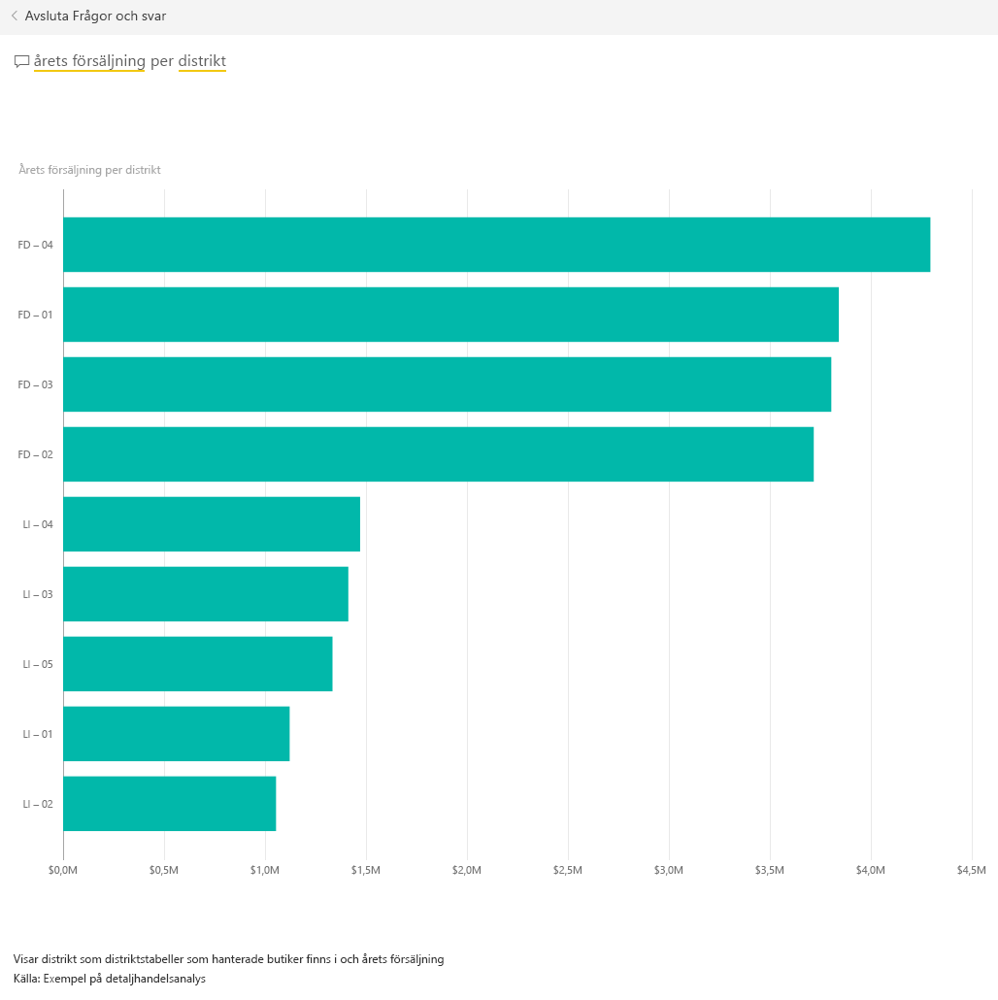
2. Ändra nu frågan till _årets försäljning **per postnummer och kedja**_ .

   Observera hur frågan besvaras av Power BI med lämpliga diagram samtidigt som du skriver.
3. Experimentera med fler frågor och se vilken typ av resultat du får.
4. När du är klar går du tillbaka till instrumentpanelen.

## Fördjupa dig i datan
Nu ska vi titta närmare på en mer detaljerad nivå, nämligen distriktens resultat.

1. På instrumentpanelen, väljer du panelen **Årets försäljning, Fjolårets försäljning** vilket öppnar sidan **Månadsförsäljning per distrikt** i rapporten.

   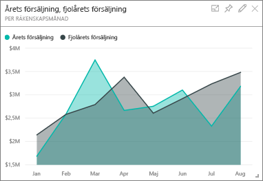

   I diagrammet **Totalförsäljningsvarians % per räkenskapsmånad** ser du de stora skillnaderna i avvikelse i % jämfört med föregående år, där januari, april och juli är särskilt dåliga månader.

   

   Låt oss se om vi kan upptäcka vad problemet är.
2. I bubbeldiagrammet väljer du bubblan **020-Herr**.

   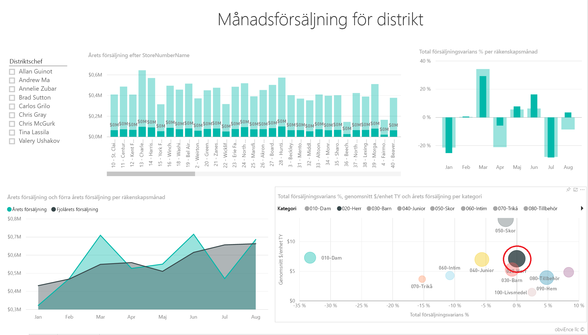  

   Observera att även om herrkategorin inte var lika kraftigt påverkad i april som den övergripande verksamheten var januari och juli ändå problemmånader.
1. Välj **bubblan 010-Dam**.

   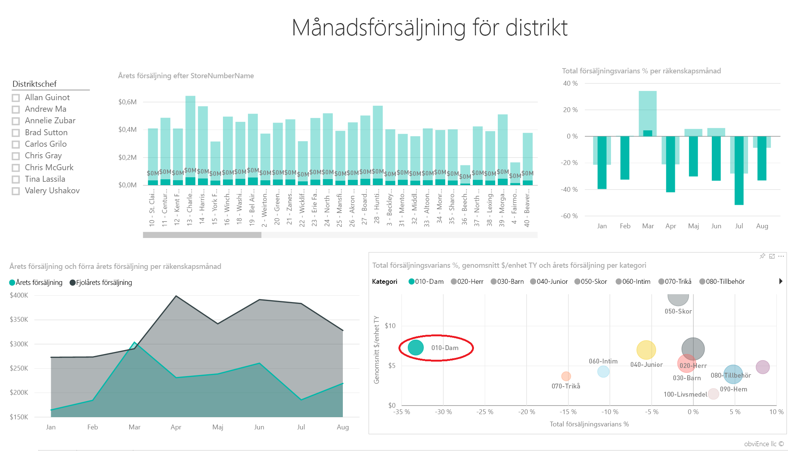

   Observera att damkategorin hade ett mycket sämre resultat än den övergripande verksamheten under alla månader och under nästan alla månader jämfört med föregående år.
1. Välj bubblan igen för att ta bort filtret.

## Testa utsnittet
Nu ska vi titta på hur det går för vissa distrikt.

1. Välj **Allan Guinot** i utsnittet **Distriktchef** uppe till vänster.

   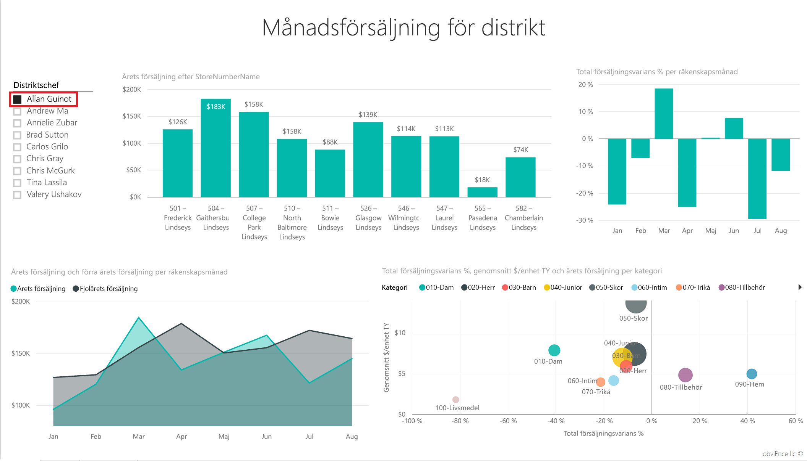

   Observera att Allans distrikt gick bättre än förväntat i mars och juni jämfört med förra året.
2. Med **Allan Guinot** fortfarande markerad väljer du bubblan **Dam-10** i bubbeldiagrammet.

   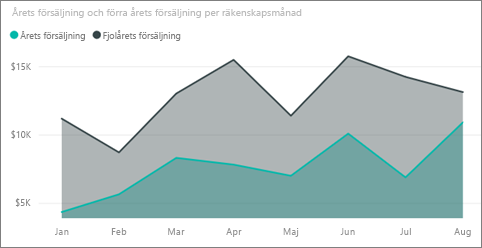

   Observera att Allans distrikt för kategorin Dam-10 inte uppnådde fjolårets volym.
3. Utforska andra distriktschefer och kategorier – vilka andra insikter kan du hitta?
4. När du är klar går du tillbaka till instrumentpanelen.

## Datan ger följande information om årets försäljning
Det sista området som vi ska utforska är vår tillväxt genom att titta på de nya butikerna som vi öppnade i år.

1. Välj panelen **Butiker som öppnats detta år efter öppningsmånad, kedja** vilket öppnar sidan **Analys av nya butiker** i rapporten.

   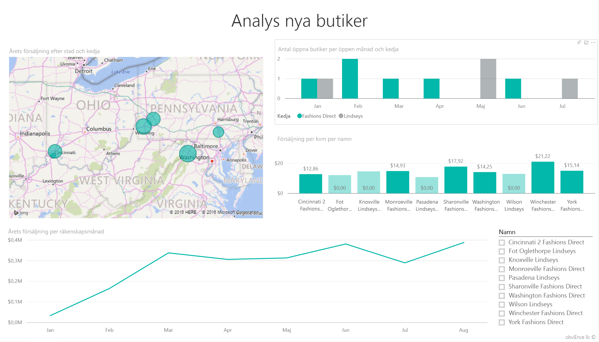

   Som framgår i panelen har det öppnats fler Fashions Direct-butiker än Lindseys-butiker i år.
2. Se diagrammet **Försäljning per kvadratfot och namn**:

   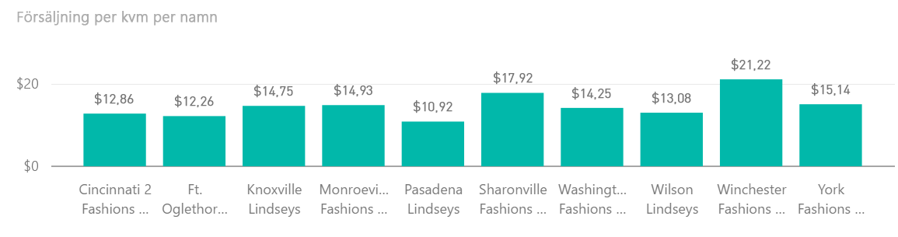

    Lägg märke till skillnaden i genomsnittlig försäljning/kvadratfot mellan de nya butikerna.
3. Välj förklaringsobjektet **Fashions Direct** i **Antal öppna butiker per öppningsmånad och kedja** i det övre högra diagrammet. Observera att till och med i samma kedja utklassar den bästa butiken (Winchester Fashions Direct) den sämsta butiken (Cincinnati 2 Fashions Direct) med 21,22 USD mot 12,86 USD.

   
4. Markera **Winchester Fashions Direct** i utsnittet **Namn** och observera linjediagrammet. De första försäljningssiffrorna rapporterades i februari.
5. Klicka på **Cincinnati 2 Fashions Direct** i utsnittet. Du ser då i linjediagrammet att den öppnades i juni och verkar vara den sämst presterande butiken.
6. Utforska genom att klicka på andra staplar, linjer och bubblor i diagrammen och se vilka insikter du kan upptäcka.

## Nästa steg: Anslut till dina data
Den här miljön är säker att leka i eftersom du kan välja att inte spara dina ändringar. Men om du sparar dem kan du alltid välja **Hämta data** för att få en ny kopia av exemplet.

Vi hoppas att denna rundtur har visat hur Power BI-instrumentpaneler, frågor och svar, samt rapporter kan ge insikter om exempeldata. Nu är det din tur – anslut till dina egna data. Med Power BI kan du ansluta till en mängd olika datakällor. Läs mer i [Kom igång med Power BI-tjänsten](service-get-started.md).
