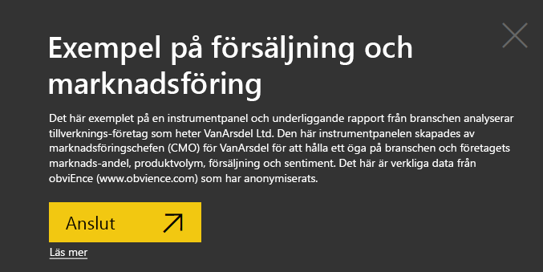
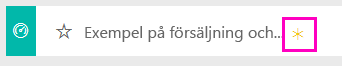
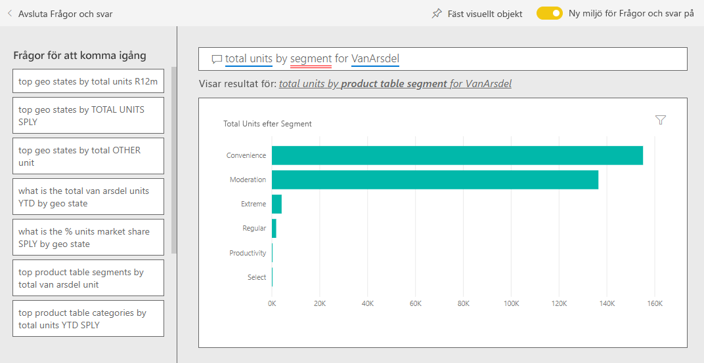
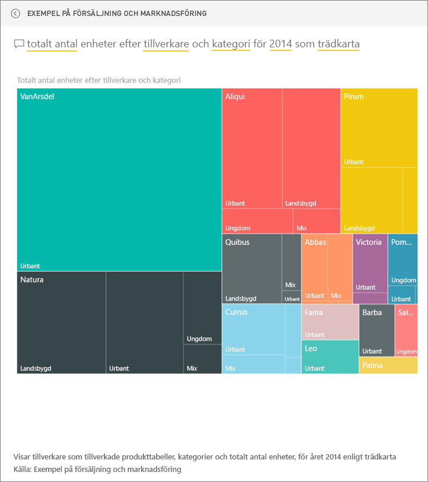

# Exempel på försäljning och marknadsföring för Power BI: Ta en rundtur

## Översikt på Exemplet på försäljning och marknadsföring
**Försäljning och marknadsföringsexemplet** innehåller en instrumentpanel och rapport för ett fiktivt tillverkningsföretag som heter VanArsdel Ltd. Den här instrumentpanelen skapades av marknadsföringschefen (CMO) för VanArsdel för att hålla ett öga på branschen och företagets marknadsandel, produktvolym, försäljning och sentiment.

VanArsdel har många konkurrenter men är marknadsledande inom sin bransch. CMO:n vill öka marknadsandel och identifiera tillväxtmöjligheter. Men av någon anledning har VanArsdels marknadsandel börjat minska med betydande dippar under juni.

Det här exemplet ingår i en serie som illustrerar hur du kan använda Power BI med affärsorienterade data, rapporter och instrumentpaneler. Det här är verkliga data från obviEnce (www.obvience.com) som har anonymiserats.

## Förutsättningar

 Innan du kan använda exemplet, måste du först hämta det som ett innehållspaket, en .pbix-fil eller en Excel-arbetsbok.

### Hämta innehållspaketet för det här exemplet

1. Öppna Power BI-tjänsten (app.powerbi.com) och logga in.
2. Längst ned i vänster hörn väljer du **Hämta data**.
   
    
3. På sidan Hämta data väljer du ikonen **Exempel**.
   
   
4. Välj **Exempel på försäljning och marknadsföring** och sedan **Anslut**.  
  
   
   
5. Power BI importerar innehållspaketet och lägger till en ny instrumentpanel, rapport och datauppsättning till din aktuella arbetsyta. Det nya innehållet markeras med en gul asterisk. 
   
   
  
### Hämta .pbix-filen för det här exemplet

Du kan även hämta exemplet som en .pbix-fil som är avsedd för användning med Power BI Desktop. 

 * [Exempel på försäljning och marknadsföring](http://download.microsoft.com/download/9/7/6/9767913A-29DB-40CF-8944-9AC2BC940C53/Sales%20and%20Marketing%20Sample%20PBIX.pbix)

### Hämta Excel-arbetsboken för det här exemplet
Du kan också [hämta enbart datauppsättningen (Excel-arbetsboken) för det här exemplet](http://go.microsoft.com/fwlink/?LinkId=529785). Arbetsboken innehåller Power View-blad som du kan visa och ändra. För att se rådata väljer du **Power Pivot > Hantera**.

## Vad kan vi utläsa från instrumentpanelen?
Vi ska starta våra rundtur på instrumentpanelen och titta på panelerna som CMO:n har valt att fästa. Vi kan se information om vår marknadsandel, försäljning och sentiment. Och vi ser att data uppdelas efter region, tid och konkurrens.

* Antalet sifferpaneler nedför den vänstra kolumnen visar branschens säljvolym det senaste året (50K), marknadsandel (32,86%), säljvolymen (16K), sentimentpoäng (68), sentimentgap (4) och totalt antal sålda enheter (1M).
* Det övre linjediagrammet visar hur våra marknadsandel förändras över tid. Vår marknadsandel dippar ordentligt i juni. Och vår R12M (rullande 12-månaders) andel som ökade ett tag, börjar stanna av.
* Vår största konkurrent är Aliqui (tydligt i mittenkolumnens diagrampanel).
* De mesta av vår verksamhet är i regionerna öst och central.
* Linjediagrammet längst ned visar att vår dip i juni inte är säsongsbaserad – ingen av våra konkurrenter har samma trend.
* De två panelerna totalt antal enheter visar sålda enheter, efter segment och region/tillverkare. Det största marknadssegmentet i vår bransch är **produktivitet** och **bekvämlighet**.

### Använd frågor och svar för att granska lite djupare
#### Vilka segment driver försäljningen? Matchar det branschtrenden?
1. Välj panelen totalt antal övergripande enheter efter segment vilket öppnar frågor och svar.
2. Skriv in **för VanArsdel** i slutet av den befintliga frågan. Frågor och svar tolkar frågan och visar ett uppdaterat diagram med svaret. Vår produktvolym kommer från bekvämlighet och måttlighet.

   
3. Vår del i kategorierna **måttlighet** och **bekvämlighet** är mycket högt. Det är i de här segmenten vi konkurrerar.
4. Gå tillbaka till instrumentpanelen genom att välja instrumentpanelens namn i det övre navigeringsfältet (spår).

#### Hur ser den totala marknadsandelen för enheter ut för kategorin (jämfört med region)?
1. Lägg märke till panelen totalt antal enheter i år efter tillverkare, region. Jag undrar hur den totala marknadsandelen för enheter ser ut efter kategori?

   
2. I frågerutan högst upp på instrumentpanelen, skriver du in frågan **totalt antal enheter per tillverkare och kategori för 2014 som ett träddiagram**. Observera hur visualiseringen uppdateras när du skriver frågan.
   
3. Om du vill jämföra resultaten, fäster du diagrammet på din instrumentpanel. Mycket intressant! Under 2014 sålde VanArsdel endast produkter som tillhör kategorin **urban**.
4. Gå tillbaka till instrumentpanelen.

Instrumentpaneler är också en startpunkt för rapporter.  Om en panel har skapats från en underliggande rapport, öppnas rapporten om du klickar på panelen.

På vår instrumentpanel visar R12M-linjen (rullande 12 månaders) att vår marknadsandel inte längre ökar med tiden, den minskar till och med lite. Och varför har vi en så stor dipp för marknadsandelar i juni? Klicka på den här visualiseringen för att öppna den underliggande rapporten om du vill undersöka vidare.

### Vår rapport har 4 sidor
#### Sida 1 av vår rapport fokuserar på VanArsdels marknadsandel.

1. Titta på stapeldiagrammet totalt antal enheter efter månad och isVanArsdel längst ned. Den svarta kolumnen representerar VanArsdel (våra produkter) och grön är våra konkurrenter. Dippen i juni 2014 som VanArsdel upplevde orsakades inte av konkurrensen.
2. Stapeldiagrammet total kategorivolym efter segment till höger, filtreras för att visa Vanarsdels viktigaste 2 segment. Ta en titt på hur det här filtret har skapats:  

   a.  Expandera fönstret filter till höger.  
   b.  Klicka för att markera visualiseringen.  
   c.  Under visuella nivåfilter, lägg märke till att **segment** filtreras till att enbart inkludera **bekvämlighet** och **måttlighet**.  
   d.  Ändra filtret genom att välja segment för att expandera det avsnittet och sedan kontrollera **produktivitet** för att även lägga till det segmentet.  
3. I totalt antal enheter efter månad och isVanArsdel, väljer du det svarta ja i förklaringen för att korsfiltrera sidan efter VanArsdel. Observera att vi inte konkurrerar i segmentet produktivitet.
4. Välj det svarta ja igen för att ta bort filtret.
5. Ta en titt på linjediagrammet. Den visar vår månatliga marknadsandel och 12 månaders rullande marknadsandelar. Rullande 12 månadersdata hjälper att släta ut de månatliga variationerna och visar de långsiktiga trenderna. Välj bekvämlighet och därefter måttlighet i stapeldiagrammet för att se hur mycket variationer i marknadsandel det är för varje segment. Segmentet måttlighet uppvisar mycket mer variationer i marknadsandel än segmentet bekvämlighet.

Vi letar fortfarande efter varför vår marknadsandel dippade så lågt i juni. Nu ska vi kolla sentiment.

#### Sidan 3 av vår rapport fokuserar på sentiment.

Tweets, Facebook, bloggar, artiklar, osv. bidrar till sentiment som visas i de två linjediagrammen. Sentimentdiagrammet i det övre vänstra visar att sentimentet för våra produkter var ganska neutralt fram tills februari. Därefter började en stor dipp under februari som nådde sin botten i juni. Vad hände för att orsaka den här dippen i sentiment? Vi behöver titta på externa källor. Under februari, betygsatta flera artiklar och blogginlägg VanArsdels kundtjänst som värst i branschen. Den här dåliga pressen hade en direkt korrelation med kundsentiment och försäljning. VanArsdel har arbetat hårt för att förbättra sin kundtjänst och kunderna och branschen uppmärksammade det. I juli började det positiva sentimentet att öka och nådde ett högstavärde på runt 60. Det här förbättrade sentimentet återspeglas i totalt antal enheter efter månad på sidorna 1 och 3. Det här kanske delvis förklarar vår dipp i marknadsandelar under juni?

Sentimentgap kan vara ett annaat område att utforska: vilka distrikt har det högsta sentimentgapet, hur kan chefer utnyttja det här och identifiera sätt att återskapa det i andra distrikt.

#### Sidan 2 av vår rapport fokuserar på kategoritrend i år

* Av alla företag i den här kategorin, är VanArsdel störst och våra största konkurrenter är Natura, Aliqui och Pirium. Vi håller ögonen på dem.
* Aliqui växer, men produktvolymen är fortfarande låg jämfört med oss.
* Träddiagrammet visar VanArsdel i grönt. I öst, föredrar kunder våra konkurrenter, i central går det ok och vår andel i öst är lägst.
* Geografisk plats påverkar sålda enheter. Öst är den dominerande regionen för de flesta tillverkare och VanArsdel har en stark närvaro i den centrala regionen också.
* På diagrammet totalt antal enheter i år Var % efter månad och tillverkare i det nedre högra – har vi en positiv avvikelse och det är ett bra tecken, det går bättre än förra året men det gör även en annan konkurrent, Aliqui.

#### Sida 4 i vår rapport fokuserar på konkurrensanalys för produkter.

* Det nedre vänstra diagrammet visar alla kategorisegment förutom VanArsdels två starkaste segment. Om du filtrerar efter kategori genom att klicka på staplarna så kan du identifiera potentiella expansionsområden för VanArsdel. Segmenten **extrem** och **produktivitet** ökar snabbare än andra.
* Men vi konkurrerar inte i dessa segment. Om vi vill flytta till dessa områden, kan vi använda våra data och se vilka segment som är vanliga i vilka regioner. Vi kan ytterligare undersöka frågor som vilken region växer snabbare och vem som skulle vara vår största konkurrent i segmentet.
* Kommer du ihåg våra dipp av marknadsandelar i juni? Juni är en viktig månad för produktivitetssegmentet – ett segment som vi inte konkurrerar i alls. Det här kan hjälpa till att förklara vår dipp av marknadsandelar i juni.

Genom att filtrera visualiseringar efter VanArsdel, efter segment, efter månad och efter region, kan vi identifiera tillväxtmöjligheter för VanArsdel.

Det här är en säker miljö att leka runt i. Du kan alltid välja att inte spara ändringarna. Men om du sparar dem, kan du alltid gå till **Hämta data** för en ny kopia av det här exemplet.

## Nästa steg: anslut till dina data
Vi hoppas att den här rundturen har visat hur Power BI-instrumentpaneler, frågor och svar, samt rapporter kan ge dig insikter om försäljnings- och marknadsföringsdata. Nu är det din tur – anslut till dina egna data. Med Power BI kan du ansluta till en mängd olika datakällor. Läs mer om att [komma igång med Power BI](service-get-started.md).  
