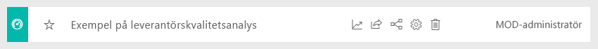

# Exempel på försäljning och marknadsföring för Power BI: Ta en rundtur

Exemplet på försäljning och marknadsföring innehåller en instrumentpanel och rapport för ett fiktivt tillverkningsföretag som heter VanArsdel Ltd. Marknadsföringschefen (CMO) för VanArsdel skapade den här instrumentpanelen för att hålla ett öga på branschen samt företagets marknadsandel, produktvolym, försäljning och sentiment.

VanArsdel har många konkurrenter men är marknadsledande inom sin bransch. CMO:n vill öka marknadsandel och identifiera tillväxtmöjligheter. Men av okända anledningar har VanArsdels marknadsandel börjat minska med betydande dippar under juni.

Det här exemplet ingår i en serie som visar hur du kan använda Power BI med verksamhetsorienterade data, rapporter och instrumentpaneler. Det skapades av [obviEnce](http://www.obvience.com/) med verkliga data, som har anonymiserats. Dessa data är tillgängliga i flera format: innehållsförpackning, .pbix-fil för Power BI Desktop eller Excel-arbetsbok. Se [Exempel för Power BI](sample-datasets.md). 

Den här självstudien utforskar innehållspaketet för Exempel på försäljning och marknadsföring i Power BI-tjänsten. Eftersom rapportupplevelserna är så lika i Power BI Desktop och tjänsten kan du även följa med via .pbix-exempelfilen i Power BI Desktop. 

Du behöver inte en licens för Power BI för att utforska exempel i Power BI Desktop. Om du inte har en Power BI Pro-licens kan du spara exemplet på Min arbetsyta i Power BI-tjänsten. 

## Hämta exemplet

Innan du kan använda exemplet, måste du först hämta det som ett [innehållspaket](#get-the-content-pack-for-this-sample), en [.pbix-fil](#get-the-pbix-file-for-this-sample) eller en [Excel-arbetsbok](#get-the-excel-workbook-for-this-sample).

### Hämta innehållspaketet för det här exemplet

1. Öppna Power BI-tjänsten (app.powerbi.com), logga in och öppna den arbetsyta där du vill spara exemplet.

   Om du inte har en Power BI Pro-licens kan du spara exemplet på Min arbetsyta.

2. Längst ned i vänster hörn väljer du **Hämta data**.
   
   
3. På sidan **Hämta data** väljer du **Exempel**.
   
4. Välj **Exempel på försäljning och marknadsföring** och sedan **Anslut**.   
  
   
   
5. Power BI importerar innehållspaketet och lägger sedan till en ny instrumentpanel, rapport och datamängd till din aktuella arbetsyta.
   
   
  
### Hämta .pbix-filen för det här exemplet

Alternativt kan du ladda ned Exempel på försäljning och marknadsföring som en [.pbix-fil](https://download.microsoft.com/download/9/7/6/9767913A-29DB-40CF-8944-9AC2BC940C53/Sales%20and%20Marketing%20Sample%20PBIX.pbix) som är avsedd för användning med Power BI Desktop.

### Hämta Excel-arbetsboken för det här exemplet

Om du vill visa i datakällan för det här exemplet är det även tillgängligt som en [Excel-arbetsbok](https://go.microsoft.com/fwlink/?LinkId=529785). Arbetsboken innehåller Power View-blad som du kan visa och ändra. Om du vill se rådata aktiverar du dataanalystilläggen och väljer **Power Pivot > Hantera**. Aktivering av tilläggen för Power View och Power Pivot beskrivs i avsnittet om att [titta på Excel-exemplen inuti själva Excel](sample-datasets.md#optional-take-a-look-at-the-excel-samples-from-inside-excel-itself).

## Vad kan vi utläsa från instrumentpanelen?
Vi ska starta våra rundtur på instrumentpanelen och titta på panelerna som CMO:n har valt att fästa. Vi kan se information om vår marknadsandel, försäljning och sentiment. Data uppdelas efter region, tid och konkurrens.

* Antalet sifferpaneler längsmed den vänstra kolumnen visar branschens säljvolym det gångna året (50 000), marknadsandel (32,86 %), säljvolymen (16 000), sentimentpoäng (68), sentimentgap (4) och totalt antal sålda enheter (1 miljon).
* Det översta linjediagrammet ( **%-enheter marknadsandel, jämfört med %-enheter marknadsandel rullande 12 månader**) visar hur vår marknadsandel varierar över tid. Observera den stora minskningen i juni. Och vår rullande 12-månaders (R12M) andel, som ökade ett tag, börjar nu stanna av.
* Vår största konkurrent är Aliqui, vilket framgår av mittenkolumnens diagrampanel (**YTD-varians i % för totalt antal enheter**).
* De mesta av vår verksamhet är i regionerna öst och central.
* Linjediagrammet längst ned (**Totalt antal enheter för 2014**) visar att vår dip i juni inte är säsongsbaserad – ingen av våra konkurrenter har samma trend.
* Panelerna **Totalt antal enheter sammanlagt** och **Totalt antal enheter YTD** till höger visar sålda enheter efter segment och efter region/tillverkare. Den största marknadssegmenten i vår bransch är **Produktivitet** och **Bekvämlighet**.

## Använd frågor och svar för att granska lite djupare

Med hjälp av frågor och svar kan du identifiera ytterligare information i data.

### Vilka segment driver försäljningen? Matchar de branschtrenden?
1. Välj panelen **Totalt antal enheter sammanlagt efter segment**, som öppnar Frågor och svar och fyller i med frågan, *totalt antal enheter efter segment*.
2. I slutet för den befintliga frågan lägger du till: *för VanArsdel*. Frågor och svar tolkar frågan och visar ett uppdaterat diagram med svaret. Observera att produktvolymen främst kommer från segmenten **Bekvämlighet** och **Måttlighet**.

   
3. Vår andel i kategorierna **Måttlighet** och **Bekvämlighet** är mycket hög. Det är i de här segmenten vi konkurrerar.
4. Gå tillbaka till instrumentpanelen genom att välja **Exempel på försäljning och marknadsföring** i det övre navigeringsfönstret.

### Hur ser den totala marknadsandelen för enheter ut för kategorin (jämfört med region)?
1. Lägg märke till panelen **YTD för totalt antal enheter efter tillverkare, region**. Vad är den totala marknadsandelen för enheter efter kategori?

   
2. Välj frågerutan högst upp på instrumentpanelen och skriv in frågan *totalt antal enheter per tillverkare och kategori för 2014 som ett träddiagram*. Observera hur visualiseringen uppdateras när du skriver frågan.

   
3. Om du vill jämföra resultaten, fäster du diagrammet på din instrumentpanel. Observera detta intressanta faktum: År 2014 sålde VanArsdel endast produkter i kategorin **Urbant**.
4. Gå tillbaka till instrumentpanelen.

## Rapport för Exempel på försäljning och marknadsföring

Instrumentpaneler är en startpunkt för rapporter. Om en panel har skapats från en underliggande rapport öppnas rapporten om du väljer den panelen.

På instrumentpanelen visar linjen **%-enheter marknadsandel R12M** i diagrammet **%-enheter marknadsandel, jämfört med %-enheter marknadsandel rullande 12 månader** att vår marknadsandel inte längre ökar med tiden. Den har rentav minskat något. Och varför har vi en stor dipp i marknadsandelen i juni? 

Rapporten för Exempel på försäljning och marknadsföring innehåller fyra sidor.
 
### VanArsdel – sida för marknadsandel
Sida ett i rapporten fokuserar på VanArsdels marknadsandel.

1. På instrumentpanelen väljer du diagrammet **%-enheter marknadsandel, jämfört med %-enheter marknadsandel rullande 12 månader** för att öppna sidan **VanArsdel – marknadsandel** i rapporten för Exempel på försäljning och marknadsföring.

   

2. Titta på stapeldiagrammet **Totalt antal enheter efter månad och isVanArsdel** längst ned i rapporten. Den svarta kolumnen representerar VanArsdel (våra produkter), och den gröna kolumnen är våra konkurrenter. Den dipp i juni 2014 som VanArsdel upplevde drabbade inte konkurrensen.

3. Stapeldiagrammet **Total kategorivolym efter segment** till höger filtreras för att visa VanArsdels två främsta segment. Ta en titt på hur det här filtret har skapats:  

   a. Välj diagrammet **Total kategorivolym efter segment**.

   b. Välj fönstret **Filter** till höger för att expandera det.  

   c. Under **Filter på visualiseringsnivå** filtreras **Segment** till att endast inkludera segmenten **Bekvämlighet** och **Måttlighet**.  

   d. Ändra filtret genom att välja **Segment** för att expandera det, och markera sedan **Produktivitet** för att lägga till det segmentet.  

4. I diagrammet **Totalt antal enheter efter månad och isVanArsdel** väljer du **Ja** i förklaringen för att korsfiltrera sidan efter VanArsdel. Observera att vi i diagrammet **Total kategorivolym efter segment** inte konkurrerar i segmentet **Produktivitet**.

5. Välj **Ja** igen i förklaringen för att ta bort filtret.

6. Titta på linjediagrammet **%-enheter marknadsandel och %-enheter marknadsandel R12M efter månad**. Det visar vår månatliga marknadsandel och rullande 12 månaders marknadsandelar. Data för rullande månaders hjälper till att släta ut de månatliga variationerna och visar långsiktiga trender. I stapeldiagrammet **Total kategorivolym efter segment** väljer du **Bekvämlighet** och sedan **Måttlighet** för att se variationen i marknadsandel för varje segment. Observera att segmentet **Måttlighet** uppvisar mycket mer variationer i marknadsandel.

Vi letar fortfarande efter varför vår marknadsandel dippade så lågt i juni. Nu kontrollerar vi sidan **Attitydanalys** i rapporten.

### Sidan Attitydanalys
Sida tre i rapporten fokuserar på konsumentsentiment.

Tweets, Facebook, bloggar och artiklar bidrar alla till konsumentsentiment, vilket visas i de två linjediagrammen till vänster på sidan. Diagrammet **VanArsdel – sentiment efter månad** i det övre vänstra hörnet visar att sentimentet för våra produkter var mestadels neutralt fram till februari. Därefter började en stor dipp under februari som nådde sin botten i juni. Vad hände för att orsaka den här dippen i sentiment? 

Vi tittar på externa källor. Under februari betygsatte flera artiklar och blogginlägg VanArsdels kundtjänst som sämst i branschen. Den här dåliga pressen hade en direkt korrelation med kundsentiment och försäljning. VanArsdel arbetade hårt för att förbättra sin kundtjänst, vilket kunderna och branschen uppmärksammade. I juli började det positiva sentimentet att öka och nådde sin toppen någonstans över 60. Den här uppgången i sentiment framgår i diagrammet **Totalt antal enheter efter månad** på sidorna en och två i rapporten. Det här kanske delvis förklarar vår dipp i marknadsandelar under juni?

Sentimentgap kan vara ett annat område att utforska. Vilka distrikt har det högsta sentimentgapet, hur kan ledningen utnyttja detta och hur kan de replikera det i andra distrikt?

### Sida för trendanalys för kategori hittills i år
Sidan två av rapporten fokuserar på trenden för kategorin hittills i år.

Observera följande information:
* VanArsdel är det största företaget i den här kategorin, och dess största konkurrenter är Natura, Aliqui och Pirium. Vi håller ögonen på dem.
* Aliqui växer, men produktvolymen är fortfarande låg jämfört med oss.
* Träddiagrammet visar VanArsdel i grönt. I regionen Östra föredrar våra kunder konkurrenterna, men i regionen Centrala presterar vi ganska väl. Vår marknadsandel i regionen Östra är vår lägsta.
* Geografisk plats påverkar sålda enheter. Regionen Östra är den dominerande regionen för de flesta tillverkare, och VanArsdel har även en stark närvaro i regionen Centrala.
* I diagrammet **Totalt antal enheter YTD, varians-% efter månad och tillverkare** i det nedre högra hörnet har vi en positiv varians, vilket är ett positivt tecken. Vi presterar bättre än förra året, men det gör även vår konkurrent Aliqui.

### Sidan för tillväxtmöjligheter
Sida fyra i rapporten fokuserar på konkurrensanalys för produkter.

Observera följande information:
* Diagrammet **Totalt antal enheter efter segment** i det nedre vänstra hörnet visar alla kategorisegment förutom VanArsdels två starkaste segment. Välj vart och ett av segmenten i turordning för att identifiera potentiella expansionsområden för VanArsdel. 
* Observera att segmenten **Extrem** och **Produktivitet** ökar snabbare än andra. Vi konkurrerar dock inte inom dessa segment. Om vi vill börja verka i dessa områden kan vi använda våra data och se vilka segment som är populära i vilka regioner. Vi kan ytterligare undersöka frågor såsom vilken region som växer snabbare och vem som skulle vara vår största konkurrent i segmentet.
* Kommer du ihåg våra dipp av marknadsandelar i juni? Juni är en viktig månad för segmentet **Produktivitet**, ett segment som vi inte konkurrerar i alls. Den här detaljen skulle kunna hjälpa till att förklara vår dipp i marknadsandelen i juni.

Genom att filtrera visualiseringar efter VanArsdel, efter segment, efter månad och efter region, kan vi identifiera tillväxtmöjligheter för VanArsdel.

## Nästa steg: Anslut till dina data
Den här miljön är säker att leka i eftersom du kan välja att inte spara dina ändringar. Men om du sparar dem kan du alltid välja **Hämta data** för att få en ny kopia av exemplet.

Vi hoppas att denna rundtur har visat hur Power BI-instrumentpaneler, frågor och svar, samt rapporter kan ge insikter om personalfrågor. Nu är det din tur – anslut till dina egna data. Med Power BI kan du ansluta till en mängd olika datakällor. Läs mer i [Kom igång med Power BI-tjänsten](service-get-started.md).
