# Exempel på leverantörskvalitetsanalys för Power BI: Ta en rundtur

Det här exemplet på en instrumentpanel och underliggande rapport från branschen fokuserar på en av de mest typiska utmaningarna i leveranskedjan: analys av leverantörskvalitet. Två primära mått används i den här analysen: det totala antalet defekter och den totala nedtiden som dessa defekter har orsakat. 

Det här exemplet har två huvudsakliga mål:

* Förstå vilka leverantörer som är bäst och sämst med avseende på kvalitet.
* Identifiera vilka anläggningar som gör ett bättre jobb när det gäller att hitta och avvisa defekter, för att minimera stilleståndstiden.

Det här exemplet ingår i en serie som visar hur du kan använda Power BI med verksamhetsorienterade data, rapporter och instrumentpaneler. Det skapades av [obviEnce](http://www.obvience.com/) med verkliga data, som har anonymiserats. Dessa data är tillgängliga i flera format: innehållsförpackning, .pbix-fil för Power BI Desktop eller Excel-arbetsbok. Se [Exempel för Power BI](sample-datasets.md). 

Den här självstudien utforskar innehållspaketet för Exempel på leverantörskvalitetsanalys i Power BI-tjänsten. Eftersom rapportupplevelserna är så lika i Power BI Desktop och tjänsten kan du även följa med via .pbix-exempelfilen i Power BI Desktop. 

Du behöver inte en licens för Power BI för att utforska exempel i Power BI Desktop. Om du inte har en Power BI Pro-licens kan du spara exemplet på Min arbetsyta i Power BI-tjänsten. 

## Hämta exemplet

Innan du kan använda exemplet, måste du först hämta det som ett [innehållspaket](#get-the-content-pack-for-this-sample), en [.pbix-fil](#get-the-pbix-file-for-this-sample) eller en [Excel-arbetsbok](#get-the-excel-workbook-for-this-sample).

### Hämta innehållspaketet för det här exemplet

1. Öppna Power BI-tjänsten (app.powerbi.com), logga in och öppna den arbetsyta där du vill spara exemplet.

   Om du inte har en Power BI Pro-licens kan du spara exemplet på Min arbetsyta.

2. Längst ned i vänster hörn väljer du **Hämta data**.
   
   
3. På sidan **Hämta data** väljer du **Exempel**.
   
4. Välj **Exempel på leverantörskvalitetsanalys** och sedan **Anslut**.  
   
   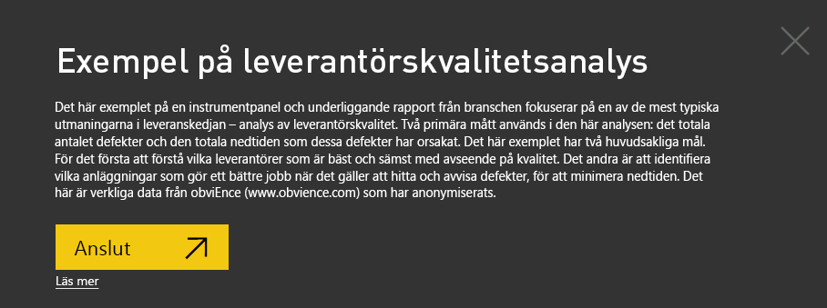

5. Power BI importerar innehållspaketet och lägger sedan till en ny instrumentpanel, rapport och datamängd till din aktuella arbetsyta.
   
   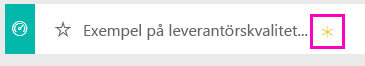
  
### Hämta .pbix-filen för det här exemplet

Du kan även ladda ned Exempel på leverantörskvalitetsanalys som en [.pbix-fil](https://download.microsoft.com/download/8/C/6/8C661638-C102-4C04-992E-9EA56A5D319B/Supplier-Quality-Analysis-Sample-PBIX.pbix) som är avsedd för användning med Power BI Desktop.

### Hämta Excel-arbetsboken för det här exemplet

Om du vill visa i datakällan för det här exemplet är det även tillgängligt som en [Excel-arbetsbok](https://go.microsoft.com/fwlink/?LinkId=529779). Arbetsboken innehåller Power View-blad som du kan visa och ändra. Om du vill se rådata aktiverar du dataanalystilläggen och väljer **Power Pivot > Hantera**. Aktivering av tilläggen för Power View och Power Pivot beskrivs i avsnittet om att [Titta på Excel-exemplen inuti Excel](sample-datasets.md#explore-excel-samples-inside-excel).

## Stilleståndstid som orsakas av defekta material
Nu ska vi analysera den stilleståndstid som orsakas av defekta material och se vilka leverantörer som är ansvariga.  

1. På instrumentpanelen väljer du panelen **Total defekt mängd** eller **Total nedtid i minuter**.

   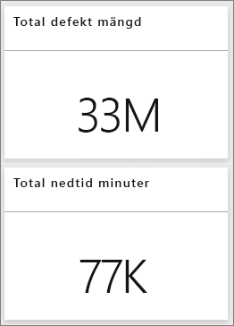  

   Rapporten Exempel på leverantörskvalitetsanalys öppnas på sidan **Analys av nedtid**.

   Observera att vi har 33 miljoner defekta delar, vilket orsakar en total nedtid på 77 000 minuter. Även om vissa material har färre defekta delar kan de orsaka fördröjningar, vilket leder till mer nedtid. Vi ska undersöka dem på rapportsidan.  
2. Om vi tittar på raden **Total defekt mängd** i kombinationsdiagrammet **Defekter och nedtid (min) per materialtyp** ser vi att korrugerade material orsakar mest nedtid.  
3. Välj kolumnen **Korrugerad** för att se vilka anläggningar som påverkas mest av den här defekten och vilken leverantör som är ansvarig.  

     
4. På kartan **Nedtid (min) per anläggning** väljer du enskilda anläggningar på kartan för att se vilken leverantör eller vilket material som är orsaken till nedtiden på den anläggningen.

### Vilka är de sämsta leverantörerna?
 Vi vill hitta de åtta sämsta leverantörerna och fastställa hur stor procentandel av nedtiden de står för. Vi kan göra detta genom att ändra ytdiagrammet **Nedtid (min) efter leverantör** till en trädkarta.  

1. På sidan **Analys av nedtid** i rapporten väljer du **Redigera rapport** i det övre vänstra hörnet.  
2. Välj ytdiagrammet **Nedtid (min) per leverantör**. I fönstret **Visualiseringar** väljer du sedan ikonen **Trädkarta**.  

   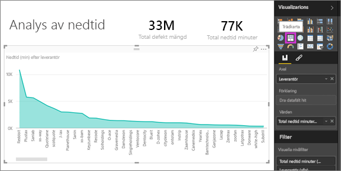  

    Trädkartan anger automatiskt fältet **Leverantör** till **Grupp**.  

      

   I den här trädkartan ser vi att de åtta främsta leverantörerna är de åtta blocken till vänster i trädkartan. Vi kan också se att de svarar för 50 % av all stilleståndstid i minuter.  
3. Välj **Exempel på leverantörskvalitetsanalys** i det övre navigeringsfönstret för att gå tillbaka till instrumentpanelen.

### Jämföra anläggningar
Nu ska vi titta närmare på vilken anläggning som är bäst på att hantera defekta material, vilket resulterar i kortare stilleståndstid.  

1. På instrumentpanelen väljer du kartrutan **Rapport över totala defekter per anläggning, defekt typ**.      

   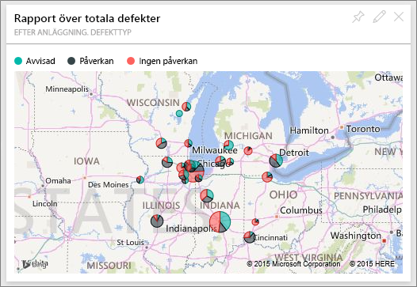  

   Rapporten öppnas på sidan **Leverantörskvalitetsanalys**.  

2. I förklaringen för **Rapport över totala defekter per anläggning och defekt typ** väljer du cirkeln **Påverkan**.  

    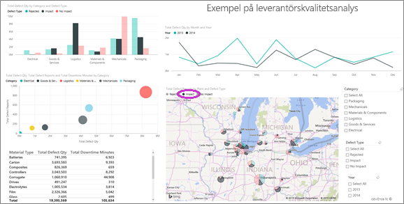  

    Lägg märke till att **Logistik** i bubbeldiagrammet är den mest problematiska kategorin. Den är störst vad gäller total defekt mängd, rapporter över defekter samt nedtid i minuter. Låt oss utforska den här kategorin mer.  
3. Välj **Logistik**-bubblan i bubbeldiagrammet och titta på anläggningarna i Springfield och i Naperville i Illinois. Naperville verkar göra ett mycket bättre arbete med att hantera defekta material eftersom de har ett stort antal avvisade artiklar och låg påverkan, jämfört med Springfields höga siffra för påverkan.  

     
4. Välj **Exempel på leverantörskvalitetsanalys** i det övre navigeringsfönstret för att gå tillbaka till instrumentpanelen.

## Vilken materialtyp hanteras bäst?
Den bäst hanterade materialtypen är den med lägst stilleståndstid eller utan påverkan, oavsett antalet defekter.

1. I instrumentpanelen tittar vi närmare på panelen **Total Defect Quantity by Material Type (Totalt antal defekta per materialtyp), Defect Type (Defekttyp)** .

   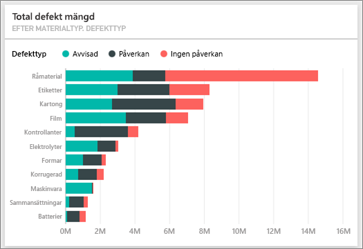

   Observera att materialtypen **Råmaterial** har ett stort antal totala defekter, men att de flesta av dessa defekter antingen avvisas eller saknar påverkan.

   Vi ska kontrollera att den här materialtypen inte orsakar mycket nedtid, trots högt antal defekter.

2. I instrumentpanelen tittar vi närmare på panelen **Total Defect Qty (Totalt antal defekta), Total Downtime Minutes by Material Type (Total stilleståndstid i minuter per materialtyp)** .

   

   Råmaterial verkar hanteras väl: de har fler defekter men total lägre total nedtid i minuter.

### Jämföra defekter med stilleståndstid per år
1. Välj kartrutan **Rapport över totala defekter per anläggning, defekt typ** för att öppna rapporten på sidan **Leverantörskvalitetsanalys**.
2. I diagrammet **Total mängd defekter per månad och år** ser du att den defekta kvantiteten är högre under 2014 än under 2013.  

      
3. Innebär fler defekter längre stilleståndstid? Ställ frågor i Frågor och svar-rutan för att ta reda på det.  
4. Välj **Exempel på leverantörskvalitetsanalys** i det övre navigeringsfönstret för att gå tillbaka till instrumentpanelen.  
5. Eftersom vi vet att råmaterial har det högsta antalet defekter skriver du följande i frågerutan: *visa materialtyper, år och total mängd defekta*.  

    Det förekom många fler råmaterialsdefekter under 2014 än under 2013.  

    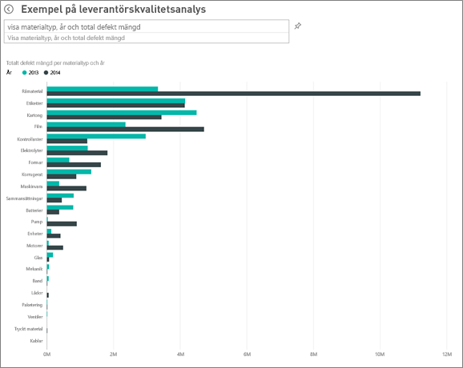  
6. Sedan ändrar du frågan till _visa materialtyper, år och total **stilleståndstid i minuter**_ .  

   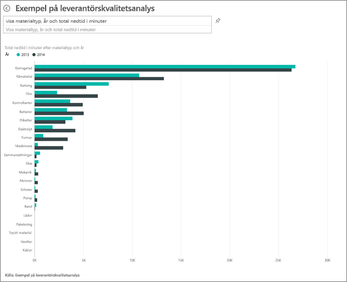

   Observera att nedtiden för råmaterial låg på ungefär samma nivå 2013 och 2014, trots att det förekom många fler råmaterialdefekter under 2014. Det verkar som att det större antalet defekter för råmaterial under 2014 inte ledde till särskilt mycket mer nedtid för råmaterial under 2014.

### Jämför defekterna med stilleståndstiden månad för månad
Nu ska vi titta på en annan instrumentpanels panel som rör det totala antalet defekta material.  

1. Välj **Avsluta Frågor och svar** i det övre vänstra hörnet för att gå tillbaka till instrumentpanelen.  

    Titta närmare på panelen **Total defekt mängd per månad, år**. Den visar att den första halvan av 2014 hade ett motsvarande antal defekter som 2013, men under andra halvan av 2014 steg antalet defekter avsevärt.  

    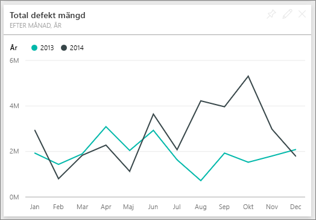  

    Låt oss se om det ökade antalet defekter ledde till en lika stor ökad stilleståndstid i minuter.  
2. I frågerutan skriver du *total nedtid i minuter per månad och år som ett linjediagram*.  

   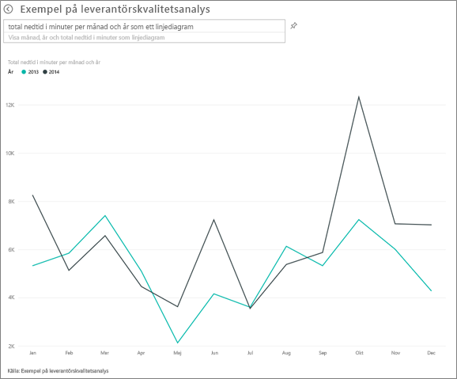

   Förutom en tydlig ökning av nedtiden i minuter under juni och oktober resulterade det större antalet defekter inte i någon väsentlig ökning av nedtiden. Det här resultatet visar att vi hanterar problem på rätt sätt.  
3. Välj fästikonen för att fästa diagrammet på instrumentpanelen  ovanför frågerutan.  
4. Om du vill utforska de avvikande månaderna kontrollerar du nedtiden i minuter under oktober per materialtyp, anläggningsplats, kategori och så vidare genom att ställa frågor som *total nedtid i minuter i oktober per anläggning*. 
5. Välj **Avsluta Frågor och svar** i det övre vänstra hörnet för att gå tillbaka till instrumentpanelen.

## Nästa steg: Anslut till dina data
Den här miljön är säker att leka i eftersom du kan välja att inte spara dina ändringar. Men om du sparar dem kan du alltid välja **Hämta data** för att få en ny kopia av exemplet.

Vi hoppas att denna rundtur har visat hur Power BI-instrumentpaneler, frågor och svar, samt rapporter kan ge insikter om exempeldata. Nu är det din tur – anslut till dina egna data. Med Power BI kan du ansluta till en mängd olika datakällor. Läs mer i [Kom igång med Power BI-tjänsten](service-get-started.md).
