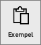
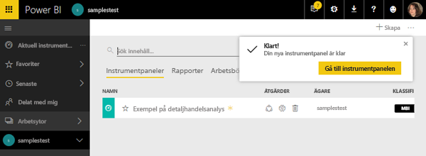
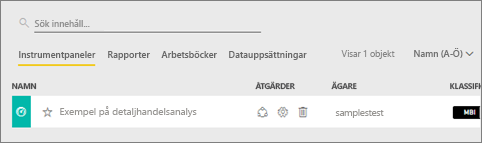
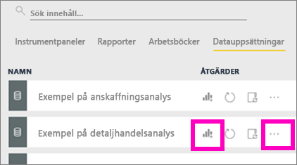

#  Ansluta till exemplen i Power BI-tjänsten

I de här självstudierna lär du dig att: 
- Importera ett exempelinnehållspaket, lägga till det i Power BI-tjänsten och öppna innehållet. Ett *innehållspaket* är en typ av exempel där datauppsättningen har paketerats med en instrumentpanel och en rapport. 
- Öppna en PBIX-exempelfil i Power BI Desktop.

Om du vil ha lite mer bakgrund rekommenderar vi att du börjar med artikeln [Exempel på datauppsättningar för Power BI](sample-datasets.md). I den här artikeln får du lära dig allt om exemplen. Hur du hämtar dem, var du sparar dem, hur du använder dem och några av de budskap som varje exempel kan förmedla. Sedan, när du har ett grepp om grunderna, kan gå tillbaka till de här självstudierna.   

## Förutsättningar
Exemplen finns tillgängliga för Power BI-tjänsten och Power BI Desktop. Om du vill följa med kommer vi att använda exemplet på detaljhandelsanalysen.

Innehållspaketet för *Exempel på detaljhandelsanalys* som används i de här självstudierna består av en instrumentpanel, en rapport och en datauppsättning.
Om du vill bekanta dig med det här specifika innehållspaketet och dess scenario, kan du [ta en titt på exemplet på detaljhandelsanalys](sample-retail-analysis.md) innan du börjar.

## Exempel och Power BI-tjänsten

1. Öppna Power BI-tjänsten och logga in (app.powerbi.com).
2. Välj **Hämta data** längst ned i det vänstra navigeringsfönstret. Om du inte ser **Hämta data** kan du expandera navigeringsfönstret genom att välja .
   
   
5. Välj **Exempel**.  
   
   
6. Välj *Exempel på detaljhandelsanalys* och sedan **Anslut**.   
   
   

## Vad exakt importerades?
När du arbetar med exemplen på innehållspaket och väljer **Anslut**, hämtar Power BI en kopia av det aktuella innehållspaketet och lagrar det åt dig i molnet. Eftersom den person som skapade innehållspaketet inkluderade en datauppsättning, en rapport och en instrumentpanel – är det det som du får när du klickar på **Anslut**. 

1. Power BI skapar den nya instrumentpanelen och visar den på fliken **Instrumentpaneler**. Den gula asterisken visar att den är ny.
   
   
2. Öppna fliken **Rapporter**.  Här visas en ny rapport med namnet *Exempel på detaljhandelsanalys*.
   
   
   
   Titta närmare på fliken **Datauppsättningar**.  Där finns även en ny datauppsättning.
   
   

## Utforska ditt nya innehåll
Utforska nu instrumentpanelen, datauppsättningen och rapporten på egen hand. Det finns många olika sätt för att navigera till dina instrumentpaneler, rapporter och datauppsättningar och bara ett av dessa sätt beskrivs nedan.  

> [!TIP]
> Vill du ha lite stöd på vägen först?  Prova [rundturen i exemplet för detaljhandelsanalys](sample-retail-analysis.md) för en stegvis genomgång av det här exemplet.
> 
> 

1. Gå tillbaka till fliken **Instrumentpaneler** och markera instrumentpanelen *Exempel på detaljhandelsanalys* för att öppna den.    
   
   
2. Instrumentpanelen öppnas.  Den innehåller många olika visualiseringspaneler.
   
   
3. Välj en av panelerna för att öppna den underliggande rapporten.  I det här exemplet ska vi välja ytdiagrammet (indikeras med rosa på föregående bild). Rapporten öppnas på den sida som innehåller ytdiagrammet.
   
    
   
   > [!NOTE]
   > Om panelen hade skapats med hjälp av [Power BI:s frågor och svar](consumer/end-user-q-and-a.md), skulle sidan Frågor och svar öppnats i stället. Om panelen hade [fästs från Excel](service-dashboard-pin-tile-from-excel.md), skulle Excel Online ha öppnats i Power BI.
   > 
   > 
1. Tillbaka på din flik **Datauppsättningar** har du flera alternativ för att utforska din datauppsättning.  Du kommer inte att kunna öppna den och se alla rader och kolumner (som du kan i Power BI Desktop eller Excel).  När någon delar ett innehållspaket med kollegor vill de vanligtvis dela med sig av vissa insikter och inte ge dem direkt åtkomst till specifika data. Men det betyder inte att du inte kan utforska datauppsättningen.  
   
   
   
   * Ett sätt att utforska datauppsättningen är genom att skapa egna visualiseringar och rapporter från grunden.  Välj diagramikonen  för att öppna datauppsättningen i rapportredigeringsvyn.
     
       
   * Ett annat sätt att utforska datauppsättningen är att köra [Quick Insights](consumer/end-user-insights.md). Välj ellipserna (...) och välj **Hämta insikter**. När insikterna är klara väljer du **Visa insikter**.
     
       

## Exempel och Power BI Desktop 
När du först öppnar PBIX-exempelfilen visas den i rapportvyn där du kan utforska, skapa och ändra valfritt antal rapportsidor med visualiseringar. Rapportvyn ger praktiskt taget samma designupplevelse som rapportens redigeringsvy i Power BI-tjänsten. Du kan flytta runt visuella objekt, kopiera och klistra in, sammanfoga och så vidare.

Skillnaden mellan dessa är att när du använder Power BI Desktop kan du arbeta med dina frågor och modellera dina data så att dina data ger de bästa insikterna i dina rapporter. Du kan spara Power BI Desktop-filen var du vill, oavsett om det är en lokal hårddisk eller till molnet.

1. Öppna [PBIX-filen Exempel på detaljhandelsanalys](http://download.microsoft.com/download/9/6/D/96DDC2FF-2568-491D-AAFA-AFDD6F763AE3/Retail%20Analysis%20Sample%20PBIX.pbix) i Power BI Desktop. 

    

1. Filen öppnas i rapportvyn. Lägg märke till de 4 flikarna längst ned i rapportredigeraren. Det innebär att det finns 4 sidor i den här rapporten och sidan ”Nya butiker” är markerad. 

    .

3. Mer ingående information om rapportredigeraren finns i [Ta en rundtur i rapportredigeraren](service-the-report-editor-take-a-tour.md)

## Vad exakt importerades?
När du öppnar PBIX-exempelfilen i Desktop tar faktiskt Power BI in en kopia av dessa data och lagrar dem åt dig i molnet. Från skrivbordet har du åtkomst till rapporten ***och den underliggande datamängden***. När data har lästs in försöker Power BI Desktop hitta och skapa relationer för dig.  

1. Växla till [Datavy](desktop-data-view.md) genom att välja tabellikonen  .
 
    

    Datavyn hjälper dig att inspektera, utforska och förstå data i Power BI Desktop-modellen. Det här skiljer sig från hur du visar tabeller, kolumner och data i frågeredigeraren. I datavyn tittar du på dina data efter att de har lästs in i modellen.

    När du utformar dina data, vill ibland du se vad som faktiskt finns i en tabell eller kolumn utan att skapa ett visuellt objekt på rapportarbetsytan, ofta på radnivå. Detta gäller särskilt när du skapar mått och beräknade kolumner och du behöver identifiera en datatyp eller datakategori.

1. Växla till [Relationsvy](desktop-relationship-view.md) genom att välja ikonen  .
 
    

    Relationsvyn visar alla tabeller, kolumner och relationer i din modell. Härifrån kan du visa, ändra och skapa relationer.

## Utforska ditt nya innehåll
Utforska nu datauppsättningen, relationerna och rapporten på egen hand. Du hittar hjälp att komma igång i [Komma igång med Desktop](desktop-getting-started.md).    

## Nästa steg
[Grundläggande begrepp för Power BI](consumer/end-user-basic-concepts.md)

[Exempel för Power BI-tjänsten](sample-datasets.md)

[Datakällor för Power BI](service-get-data.md)

Har du fler frågor? [Prova Power BI Community](http://community.powerbi.com/)

