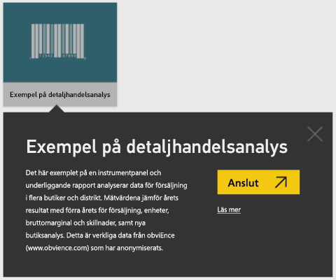
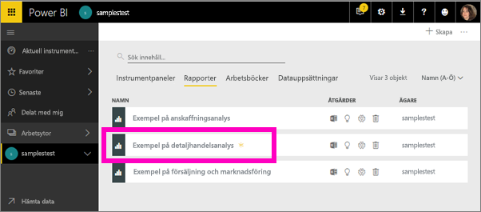
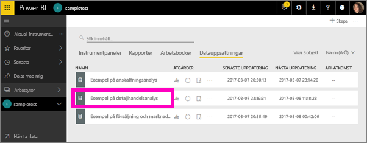
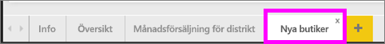

#  Ansluta till exemplen i Power BI-tjänsten

Den här självstudien visar hur du gör följande: 
- Importera ett exempelinnehållspaket, lägga till det i Power BI-tjänsten och öppna innehållet. Ett *innehållspaket* är en typ av exempel där datauppsättningen har paketerats med en instrumentpanel och en rapport. 
- Öppna en PBIX-exempelfil i Power BI Desktop.

Om du vill ha mer bakgrundsinformation kan du läsa [Exempeldatamängder för Power BI](sample-datasets.md). I den här artikeln får du lära dig allt om exemplen: hur du hämtar dem, var du sparar dem, hur du använder dem och några av de budskap som varje exempel kan förmedla. 

## Förutsättningar
Exemplen finns tillgängliga för Power BI-tjänsten och Power BI Desktop. Om du vill följa med kommer vi att använda exemplet på detaljhandelsanalysen.

Innehållspaketet för *Exempel på detaljhandelsanalys* som används i de här självstudierna består av en instrumentpanel, en rapport och en datauppsättning.
Om du vill bekanta dig med det här specifika innehållspaketet och dess scenario kan du gå igenom [Exempel på detaljhandelsanalys för Power BI: Ta en rundtur](sample-retail-analysis.md) innan du börjar.

## Exempel i Power BI-tjänsten

1. Öppna Power BI-tjänsten (app.powerbi.com), logga in och öppna den arbetsyta där du vill spara exemplet. 

    Om du inte har en Power BI Pro-licens kan du spara exemplet på Min arbetsyta.

2. Välj **Hämta data** längst ned i navigeringsfönstret. 

   

   Om du inte ser **Hämta data** så utvidga navigeringsfönstret genom att välja följande ikon högst upp i fönstret: .

5. På sidan **Hämta data** väljer du **Exempel**.
   
6. Välj **Exempel på detaljhandelsanalys** och sedan **Anslut**.   
   
   

## Vad importerades?
När du arbetar med exemplen på innehållspaket och väljer **Anslut** hämtar Power BI en kopia av det innehållspaketet och lagrar det i molnet. Eftersom den person som skapade innehållspaketet inkluderade en datamängd, en rapport och en instrumentpanel får du dessa när du klickar på **Anslut**. 

1. När du väljer **Anslut** skapar Power BI den nya instrumentpanelen och visar den på fliken **Instrumentpaneler**. 
   
   
2. Öppna fliken **Rapporter**. Här visas en ny rapport med namnet *Exempel på detaljhandelsanalys*.
   
   
   
   Kolla på fliken **Datamängder** – det finns ny datamängd där också.
   
   

## Utforska ditt nya innehåll
Utforska nu instrumentpanelen, datauppsättningen och rapporten på egen hand. Det finns många olika sätt att navigera till dina instrumentpaneler, rapporter och datamängder. Ett av dessa sätt beskrivs i följande procedur.  

1. Gå tillbaka till fliken **Instrumentpaneler** och välj instrumentpanelen **Exempel på detaljhandelsanalys** för att öppna den.       

   Instrumentpanelen öppnas. Den innehåller flera olika visualiseringspaneler.   
 
1. Välj en av panelerna på instrumentpanelen för att öppna den underliggande rapporten. I det här exemplet väljer vi ytdiagrammet **Årets försäljning, fjolårets försäljning efter räkenskapsmånad**.  

   

   Rapporten öppnas på den sida som innehåller det ytdiagram du valde, i det här fallet sidan **Månadsförsäljning för distrikt** i rapporten.
   
   
   
   > [!NOTE]
   > Om panelen skapades med hjälp av [Frågor och svar för Power BI](power-bi-tutorial-q-and-a.md) öppnas i stället sidan Frågor och svar. Om panelen [fästes från Excel](service-dashboard-pin-tile-from-excel.md) öppnas Excel Online i Power BI.
   > 
   > 
1. När någon delar ett innehållspaket med kollegor vill de vanligtvis dela med sig av endast insikterna och inte ge dem direkt åtkomst till data. På fliken **Datamängder** har du flera alternativ för att utforska datamängden. Du kan dock inte visa rader och kolumner i dina data på det sätt som går i Power BI Desktop eller Excel. 
   
   
   
1. Ett sätt att utforska datauppsättningen är genom att skapa egna visualiseringar och rapporter från grunden. Välj diagramikonen  för att öppna datauppsättningen i rapportredigeringsvyn.
     
   

1. Ett annat sätt att utforska datamängden är att köra [snabbinsikter](consumer/end-user-insights.md). Välj **Fler alternativ** (…) och sedan **Hämta snabbinsikter**. När insikterna är klara väljer du **Visa insikter**.
     
    

## Exempel i Power BI Desktop 
När du först öppnar .pbix-exempelfilen i Power BI Desktop visas den i rapportvyn, där du kan utforska, skapa och ändra valfritt antal rapportsidor med visualiseringar. Rapportvyn ger nästan samma designupplevelse som rapportens redigeringsvy i Power BI-tjänsten. Du kan flytta runt visuella objekt, kopiera och klistra in, sammanfoga och så vidare. 

Till skillnad från redigering av en rapport i Power BI-tjänsten kan du i Power BI Desktop även arbeta med dina frågor och modellera dina data så att de ger de bästa insikterna i rapporterna. Du kan sedan spara Power BI Desktop-filen var du vill, oavsett om det är en lokal hårddisk eller till molnet.

1. Ladda ned [.pbix-filen för Exempel på detaljhandelsanalys](https://download.microsoft.com/download/9/6/D/96DDC2FF-2568-491D-AAFA-AFDD6F763AE3/Retail%20Analysis%20Sample%20PBIX.pbix) och öppna den i Power BI Desktop. 

    

1. Filen öppnas i rapportvyn. Lägg märke till de fyra flikarna längst ned i rapportredigeraren. Dessa flikar representerar de fyra sidorna i rapporten. I det här exemplet är sidan **Nya butiker** markerad för tillfället. 

    .

1. Mer ingående information om rapportredigeraren finns i [Ta en rundtur i rapportredigeraren](service-the-report-editor-take-a-tour.md).

## Vad finns i rapporten?
När du laddar ned en .pbix-exempelfil får du inte bara en rapport utan även den *underliggande datamängden*. När du öppnar filen läser Power BI Desktop in data med deras tillhörande frågor och relationer. Du kan visa underliggande data och relationer, men du kan inte visa de underliggande frågorna i frågeredigeraren.

1. Växla till [Datavy](desktop-data-view.md) genom att välja tabellikonen .
 
    

    I datavyn kan du inspektera, utforska och förstå data i din Power BI Desktop-modell. Det här skiljer sig från hur du visar tabeller, kolumner och data i frågeredigeraren. Data i Datavyn har redan lästs in i modellen.

    När du modellerar data vill ibland du se vad som faktiskt finns i raderna och kolumnerna i en tabell, utan att skapa ett visuellt objekt på rapportarbetsytan. Detta gäller särskilt när du skapar mått och beräknade kolumner och du behöver identifiera en datatyp eller datakategori.

1. Växla till [Relationsvy](desktop-relationship-view.md) genom att välja följande ikon: .
 
    

    Relationsvyn visar alla tabeller, kolumner och relationer i din modell. Härifrån kan du visa, ändra och skapa relationer.

## Nästa steg
Den här miljön är säker att leka i eftersom du kan välja att inte spara dina ändringar. Men om du sparar dem kan du alltid välja **Hämta data** för att få en ny kopia av exemplet.

Vi hoppas att denna rundtur har visat hur instrumentpaneler, datamängder, relationer och rapporter i Power BI kan ge insikter om exempeldata. Nu är det din tur – anslut till dina egna data. Med Power BI kan du ansluta till en mängd olika datakällor. Mer information finns i [Kom igång med Power BI-tjänsten](service-get-started.md) och [Kom igång med Power BI Desktop](desktop-getting-started.md).  

Mer information finns i:  
- [Grundläggande begrepp för designers i Power BI-tjänsten](service-basic-concepts.md)
- [Exempel för Power BI-tjänsten](sample-datasets.md)
- [Datakällor för Power BI](service-get-data.md)

Har du fler frågor? [Prova Power BI Community](https://community.powerbi.com/)
