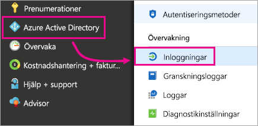
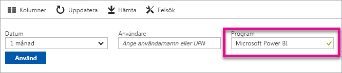
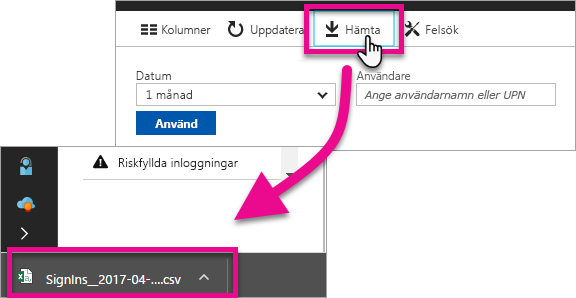

# Hitta Power BI-användare som har loggat in
Om du är en klientadministratör och vill se vem som har signerat till Power BI, kan du använda Azure Active Directory-rapporter för åtkomst och användning för att få insyn.

<iframe width="640" height="360" src="https://www.youtube.com/embed/1AVgh9w9VM8?showinfo=0" frameborder="0" allowfullscreen></iframe>

Du kan komma åt aktivitetsrapporten inom de [nya](https://docs.microsoft.com/azure/active-directory/active-directory-reporting-activity-sign-ins) och [klassiska](https://docs.microsoft.com/azure/active-directory/active-directory-view-access-usage-reports) portalerna för Azure Active Directory (Azure AD). Medan den ovanstående videon använder den klassiska portalen som exempel kommer den här artikeln att fokusera på den nya.

> [!NOTE]
> Den här aktivitetsrapporten omfattar både Power BI- (Free) och Pro-användare men gör ingen åtskillnad på dem baserat på deras licens.
> 
> 

## Krav
Följande är krav för att visa inloggningsaktivitetsrapporten.

* Användare i rollerna Global administratör, Säkerhetsadministratör eller Säkerhetsläsare har åtkomst till data.
* Alla användare (icke-administratörer) kan komma åt sina egna inloggningar.
* Din klient måste ha en associerad Azure AD Premium-licens för att se hela inloggningsrapporten.

## Använda Azure Portal för att visa inloggningar
Du kan använda Azure AD-portalen för att visa inloggningsaktivitet.

1. Bläddra till **Azure Portal** och välj **Azure Active Directory**.
2. Under **Aktivitet** väljer du **Inloggningar**.
   
    
3. Filtrera programmet efter antingen **Microsoft Power BI** eller **Power BI Gateway** och välj **Tillämpa**.
   
    **Microsoft Power BI** avser inloggningsaktivitet som är relaterad till tjänsten medan **Power BI Gateway** är särskilda inloggningar för den lokala datagatewayen.
   
    

## Exportera data
Du har två alternativ för att exportera data för inloggning. Du antingen ladda ner en csv-fil eller använda PowerShell.

### Hämta csv-fil
Välj **Hämta** i verktygsfältet på skärmen Aktivitet. Nu hämtas csv-filen för data med det aktuella filtret.

### PowerShell
Du kan använda PowerShell för att exportera inloggningsdata. En [exempel](https://docs.microsoft.com/azure/active-directory/active-directory-reporting-api-sign-in-activity-samples#powershell-script) är tillgängligt i Azure AD-dokumentationen.

> [!NOTE]
> För att PowerShell-exemplet ska fungera måste du följa [kraven för att få åtkomst till rapporterings-API för Azure AD](https://docs.microsoft.com/en-us/azure/active-directory/active-directory-reporting-api-prerequisites).
> 
> 

## Datakvarhållning
Inloggningsdata kan hållas kvar i upp till 30 dagar. Mer information finns i [Rapportkvarhållningsregler i Azure Active Directory](https://docs.microsoft.com/azure/active-directory/active-directory-reporting-retention).

## Nästa steg
[Inloggningsaktivitetrapporter i Azure Active Directory-portalen (nya portalen)](https://docs.microsoft.com/azure/active-directory/active-directory-reporting-activity-sign-ins)  
[Visa åtkomst och användning (klassisk portal)](https://docs.microsoft.com/azure/active-directory/active-directory-view-access-usage-reports#view-or-download-a-report)  
[Inloggningsexempel med PowerShell-skript](https://docs.microsoft.com/azure/active-directory/active-directory-reporting-api-sign-in-activity-samples#powershell-script)  
[Rapportkvarhållningsregler i Azure Active Directory](https://docs.microsoft.com/azure/active-directory/active-directory-reporting-retention)  
[Använda granskning i din organisation](service-admin-auditing.md)  
[Aktivering av utökad Pro-utvärderingsversion](service-extended-pro-trial.md)

Har du fler frågor? [Fråga Power BI Community](https://community.powerbi.com/)

