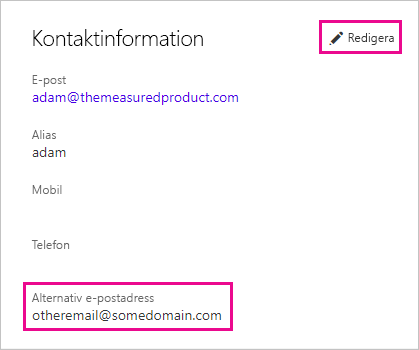

# <a name="using-an-alternate-email-address"></a>Använda en alternativ e-postadress
Som standard används e-postadressen som du använde för att logga in på Power BI för att skicka uppdateringar om aktiviteten i Power BI.  Om någon skickar en inbjudan skickas den till den här adressen.

Ibland kanske du vill dessa e-postmeddelanden ska skickas till en annan e-postadress än den som du ursprungligen använde för att registrera dig för Power BI.

## <a name="updating-through-office-365-personal-info-page"></a>Uppdatera via sidan personlig information i Office 365
1. Gå till [sidan personlig information i Office 365](https://portal.office.com/account/#personalinfo).  Logga in med din e-postadress och lösenord för Power BI om du uppmanas.
2. Klicka på redigeringslänken på området kontaktinformation.  
   
   > [!NOTE]
   > Om du inte ser en redigeringslänk innebär det att din e-postadress hanteras av din Office 365-administratör och du måste kontakta denna för att uppdatera din e-postadress.
   > 
   > 
   
   
3. Ange den e-postadress som du vill att Power BI-uppdateringar ska skickas till i fältet Alternativ e-postadress.

> [!NOTE]
> När du ändrar den här inställningen ändras inte vilken e-postadress som används för att skicka serviceuppdateringar, nyhetsbrev och andra erbjudanden.  De kommer alltid att skickas till e-postadressen du använde när du registrerade dig för Power BI.
> 
> 

## <a name="updating-with-powershell"></a>Uppdatera med PowerShell
Alternativt kan du uppdatera den alternativa e-postadressen via PowerShell för Azure Active Directory. Detta görs med kommandot [Set-AzureADUser](https://docs.microsoft.com/powershell/module/azuread/set-azureaduser).

```
Set-AzureADUser -ObjectId john@contoso.com -OtherMails "otheremail@somedomain.com"
```

Mer information finns i [Azure Active Directory PowerShell Version 2](https://docs.microsoft.com/powershell/azure/active-directory/install-adv2).

Har du fler frågor? [Prova Power BI Community](http://community.powerbi.com/)

