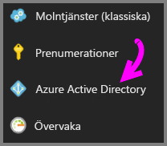
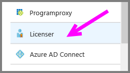
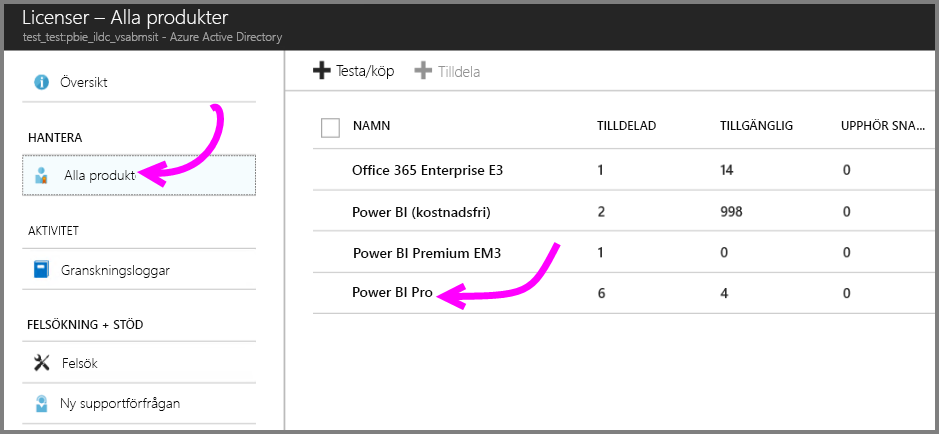
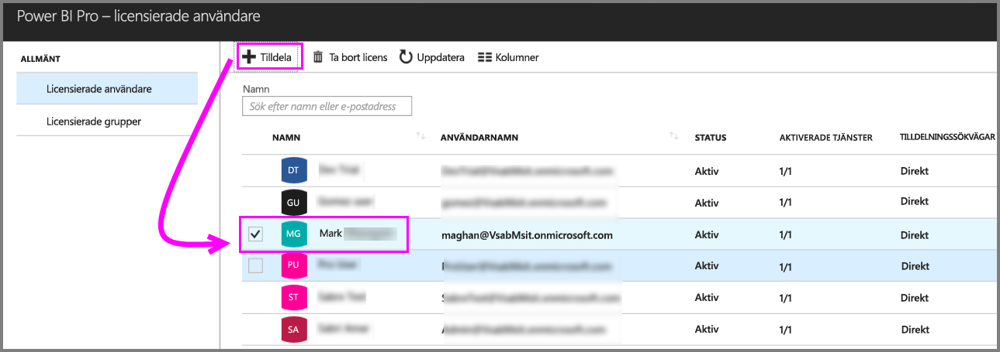

# Snabbstart: Tilldela Power BI Pro-licenser i Azure

Power BI Pro är en enskild licens som tillåter åtkomst till allt innehåll och alla funktioner i Power BI-tjänsten, inklusive möjligheten att dela innehåll och samarbeta med andra Pro-användare. Endast Pro-användare kan publicera innehåll till och använda app-arbetsytor, dela instrumentpaneler och prenumerera på instrumentpaneler och rapporter. Den här artikeln beskriver hur du tilldelar Power BI Pro-licenser i Azure. Du kan också [tilldela licenser i Office 365](service-admin-assigning-power-bi-pro-licenses.md).

## Förutsättningar

Du måste vara ägare till den Azure-prenumeration som Power BI använder för Active Directory-sökningar.

Du måste [köpa minst en licens](service-admin-purchasing-power-bi-pro.md) innan du börjar.

## Tilldela licenser till enskilda användarkonton

Följ dessa steg om du vill tilldela Power BI Pro-licenser till enskilda användarkonton:

1. Gå till [Azure-portalen](https://ms.portal.azure.com/#@microsoft.onmicrosoft.com/dashboard/private/39bc3cf7-31a4-43f6-954c-f2d69ca2f0). 

2. Välj **Azure Active Directory** i det vänstra navigeringsfältet.

    

3. Under **Azure Active Directory** väljer du **Licenser**.

    

4. Under **Licenser**, väljer du **Alla produkter** och väljer sedan **Power BI Pro** för att visa listan över licensierade användare.

    

5. Klicka på **Tilldela** för att lägga till en Power BI Pro-licens till ett ytterligare användarkonto.

    

## Nästa steg

Nu när du har tilldelat licenser, kan du läsa mer om Power BI Pro.

[Power BI Pro i din organisation](service-admin-power-bi-pro-in-your-organization.md)

[Hitta Power BI-användare som har loggat in](service-admin-access-usage.md)

Har du fler frågor? [Fråga Power BI Community](https://community.powerbi.com/)