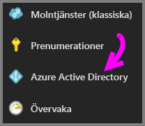
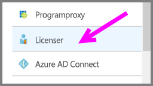
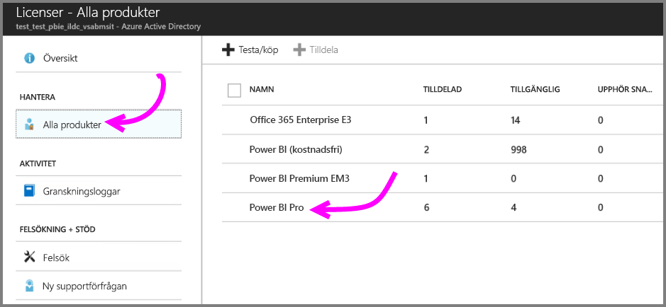
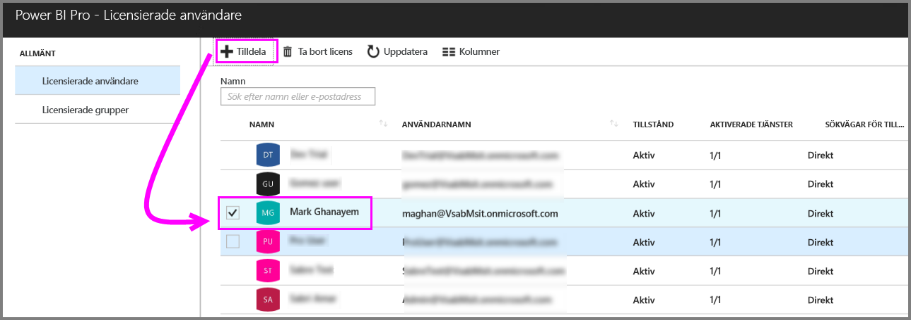
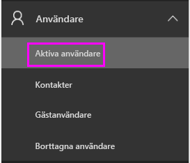
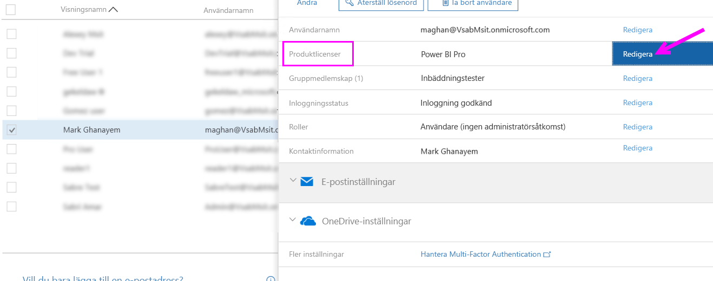
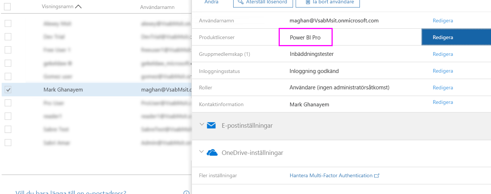

# Tilldela Power BI Pro-licenser

Administratörer har rad olika hanteringsportaler och PowerShell-cmdletar att välja bland när de tilldelar Power BI Pro-licenser till användare. Power BI-licenshanteringen backas upp av Azure Active Directory (Azure AD).

* Azure-prenumerationsägare kan använda Azure Active Directory-bladet i [Azure Portal](https://ms.portal.azure.com/#@microsoft.onmicrosoft.com/dashboard/private/39bc3cf7-31a4-43f6-954c-f2d69ca2f0). 

* Globala administratörer och användarkontoadministratörer kan använda [Administrationscenter för Office 365](https://portal.office.com/AdminPortal/Home#/homepage).

## Hantera Power BI Pro-licenser i Azure Portal

Power BI använder Azure AD som en grundläggande tjänst. I Azure AD lagras användarkonton och grupper vid lagring av andra inställningar som information om köpta produkter.

### Tilldela licenser till enskilda användarkonton

Följ dessa steg om du vill tilldela Pro-licenser till enskilda användarkonton om du är Azure-prenumerationsägare:

1. Navigera till [Azure Portal](https://ms.portal.azure.com/#@microsoft.onmicrosoft.com/dashboard/private/39bc3cf7-31a4-43f6-954c-f2d69ca2f0). 

2. Klicka på Azure Active Directory i det vänstra navigeringsfältet.

    

3. Klicka på Licenser på bladet Azure Active Directory.

    

4. På bladet Licenser klickar du på Alla produkter och sedan på Power BI Pro för att visa en lista över licensierade användare.

    

5. Klicka på Tilldela för att lägga till en Power BI Pro-licens till ytterligare ett användarkonto.

    

> [!NOTE]
> I Azure Portal kan du hantera de flesta aspekter av licensieringen, men inte köpa Power BI Pro-licenser. Använd Administrationscenter för Office 365 när du vill köpa en Power BI Pro-prenumeration. Mer information finns i [Köpa Power BI Pro](https://docs.microsoft.com/en-us/power-bi/service-admin-purchasing-power-bi-pro).
>

## Hantera Power BI Pro-licenser i Administrationscenter för Office 365

Om du är en global administratör använder du Administrationscenter för Office 365 för att köpa en Power BI Pro-prenumeration och hantera tillhörande licenser för organisationen.

Följ dessa steg om du vill tilldela Pro-licenser till enskilda användarkonton om du är Office 365-administratör:

1. Gå till administrationscentret för Office 365.

2. Expandera Användare i det vänstra navigeringsfönstret och klicka sedan på Aktiva användare.

    

3. Välj en eller flera användare och klicka på Redigera produktlicenser.

    

4. Under Power BI Pro ändrar du inställningen till På och klickar sedan på Spara.

    

5. Under Status kontrollerar du att Power BI Pro-licenserna har tilldelats för de valda kontona.

    

> [!NOTE]
> Om prenumerationen har slut på licenser kan du lägga till fler genom att utöka Fakturering i det vänstra navigeringsfönstret och klicka på Prenumerationer. På sidan Prenumerationer väljer du Power BI Pro-prenumerationen och klickar sedan på Lägg till/ta bort licenser.
>

## Nästa steg
[Power BI Pro i din organisation](service-admin-power-bi-pro-in-your-organization.md)
 
[Aktivering av utökad Pro-utvärderingsversion](service-extended-pro-trial.md)
 
[Power BI-serviceavtal för enskilda användare](https://powerbi.microsoft.com/terms-of-service/)
 
[Power BI Premium-meddelande](https://aka.ms/pbipremium-announcement)
 
[Hitta Power BI-användare som har loggat in](service-admin-access-usage.md)

Har du fler frågor? [Fråga Power BI Community](https://community.powerbi.com/)