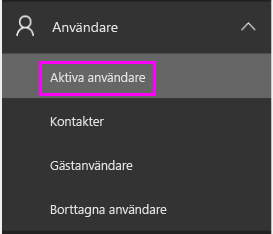
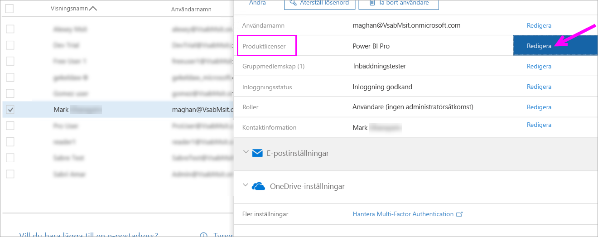
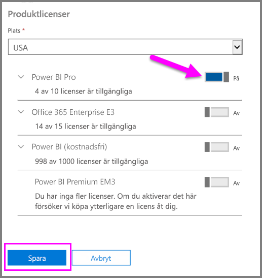
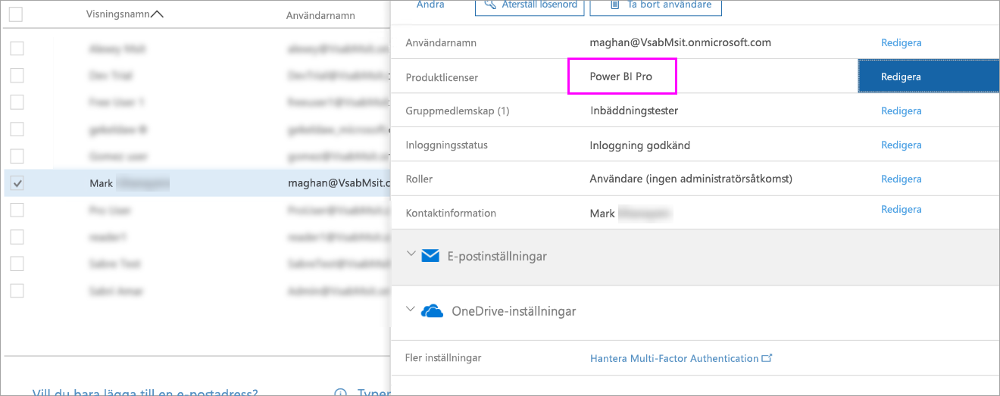

# Snabbstart: Tilldela Power BI Pro-licenser i Office 365

Power BI Pro är en enskild licens som tillåter åtkomst till allt innehåll och alla funktioner i Power BI-tjänsten, inklusive möjligheten att dela innehåll och samarbeta med andra Pro-användare. Endast Pro-användare kan publicera innehåll till och använda apparbetsytor, dela instrumentpaneler och prenumerera på instrumentpaneler och rapporter. Den här artikeln beskriver hur du tilldelar Power BI Pro-licenser i Office 365. Du kan också [tilldela licenser i Azure](service-admin-assigning-power-bi-pro-licenses-azure.md).

## Förutsättningar

Du måste ha rollen [**global administratör** eller **användarkontoadministratör**](https://support.office.com/article/about-office-365-admin-roles-da585eea-f576-4f55-a1e0-87090b6aaa9d?ui=en-US&rs=en-US&ad=US) i Office 365.

Du måste [köpa minst en licens](service-admin-purchasing-power-bi-pro.md) innan du börjar.

## Tilldela licenser till enskilda användarkonton

Följ de här stegen om du vill tilldela Power BI Pro-licenser till enskilda användarkonton:

1. Öppna [Administrationscenter för Office 365](https://portal.office.com/adminportal/home#/homepage).

2. Expandera **Användare** i det vänstra navigeringsfönstret och klicka sedan på **Aktiva användare**.

    

3. Välj en användare och sedan **Redigera** under **Produktlicenser**.

    

4. Under **Power BI Pro** ändrar du inställningen till **På** och klickar sedan på **Spara**.

    

5. Under **Status** kontrollerar du att Power BI Pro-licensen har tilldelats för det valda kontot.

    

## Nästa steg

Nu när du har tilldelat licenser, kan du läsa mer om Power BI Pro.

[Power BI Pro i din organisation](service-admin-power-bi-pro-in-your-organization.md)

[Hitta Power BI-användare som har loggat in](service-admin-access-usage.md)

Har du fler frågor? [Fråga Power BI Community](https://community.powerbi.com/)