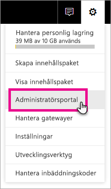
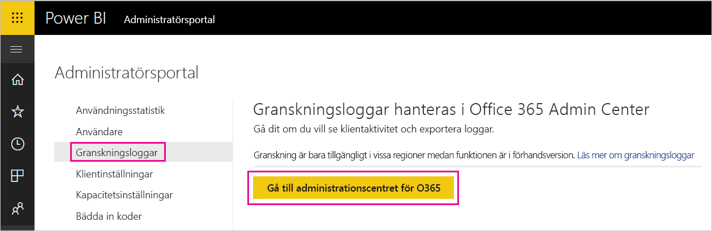
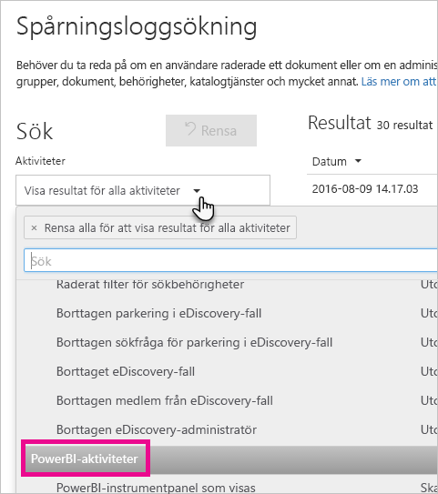
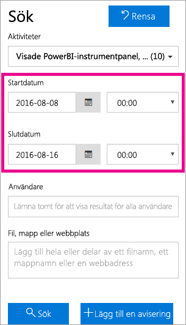
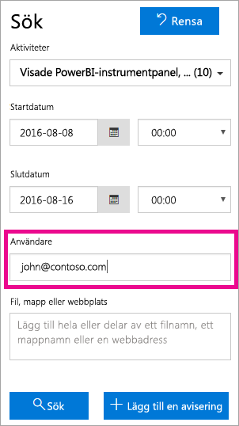
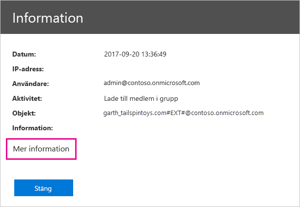
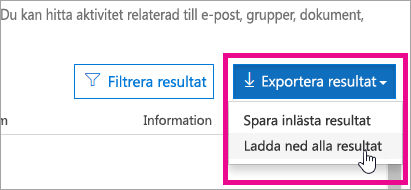

# <a name="using-auditing-within-your-organization"></a>Använda granskning i din organisation

Att veta vem som vidtagit en viss åtgärd för ett visst objekt i din Power BI-klient kan vara av avgörande betydelse när det gäller att hjälpa organisationen att uppfylla olika krav, t.ex regelefterlevnad och posthantering. Använd Power BI-granskning för att granska åtgärder som utförs av användare, till exempel ”Visa rapport” och ”Visa instrumentpanelen”. Du kan inte använda granskning för att granska behörigheter.

Du arbetar med granskning i säkerhets- och efterlevnadscentrumet för Office 365 eller använder PowerShell. Vi täcker både i den här artikeln. Du kan filtrera granskningsdata efter datumintervall, användare, instrumentpanel, rapport, datamängd eller aktivitetstyp. Du kan också hämta aktiviteterna till en CSV-fil att analysera dem offline.

## <a name="requirements"></a>Krav

Du måste uppfylla följande krav för att komma åt granskningsloggar:

- Du måste ha en Exchange Online-licens (ingår i Office 365 Enterprise E3 och E5-prenumerationer) för att komma åt granskningsavsnittet i säkerhet- och efterlevnadscentrumet för Office 365.

- Du måste antingen vara global administratör eller ha en Exchange-administratörsroll som ger åtkomst till granskningsloggen. Exchange-administratörsrollerna styrs via administrationscentret för Exchange. Mer information finns i [Behörigheter i Exchange Online](/exchange/permissions-exo/permissions-exo/).

- Om du har åtkomst till granskningsloggen men inte är global administratör eller administratör för Power BI-tjänsten, får du inte åtkomst till Power BI-administratörsportalen. I det här fallet måste du hämta en direktlänk till [säkerhet- och efterlevnadscentrumet för Office 365](https://sip.protection.office.com/#/unifiedauditlog).

- Om du vill visa granskningsloggar för Power BI i din klient, så måste du ha minst en Exchange-postlådelicens i din klient.

## <a name="accessing-your-audit-logs"></a>Öppna dina granskningsloggar

Om du vill komma åt loggar måste loggning vara aktiverat i Power BI. Mer information finns i [Granskningsloggar](service-admin-portal.md#audit-logs) i dokumentationen för administratörsportalen. Det kan förekomma en fördröjning på upp till 48 timmar mellan det att granskning aktiveras och att granskningsdata kan visas. Om du inte ser data omedelbart kontrollerar du granskningsloggarna senare. Det kan förekomma en liknande fördröjning mellan hämtning av behörighet för att visa granskningsloggar och att komma åt loggarna.

Granskningsloggar för Power BI är tillgängliga direkt via [säkerhets- och efterlevnadscenter för Office 365](https://sip.protection.office.com/#/unifiedauditlog). Det finns också en länk från Power BI-administratörsportalen:

1. Välj **kugghjulsikonen** i det övre högra hörnet i Power BI och välj sedan **Administratörsportalen**.

   

1. Välj **Granskningsloggar**.

1. Välj **Gå till administrationscentret för O365**.

   

Om du vill ge åtkomst till granskningsloggen för icke-administratörskonton, så måste du tilldela behörigheter i administrationscentret för Exchange Online. Du skulle t.ex. kunna tilldela en befintlig rollgrupp, som Organisationens ledning, en användare, eller så skulle du kunna skapa en ny rollgrupp med rollen Granskningsloggar. Mer information finns i [Behörigheter i Exchange Online](/exchange/permissions-exo/permissions-exo/).

## <a name="search-only-power-bi-activities"></a>Sök endast efter Power BI-aktiviteter

Du kan begränsa resultaten till enbart Power BI-aktiviteter genom att utföra följande steg. En lista över aktiviteter finns i [listan med aktiviteter som granskas av Power BI](#list-of-activities-audited-by-power-bi) längre fram i den här artikeln.

1. Välj **Aktiviteter** i listrutan under **Sök** på sidan **Sök i granskningslogg**.

2. Välj **PowerBI-aktiviteter**.

   

3. Stäng markeringsrutan genom att klicka någonstans utanför den.

Dina sökningar filtreras nu enbart efter Power BI-aktiviteter.

## <a name="search-the-audit-logs-by-date"></a>Sök efter datum i granskningsloggarna

Du kan söka i loggarna efter datumintervall med hjälp av fälten **Startdatum** och **Slutdatum**. De senaste sju dagarna markeras som standard. Datum och tid som visas i UTC-format (Coordinated Universal Time). Det maximala datumintervall som du kan ange är 90 dagar. 

Ett felmeddelande visas om det valda datumintervallet är längre än 90 dagar. Om du använder det maximala datumintervallet 90 dagar, så välj den aktuella tiden som **Startdatum**. I annat fall får du ett felmeddelande som säger att startdatumet är senare än slutdatumet. Om du har aktiverat granskning under de senaste 90 dagarna, kan datumintervallet inte starta före det datum då granskningen aktiverades.



## <a name="search-the-audit-logs-by-users"></a>Sök i granskningsloggarna efter användare

Du kan söka efter granskningsloggposter för aktiviteter som utförts av specifika användare. Om du vill göra detta, så ange ett eller flera användarnamn i fältet **Användare**. Användarnamnet som ser ut som en e-postadress. Det är det konto som användarna loggar in på Power BI med. Om du lämnar den här rutan tom returneras poster för alla användare (och tjänstkonton) i organisationen.



## <a name="view-search-results"></a>Visa sökresultat

När du väljer **Sök** läses sökresultaten in och strax därpå visas de under **Resultat**. När sökningen är klar visas antalet funna träffar. Högst 1000 händelser visas. Om fler än 1000 händelser uppfyller sökvillkoren visas de 1000 senaste händelserna.

### <a name="view-the-main-results"></a>Visa de viktigaste resultaten

**Resultatområdet** innehåller följande information om varje händelse som returneras av sökningen. Sortera resultaten genom att välja en kolumnrubrik under **Resultat**.

| **Kolumn** | **Definition** |
| --- | --- |
| Datum |Datum och tid (i UTC-format) när händelsen inträffade. |
| IP-adress |IP-adressen för den enhet som användes när aktiviteten loggades. IP-adressen visas i IPv4- eller IPv6-adressformat. |
| Användare |Den användare (eller det tjänstkonto) som utförde den åtgärd som utlöste händelsen. |
| Aktivitet |Den aktivitet som utfördes av användaren. Det här värdet motsvarar de aktiviteter som du har markerat i listrutan **Aktiviteter**. Värdet i den här kolumnen är en Exchange-cmdlet för en händelse från Exchange-administratörens granskningslogg. |
| Objekt |Det objekt som skapades eller ändrades till följd av motsvarande aktivitet. Det kan t.ex. vara den fil som visades eller ändrades, eller det användarkonto som uppdaterades. Alla aktiviteter har inte något värde i den här kolumnen. |
| Information |Ytterligare information om en aktivitet. Som redan nämnts har inte alla aktiviteter något värde. |

### <a name="view-the-details-for-an-event"></a>Visa information om en händelse

Du kan visa mer information om en händelse genom att klicka på händelseposten i listan med sökresultat. En sida med **information** visas med detaljerade egenskaper från händelseposten. Vilka egenskaper som visas beror på i vilken Office 365-tjänst som händelsen inträffar. 

Om du vill visa denna information väljer du **Mer information**. Alla Power BI-poster har värdet 20 för egenskapen RecordType (typ av post). Information om andra egenskaper finns i [detaljerade egenskaper i granskningsloggen](/office365/securitycompliance/detailed-properties-in-the-office-365-audit-log/).

   

## <a name="export-search-results"></a>Exportera sökresultat

Du kan exportera Power BI-granskningsloggen till en csv-fil med dessa steg.

1. Välj **Exportera resultat**.

1. Välj **Spara inlästa resultat** eller **Hämta alla resultat**.

    

## <a name="use-powershell-to-search-audit-logs"></a>Använd PowerShell för att söka igenom granskningsloggar

Du kan också använda PowerShell för att få åtkomst till granskningsloggarna utifrån din inloggning. I följande exempel visas hur du använder kommandot [Search-UnifiedAuditLog](/powershell/module/exchange/policy-and-compliance-audit/search-unifiedauditlog?view=exchange-ps/) för att hämta granskningsloggposter i Power BI.

Om ditt konto ska kunna använda kommandot [New-PSSession](/powershell/module/microsoft.powershell.core/new-pssession/) måste det ha tilldelats en Exchange Online-licens och du måste ha åtkomst till din klients granskningslogg. Mer information om hur du ansluter till Exchange Online finns i [Anslut till Exchange Online PowerShell](/powershell/exchange/exchange-online/connect-to-exchange-online-powershell/connect-to-exchange-online-powershell/).

```powershell
Set-ExecutionPolicy RemoteSigned

$UserCredential = Get-Credential

$Session = New-PSSession -ConfigurationName Microsoft.Exchange -ConnectionUri https://outlook.office365.com/powershell-liveid/ -Credential $UserCredential -Authentication Basic -AllowRedirection

Import-PSSession $Session
Search-UnifiedAuditLog -StartDate 9/11/2018 -EndDate 9/15/2018 -RecordType PowerBI -ResultSize 1000 | Format-Table | More
```

Ett annat exempel hur PowerShell används med granskningsloggar finns i [Använda Power BI-granskningsloggen och PowerShell för att tilldela Power BI Pro-licenser](https://powerbi.microsoft.com/blog/using-power-bi-audit-log-and-powershell-to-assign-power-bi-pro-licenses/).

## <a name="activities-audited-by-power-bi"></a>Aktiviteter som granskas av Power BI

Följande aktiviteter granskas av Power BI.

* AddDatasourceToGateway
* AddGroupMembers
* AnalyzedByExternalApplication
* AnalyzeInExcel
* AttachDataflowStorageAccount
* BindToGateway
* ChangeCapacityState
* ChangeGatewayAdministrators
* ChangeGatewayDatasourceUsers
* CreateApp
* CreateDashboard
* CreateDataflow
* CreateDataset
* CreateEmailSubscription
* CreateFolder
* CreateGateway
* CreateGroup
* CreateOrgApp
* CreateReport
* DeleteComment
* DeleteDashboard
* DeleteDataflow
* DeleteDataset
* DeleteEmailSubscription
* DeleteFolder
* DeleteGateway
* DeleteGroup
* DeleteGroupMembers
* DeleteOrgApp
* DeleteReport
* DownloadReport
* EditDataset
* EditReport
* ExportDataflow
* ExportReport
* ExportTile
* GenerateDataflowSasToken
* GenerateEmbedToken
* GetDatasources
* Importera
* InstallApp
* MigrateWorkspaceIntoCapacity
* OptInForProTrial
* PostComment
* PrintDashboard
* PrintReport
* PublishToWebReport
* RefreshDataset
* RemoveDatasourceFromGateway
* RemoveWorkspacesFromCapacity
* RenameDashboard
* SetAllConnections
* SetScheduledRefresh
* SetScheduledRefreshOnDataflow
* ShareDashboard
* ShareReport
* TakeOverDataset
* TakeOverDataset
* UnpublishApp
* UpdateApp
* UpdateCapacityAdmins
* UpdateCapacityDisplayName
* UpdateCapacityResourceGovernanceSettings
* UpdateCapacityUsersAssignment
* UpdatedAdminFeatureSwitch
* UpdateDataflow
* UpdateDatasetParameters
* UpdateDatasourceCredentials
* UpdateDatasources
* UpdateEmailSubscription
* UpdateFolder
* UpdateFolderAccess
* ViewDashboard
* ViewDataflow
* ViewReport
* ViewTile
* ViewUsageMetrics

## <a name="next-steps"></a>Nästa steg

[Vad är Power BI-administration?](service-admin-administering-power-bi-in-your-organization.md)  

[Power BI-administratörsportalen](service-admin-portal.md)  

Har du fler frågor? [Fråga Power BI Community](http://community.powerbi.com/)
