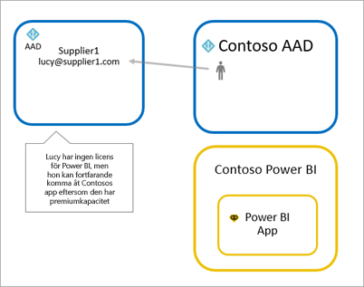
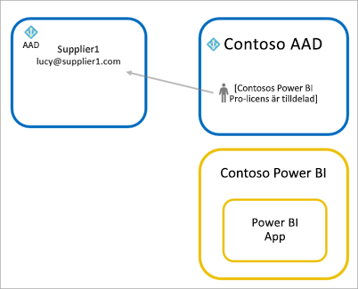

# Distribuera Power BI-innehåll till externa gästanvändare med Azure Active Directory B2B

I Power BI kan du dela innehåll med externa gästanvändare via Azure Active Directory Business-to-Business (Azure AD B2B).
Med Azure AD B2B kan din organisation aktivera och hantera delningen med externa användare från en och samma plats. Externa gäster är som standard endast användare. Dessutom kan du tillåta att gästanvändare utanför organisationen redigerar och hanterar innehåll i din organisation.

Den här artikeln innehåller en grundläggande introduktion till Azure AD B2B i Power BI. Mer information finns i [Distribuera Power BI-innehåll till externa gästanvändare med Azure Active Directory B2B](whitepaper-azure-b2b-power-bi.md).

## Aktivera åtkomst

Du måste aktivera funktionen [Dela innehåll med externa användare](service-admin-portal.md#export-and-sharing-settings) på Power BI-administratörsportalen innan du bjuder in gästanvändare. Även om det här alternativet är aktiverat så måste användaren ha behörighet i Azure Active Directory att bjuda in gästanvändare, vilket beviljas genom rollen som Gästinbjudare. 

Med funktionen [Tillåt externa gästanvändare att redigera och hantera innehåll i organisationen](service-admin-portal.md#allow-external-guest-users-to-edit-and-manage-content-in-the-organization) kan du ge gästanvändarna möjlighet att visa och skapa innehåll på arbetsytor, inklusive att bläddra i organisationens Power BI.

> [!NOTE]
> Inställningen [Dela innehåll med externa användare](service-admin-portal.md#export-and-sharing-settings) anger om Power BI tillåter att externa användare bjuds in till organisationen. När en extern användare godkänner inbjudan blir hen Azure AD B2B-gästanvändare i organisationen. Gästanvändarna visas i personväljare i Power BI. När inställningen är inaktiverad så har befintliga gästanvändare i din organisation fortsatt åtkomst till alla objekt som de hade tillgång till och fortsätter att listas i personväljarna. Om gäster läggs till via metoden för [planerad inbjudan](#planned-invites) så visas de även i personväljarna. Använd en Azure AD-princip för villkorsstyrd åtkomst om du vill förhindra att gästanvändare kommer åt Power BI.

## Vilka kan du bjuda in?

Du kan bjuda in gästanvändare med de flesta typer av e-postadresser till organisationen, även personliga konton som gmail.com, outlook.com och hotmail.com. I Azure AD B2B kallas de här adresserna *sociala identiteter*.

Du kan inte bjuda in användare som är kopplade till ett myndighetsmoln, som [Power BI för amerikanska myndigheter](service-govus-overview.md).

## Bjud in gästanvändare

Gästanvänder behöver endast en inbjudan den första gången du bjuder in dem till din organisation. Om du vill bjuda in användare ska du använda planerade inbjudningar eller ad hoc-inbjudningar.

Använd följande funktioner om du vill använda ad hoc-inbjudningar:
* Delning av rapporter och instrumentpaneler
* Appåtkomstlista

Du kan inte använda ad hoc-inbjudningar i arbetsytans åtkomstlista. Använd metoden med [planerade inbjudningar](#planned-invites) för att lägga till dessa användare i organisationen. När den externa användaren är en gäst i organisationen kan du lägga till hen i arbetsytans åtkomstlista.

### Planerad inbjudan

Använd en planerad inbjudan om du vet vilka användare du vill bjuda in. Du kan skicka inbjudningar via Azure-portalen eller PowerShell. Du måste vara klientadministratör för att bjuda in människor.

Följ dessa steg för att skicka en inbjudan i Azure-portalen.

1. Välj **Azure Active Directory** i [Azure-portalen](https://portal.azure.com).

1. Under **Hantera** går du till **Användare** > **Alla användare** > **Ny gästanvändare**.

    

1. Ange en **e-postadress** och ett **personligt meddelande**.

    

1. Välj **Bjud in**.

Använd PowerShell för att bjuda in fler än en gästanvändare. Mer information finns i [Azure AD B2B-samarbetskod och PowerShell-exempel](/azure/active-directory/b2b/code-samples/).

Gästanvändaren behöver välja **Kom igång** i e-postinbjudan hen tar emot. Gästanvändaren läggs sedan till i klientorganisationen.

### Ad hoc-inbjudningar

Bjud in en extern användare när som helst genom att lägga till den i din instrumentpanel eller rapport via delningsgränssnittet, eller din app via åtkomstsidan. Här är ett exempel på vad du gör när du bjuder in en extern användare att använda en app.

Gästanvändaren får ett e-postmeddelande som anger att appen har delats med dem.

Gästanvändaren måste logga in med sin organisations e-postadress. De uppmanas att tacka ja till inbjudan efter inloggningen. Efter inloggningen öppnas appen för gästanvändaren. Användaren bör bokmärka länken eller spara e-postmeddelandet så att det blir enkelt att återgå till appen.

## Licensiering

Gästanvändaren måste ha korrekt licensiering för att se innehållet som delats. Det finns tre alternativ för att kontrollera att användaren har en giltig licens: använda Power BI Premium; tilldela en licens för Power BI Pro; eller använda gästens Power BI Pro-licens.

[Gästanvändare som kan redigera och hantera innehåll i organisationen](service-admin-portal.md#allow-external-guest-users-to-edit-and-manage-content-in-the-organization) behöver en Power BI Pro-licens för att bidra med innehåll på arbetsytor och dela innehåll med andra.

### Använda Power BI Premium

Genom att tilldela arbetsytan till en [Power BI Premium-kapacitet](service-premium-what-is.md) kan gästanvändaren använda appen utan att behöva någon Power BI Pro-licens. Power BI Premium kan även användas för appar för att dra nytta av andra funktioner som ökade uppdateringsintervall, dedikerad kapacitet och stora modellstorlekar.

### Tilldela Power BI Pro-licens till gästanvändaren

När du tilldelar en Power BI Pro-licens till en gästanvändare i din klientorganisation kan gästanvändaren se innehållet i klientorganisationen. Mer information om tilldelning av licenser finns i [Tilldela licenser till användare på sidan Licenser](/office365/admin/manage/assign-licenses-to-users#assign-licenses-to-users-on-the-licenses-page). Innan du tilldelar gästanvändare Pro-licenser bör du kontakta din Microsoft-kontorepresentant och se till att du följer villkoren i ditt avtal med Microsoft.

### Gästanvändare tar med sin egen Power BI Pro-licens

Gästanvändaren har redan en Power BI Pro-licens i klientorganisationen.

## Gästanvändare som kan redigera och hantera innehåll

När du använder [Tillåt externa gästanvändare att redigera och hantera innehåll i organisationen](service-admin-portal.md#allow-external-guest-users-to-edit-and-manage-content-in-the-organization) får den angivna gästen ytterligare åtkomst till organisationens Power BI. Tillåtna gäster kan se allt innehåll de har behörighet till, komma åt Start, bläddra på arbetsytor, installera appar, se var de finns på åtkomstlistan och bidra med innehåll på arbetsytor. De kan skapa eller vara administratör för arbetsytor som använder den nya användningen av arbetsytan. Vissa begränsningar gäller. I avsnittet Överväganden och begränsningar listas dessa begränsningar.
 
För att hjälpa tillåtna användare att logga in i Power BI kan du ge dem klientorganisationens webbadress. Följ dessa steg för att hitta klientorganisations-URL:en.

1. I Power BI-tjänsten på den översta menyn väljer du hjälp ( **?** ) och sedan **Om Power BI**.

2. Leta efter värdet bredvid **Klientorganisations-URL**. Dela klientorganisationens webbadress med dina tillåtna gästanvändare.

    

## Överväganden och begränsningar

* Som standard är externa Azure AD B2B-gäster begränsade till förbrukning av innehåll. Externa Azure AD B2B-gäster kan visa appar, instrumentpaneler, rapporter, exportera data och skapa e-postprenumerationer för instrumentpaneler och rapporter. De kan inte komma åt arbetsytor eller publicera sitt eget innehåll. Om du vill ta bort de här begränsningarna kan du använda funktionen [Tillåt externa gästanvändare att redigera och hantera innehåll i organisationen](service-admin-portal.md#allow-external-guest-users-to-edit-and-manage-content-in-the-organization).

* Du behöver en Power BI Pro-licens för att bjuda in gästanvändare. Pro Trial-användare kan inte bjuda in gästanvändare i Power BI.

* Vissa funktioner är inte tillgängliga för [gästanvändare som kan redigera och hantera innehåll i organisationen](service-admin-portal.md#allow-external-guest-users-to-edit-and-manage-content-in-the-organization). För att uppdatera eller publicera rapporter måste de använda Power BI-tjänstens webbgränssnitt, inklusive Hämta data för att överföra Power BI Desktop-filer.  Följande upplevelser stöds inte:
    * Direktpublicering från Power BI Desktop till Power BI-tjänsten
    * Gästanvändare kan inte använda Power BI Desktop för att ansluta till tjänstdatauppsättningar i Power BI-tjänsten
    * Klassiska arbetsytor som är kopplade till Office 365-grupper:
        * Gästanvändare kan inte skapa eller vara administratörer för dessa arbetsytor
        * Gästanvändare kan vara medlemmar
    * Det går inte att skicka ad hoc-inbjudan för åtkomstlistor för arbetsytor
    * Power BI Publisher för Excel stöds inte för gästanvändare
    * Gästanvändare kan inte installera en Power BI Gateway och ansluta den till din organisation
    * Gästanvändare kan inte installera appar och publicera i hela organisationen
    * Gästanvändare kan inte använda, skapa, uppdatera eller installera innehållspaket för organisationen
    * Gästanvändare kan inte använda Analysera i Excel
    * Gästanvändare kan inte @mentioned i kommentarer
    * Gästanvändare kan inte använda prenumerationer
    * Gästanvändare som använder den här funktionen ska ha ett arbets- eller skolkonto. 
    
* Gästanvändare med personliga konton har fler begränsningar på grund av inloggningsbegränsningar.
    * De kan använda miljön i Power BI-tjänsten via en webbläsare.
    * De kan inte använda Power BI-mobilapparna.
    * De kan inte logga in för att ange autentiseringsuppgifter där det krävs ett arbets- eller skolkonto.

* Den här funktionen är inte tillgänglig med rapportwebbdelen för SharePoint Online i Power BI.

* Det finns inställningar för Active Directory som begränsar vad externa gästanvändare kan göra inom din organisation. Detta gäller också för din Power BI-miljö. I följande dokumentation beskrivs inställningarna:
    * [Hantera inställningar för externt samarbete](/azure/active-directory/b2b/delegate-invitations#configure-b2b-external-collaboration-settings)
    * [Tillåt eller blockera inbjudningar till B2B-användare från specifika organisationer](https://docs.microsoft.com/azure/active-directory/b2b/allow-deny-list)
    * [Tillåt eller blockera gästanvändares åtkomst till Power BI-tjänsten](/azure/active-directory/conditional-access/overview)
    
* Du kan inte dela utanför organisationen i nationella moln. Skapa istället användarkonton i din organisation som externa användare kan använda för att få åtkomst till innehållet. 

* Om du delar direkt till en gästanvändare kommer Power BI att skicka ett e-postmeddelande med länken. Du undviker att skicka e-postmeddelanden genom att lägga till gästanvändaren i en säkerhetsgrupp och dela till säkerhetsgruppen.  

## Nästa steg

Mer detaljerad information, inklusive hur säkerhet på radnivå fungerar, hittar du i följande faktablad: [Distribuera Power BI-innehåll till externa gästanvändare med Azure Active Directory B2B](https://aka.ms/powerbi-b2b-whitepaper).

Mer information om Azure AD B2B finns i [Vad är Azure AD B2B-samarbete?](/azure/active-directory/active-directory-b2b-what-is-azure-ad-b2b/).
