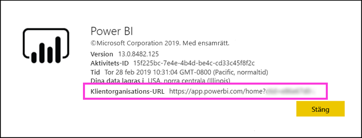

# Distribuera Power BI-innehåll till externa gästanvändare med Azure Active Directory B2B

Power BI kan integreras med Azure Active Directory Business-to-business (Azure AD B2B) för att tillåta säker distribution av Power BI-innehåll till gästanvändare utanför organisationen, medan kontroll över interna data bibehålls.  

Dessutom kan du tillåta att gästanvändare utanför organisationen redigerar och hanterar innehåll i din organisation.

## Aktivera åtkomst

Du måste aktivera funktionen [Dela innehåll med externa användare](service-admin-portal.md#export-and-sharing-settings) på Power BI-administratörsportalen innan du bjuder in gästanvändare.

Med funktionen [Tillåt externa gästanvändare att redigera och hantera innehåll i organisationen](service-admin-portal.md#export-and-sharing-settings) kan du dessutom välja vilken gästanvändare som ska kunna se och skapa innehåll i arbetsytor och bläddra i din organisations Power BI.

## Vilka kan du bjuda in?

Du kan bjuda in gästanvändare som använder alla e-postadresser, även personliga konton som gmail.com, outlook.com och hotmail.com. I Azure AD B2B kallas de här adresserna *sociala identiteter*.

## Bjud in gästanvändare

Inbjudningar krävs endast första gången en extern gästanvändare bjuds in till din organisation. Det finns två sätt att bjuda in användare: planerad inbjudan och ad hoc-inbjudan.

### Planerad inbjudan

Använd en planerad inbjudan om du vet vilka användare du vill bjuda in. Du kan skicka inbjudan med hjälp av Azure-portalen eller PowerShell. Du måste vara klientadministratör för att bjuda in människor.

Följ dessa steg för att skicka en inbjudan i Azure-portalen.

1. Välj **Azure Active Directory** i [Azure-portalen](https://portal.azure.com).

1. Under **Hantera** går du till **Användare** > **Alla användare** > **Ny gästanvändare**.

    

1. Ange en **e-postadress** och ett **personligt meddelande**.

    

1. Välj **Bjud in**.

Använd PowerShell för att bjuda in fler än en gästanvändare. Mer information finns i [Azure AD B2B-samarbetskod och PowerShell-exempel](/azure/active-directory/b2b/code-samples/).

Gästanvändaren behöver välja **Kom igång** i e-postinbjudan hen tar emot. Gästanvändaren läggs sedan till i klientorganisationen.

### Ad hoc-inbjudningar

Utför en inbjudan när som helst genom att lägga till den externa användaren i din instrumentpanel eller rapport via delningsgränssnittet, eller din app via åtkomstsidan. Här är ett exempel på vad du gör när du bjuder in en extern användare att använda en app.

Gästanvändaren får ett e-postmeddelande som anger att appen har delats med dem.

Gästanvändaren måste logga in med sin organisations e-postadress. De uppmanas att tacka ja till inbjudan efter inloggningen. Efter inloggningen dirigeras gästanvändare om till appinnehållet. De kan märka länken med ett bokmärke eller spara e-postmeddelandet om de vill återgå till appen.

## Licensiering

Gästanvändaren måste ha korrekt licensiering för att se innehållet som delats. Det finns tre alternativ för att åstadkomma detta: använda Power BI Premium; tilldela en licens för Power BI Pro; eller använda gästens Power BI Pro-licens.

När du använder funktionen [Tillåt externa gästanvändare att redigera och hantera innehåll i organisationen](service-admin-portal.md#export-and-sharing-settings) krävs en Power BI Pro-licens för att gästanvändare ska kunna bidra med innehåll till arbetsytor eller dela innehåll med andra.

### Använda Power BI Premium

Genom att tilldela apparbetsytan till [Power BI Premium-kapacitet](service-premium.md) kan gästanvändaren använda appen utan att behöva en Power BI Pro-licens. Power BI Premium kan även användas för appar för att dra nytta av andra funktioner som ökade uppdateringsintervall, dedikerad kapacitet och stora modellstorlekar.

### Tilldela Power BI Pro-licens till gästanvändaren

Genom att tilldela en Power BI Pro-licens till gästanvändaren i din klientorganisation kan gästanvändaren se innehållet i klienten.

### Gästanvändare tar med sin egen Power BI Pro-licens

Gästanvändaren har redan en Power BI Pro-licens i klientorganisationen.

## Gästanvändare som kan redigera och hantera innehåll 

När du använder [Tillåt externa gästanvändare att redigera och hantera innehåll i organisationen](service-admin-portal.md#export-and-sharing-settings) får den angivna gästen åtkomst till organisationens Power BI och ser innehåll som de har behörighet för. De kan komma åt Start, bläddra i arbetsytor, installera appar där de är på åtkomstlistan och bidra med innehåll till arbetsytor. De kan skapa eller vara administratör för arbetsytor som använder den nya användningen av arbetsytan. Vissa begränsningar gäller. De anges i avsnittet Överväganden och begränsningar.

För att hjälpa användarna att logga in på Power BI kan du ange dem med klientorganisations-URL:en. Följ dessa steg för att hitta klientorganisations-URL:en.

1. I Power BI-tjänsten på den översta menyn väljer du hjälp (**?**) och sedan **Om Power BI**.

2. Leta efter värdet bredvid **Klientorganisations-URL**. Det här är Klientorganisations-URL:en som du kan dela med dina gästanvändare.

## Överväganden och begränsningar

* Som standard är externa B2B-gäster begränsade till förbrukning av endast innehåll. Externa B2B-gäster kan visa appar, instrumentpaneler, rapporter, exportera data och skapa e-postprenumerationer för instrumentpaneler och rapporter. De kan inte komma åt arbetsytor eller publicera sitt eget innehåll. Men dessa begränsningar gäller inte för gästanvändare som tillåts via klientinställningen [Tillåt externa gästanvändare att redigera och hantera innehåll i organisationen](service-admin-portal.md#export-and-sharing-settings).

* För gästanvändare som aktiverats via klientinställningen [Tillåt externa gästanvändare att redigera och hantera innehåll i organisationen](service-admin-portal.md#export-and-sharing-settings) är vissa funktioner inte tillgängliga. För att uppdatera eller publicera rapporter måste de använda Power BI-tjänstens webbgränssnitt, inklusive Hämta data för att överföra Power BI Desktop-filer.  Följande användningar stöds inte:
    * Direktpublicering från Power BI Desktop till Power BI-tjänsten
    * Gästanvändare kan inte använda Power BI Desktop för att ansluta till tjänstdatauppsättningar i Power BI-tjänsten
    * Klassiska arbetsytor som är kopplade till Office 365-grupper: Gästanvändare kan inte skapa eller vara administratörer för dessa arbetsytor. De kan vara medlemmar.
    * Det går inte att skicka ad hoc-inbjudan för arbetsyteåtkomstlistor
    * Power BI Publisher för Excel stöds inte för gästanvändare
    * Gästanvändare kan inte installera en Power BI Gateway och ansluta den till din organisation
    * Gästanvändare kan inte installera appar och publicera i hela organisationen
    * Gästanvändare kan inte använda, skapa, uppdatera eller installera innehållspaket för organisationen
    * Gästanvändare kan inte använda Analysera i Excel
    * Gästanvändare kan inte @mentioned i kommentarer
    * Gästanvändare kan inte använda prenumerationer
    * Gästanvändare som använder den här funktionen ska ha ett arbets- eller skolkonto. Gästanvändare med personliga konton får mer begränsningar på grund av inloggningsbegränsningar.

* Den här funktionen är inte tillgänglig med rapportwebbdelen för SharePoint Online i Power BI.

* Det finns inställningar för Active Directory som begränsar vad externa gästanvändare kan göra inom din organisation och som också gäller för din Power BI-miljö. I följande dokumentation beskrivs inställningarna:
    * [Hantera inställningar för externt samarbete](https://docs.microsoft.com/azure/active-directory/b2b/delegate-invitations#control-who-can-invite)
    * [Tillåt eller blockera inbjudningar till B2B-användare från specifika organisationer](https://docs.microsoft.com/azure/active-directory/b2b/allow-deny-list)  

## Nästa steg

Mer detaljerad information, inklusive hur säkerhet på radnivå fungerar, hittar du i följande faktablad: [Distribuera Power BI-innehåll till externa gästanvändare med Azure Active Directory B2B](https://aka.ms/powerbi-b2b-whitepaper).

Mer information om Azure AD B2B finns i [Vad är Azure AD B2B-samarbete?](/azure/active-directory/active-directory-b2b-what-is-azure-ad-b2b/).
