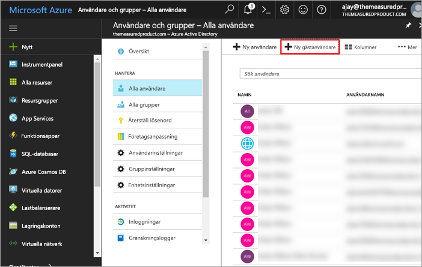
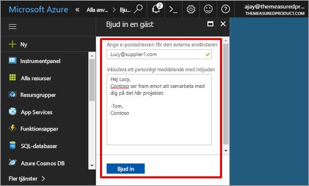
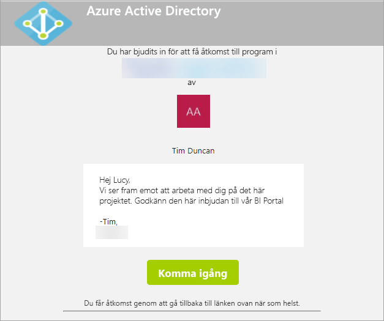
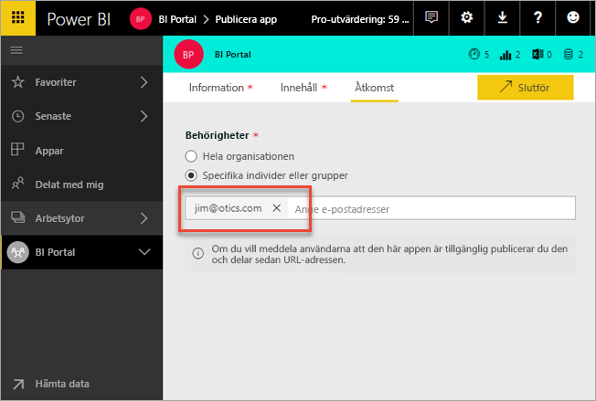
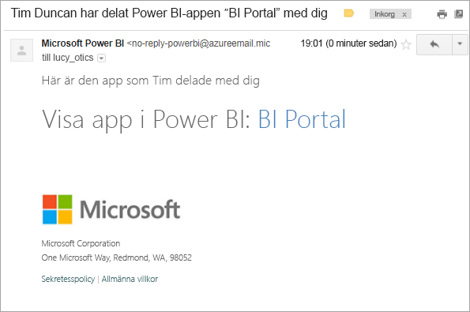
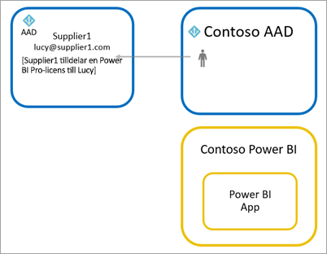

# Distribuera Power BI-innehåll till externa gästanvändare med Azure Active Directory B2B

Power BI kan integreras med Azure Active Directory Business-to-business (Azure AD B2B) för att tillåta säker distribution av Power BI-innehåll till gästanvändare utanför organisationen, medan kontroll över interna data bibehålls.

> [!VIDEO https://www.youtube.com/embed/xxQWEQ1NnlY]

> [!NOTE]
> Du måste **aktivera** funktionen [Inställningar för export och delning](service-admin-portal.md#export-and-sharing-settings) i Klientinställningar på Power BI-administratörsportalen innan du bjuder in gästanvändare.

> [!NOTE]
> Den här funktionen är inte tillgänglig med Power BI-appar. Du kan visa Power BI-innehåll som delas med hjälp av Microsoft Azure Active Directory B2B i en webbläsare på en mobil enhet. 

## Vilka kan du bjuda in?

Du kan bjuda in gästanvändare som använder alla e-postadresser, även personliga konton som gmail.com, outlook.com och hotmail.com. I Azure B2B kallas de ”sociala ID”. Mer information hittar du i [Azure B2B](https://docs.microsoft.com/azure/active-directory/active-directory-b2b-what-is-azure-ad-b2b).

## Bjud in gästanvändare

Det finns två sätt att bjuda in gästanvändare till Power BI-klienten: planerad inbjudan eller ad hoc-inbjudan. Inbjudningar krävs endast första gången en extern användare bjuds in till din organisation.

### Planerad inbjudan

En planerad inbjudan utförs i Microsoft Azure Portal i Azure AD eller med hjälp av PowerShell. Det här är alternativet du ska använda om du vet vilka användare som ska bjudas in. 

**För att skapa gästanvändare i Azure Active Directory-portalen måste du vara innehavaradministratör.**

1. Gå till [Azure Portal](https://portal.azure.com) och välj **Azure Active Directory**.

2. Gå till **Användare och grupper** > **Alla användare** > **Nya gästanvändare**.

    

3. Ange **e-postadress** och **personligt meddelande**.

    

4. Välj **Bjud in**.

Använd PowerShell för att bjuda in fler än en gästanvändare. Mer information finns i [Azure Active Directory B2B-samarbetskod och PowerShell-exempel](https://docs.microsoft.com/azure/active-directory/b2b/code-samples).

Gästanvändaren behöver välja **Kom igång** i e-postinbjudan hen tar emot. Gästanvändaren läggs sedan till i klientorganisationen.

### Ad hoc-inbjudningar

Utför en inbjudan när som helst genom att lägga till den externa användaren i din instrumentpanel eller rapport via delningsgränssnittet, eller din app via åtkomstsidan.

Här är ett exempel på vad du gör när du bjuder in en extern användare att använda en app.

Gästanvändaren får ett e-postmeddelande som anger att appen har delats med dem.

Gästanvändaren måste logga in med sin organisations e-postadress. De uppmanas att tacka ja till inbjudan efter inloggningen. Efter inloggningen dirigeras gästanvändare om till appinnehållet. Märk länken med ett bokmärke eller spara e-postmeddelandet om du vill återgå till appen.

## Licensiering

Gästanvändaren måste ha korrekt licensiering för att se appen som delats. Det finns tre alternativ att åstadkomma detta.

### Använda Power BI Premium

Genom att tilldela app-arbetsytan till Power BI Premium-kapacitet kan gästanvändaren använda appen utan att behöva en Power BI Pro-licens. Power BI Premium kan även användas för appar för att dra nytta av andra funktioner som ökade uppdateringsintervall, dedikerad kapacitet och stora modellstorlekar.

### Tilldela Power BI Pro-licens till gästanvändaren

Genom att tilldela en Power BI Pro-licens till gästanvändaren i din klientorganisation kan gästanvändaren se innehållet.

> [!NOTE]
> En Power BI Pro-licens från din klientorganisation används endast för gästanvändare när de har åtkomst till innehåll i din klientorganisation.

### Gästanvändare tar med sin egen Power BI Pro-licens

Gästanvändaren har redan en Power BI Pro-licens i klientorganisationen.

## Överväganden och begränsningar

* När du bjuder in gästanvändare som använder personliga e-postkonton, till exempel gmail.com, outlook.com och hotmail.com, kan du följa det här [inbäddade videoklippet](https://docs.microsoft.com/azure/active-directory/active-directory-b2b-redemption-experience) om du vill se ett exempel på hur en användare registrerar sig.
* Externa B2B-gäster är begränsade till förbrukning av innehåll endast. Externa B2B-gäster kan visa appar, instrumentpaneler, rapporter, exportera data och skapa e-postprenumerationer för instrumentpaneler och rapporter. De kan inte komma åt arbetsytor eller publicera sitt eget innehåll.
* Den här funktionen är inte tillgänglig med Power BI-appar. Du kan visa Power BI-innehåll som delas med hjälp av Microsoft Azure Active Directory B2B i en webbläsare på en mobil enhet.
* Den här funktionen är inte tillgänglig med rapportwebbdelen för SharePoint Online i Power BI.

## Nästa steg

Mer detaljerad information, inklusive hur säkerhet på radnivå fungerar, hittar du i [white paper](https://aka.ms/powerbi-b2b-whitepaper).

Mer information om Azure Active Directory B2B finns i [Vad är Azure AD B2B-samarbete?](https://docs.microsoft.com/azure/active-directory/active-directory-b2b-what-is-azure-ad-b2b)
