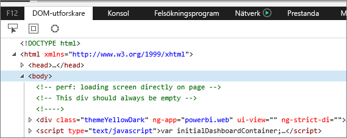
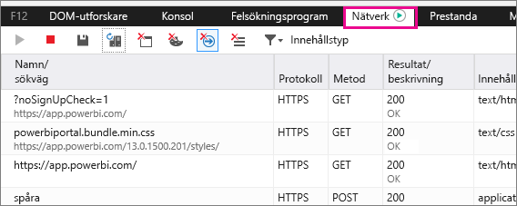
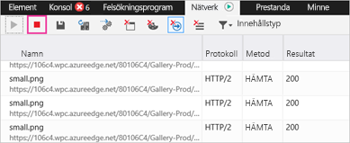
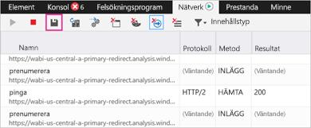

# Samla in ytterligare diagnostikinformation
## Samla in ytterligare diagnostikinformation för Power BI
I dessa anvisningar finns två möjliga alternativ för att samla in ytterligare diagnostikinformation från Power BI-webbklienten manuellt.  Du behöver bara använda ett av dessa alternativ.

## Nätverksklipp – Edge och Internet Explorer
1. Bläddra till [Power BI](https://app.powerbi.com) med Microsoft Edge eller Internet Explorer.
2. Öppna utvecklingsverktygen i Edge genom att trycka på F12.
3. Fönstret Utvecklingsverktyg öppnas: 
   
   
4. Gå till fliken Nätverk. Den visar en lista över trafik som redan har samlats in. 
   
   
5. Du kan bläddra i fönstret och återskapa alla problem som du hittar. Du kan dölja och visa fönstret Utvecklingsverktyg när som helst under sessionen genom att trycka på F12.
6. Markera den röda rutan på nätverksfliken i området för utvecklingsverktygen om du vill stoppa insamlingen.
   
   
7. Välj diskettikonen för att **Exportera som HAR**
   
   
8. Ange ett filnamn och spara HAR-filen.
   
    HAR-filen innehåller all information om nätverksbegäranden mellan webbläsarfönstret och Power BI.  Detta inkluderar aktivitets-ID:n för varje begäran, exakt tidsstämpel för varje begäran och eventuell felinformation som returnerats till klienten.  Den här spårningen innehåller även data som används för att fylla i de visuella objekt som visas på skärmen.
9. Du kan skicka HAR-filen till supporten för granskning.

Har du fler frågor? [Fråga Power BI Community](http://community.powerbi.com/)

