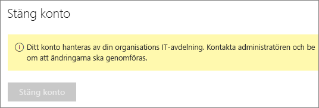

# Stänga ditt Power BI-konto

Om du inte vill använda Power BI längre, kan du avsluta ditt Power BI-konto.  När du avslutar ditt konto kan du logga in till Power BI. Eftersom den delstater i policyn för datalagring i data i Power BI användarvillkoren tar Power BI du också all kundinformation som du laddat upp eller skapas. Den finns inte kvar.

## Enskilda Power BI-användare

Om du har registrerat dig för Power BI som individ kan du avsluta ditt konto från skärmen **Inställningar**.

1. Välj kugghjulsikonen i det övre högra hörnet i Power BI och välj sedan **Inställningar**.

    

1. På fliken **Allmänt** väljer du **Stäng konto**.

    

1. Välj ett skäl för att stänga kontot (1). Alternativt så kan du ge mer information (2). Välj sedan **avsluta kontot**.

    

1. Bekräfta att du vill avsluta ditt konto.

    

    Du bör se en bekräftelse på att Power BI stängs ditt konto. Du kan återaktivera ditt konto här om det behövs.

    

## Hanterade klientanvändare

Om din organisation har registrerat dig för Power BI kan du kontakta din klientadministratör. Be dem att ta bort licensen från ditt konto.

Har du fler frågor? [Fråga Power BI Community](http://community.powerbi.com/)