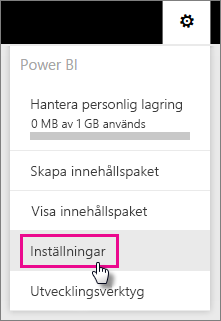
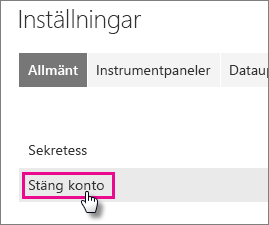
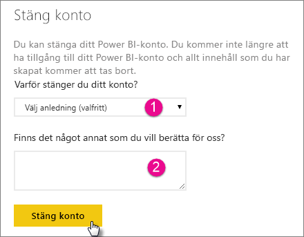
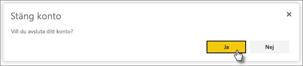

# Stäng ditt Power BI-konto
Om du inte vill använda Power BI längre, kan be du be oss att avsluta ditt Power BI-konto.  När ditt konto har avslutats kan du inte längre logga in på Power BI.  Dessutom raderas all kundinformation som du laddat upp eller skapat i Power BI enligt principen för datakvarhållning i tjänstevillkoren för Power BI.

## Enskilda Power BI-användare
Du kan avsluta ditt konto från inställningsskärmen.

1. Välj kugghjulet  i det övre högra hörnet.
2. Välj **inställningar**.
   
    
3. **Allmänt** > **avsluta kontot**
   
    
4. Välj en orsak från listrutan **varför stänger du ditt konto?** (1).  Alternativt så kan du ge mer information (2). Välj sedan **avsluta kontot**.
   
    
5. Bekräfta att du vill avsluta ditt konto.
   
    
6. Du kommer se en bekräftelse på att ditt konto har avslutats. Du kommer också att få en länk för att återaktivera ditt konto.
   
    

## Hanterade klientanvändare
Du behöver kontakta din klientadministratör och be dem ta bort tilldelningen av licensen från ditt konto.

Har du fler frågor? [Fråga Power BI Community](http://community.powerbi.com/)

