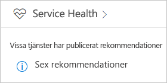
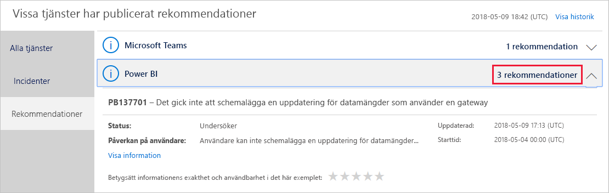
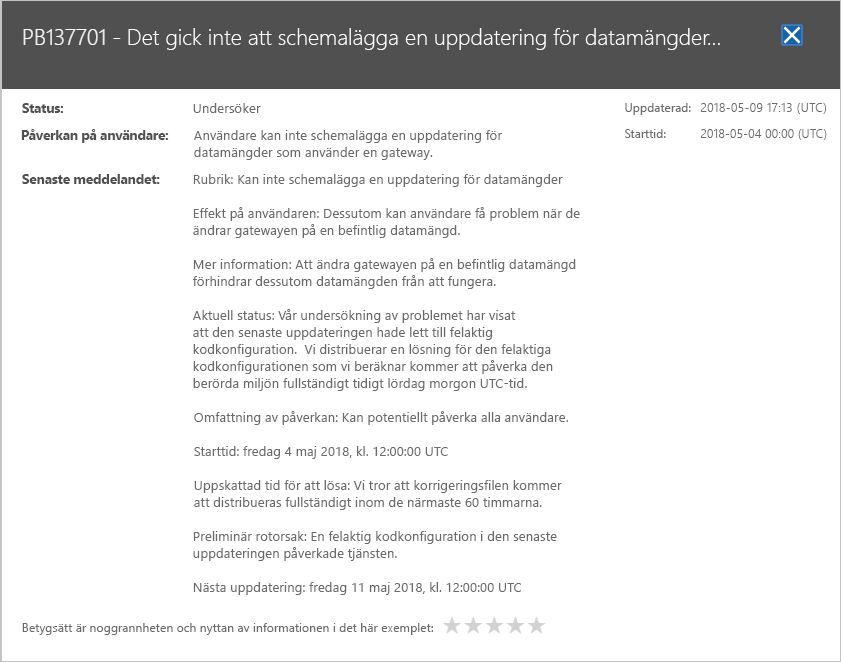

# Spåra Power BI-tjänstens hälsa i Office 365

Administrationscenter för Office 365 innehåller viktiga verktyg för Power BI-administratörer, inklusive aktuell och historisk information om tjänstens hälsa. Om du vill komma åt den här informationen så måste du ha någon av följande roller: Tjänstadministratör för Power BI eller Global administratör för Office 365. Mer information om roller finns i [Administratörsroller relaterade till Power BI](service-admin-administering-power-bi-in-your-organization.md#administrator-roles-related-to-power-bi).

1. Logga in på [Administrationscenter för Office 365](https://portal.office.com/adminportal).

2. Välj panelen **Tjänstens hälsa**.

    

3. I den aktuella listan, väljer du **N rekommendationer** eller **N incidenter** och granskar resultatet. I bilden nedan, ser du en av tre aktiva rekommendationer.

    

4. Om du vill se mer information, väljer du **Visa information** för ett objekt. I bilden nedan visas ytterligare information, inklusive de senaste statusuppdateringarna.

    

    Bläddra nedåt för att se mer information och stäng sedan fönstret när du är klar.

5. Om du vill visa historisk information för alla tjänster, väljer du **Visa historik** i det övra högra hörnet av huvudlisten. Välj sedan **Senaste 7 dagarna** eller **Senaste 30 dagarna**. Om du vill återgå till den aktuella tjänstens hälsa, väljer du **Visa aktuell status**.