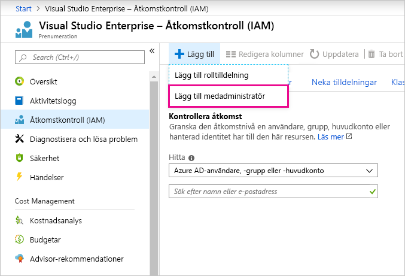

# Använda samma kontoinloggning för Power BI och Azure

Om du är en användare av både Power BI och Azure, vill du kanske använda samma inloggning för båda tjänsterna så att du inte behöver ange ditt lösenord två gånger.

Power BI loggar in dig med ditt organisationskonto som är kopplat till din arbets- eller skolmejl.  Azure loggar in dig med ett Microsoft-konto eller ditt organisationskonto.

Om du vill använda samma inloggning för både Azure och Power BI ska du logga in på Azure med ditt organisationskonto.

**Vad händer om jag redan har loggat in på Azure med mitt Microsoft-konto?**

Du kan lägga till ditt organisationskonto som medadministratör i Azure med följande steg:

1. Logga in på [Azure-portalen](http://portal.azure.com/). Om du är en användare i flera kataloger i Azure markerar du **Prenumerationer** och filtrerar sedan för att visa katalogen och de prenumerationer som du vill redigera.

1. I navigerings fönstret väljer du **åtkomstkontroll (IAM)** och väljer sedan **Lägg till** \> **Lägg till medadministratör**.

    

1. Ange den e-postadress som är associerat med ditt organisationskonto och välj **Lägg till**.

1. Nästa gång du loggar in på Azure-portalen ska du använda din organisations e-postadress.

Har du fler frågor? [Prova Power BI Community](http://community.powerbi.com/)
