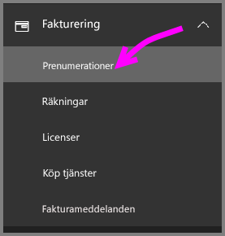
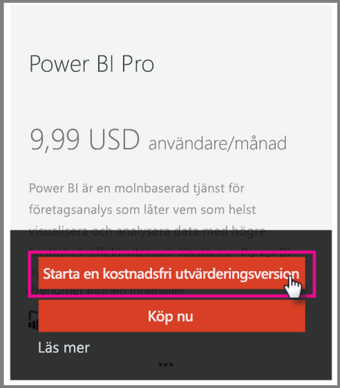
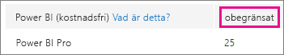
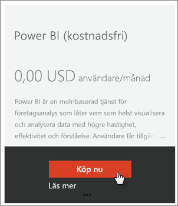
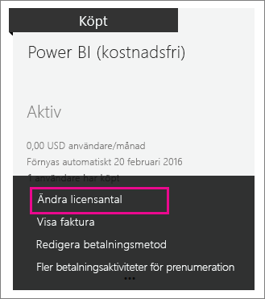

# <a name="power-bi-licensing-in-your-organization"></a>Power BI-licensiering i din organisation

[!INCLUDE [license-capabilities](includes/license-capabilities.md)]

Den här artikeln fokuserar på licenser per användare från en administratörs perspektiv.

## <a name="manage-power-bi-pro-licenses"></a>Hantera Power BI Pro-licenser

Som administratör kan du köpa och tilldela Power BI Pro-licenser. Du kan även registrera dig för en utvärderingsversion av Power BI Pro för din organisation. Enskilda användare kan också registrera sig för en utvärderingsversion av Power BI Pro.

### <a name="purchase-power-bi-pro"></a>Köp Power BI Pro

Du kan köpa Power BI Pro-licenser via Microsoft Office 365 eller en certifierad Microsoft-partner. När du har köpt licenserna kan du tilldela dem till enskilda användare. Mer information finns i avsnittet [Köpa och tilldela Power BI Pro-licenser](service-admin-purchasing-power-bi-pro.md).

### <a name="power-bi-pro-license-expiration"></a>Power BI Pro-licensens upphörande

Det finns en respitperiod efter att en Power BI Pro-licens har gått ut. För licenser som är en del av ett volymlicensköp är respitperioden 90 dagar. Om du har köpt licensen direkt är respitperioden 30 dagar.

Power BI Pro har samma prenumerationslivscykel som Office 365. Mer information finns i [Vad händer med mina data och åtkomst när Office 365 för företag-prenumerationen går ut?](https://support.office.com/article/What-happens-to-my-data-and-access-when-my-Office-365-for-business-subscription-ends-4436582f-211a-45ec-b72e-33647f97d8a3).

### <a name="power-bi-pro-trial-for-individuals"></a>Utvärderingsversion av Power BI Pro för enskilda användare

Enskilda användare i din organisation kan registrera sig för en utvärderingsversion av Power BI Pro. Mer information finns i [Registrera dig själv som enskild individ för Power BI](service-self-service-signup-for-power-bi.md).

Användare som utnyttjar denna Power BI Pro-utvärderingsversion visas inte i Microsoft 365-administratörscentret som Power BI Pro-utvärderingsanvändare (de visas som användare av den kostnadsfria Power BI-versionen). De visas dock som Power BI Pro-utvärderingsanvändare på sidan Hantera lagring i Power BI.

### <a name="power-bi-pro-trial-for-organizations"></a>Utvärderingsversion av Power BI Pro för organisationer

Om du vill hämta och distribuera Power BI-utvärderingslicenser till flera användare i din organisation utan att de enskilda användarna ska behöva godkänna användningsvillkoren individuellt, så kan du registrera dig för en utvärderingsversion av Power BI Pro för din organisation.

Tänk på följande innan du börjar registrera dig:

* Du måste ha rollen [**global administratör** eller **faktureringsadministratör**](https://support.office.com/article/about-office-365-admin-roles-da585eea-f576-4f55-a1e0-87090b6aaa9d) i Office 365 för att kunna registrera dig.

* Det finns en gräns på en organisationsutvärdering per klientorganisation. Det innebär att om någon redan har använt Power BI Pro-utvärderingen för din klientorganisation så kan du inte göra det igen. Om du behöver hjälp med det här kan du kontakta [faktureringssupporten för Office 365](https://support.office.microsoft.com/article/contact-support-for-business-products-admin-help-32a17ca7-6fa0-4870-8a8d-e25ba4ccfd4b?CorrelationId=552bbf37-214f-4202-80cb-b94240dcd671).

1. Gå till [Administrationscenter för Microsoft 365](https://portal.office.com/adminportal/home#/homepage).

1. I det vänstra navigeringsfönstret väljer du **Fakturering** och sedan **Prenumerationer**.

   

1. Till höger väljer du **Lägg till prenumerationer**.

   

1. Under **Andra planer** hovrar du över ellipsen ( **. . .** ) för Power BI Pro och väljer **Starta en kostnadsfri utvärderingsversion**.

    

1. Välj **Testa nu** på orderbekräftelsesidan.

1. Välj **Fortsätt** på orderkvittot.

Nu kan du [tilldela licenser i Office 365](https://support.office.com/article/assign-licenses-to-users-in-office-365-for-business-997596b5-4173-4627-b915-36abac6786dc).

## <a name="manage-power-bi-free-licenses"></a>Hantera kostnadsfria Power BI-licenser

Användare i din organisation kan få tillgång till kostnadsfria Power BI-licenser på två olika sätt:

* Du kan tilldela en licens för Power BI till dem i administrationscentret för Microsoft 365.

* Om en användare [registrerar sig för en kostnadsfri utvärderingsversion av Power BI Pro](service-self-service-signup-for-power-bi.md) och utvärderingsversionen är slut tilldelas de en kostnadsfri licens.

### <a name="requesting-and-assigning-free-licenses"></a>Begära och tilldela kostnadsfria licenser

Om du planerar att ha en central hantering av licensbegäranden och licenstilldelningar kontrollerar du först om du redan har det obegränsade Power BI-licensblocket (kostnadsfritt).

Det här blocket med licenser är tillgängligt efter den första gången någon registrerat sig för Power BI som individ. Under den här processen är licensblocket kopplat till din organisation och en licens tilldelas till den användare som registrerar sig.

1. I Administrationscenter för Microsoft 365 söker du efter **obegränsat** under **Fakturering** > **Licenser**.

    

1. Om blocket är tillgängligt kan du nu [tilldela licenser i Office 365](https://support.office.com/article/assign-licenses-to-users-in-office-365-for-business-997596b5-4173-4627-b915-36abac6786dc). Om blocket inte är tillgängligt har du två alternativ:

    * Låt en medlem i din organisation registrera sig som enskild användare, vilket gör att det obegränsade blocket skapas.

    * Gå till nästa procedur där du kan registrera dig för ett fast antal licenser.

Om det obegränsade Power BI-licensblocket (kostnadsfritt) inte är tillgängligt och du inte vill göra en enskild registrering kan du följa den här proceduren.

1. Gå till [Administrationscenter för Microsoft 365](https://portal.office.com/admin/default.aspx).

1. Välj **fakturering** > **prenumerationer** i den vänstra navigeringspanelen.

1. Välj **Lägg till prenumerationer +** till höger.

1. Under **Andra planer**, hovrar du över ellipsen ( **. . .** ) för Power BI (kostnadsfri) och väljer **Köp nu**.

    

1. Ange det antal licenser som du vill lägga till och markera sedan **Checka ut nu** eller **Lägg till i kundvagn**.

1. Ange den nödvändiga informationen i utcheckningsflödet.

    Det sker inget köp när du gör på det här sättet, men du behöver ange din kreditkortsinformation för debitering eller välja att faktureras.

1. Nu kan du [tilldela licenser i Office 365](https://support.office.com/article/assign-licenses-to-users-in-office-365-for-business-997596b5-4173-4627-b915-36abac6786dc).

1. Om du väljer senare att du vill lägga till fler licenser, går du tillbaka till **lägg till prenumerationer** och väljer **ändra licensantal** för Power BI (kostnadsfri).

    

### <a name="enable-or-disable-individual-user-sign-up-in-azure-active-directory"></a>Aktivera eller inaktivera registrering för enskilda användare i Azure Active Directory

Som administratör kan du välja att aktivera eller inaktivera individuell användarregistrering via Azure Active Directory (AAD). Det här avsnittet av artikeln visar hur du hanterar registreringar med PowerShell-kommandon. Läs mer om Azure PowerShell i [Översikt över Azure PowerShell](/powershell/azure/overview).

Azure AD-inställningen som styr registreringen är **AllowAdHocSubscriptions**. I de flesta klienter är det här inställt på *true*, vilket innebär att inställningen är aktiverad. Om du har köpt Power BI via en partner kan detta vara inställt på *false*, vilket innebär att det är inaktiverat. Om du ändrar inställningen från *true* till *false* blockeras nya användare i din organisation från att kunna registrera sig individuellt. Användare som har registrerat sig för Power BI före inställningen ändrades har kvar sina licenser. Observera att med inställningen *falskt* kan användarna fortfarande registrera sig för en utvärderingsversion av Pro.

1. Logga in på Azure Active Directory med dina Office 365-autentiseringsuppgifter. Den första raden i följande PowerShell-skript uppmanar dig att ange dina autentiseringsuppgifter. Den andra raden ansluter till Azure Active Directory.

    ```powershell
     $msolcred = get-credential
     connect-msolservice -credential $msolcred
    ```

   

1. När du har loggat in kan du köra följande kommando för att se hur din klient är konfigurerad. (Observera att "fl" nedan använder bokstaven "l", inte siffran 1.)

    ```powershell
     Get-MsolCompanyInformation | fl AllowAdHocSubscriptions 
    ```
1. Kör det här kommandot för att aktivera ($true) eller inaktivera ($false) **AllowAdHocSubscriptions**.

    ```powershell
     Set-MsolCompanySettings -AllowAdHocSubscriptions $true
    ```

> [!NOTE]
> Flaggan AllowAdHocSubscriptions används för att styra flera användarfunktioner i organisationen, inklusive möjligheten för användare att registrera sig för Azure Rights Management-tjänsten. Om du ändrar flaggan påverkas alla dessa funktioner.

## <a name="next-steps"></a>Nästa steg

[Självregistrering för Power BI](service-self-service-signup-for-power-bi.md)  

[Köpa och tilldela Power BI Pro-licenser](service-admin-purchasing-power-bi-pro.md)

Har du fler frågor? [Fråga Power BI Community](http://community.powerbi.com/)