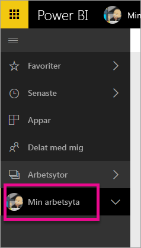
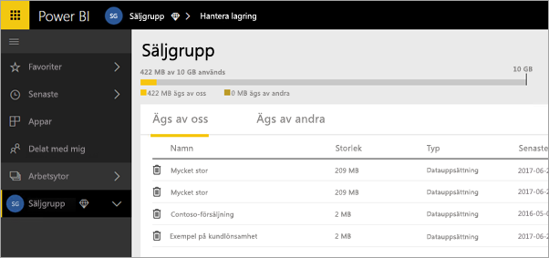
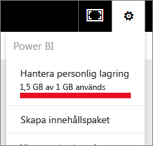
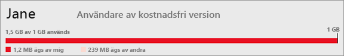

# Hantera din datalagring
Läs hur du hanterar datalagring individuellt eller i apparbetsytan för att kontrollera att du kan fortsätta att publicera rapporter och datauppsättningar.

Användare och apparbetsytor har sina egna datakapaciteter

* Alla användare har upp till 10 GB datalagring.
* Användare med Power BI Pro-licens kan skapa apparbetsytor med maximalt 10 GB lagring i varje.

På klientnivån, får total användning inte överstiga 10 GB per Pro-användare över alla Pro-användare och apparbetsytor i klientorganisationen.

Läs om andra funktioner i [Power BI-prismodellen](https://powerbi.microsoft.com/pricing).

Din datalagring inkluderar dina egna datauppsättningar och Excel-rapporter och de som någon har delat med dig. Datauppsättningar är alla datakällor som du har laddat upp eller anslutit till, inklusive Power BI Desktop-filer och Excel-arbetsböcker som du använder. Följande ingår även i din datakapacitet.

* Excel-intervall fästa till en instrumentpanel.
* Reporting Services lokala visualiseringar fästa på en Power BI-instrumentpanel.
* Överförda bilder.

Storleken på en instrumentpanel som du delar varierar beroende på vad som är fäst på den. Om du till exempel fäster objekt från två rapporter som ingår i två olika datauppsättningar, kommer storleken att inkludera bägge datauppsättningarna.

<a name="manage"/>

## Hantera objekt som du äger
Se hur mycket lagringsutrymme du använder i ditt Power BI-konto och hantera ditt konto.

1. Om du vill hantera din lagring, går du till **min arbetsyta** i det vänstra navigeringsfönstret.
   
    
2. Välj kugghjulsikonen  i det övre högra hörnet \> **hantera personlig lagring**.
   
    Det översta fältet visar hur mycket av din lagringsgräns som du har använt.
   
    
   
    Datauppsättningarna och rapporterna avgränsas på två flikar:
   
    **Ägs av mig:** rapporter och datauppsättningar som du har överfört till ditt Power BI-konto, inklusive tjänstedatauppsättningar som Salesforce och Dynamics CRM.  
    **Ägs av andra:** andra har delat dessa rapporter och datauppsättningar med dig.
3. Om du vill ta bort en datauppsättning eller rapport, väljer du papperskorgsikonen .

Tänk på att du eller någon annan kan ha rapporter och instrumentpaneler baserade på en datauppsättning. Om du tar bort datauppsättningen, fungerar dessa rapporter och instrumentpaneler inte längre.

## Hantera din apparbetsyta
1. Välj pilen bredvid **arbetsytor** \> välj namnet på apparbetsytan.
   
    
2. Välj kugghjulsikonen  i det övre högra hörnet \> **hantera grupplagring**.
   
    Det översta fältet visar hur mycket av din lagringsgräns som du har använt.
   
    
   
    Datauppsättningarna och rapporterna avgränsas på två flikar:
   
    **Ägs av oss:** rapporter och datauppsättningar som du eller någon annan har överfört till gruppens Power BI-konto, inklusive tjänstedatauppsättningar som Salesforce och Dynamics CRM.
    **Ägs av andra:** andra har delat dessa rapporter och datauppsättningar med din grupp.
3. Om du vill ta bort en datauppsättning eller rapport, väljer du papperskorgsikonen .
   
   > [!NOTE]
   > Alla medlemmar med redigeringsbehörigheter för en apparbetsyta har behörighet att ta bort datauppsättningar och rapporter från apparbetsytan.
   > 
   > 

Tänk på att du eller någon annan i gruppen kan ha rapporter och instrumentpaneler baserade på en datauppsättning. Om du tar bort datauppsättningen, fungerar dessa rapporter och instrumentpaneler inte längre.

## Datauppsättningsgränser
Det finns en gräns på 1 GB, per datauppsättning som importeras till Power BI. Om du har valt att behålla Excel-upplevelsen istället för att importera data, begränsas du till 250 MB för datauppsättningen.

## Vad händer när du når gränsen
När du når datakapacitetsgränsen för vad du kan göra, får du meddelanden i tjänsten. 

När du väljer kugghjulsikonen , ser du ett rött streck som anger att du har överskridit din datakapacitetsgräns.

Du ser även detta inom **hantera personlig lagring**.

 

 När du försöker utföra en åtgärd som kommer att gå över en av gränserna, visas ett meddelande som anger att du har överskridit gränsen. Du kommer att kunna [hantera](#manage) din lagring för att minska ditt lagringsutrymme och komma förbi gränsen.

 

 Har du fler frågor? [Fråga Power BI Community](http://community.powerbi.com/)

