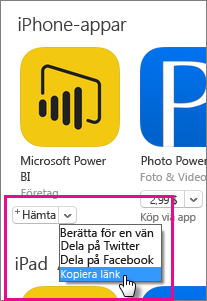
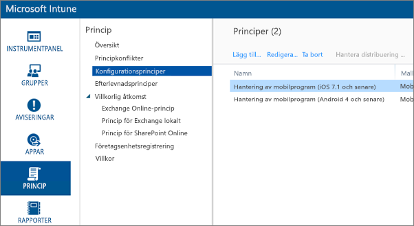
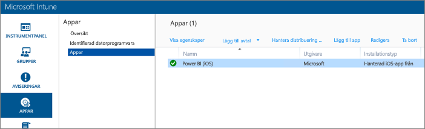
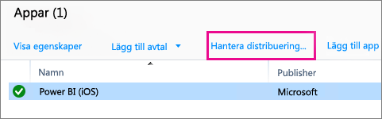
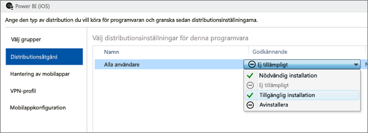
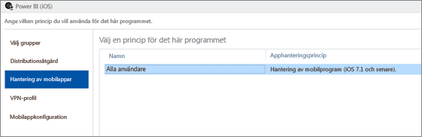
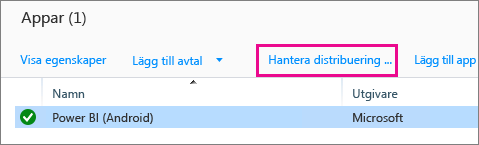
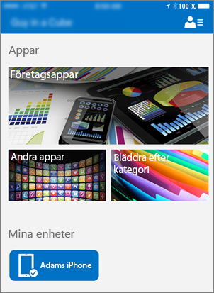
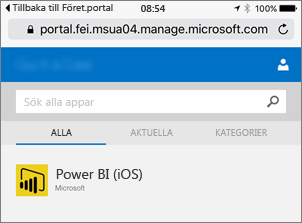
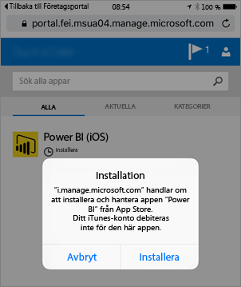

# Konfigurera mobilappar med Microsoft Intune
Microsoft Intune låter organisationer hantera enheter och program. Power BI-mobilprogrammen, för iOS och Android, integrerar med Intune för att låta dig hantera programmet på dina enheter och för att kontrollera säkerhet. Genom konfigurationsprinciper kan du kontrollera objekt och kräva en PIN-kod för åtkomst, styra hur data hanteras av programmet och även kryptera programdata när appen inte används.

<iframe width="560" height="315" src="https://www.youtube.com/embed/9HF-qsdQvHw?list=PLv2BtOtLblH1nPVPU2etFzTNmpz49dwXm" frameborder="0" allowfullscreen></iframe>

## Konfiguration av allmän mobilenhetshantering
Den här artikeln är inte avsedd som en fullständig konfigurationsguide för Microsoft Intune. Om du just nu integrerar med Intune, finns det några saker som du bör kontrollera att du har konfigurerat. [Läs mer](https://technet.microsoft.com/library/jj676587.aspx)

Microsoft Intune kan finnas tillsammans med hantering av mobilenheter (MDM) i Office 365. [Läs mer](https://blogs.technet.microsoft.com/configmgrdogs/2016/01/04/microsoft-intune-co-existence-with-mdm-for-office-365/)

Den här artikeln förutsätter att Intune är korrekt konfigurerat och att du har enheter som registrerats med Intune. Om du samexisterar med MDM, visar enheten registrerade inom MDM, men är tillgänglig för hantering i Intune.

> [!NOTE]
> Om du använder Power BI-mobilappen på din iOS- eller Android-enhet och din organisation har konfigurerat Microsoft Intune MAM, stängs datauppdatering i bakgrunden av. Nästa gång du använder appen uppdaterar Power BI data från Power BI-tjänsten på webben.
> 
> 

## Steg 1: Hämta URL:en för programmet
Innan vi skapar programmet i Intune, måste vi hämta URL:er för apparna. För iOS får vi detta från iTunes. För Android, kan du få det från Power BI-mobilsidan.

Spara URL:en då du kommer att behöva den när vi skapar programmet.

### iOS
Om du vill hämta appens URL för iOS, måste vi du hämta den från iTunes.

1. Öppna iTunes.
2. Sök efter *Power BI*.
3. Du bör se **Microsoft Power BI** listat under **iPhone-appar** och **iPad-appar**. Du kan använda vilken som, eftersom de ger samma URL.
4. Välj listrutan **hämta** och välj **kopiera länk**.
   
    

Det bör se ut ungefär så här.

    https://itunes.apple.com/us/app/microsoft-power-bi/id929738808?mt=8

### Android
Du kan hämta URL:en för Google Play från [Power BI-mobilsidan](https://powerbi.microsoft.com/mobile/). Om du klickar på ikonen **ladda ned från Google Play**, kommer du till appsidan. Du kan kopiera URL:en från adressfältet i webbläsaren. Det bör se ut ungefär så här.

    https://play.google.com/store/apps/details?id=com.microsoft.powerbim

## Steg 2: Skapa en hanteringsprincip för mobilprogram
Principen för hantering av mobilprogram låter dig framtvinga sådant som en PIN-kod för åtkomst. Du kan skapa en i Intune-portalen. 

Du kan skapa programmet eller principen först. Den ordning som de läggs till spelar ingen roll. Bägge två måste endast finnas för distributionssteget.

1. Välj **princip** > **konfigurationsprinciper**.
   
    
2. Välj **Lägg till...** .
3. Under **programvara** kan du välja hantering av mobilprogram för Android eller iOS. Om du vill komma igång snabbt, kan du välja **skapa en princip med de rekommenderade inställningarna**, eller så kan du skapa en anpassad princip.
4. Redigera principen för att konfigurera de begränsningar du vill ha på programmet.

## Steg 3: Skapa programmet
Programmet är en referens eller ett paket, som sparas i Intune för distribution. Vi behöver skapa ett program och referera till den app-URL som vi fick från Google Play eller iTunes.

Du kan skapa programmet eller principen först. Den ordning som de läggs till spelar ingen roll. Bägge två måste endast finnas för distributionssteget.

1. Gå till Intune-portalen och välj **appar** i den vänstra menyn.
2. Välj **lägg till app**. Det här startar programmet **lägg till programvara**.

### iOS
1. Välj **hanterad iOS-App från App Store** i listrutan.
2. Ange den app-URL som vi fick från [Steg 1](#step-1-get-the-url-for-the-application) och välj **Nästa**.
   
    
3. Ange **Publicerare**, **Namn** och **Beskrivning**. Du kan också bifoga en **ikon**. **Kategori** är för företagsportalappen. När du är klar, väljer du **Nästa**.
4. Du kan välja om du vill publicera appen som **alla** (standard), **iPad** eller **iPhone**. Som standard visas **alla** och den kommer att fungera för båda typer av enheter. Power BI-appen har samma URL för både iPhone och iPad. Välj **Nästa**.
5. Välj **Överför**.

> [!NOTE]
> Det är möjligt att du inte ser den i applistan innan du uppdaterar sidan. Du kan klicka på **Översikt** och tillbaka till **Appar** för att uppdatera sidan.
> 
> 

### Android
1. Välj **extern länk** i listrutan.
2. Ange den app-URL som vi fick från [Steg 1](#step-1-get-the-url-for-the-application) och välj **Nästa**.
   
    
3. Ange **Publicerare**, **Namn** och **Beskrivning**. Du kan också bifoga en **ikon**. **Kategori** är för företagsportalappen. När du är klar, väljer du **Nästa**.
4. Välj **Överför**.

> [!NOTE]
> Det är möjligt att du inte ser den i applistan innan du uppdaterar sidan. Du kan klicka på **Översikt** och tillbaka till **Appar** för att uppdatera sidan.
> 
> 

## Steg 4: Distribuera programmet
När du har lagt till programmet, behöver du distribuera det så att det finns tillgängligt för dina slutanvändare. Detta är steget där du ska binda principen du skapade med appen.

### iOS
1. Välj den app som du skapade på Appar-skärmen. Välj sedan länken **Hantera distribution...**.
   
    
2. På skärmen **Välj grupper** kan du välja vilka grupper som du vill distribuera den här appen till. Välj **Nästa**.
3. På skärmen **Distributionsåtgärd** kan du välja hur du vill distribuera den här appen. Om du väljer **Tillgänglig installation** eller **Nödvändig installation** blir appen tillgänglig i företagsportalen för användare att installera på begäran. När du är klar med ditt val väljer du **Nästa**.
   
    
4. På skärmen **Hantering av mobilappar** väljer du den princip för hantering av mobilappar som vi skapade i [Steg 2](#step-2-create-a-mobile-application-management-policy). Det kommer som standard vara den princip som du skapade, om det är den enda iOS-principen som finns tillgänglig. Välj **Nästa**.
   
    
5. På skärmen **VPN-profil**, kan du välja en princip om du har en för din organisation. Som standard används **Ingen**. Välj **Nästa**.
6. På skärmen **konfiguration av mobilapp**, kan du välja en **appkonfigurationsprincip** om du har skapat en sådan. Som standard används **Ingen**. Det här krävs inte. Välj **Slutför**.

När du har distribuerat appen, bör du se **Ja** för distribuerad på appsidan.

### Android
1. Välj den app som du skapade på Appar-skärmen. Välj sedan länken **Hantera distribution...**.
   
    
2. På skärmen **Välj grupper** kan du välja vilka grupper som du vill distribuera den här appen till. Välj **Nästa**.
3. På skärmen **Distributionsåtgärd** kan du välja hur du vill distribuera den här appen. Om du väljer **Tillgänglig installation** eller **Nödvändig installation** blir appen tillgänglig i företagsportalen för användare att installera på begäran. När du är klar med ditt val väljer du **Nästa**.
   
    
4. På skärmen **Hantering av mobilappar** väljer du den princip för hantering av mobilappar som vi skapade i [Steg 2](#step-2-create-a-mobile-application-management-policy). Det kommer som standard vara den princip som du skapade, om det är den enda Android-principen som finns tillgänglig. Välj **Slutför**.
   
    

När du har distribuerat appen, bör du se **Ja** för distribuerad på appsidan.

## Steg 5: Installera programmet på en enhet
Du installerar programmet via företagsportalappen. Om du inte har installerat företagsportalen, kan du hämta den via App Store på iOS- eller Android-plattformar. Du loggar in på företagsportalen med din organisations inloggning.

1. Öppna företagsportalappen.
2. Om du inte ser Power BI-appen listad som en viktig app, väljer du **företagsappar**.
   
    
3. Välj den Power BI-app som du har distribuerat.
   
    
4. Välj **installera**.
   
    
5. Om du är på iOS, pushas appen till dig. Välj **installera** i push-dialogrutan.
   
    

När den har installerats, ser du att den är **hanterad av ditt företag**. Om du har aktiverat åtkomst med en PIN-kod i principen, ser du följande.

## Nästa steg
[Konfigurera och distribuera hanteringsprinciper för mobilprogram i Microsoft Intune-konsolen](https://technet.microsoft.com/library/dn878026.aspx)  
[Power BI-appar för mobila enheter](mobile-apps-for-mobile-devices.md)  

Har du fler frågor? [Fråga Power BI Community](http://community.powerbi.com/)

