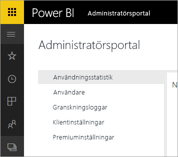

# Power BI för Office 365 har dragits tillbaka
Power BI för Office 365, en tidigare version av Power BI har övergått till den aktuella versionen av [Power BI](https://powerbi.microsoft.com). Användare som använde **Power BI för Office 365** kan använda den aktuella versionen av Power BI. Du kan [läsa mer om Power BI](service-get-started.md).

## Administratörsportalen
Åtkomst till **Power BI för Office 365**-administrationsportalen är inte längre tillgänglig. Administratörer kan använda den nya [administratörsportalen](https://app.powerbi.com/admin-portal) för att hantera organisationens Power BI-prenumeration.

Mer information finns i [Power BI-administratörsportalen](service-admin-portal.md).

## Nästa steg
[Kom igång med Power BI](service-get-started.md)

[Kom igång med Power BI Desktop](desktop-getting-started.md)

[Administrera Power BI i din organisation](service-admin-administering-power-bi-in-your-organization.md)