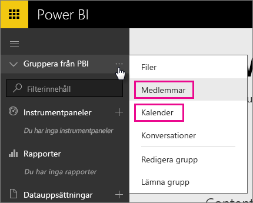
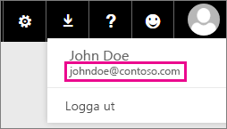

# Office 365-dedikerade kunder – kända problem
Power BI har nu stöd för Office 365-dedikerade kunder.  Om du är en O365-dedikerad kund kan du logga in med ett konto från den klienten och använda Power BI. Det finns för närvarande två kända problem.

## Grupper
När du väljer **Medlemmar** eller **Kalender** i snabbmenyn Grupp omdirigeras du till e-postappen i stället.  **Filer** och **Konversationer** fungerar som förväntat.

## iPhone-app – Inloggning med en anpassad domän leder till fel
När du loggar in på iPhone-appen med en anpassad domän kan det uppstå ett fel.

*Inloggningsfel*  
*Ett oväntat internt fel har uppstått. Försök igen.*

Undvik problemet genom att logga in med e-postadressen som visas när du klickar på användarikonen i Power BI-tjänsten, i stället för med den anpassade domänen.

Har du fler frågor? [Prova Power BI Community](https://community.powerbi.com/)

