# Administrera Power BI i Admin-portalen

Med Admin-portalen kan du använda en Power BI-*klient* för din organisation. Portalen innehåller sådant som användningsstatistik för åtkomst till Office 365-administrationscenter och inställningar.

Hela administrationsportalen är tillgänglig för alla användare som är globala administratörer i Office 365 eller som har tilldelats rollen administratör i Power BI-tjänsten. Om du inte är någon av dessa roller kan du bara se **kapacitetsinställningarna** i portalen. Läs mer om administratörsrollen för Power BI-tjänsten i [Förstå administratörsrollen för Power BI](service-admin-role.md).

## Navigera till administrationsportalen

Ditt konto måste vara markerat som **Global administratör** i Office 365 eller Azure Active Directory, eller ha tilldelats administratörsrollen för Power BI-tjänsten, för att ha åtkomst till Power BI-administratörsportalen. Läs mer om administratörsrollen för Power BI-tjänsten i [Förstå administratörsrollen för Power BI](service-admin-role.md). Gör följande för att gå till Power BI-administratörsportalen.

1. Välj kugghjulet längst upp till höger i Power BI-tjänsten.

1. Välj **Administratörsportalen**.

    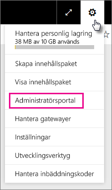

Det finns sju flikar i portalen. Resten av den här artikeln innehåller information om var och en av dessa flikar.

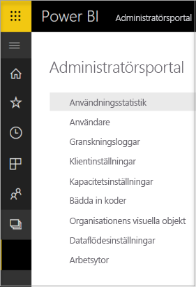

* [Användningsstatistik](#usage-metrics)
* [Användare](#users)
* [Granskningsloggar](#audit-logs)
* [Klientinställningar](#tenant-settings)
* [Premiuminställningar](#premium-settings)
* [Bädda in koder](#embed-codes)
* [Visuella organisationsobjekt](#organization-visuals)

## Användningsstatistik

Med **användningsstatistik** kan du övervaka Power BI-användningen för din organisation. Det ger också möjlighet att se vilka användare och grupper som är mest aktiva i Power BI för din organisation.

> [!NOTE]
> Första gången du använder instrumentpanelen eller när du kommer tillbaka efter en lång tid utan att visa instrumentpanelen visas antagligen en skärm för inläsning medan vi läser in instrumentpanelen.

När instrumentpanelerna har lästs in kan du se två områden med fönster. Det första området innehåller användningsdata för enskilda användare och det andra avsnittet har liknande information för grupper i din organisation.

Här är en uppdelning av vad du kan se i varje panel:

* Räknar separat instrumentpaneler, rapporter och datauppsättningar på användararbetsytan
  
    

* Med använd instrumentpanel enligt antal användare med åtkomst till den. Till exempel, om du har en instrumentpanel som du har delat med 3 användare och du även har lagt till den i ett innehållspaket som två olika användare som är anslutna till, skulle antalet vara 6 (1 + 3 + 2)
  
    

* Det mest populära innehåll som användare är anslutna till. Det är något användarna kan nå genom processen Hämta data, det vill säga innehållspaket från SaaS, organisationsinnehållspaket, filer eller databaser.
  
    

* En vy över toppanvändarna baserat på hur många instrumentpaneler de har, såväl instrumentpaneler de skapat själva som instrumentpaneler som någon har delat med dem.
  
    

* En vy över toppanvändarna baserat på hur många rapporter de har
  
    

Det andra avsnittet visar samma typ av information, men baserat på grupper. Här kan du se vilka grupper i din organisation som är mest aktiva och vilken sorts innehåll de använder.

Med den här informationen kommer du att kunna hämta verkliga insikter om hur personer använder Power BI inom organisationen och identifiera de användare och grupper som är mest aktiva i din organisation.

## Användare

Du kan hantera Power BI-användare, grupper och administratörer i Office 365 Administrationscenter. Fliken **Användare** innehåller en länk till administrationscentret för din klient.

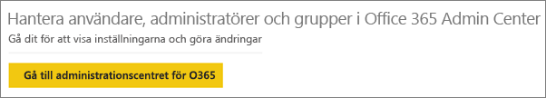

## Granskningsloggar

Du kan hantera Power BI-granskningsloggar i Säkerhets- och efterlevnadscenter för Office 365. Fliken **Granskningsloggar** innehåller en länk till din klients Säkerhets- och efterlevnadscenter. [Läs mer](service-admin-auditing.md)

Om du vill använda granskningsloggar, se till att inställningen [**Skapa granskningsloggar för intern aktivitetsgranskning och efterlevnad**](#create-audit-logs-for-internal-activity-auditing-and-compliance) är aktiverad.

## Klientinställningar

Fliken **Klientinställningar** möjliggör kontroll i minsta detalj över de funktioner som är tillgängliga för din organisation. Om du har frågor kring känsliga data, vissa av våra funktioner inte är lämpliga för din organisation eller om du bara vill att en viss funktion ska vara tillgänglig för en särskild grupp.

Följande bild visar de första två avsnitten på fliken **Klientinställningar**.

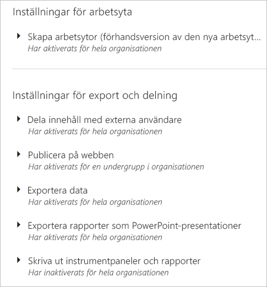

> [!NOTE]
> Det kan ta upp till 10 minuter för att inställningen ska gälla för alla i din klient.

Inställningarna kan ha tre tillstånd:

* **Har inaktiverats för hela organisationen**: Ingen i din organisation kan använda den här funktionen.

    

* **Har aktiverats för hela organisationen**: Alla i din organisation kan använda den här funktionen.

    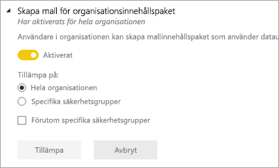

* **Har aktiverats för en undergrupp i organisationen**: En specifik delmängd av användare eller grupper i din organisation kan använda den här funktionen.

    Du kan aktivera funktionen för hela din organisation, utom för en specifik användargrupp.

    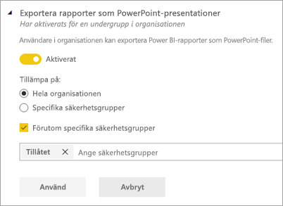

    Du kan också endast aktivera funktionen för en viss grupp av användare och även inaktivera den för en grupp av användare. Med denna metod har vissa användare inte åtkomst till funktionen även om de finns i en tillåten grupp.

    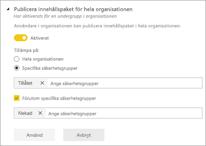

Följande avsnitt ger en översikt över de olika typerna av inställningar för klientorganisation.

## Arbetsyteinställningar

### Skapa arbetsytor (förhandsversion)

Användare i organisationen kan skapa apparbetsytor för att samarbeta på instrumentpaneler, rapporter och annat innehåll. [Läs mer](service-create-the-new-workspaces.md)

## Inställningar för export och delning

### Dela innehåll för externa användare

Användare i organisationen kan dela instrumentpaneler med användare utanför organisationen. [Läs mer](service-share-dashboards.md#share-a-dashboard-or-report-with-people-outside-your-organization)

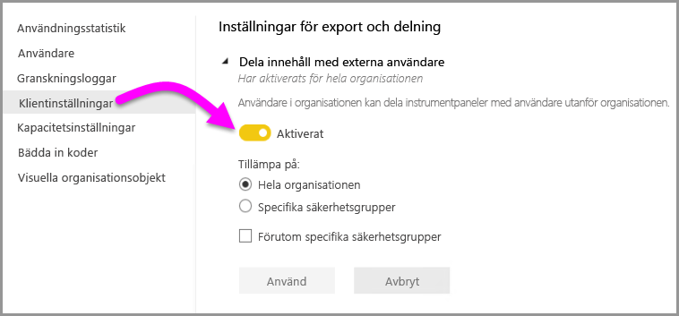

Följande bild visar meddelandet som visas när du delar med en extern användare.

### Publicera på webben

Användare i organisationen kan publicera rapporter på webben. [Läs mer](service-publish-to-web.md)

Följande bild visar menyn **Arkiv** för en rapport när inställningen **Publicera på webben** är aktiverad.

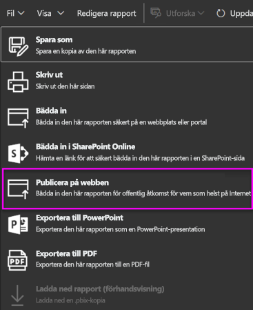

Användarna ser olika alternativ i användargränssnittet baserat på vad inställningen för **Publicering på webben** är.

|Visning av aktuellt objekt |Aktiverad för hela organisationen |Inaktiverad för hela organisationen |Specifika säkerhetsgrupper   |
|---------|---------|---------|---------|
|**Publicera på webben** under rapportens **Fil**meny.|Aktiverad för alla|Inte synlig för alla|Endast synlig för behöriga användare eller grupper.|
|**Hantera inbäddade koder** under **Inställningar**|Aktiverad för alla|Aktiverad för alla|Aktiverad för alla  Alternativet * **Ta bort** endast för behöriga användare eller grupper. * **Hämta koder** aktiverat för alla.|
|**Inbäddade koder** i administrationsportalen|Statusen visar något av följande: * Aktiv * Stöds ej * Blockerad|Statusen visar **Inaktiverad**|Statusen visar något av följande: * Aktiv * Stöds ej * Blockerad  Om en användare inte har behörighet baserat på klientinställningen visas statusen **Intrång**.|
|Befintliga publicerade rapporter|Alla aktiverade|Alla inaktiverade|Rapporter fortsätta att visas för alla.|

### Exportera data

Användare i organisationen kan exportera data från ett fönster eller en visualisering. [Läs mer](visuals/power-bi-visualization-export-data.md)

Följande bild visar alternativet för att exportera data från en panel.

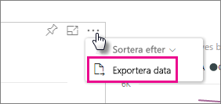

> [!NOTE]
> När du inaktiverar **Exportera data** kan användare inte heller använda funktionen **Analysera i Excel** eller live-anslutning till Power BI-tjänsten.

### Exportera rapporter som PowerPoint-presentationer

Användare i organisationen kan exportera Power BI-rapporter som PowerPoint-filer. [Läs mer](consumer/end-user-powerpoint.md)

Följande bild visar menyn **Arkiv** för en rapport när inställningen **Exportera rapporter som PowerPoint-presentationer** är aktiverad.

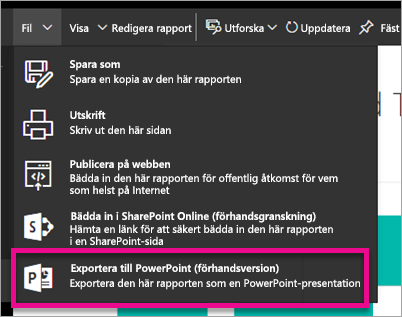

### Skriva ut instrumentpaneler och rapporter

Användare i organisationen kan skriva ut instrumentpaneler och rapporter. [Läs mer](consumer/end-user-print.md)

Följande bild visar alternativet för att skriva ut en instrumentpanel.

Följande bild visar menyn **Arkiv** för en rapport när inställningen **Skriv ut instrumentpaneler och rapporter** är aktiverad.

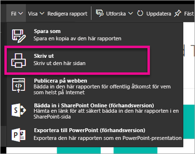

## Inställningar för innehållspaket och appar

### Publicera innehållspaket och appar för hela organisationen

Användare i organisationen kan publicera innehållspaket och appar för hela organisationen snarare än specifika grupper. [Läs mer](service-organizational-content-pack-manage-update-delete.md)

Följande bild visar alternativet **Hela min organisation** när du skapar ett innehållspaket.

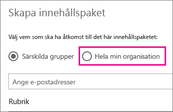

### Skapa mallorganiserade innehållspaket och appar

Användare i organisationen kan skapa mallinnehållspaket som använder datauppsättningar i Power BI Desktop. [Läs mer](template-content-pack-authoring.md)

### Pusha appar till slutanvändare

Användarna kan dela appar direkt med slutanvändarna utan att det krävs någon installation från AppSource. [Läs mer](service-create-distribute-apps.md)

## Inställningar för integrering

### Ställ frågor om data med hjälp av Cortana

Användare i organisationen kan ställa frågor om sina data med hjälp av Cortana. [Läs mer](service-cortana-enable.md)

> [!NOTE]
> Den här inställningen gäller för hela organisationen och kan inte begränsas till specifika grupper.

### Analysera i Excel med lokala datauppsättningar

Användare i organisationen kan använda Excel för att visa och interagera med lokala Power BI-datauppsättningar. [Läs mer](service-analyze-in-excel.md)

> [!NOTE]
> När du inaktiverar **Exportera data** kan användare inte heller använda funktionen **Analysera i Excel**.

### Använda ArcGIS Maps for Power BI

Användare i organisationen kan använda ArcGIS Maps for Power BI-visualiseringen som tillhandahålls av Esri. [Läs mer](power-bi-visualization-arcgis.md)

### Använda global sökning för Power BI (förhandsversion)

Användare i organisationen kan använda externa sökfunktioner som förlitar sig på Azure Search. Användare kan till exempel använda Cortana för att hämta viktig information direkt från Power BI-instrumentpaneler och Power BI-rapporter. [Läs mer](service-cortana-intro.md)

## Inställningar för anpassade visuella objekt

### Aktivera anpassad visuell information för hela organisationen

Användare i organisationen kan interagera med och dela anpassad visuell information. [Läs mer](power-bi-custom-visuals.md)

> [!NOTE]
> Den här inställningen gäller för hela organisationen och kan inte begränsas till specifika grupper.

## Inställningar för R-visualisering

### Interagera med och dela visuell R-information

Användare i organisationen kan interagera med och dela visuella objekt som skapats med R-skript. [Läs mer](visuals/service-r-visuals.md)

> [!NOTE]
> Den här inställningen gäller för hela organisationen och kan inte begränsas till specifika grupper.

## Gransknings- och användningsinställningar

### Skapa granskningsloggar för intern aktivitetsgranskning och efterlevnad

Användare i organisationen kan använda granskning för att övervaka åtgärder som vidtas i Power BI av andra användare i organisationen. [Läs mer](service-admin-auditing.md)

Den här inställningen måste vara aktiverad för att registrera granskningsloggposter. Det kan förekomma en fördröjning på upp till 48 timmar mellan det att granskning aktiveras och att granskningsdata kan visas. Om du inte ser data omedelbart kontrollerar du granskningsloggarna senare. Det kan förekomma en liknande fördröjning mellan hämtning av behörighet för att visa granskningsloggar och att komma åt loggarna.

> [!NOTE]
> Den här inställningen gäller för hela organisationen och kan inte begränsas till specifika grupper.

### Användningsstatistik för skapare av innehåll

Användarna i organisationen kan se användningsstatistik för de instrumentpaneler och rapporter som de har skapat. [Läs mer](service-usage-metrics.md)

### Data per användare i användningsmått för innehållsskapare

Om du använder mått för skapare av innehåll visas visningsnamn och e-postadresser för de användare som har åtkomst till innehållet. [Läs mer](service-usage-metrics.md)

Data per användare är aktiverat för användningsstatistik som standard, och kontoinformation om innehållsskapare ingår i statistikrapporten. Om du inte vill inkludera den här informationen för vissa eller alla användare kan du inaktivera funktionen för specifika säkerhetsgrupper eller hela organisationen. Kontoinformation visas då i rapporten som *Namnlös*.

## Inställningar för instrumentpanelen

### Klassificering av instrumentpanelsdata

Användare i organisationen kan tagga instrumentpaneler med klassificeringar som anger instrumentpanelens säkerhetsnivåer. [Läs mer](service-data-classification.md)

> [!NOTE]
> Den här inställningen gäller för hela organisationen och kan inte begränsas till specifika grupper.

## Inställningar för utvecklare

### Bädda in innehåll i appar

Användare i organisationen kan bädda in Power BI-instrumentpaneler och rapporter i SaaS-program (programvara som en tjänst). När du inaktiverar den här inställningen kan användare inte använda REST-API: er för att bädda in Power BI-innehåll i sina program. [Läs mer](developer/embedding.md)

## Arbetsytor och importinställningar

### Författa innehåll på arbetsytor

Användare i organisationen har åtkomst till arbetsytor där de kan ansluta till data och författa innehåll. [Läs mer](service-create-the-new-workspaces.md)

### Importera data till Power BI

Användare i organisationen kan importera data till tjänsten, t.ex. genom att publicera rapporter från Power BI Desktop, överföra Power BI-rapportfiler och ansluta till data direkt från tjänsten. [Läs mer](desktop-upload-desktop-files.md)

## Dataflödesinställningar (förhandsversion)

### Skapa och använda dataflöden (förhandsversion)

Användare i organisationen kan skapa och använda dataflöden. I [Dataförberedelser med självbetjäning i Power BI (förhandsversion)](service-dataflows-overview.md) finns en översikt över dataflöden. Information om hur du aktiverar dataflöden i en Premium-kapacitet finns i [Konfigurera arbetsbelastningar](service-admin-premium-manage.md#configure-workloads).

> [!NOTE]
> Den här inställningen gäller för hela organisationen och kan inte begränsas till specifika grupper.

## Kapacitetsinställningar

### Power BI Premium

På fliken **Power BI Premium** kan du hantera alla premiumfunktioner för Power BI (Em eller P SKU) som har köpts för din organisation. Alla användare inom din organisation ser fliken **Power BI Premium** men kan endast se innehåll om de har angetts som antingen *kapacitetadministratör* eller en användare som har tilldelningsbehörighet. Om en användare inte har några behörigheter visas följande meddelande.

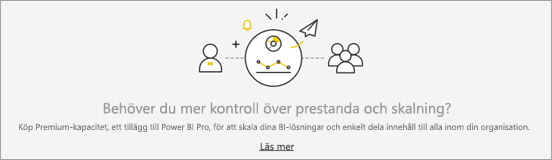

Mer information om hur du hanterar premiuminställningar finns [Hantera Power BI Premium](service-admin-premium-manage.md).

### Power BI Embedded

På fliken för **Power BI Embedded** kan du visa de Power BI Embedded-kapaciteter (A SKU) som du har köpt för din kund. Eftersom du kan bara köpa A SKU:er från Azure kan du [hantera inbäddade kapaciteter i Azure](developer/azure-pbie-create-capacity.md) från **Azure Portal**.

Mer information om hur du hanterar inställningar för Power BI Embedded (A SKU) finns i [Vad är Power BI Embedded](developer/azure-pbie-what-is-power-bi-embedded.md).

## Bädda in koder

Som administratör kan du visa de inbäddningskoder som har genererats för din klient. Du kan även återkalla eller ta bort koder. [Läs mer](service-publish-to-web.md)

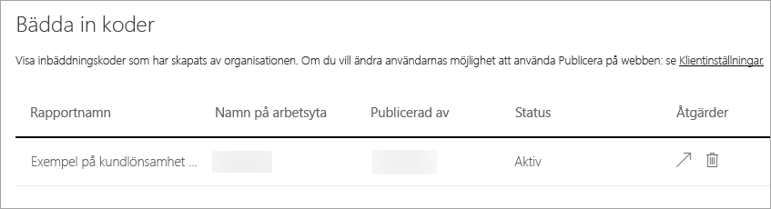

## Organisationens visuella objekt

Med fliken **organisationsobjekt** kan du distribuera och hantera anpassade visuella objekt i din organisation. Med visuella objekt kan du enkelt distribuera egna visuella objekt i din organisation som rapportförfattarna kan sedan identifiera och importera till sina rapporter från Power BI Desktop. [Läs mer](power-bi-custom-visuals-organization.md)

> [!WARNING]
> Ett anpassat visuellt objekt kan innehålla kod som innebär säkerhets- eller integritetsrisker. Kontrollera att författaren och det visuella objektets källa är betrodda innan du distribuerar till organisationens databas.

Följande bild visar alla de anpassade visuella objekt som för närvarande har distribuerats i organisationens databas.

### Lägga till ett nytt anpassat visuellt objekt

Följ dessa steg om du vill lägga till ett nytt anpassat visuellt objekt i listan. 

1. I den högra rutan väljer du **Lägg till ett anpassat visuellt objekt**.

    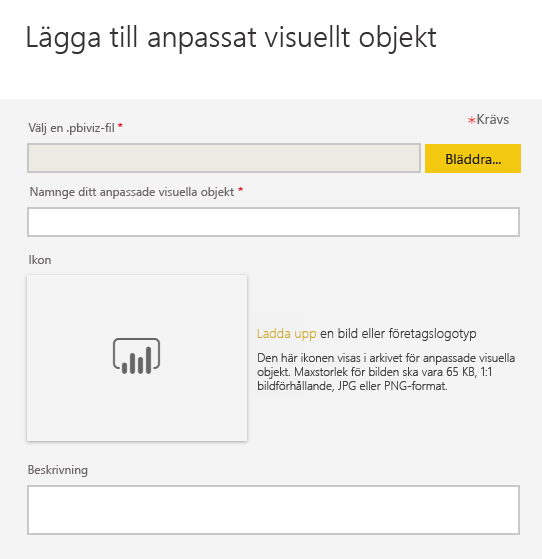

1. Fyll i formuläret **Lägg till anpassade visuella objekt**:

    * **Välj en .pbiviz-fil** (obligatoriskt): välj en fil för ett anpassat visuellt objekt att överföra. Endast versionshanterade visuella API-objekt stöds, och här kan du läsa vad det innebär.

    Innan du överför ett anpassat visuellt objekt bör du granska objektet ur säkerhets- och sekretessynvinkel för att säkerställa att det uppfyller din organisations standarder.

    * **Namnge ditt anpassade visuella objekt** (obligatoriskt): ge det visuella objektet en kort rubrik så att Power BI Desktop-användare lätt kan förstå hur det fungerar

    * **Ikon**: Den ikonfil som visas i användargränssnittet för Power BI Desktop.

    * **Beskrivning**: en kort beskrivning av det visuella objektet som ger användaren mer kontext och kunskap

1. Initiera överföringsförfrågan genom att välja **Lägg till**. Om detta lyckas visas det nya objektet i listan. Om det inte lyckas får du ett felmeddelande

### Ta bort ett anpassat visuellt objekt från listan

Välj papperskorgen om du vill ta bort det visuella objektet permanent från databasen.

> [!IMPORTANT]
> Du kan inte ångra borttagningen. När det visuella objektet väl har tagits bort upphör det omedelbart att återges i befintliga rapporter. Även om du överför samma visuella objekt igen kommer den inte att ersätta det föregående objektet som har tagits bort. Användare kan dock importera det nya visuella objektet igen och ersätta den version som de har i sina rapporter.

### Inaktivera ett anpassat visuellt objekt i listan

Välj kugghjulsikonen om du vill inaktivera det visuella objektet från organisationens lager. Inaktivera det anpassade visuella objektet i avsnittet **Åtkomst**.

När du har inaktiverat det visuella objektet återges inte det visuella objektet i befintliga rapporter utan visar felmeddelandet nedan.

*Detta anpassade visuella objekt är inte längre tillgängligt. Kontakta din administratör om du vill ha mer information.*

Visuella objekt som har bokmärken fungerar dock fortfarande.

Efter uppdatering eller byte av administratör bör Power BI Desktop-användare starta om programmet eller uppdatera webbläsaren i Power BI-tjänsten för att se uppdateringarna.

### Uppdatera ett visuellt objekt

Välj kugghjulsikonen om du vill uppdatera det visuella objektet från organisationens lager. Bläddra och ladda upp en ny version av det visuella objektet.

Kontrollera att visualiserings-ID förblir oförändrat. Den nya filen ersätter den tidigare filen för alla rapporter i hela organisationen. Men om den nya versionen av visualiseringen kan skada någon användnings- eller datastruktur av den tidigare versionen av visualiseringen ska du inte ersätta den tidigare versionen. I stället bör du skapa en ny lista för den nya versionen av visualiseringen. Lägg till exempel till ett nytt versionsnummer (version X.X) till rubriken för den nya listade visualiseringen. På det här sättet är det klart att det är samma visualisering men bara med ett uppdaterat versionsnummer så att befintliga rapporter inte skadar deras funktioner. Kontrollera igen att visualiserings-ID förblir oförändrat. Nästa gång användarna använder organisationens databas från Power BI Desktop kan de importera den nya versionen, vilket tvingar dem att ersätta den aktuella version som de har i sina rapporter.

## Nästa steg

[Administrera Power BI i din organisation](service-admin-administering-power-bi-in-your-organization.md)  [Förstå administratörsrollen för Power BI](service-admin-role.md)  
[Granska Power BI i din organisation](service-admin-auditing.md)  
[Hantera Power BI Premium](service-admin-premium-manage.md)  

Har du fler frågor? [Fråga Power BI Community](http://community.powerbi.com/)
