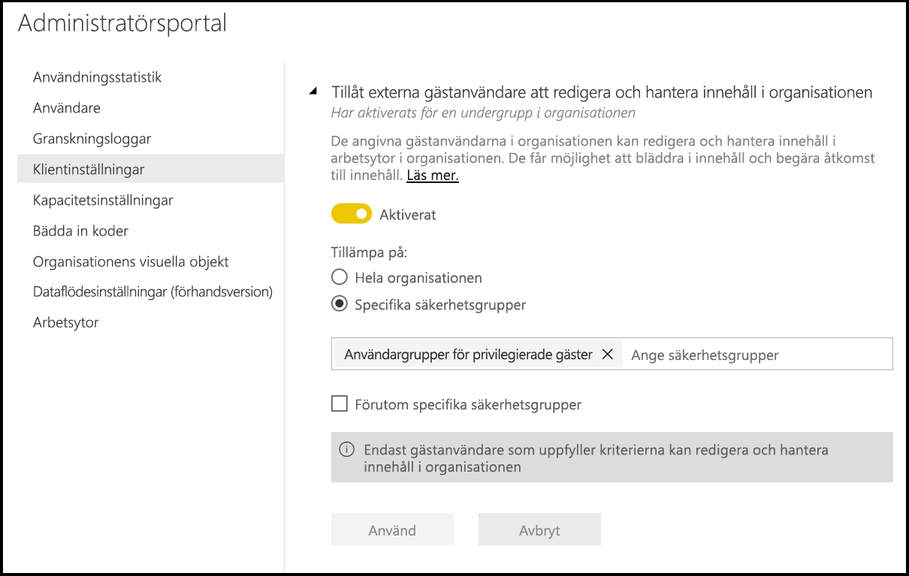
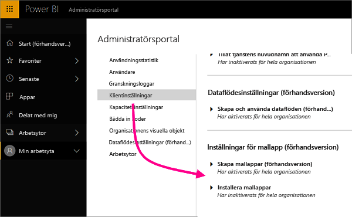
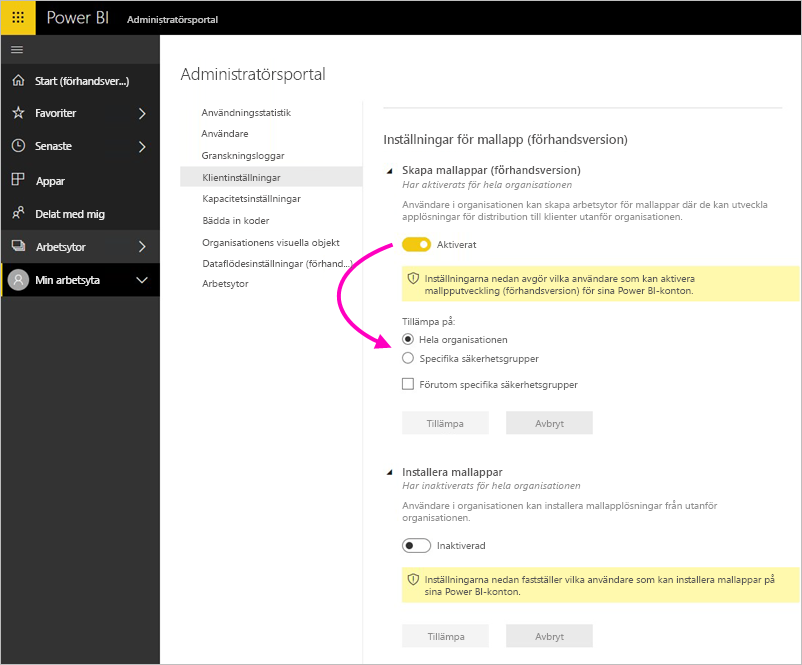

# Administrera Power BI i Admin-portalen

Med Admin-portalen kan du använda en Power BI-*klient* för din organisation. Portalen innehåller sådant som användningsstatistik för åtkomst till Microsoft 365-administrationscenter och inställningar.

Hela administrationsportalen är tillgänglig för alla användare som är globala administratörer i Office 365 eller som har tilldelats rollen administratör i Power BI-tjänsten. Om du inte är någon av dessa roller kan du bara se **kapacitetsinställningarna** i portalen. Läs mer om administratörsrollen för Power BI-tjänsten i [Förstå administratörsrollen för Power BI](service-admin-role.md).

## Navigera till administrationsportalen

Ditt konto måste vara markerat som **Global administratör** i Office 365 eller Azure Active Directory (Azure AD), eller ha tilldelats administratörsrollen för Power BI-tjänsten, för att ha åtkomst till Power BI-administratörsportalen. Läs mer om administratörsrollen för Power BI-tjänsten i [Förstå administratörsrollen för Power BI](service-admin-role.md). Gör följande för att gå till Power BI-administratörsportalen.

1. Välj kugghjulet längst upp till höger i Power BI-tjänsten.

1. Välj **Administratörsportalen**.

    

Det finns nio flikar i portalen. Resten av den här artikeln innehåller information om var och en av dessa flikar.

* [Användningsstatistik](#usage-metrics)
* [Användare](#users)
* [Granskningsloggar](#audit-logs)
* [Klientinställningar](#tenant-settings)
* [Kapacitetsinställningar](#capacity-settings)
* [Bädda in koder](#embed-codes)
* [Visuella organisationsobjekt](#organizational-visuals)
* [Dataflödeslagring (förhandsversion)](#dataflowStorage)
* [Arbetsytor](#workspaces)
* [Anpassad varumärkesanpassning](#custom-branding)

## Användningsstatistik

Med **användningsstatistik** kan du övervaka Power BI-användningen för din organisation. Det ger också möjlighet att se vilka användare och grupper som är mest aktiva i Power BI för din organisation. 

> [!NOTE]
> Första gången du använder instrumentpanelen eller när du kommer tillbaka efter en lång tid utan att visa instrumentpanelen visas antagligen en skärm för inläsning medan vi läser in instrumentpanelen.

När instrumentpanelerna har lästs in kan du se två områden med fönster. Det första området innehåller användningsdata för enskilda användare och det andra avsnittet har liknande information för grupper i din organisation.

Här är en uppdelning av vad du kan se i varje panel:

* Tydlig räkning av alla instrumentpaneler, rapporter och datamängder på användararbetsytan.
  
    

* Med använd instrumentpanel enligt antal användare med åtkomst till den. Om du t.ex. har en instrumentpanel som du har delat med tre användare och du även har lagt till den i ett innehållspaket som två olika användare är anslutna till, skulle antalet vara 6 (1 + 3 + 2).
  
    

* Det mest populära innehåll som användare är anslutna till. Det är något användarna kan nå genom processen Hämta data, det vill säga innehållspaket från SaaS, organisationsinnehållspaket, filer eller databaser.
  
    

* En vy över toppanvändarna baserat på hur många instrumentpaneler de har, såväl instrumentpaneler de skapat själva som instrumentpaneler som någon har delat med dem.
  
    

* En vy över toppanvändarna baserat på hur många rapporter de har.
  
    

Det andra avsnittet visar samma typ av information, men baserat på grupper. Här kan du se vilka grupper i din organisation som är mest aktiva och vilken sorts innehåll de använder.

Med den här informationen kommer du att kunna hämta verkliga insikter om hur personer använder Power BI inom organisationen och identifiera de användare och grupper som är mest aktiva i din organisation.

## Kontrollera användningsstatistik

Användningsstatistikrapporter är en funktion som Power BI- eller Office 365-administratören kan aktivera eller inaktivera. Administratörerna har detaljerad kontroll över vilka användare som har åtkomst till användningsstatistik. De är **På** som standard för alla användare i organisationen.

Administratörer kan också bestämma om skapare av innehåll kan se data per användare i användningsmått. 

Se [Övervaka användningsstatistik för Power BI-instrumentpaneler och rapporter](service-usage-metrics.md) för mer information om själva rapporterna.

### Användningsstatistik för innehållsskapare

1. Från Administratörsportalen väljer du **Klientinställningar** > **Användningsstatistik för skapare av innehåll**.

    

1. Aktivera (eller inaktivera) användningsstatistik > **Tillämpa**.

    

### Data per användare i användningsmått

Som standard är data per användare aktiverat för användningsstatistik och kontoinformation om konsumenter av innehåll ingår i statistikrapporten. Om du inte vill inkludera den här informationen för vissa eller alla användare kan du inaktivera funktionen för specifika säkerhetsgrupper eller hela organisationen. Kontoinformation visas sedan i rapporten som *Namnlös*.

### Ta bort allt befintligt innehåll för måttet

När du inaktiverar användningsstatistik för hela organisationen kan administratörer också välja ett eller båda alternativ:

- **Ta bort allt befintligt innehåll för användningsstatistik** för att ta bort alla befintliga rapporter och instrumentpaneler som har skapats med användningsstatistikrapporter och datauppsättningar. Det här alternativet tar bort all åtkomst till användningsstatistiken för alla användare i organisationen som kanske redan använder den. 
- **Ta bort alla befintliga användarspecifika data i den aktuella användningsstatistiken** Det här alternativet tar bort all åtkomst till användningsstatistiken för alla användare i organisationen som kanske redan använder den. 

Var försiktig, eftersom det inte går att ångra när du har tagit bort befintligt användarspecifikt användningsstatistikinnehåll.

## Användare

Du kan hantera Power BI-användare, grupper och administratörer i Microsoft 365 Administrationscenter. Fliken **Användare** innehåller en länk till administrationscentret för din klient.

## Granskningsloggar

Du kan hantera Power BI-granskningsloggar i Säkerhets- och efterlevnadscenter för Office 365. Fliken **Granskningsloggar** innehåller en länk till din klients Säkerhets- och efterlevnadscenter. [Läs mer](service-admin-auditing.md)

Om du vill använda granskningsloggar, se till att inställningen [**Skapa granskningsloggar för intern aktivitetsgranskning och efterlevnad**](#create-audit-logs-for-internal-activity-auditing-and-compliance) är aktiverad.

## Klientinställningar

Fliken **Klientinställningar** möjliggör kontroll i minsta detalj över de funktioner som är tillgängliga för din organisation. Om du har frågor kring känsliga data, vissa av våra funktioner inte är lämpliga för din organisation eller om du bara vill att en viss funktion ska vara tillgänglig för en särskild grupp.

Följande bild visar flera inställningar på fliken **Klientorganisationsinställningar**.

> [!NOTE]
> Det kan ta upp till 10 minuter för att inställningen ska gälla för alla i din klient.

Inställningarna kan ha tre tillstånd:

* **Har inaktiverats för hela organisationen**: Ingen i din organisation kan använda den här funktionen.

    

* **Har aktiverats för hela organisationen**: Alla i din organisation kan använda den här funktionen.

    

* **Har aktiverats för en undergrupp i organisationen**: En specifik delmängd av användare eller grupper i din organisation kan använda den här funktionen.

    Du kan aktivera funktionen för hela din organisation, utom för en specifik användargrupp.

    

    Du kan också endast aktivera funktionen för en viss grupp av användare och även inaktivera den för en grupp av användare. Med denna metod har vissa användare inte åtkomst till funktionen även om de finns i en tillåten grupp.

    

Följande avsnitt ger en översikt över de olika typerna av inställningar för klientorganisation.

## Inställningar för hjälp och support

### Publicera Få hjälp-information

Användare i organisationen kan gå till intern hjälp och ta del av supportresurser i Power BI:s Hjälp-meny. Mer specifikt ändrar parametrarna beteendet för menyalternativen Läs, Community och Få hjälp.

Genom att ange en URL för licensieringsbegäranden kan du dessutom anpassa mål-URL:en för knappen **Uppgradera konto**. Användare utan Power BI Pro-licens ser den här knappen i dialogrutan **Uppdatera till Power BI Pro** samt på sidan **Hantera personlig lagring**. Dessutom erbjuder Power BI inte längre knappen **Testa Pro kostnadsfritt** i den här dialogrutan eller på lagringssidan. Detta säkerställer att Power BI vägleder dina användare på ett tillförlitligt sätt genom de processer som definierats i din organisation via din licenshanteringslösning.

### Få e-postmeddelanden om tjänstavbrott eller incidenter

E-postaktiverade säkerhetsgrupper får e-postmeddelanden om den här klientorganisationen påverkas av ett avbrott i tjänsten eller en incident. Lär dig mer om [Aviseringar om tjänstavbrott](service-interruption-notifications.md).

## Arbetsyteinställningar

### Skapa arbetsytor

Administratörer använder inställningen **Skapa arbetsytor** till att ange vilka användare i organisationen som får skapa arbetsytor för samarbete på instrumentpaneler, i rapporter och annat innehåll. Läs mer om [arbetsytor](service-create-the-new-workspaces.md).

Administratörsportalen har ett annat avsnitt med inställningar för arbetsytorna i din klient. I det avsnittet kan du sortera och filtrera listan över arbetsytor och visa information för varje arbetsyta. Se [Arbetsytor](#workspaces) för mer information.

I administrationsportalen styr du också vilka användare som har behörighet att distribuera appar i organisationen. Se [Publicera innehållspaket och appar för hela organisationen](#publish-content-packs-and-apps-to-the-entire-organization) i den här artikeln för mer information.

## Inställningar för export och delning

### Dela innehåll med externa användare

Användare i organisationen kan dela instrumentpaneler, rapporter och appar med användare utanför organisationen. Läs mer om att [dela externt](service-share-dashboards.md#share-a-dashboard-or-report-outside-your-organization).

Följande bild visar meddelandet som visas när du delar med en extern användare.

  

> [!IMPORTANT]
> Det här alternativet styr huruvida användare i Power BI kan bjuda in externa användare att bli Azure Active Directory B2B (Azure AD B2B)-gästanvändare i din organisation via Power BI. När funktionen är aktiverad kan användare som har rollen gästanvändare i Azure AD lägga till externa e-postadresser när de delar rapporter, instrumentpaneler och Power BI-appar. Den externa mottagaren uppmanas att ansluta till din organisation som en Azure AD B2B-gästanvändare. Observera att när den här inställningen inaktiveras fortsätter externa användare som redan är Azure AD B2B-gästanvändare i din organisation att visas i användargränssnitt med personväljaren i Power BI och kan ges åtkomst till objekt, arbetsytor och appar.

### Publicera på webben

Användare i organisationen kan publicera rapporter på webben. [Läs mer](service-publish-to-web.md)

Följande bild visar menyn **Arkiv** för en rapport när inställningen **Publicera på webben** är aktiverad.

Användarna ser olika alternativ i användargränssnittet baserat på vad inställningen för **Publicering på webben** är.

|Funktion |Aktiverad för hela organisationen |Inaktiverad för hela organisationen |Specifika säkerhetsgrupper   |
|---------|---------|---------|---------|
|**Publicera på webben** under rapportens **Fil**meny.|Aktiverad för alla|Inte synlig för alla|Endast synlig för behöriga användare eller grupper.|
|**Hantera inbäddade koder** under **Inställningar**|Aktiverad för alla|Aktiverad för alla|Aktiverad för alla  Alternativet * **Ta bort** endast för behöriga användare eller grupper. * **Hämta koder** aktiverat för alla.|
|**Inbäddade koder** i administrationsportalen|Statusen visar något av följande: * Aktiv * Stöds ej * Blockerad|Statusen visar **Inaktiverad**|Statusen visar något av följande: * Aktiv * Stöds ej * Blockerad  Om en användare inte har behörighet baserat på klientinställningen visas statusen **Intrång**.|
|Befintliga publicerade rapporter|Alla aktiverade|Alla inaktiverade|Rapporter fortsätta att visas för alla.|

### Exportera data

Användare i organisationen kan exportera data från ett fönster eller en visualisering. [Läs mer](visuals/power-bi-visualization-export-data.md)

Följande bild visar alternativet för att exportera data från en panel.

> [!NOTE]
> När du inaktiverar **Exportera data** kan användare inte heller använda funktionen **Analysera i Excel** eller live-anslutning till Power BI-tjänsten.

### Exportera rapporter som PowerPoint-presentationer eller PDF-dokument

Användare i organisationen kan exportera Power BI-rapporter som PowerPoint-filer eller PDF-dokument. [Läs mer](consumer/end-user-powerpoint.md)

Följande bild visar menyn **Arkiv** för en rapport när inställningen **Exportera rapporter som PowerPoint-presentationer eller PDF-dokument** är aktiverad.

### Skriva ut instrumentpaneler och rapporter

Användare i organisationen kan skriva ut instrumentpaneler och rapporter. [Läs mer](consumer/end-user-print.md)

Följande bild visar alternativet för att skriva ut en instrumentpanel.

Följande bild visar menyn **Arkiv** för en rapport när inställningen **Skriv ut instrumentpaneler och rapporter** är aktiverad.

### Tillåt externa gästanvändare att redigera och hantera innehåll i organisationen

Azure AD B2B-gästanvändare kan redigera och hantera innehåll i organisationen. [Läs mer](service-admin-azure-ad-b2b.md)

I följande bild visas alternativet Tillåt externa gästanvändare att redigera och hantera innehåll i organisationen.

I administrationsportalen styr du också vilka användare som har behörighet att bjuda in externa användare till organisationen. Mer information finns i [Dela innehåll med externa användare](#export-and-sharing-settings) i den här artikeln.

### E-postprenumerationer
Användare i organisationen kan skapa e-postprenumerationer. Läs mer om [prenumerationer](service-report-subscribe.md).

## Inställningar för innehållspaket och appar

### Publicera innehållspaket och appar för hela organisationen

Administratörer använder den här inställningen för att bestämma vilka användare som får publicera innehållspaket och appar för hela organisationen snarare än specifika grupper. Läs mer om att [publicera appar](service-create-distribute-apps.md).

Följande bild visar alternativet **Hela min organisation** när du skapar ett innehållspaket.

### Skapa mallappar och organisationsinnehållspaket

Användare i organisationen kan skapa mallappar och organisationsinnehållspaket som använder datamängder som bygger på en datakälla i Power BI Desktop. Läs mer om [mallappar](template-content-pack-authoring.md).

### Pusha appar till slutanvändare

Rapportskapare kan dela appar direkt med slutanvändare utan att det krävs någon installation från [AppSource](https://appsource.microsoft.com). Läs mer om [installera appar automatiskt för slutanvändare](service-create-distribute-apps.md#automatically-install-apps-for-end-users).

## Inställningar för integrering

### Analysera i Excel med lokala datauppsättningar

Användare i organisationen kan använda Excel för att visa och interagera med lokala Power BI-datauppsättningar. [Läs mer](service-analyze-in-excel.md)

> [!NOTE]
> När du inaktiverar **Exportera data** kan användare inte heller använda funktionen **Analysera i Excel**.

### Använd ArcGIS Maps for Power BI

Användare i organisationen kan använda ArcGIS Maps for Power BI-visualiseringen som tillhandahålls av Esri. [Läs mer](visuals/power-bi-visualization-arcgis.md)

### Använda global sökning för Power BI (förhandsversion)

Användare i organisationen kan använda externa sökfunktioner som förlitar sig på Azure Search.

## Inställningar för anpassade visuella objekt

### Lägg till och använda anpassade visuella objekt

Användare i organisationen kan interagera med och dela anpassad visuell information. [Läs mer](developer/power-bi-custom-visuals.md)

> [!NOTE]
> Den här inställningen kan tillämpas för hela organisationen eller begränsas till specifika grupper.

Power BI Desktop (med start från lanseringen i mars 2019) stöder användning av **Grupprincip** för att inaktivera användningen av anpassade visuella objekt i en organisations distribuerade datorer.

<table>
<tr><th>Attribut</th><th>Värde</th>
</tr>
<td>nyckel</td>
    <td>Programvara\Principer\Microsoft\Power BI Desktop\</td>
<tr>
<td>valueName</td>
<td>EnableCustomVisuals</td>
</tr>
</table>

Med värdet 1 (decimal) kan du använda anpassade visuella objekt i Power BI (detta är standardinställningen).

Med värdet 0 (decimal) kan du inaktivera användningen av anpassade visuella objekt i Power BI.

### Tillåt endast certifierade visuella objekt

Användare i organisationen som har behörighet att lägga till och använda anpassade visuella objekt, enligt inställningen ”Lägg till och använd anpassade visuella objekt”, kan endast använda [certifierade anpassade visuella objekt](https://go.microsoft.com/fwlink/?linkid=2002010) (ocertifierade visuella objekt blockeras och ett felmeddelande visas när det används). 

Power BI Desktop (med start från lanseringen i mars 2019) stöder användning av **Grupprincip** för att inaktivera användningen av ocertifierade anpassade visuella objekt i en organisations distribuerade datorer.

<table>
<tr><th>Attribut</th><th>Värde</th>
</tr>
<td>nyckel</td>
    <td>Programvara\Principer\Microsoft\Power BI Desktop\</td>
<tr>
<td>valueName</td>
<td>EnableUncertifiedVisuals</td>
</tr>
</table>

Med värdet 1 (decimal) kan du använda ocertifierade anpassade visuella objekt i Power BI (detta är standardinställningen).

Värdet 0 (decimal) inaktiverar användningen av ocertifierade anpassade visuella objekt i Power BI (det här alternativet kan bara använda [certifierade anpassade visuella objekt](https://go.microsoft.com/fwlink/?linkid=2002010)).

## Inställningar för R-visualisering

### Interagera med och dela visuell R-information

Användare i organisationen kan interagera med och dela visuella objekt som skapats med R-skript. [Läs mer](visuals/service-r-visuals.md)

> [!NOTE]
> Den här inställningen gäller för hela organisationen och kan inte begränsas till specifika grupper.

## Gransknings- och användningsinställningar

### Skapa granskningsloggar för intern aktivitetsgranskning och efterlevnad

Användare i organisationen kan använda granskning för att övervaka åtgärder som vidtas i Power BI av andra användare i organisationen. [Läs mer](service-admin-auditing.md)

Den här inställningen måste vara aktiverad för att registrera granskningsloggposter. Det kan förekomma en fördröjning på upp till 48 timmar mellan det att granskning aktiveras och att granskningsdata kan visas. Om du inte ser data omedelbart kontrollerar du granskningsloggarna senare. Det kan förekomma en liknande fördröjning mellan hämtning av behörighet för att visa granskningsloggar och att komma åt loggarna.

> [!NOTE]
> Den här inställningen gäller för hela organisationen och kan inte begränsas till specifika grupper.

### Användningsstatistik för innehållsskapare

Användarna i organisationen kan se användningsstatistik för de instrumentpaneler och rapporter som de har skapat. [Läs mer](service-usage-metrics.md)

### Data per användare i användningsmått för innehållsskapare

Om du använder mått för innehållsskapare visas visningsnamn och e-postadresser för de användare som har åtkomst till innehållet. [Läs mer](service-usage-metrics.md)

Data per användare är aktiverat för användningsstatistik som standard, och kontoinformation om innehållsskapare ingår i statistikrapporten. Om du inte vill samla in den här informationen för alla användare kan du inaktivera funktionen för specifika säkerhetsgrupper eller hela organisationen. Kontoinformationen för de exkluderade användarna visas då i rapporten som *Namnlös*.

## Inställningar för instrumentpanelen

### Klassificering av instrumentpanelsdata

Användare i organisationen kan tagga instrumentpaneler med klassificeringar som anger instrumentpanelens säkerhetsnivåer. [Läs mer](service-data-classification.md)

> [!NOTE]
> Den här inställningen gäller för hela organisationen och kan inte begränsas till specifika grupper.

## Inställningar för utvecklare

### Bädda in innehåll i appar

Användare i organisationen kan bädda in Power BI-instrumentpaneler och rapporter i SaaS-program (programvara som en tjänst). När du inaktiverar den här inställningen kan användare inte använda REST-API: er för att bädda in Power BI-innehåll i sina program. [Läs mer](developer/embedding.md)

### Tillåt att tjänsters huvudnamn att använda Power BI API:er

Webbappar som är registrerade i Azure Active Directory (Azure AD) använder en ett huvudnamn för tjänsten som tilldelas i syfte att få åtkomst till Power BI:s API:er utan en inloggad användare. För att tillåta en app att använda autentisering med tjänstens huvudnamn, måste tjänstens huvudnamn ingå i en godkänd säkerhetsgrupp. [Läs mer](developer/embed-service-principal.md)

> [!NOTE]
> Tjänsthuvudnamn ärver behörigheterna för alla Power BI-klientinställningar för deras säkerhetsgrupp. Begränsa behörigheter genom att skapa en dedikerad säkerhetsgrupp för tjänstens huvudkonton och lägg till i listan Förutom vissa säkerhetsgrupper för de relevanta, aktiverade Power BI-inställningarna.

## Dataflödesinställningar

### Skapa och använda dataflöden

Användare i organisationen kan skapa och använda dataflöden. I [Dataförberedelser med självbetjäning i Power BI](service-dataflows-overview.md) finns en översikt över dataflöden. Information om hur du aktiverar dataflöden i en Premium-kapacitet finns i [Konfigurera arbetsbelastningar](service-admin-premium-workloads.md).

> [!NOTE]
> Den här inställningen gäller för hela organisationen och kan inte begränsas till specifika grupper.

## Inställningar för mallappar

Tre inställningar styr mallapparnas förmåga att publicera eller installera mallappar.

### Publicera mallappar

Användare i organisationen kan skapa arbetsytor för mallappar. Kontrollera vilka användare som kan publicera mallappar eller distribuera dem till klienter utanför organisationen via [AppSource](https://appsource.microsoft.com) eller något annat distributionssätt.

### Installera mallappar som finns i AppSource

Användare i organisationen kan **bara** ladda ned och installera mallappar från [AppSource](https://appsource.microsoft.com). Kontrollera vilka specifika användare eller säkerhetsgrupper som kan installera mallappar från AppSource.

### Installera mallappar som inte finns i AppSource

Kontrollera vilka användare i organisationen som kan ladda ned och installera mallappar **som inte finns i [AppSource](https://appsource.microsoft.com)** .

## Kapacitetsinställningar

### Power BI Premium

På fliken **Power BI Premium** kan du hantera alla premiumfunktioner för Power BI (Em eller P SKU) som har köpts för din organisation. Alla användare inom din organisation ser fliken **Power BI Premium** men kan endast se innehåll om de har angetts som antingen *kapacitetadministratör* eller en användare som har tilldelningsbehörighet. Om en användare inte har några behörigheter visas följande meddelande.

### Power BI Embedded

På fliken för **Power BI Embedded** kan du visa de Power BI Embedded-kapaciteter (A SKU) som du har köpt för din kund. Eftersom du bara kan köpa SKU:er från Azure, [hanterar du inbäddade kapaciteter i Azure](developer/azure-pbie-create-capacity.md) från **Azure-portalen**.

Mer information om hur du hanterar inställningar för Power BI Embedded (A SKU) finns i [Vad är Power BI Embedded](developer/azure-pbie-what-is-power-bi-embedded.md).

## Bädda in koder

Som administratör kan du visa de inbäddningskoder som har genererats för din klient. Du kan även återkalla eller ta bort koder. [Läs mer](service-publish-to-web.md)

 ## <a name="organizational-visuals">Visuella organisationsobjekt</a> 

Med fliken **organisationsobjekt** kan du distribuera och hantera anpassade visuella objekt i din organisation. Med visuella objekt kan du enkelt distribuera egna visuella objekt i din organisation som rapportförfattarna kan sedan identifiera och importera till sina rapporter från Power BI Desktop. [Läs mer](developer/power-bi-custom-visuals-organization.md)

> [!WARNING]
> Ett anpassat visuellt objekt kan innehålla kod som innebär säkerhets- eller integritetsrisker. Kontrollera att författaren och det visuella objektets källa är betrodda innan du distribuerar till organisationens databas.

Följande bild visar alla de anpassade visuella objekt som för närvarande har distribuerats i organisationens databas.

### Lägga till ett nytt anpassat visuellt objekt

Följ dessa steg om du vill lägga till ett nytt anpassat visuellt objekt i listan. 

1. I den högra rutan väljer du **Lägg till ett anpassat visuellt objekt**.

    

1. Fyll i formuläret **Lägg till anpassade visuella objekt**:

    * **Välj en .pbiviz-fil** (obligatoriskt): välj en fil för ett anpassat visuellt objekt att överföra. Endast versionshanterade visuella API-objekt stöds, och här kan du läsa vad det innebär.

    Innan du överför ett anpassat visuellt objekt bör du granska objektet ur säkerhets- och sekretessynvinkel för att säkerställa att det uppfyller din organisations standarder.

    * **Namnge ditt anpassade visuella objekt** (obligatoriskt): ge det visuella objektet en kort rubrik så att Power BI Desktop-användare lätt kan förstå hur det fungerar

    * **Ikon**: Den ikonfil som visas i användargränssnittet för Power BI Desktop.

    * **Beskrivning**: en kort beskrivning av det visuella objektet som ger användaren mer kontext och kunskap

1. Initiera överföringsförfrågan genom att välja **Lägg till**. Om detta lyckas visas det nya objektet i listan. Om det inte lyckas får du ett felmeddelande

### Ta bort ett anpassat visuellt objekt från listan

Välj papperskorgen om du vill ta bort det visuella objektet permanent från databasen.

> [!IMPORTANT]
> Du kan inte ångra borttagningen. När det visuella objektet väl har tagits bort upphör det omedelbart att återges i befintliga rapporter. Även om du överför samma visuella objekt igen kommer den inte att ersätta det föregående objektet som har tagits bort. Användare kan dock importera det nya visuella objektet igen och ersätta den version som de har i sina rapporter.

### Inaktivera ett anpassat visuellt objekt i listan

Välj kugghjulsikonen om du vill inaktivera det visuella objektet från organisationens lager. Inaktivera det anpassade visuella objektet i avsnittet **Åtkomst**.

När du har inaktiverat det visuella objektet återges inte det visuella objektet i befintliga rapporter utan visar felmeddelandet nedan.

*Detta anpassade visuella objekt är inte längre tillgängligt. Kontakta din administratör om du vill ha mer information.*

Visuella objekt som har bokmärken fungerar dock fortfarande.

Efter uppdatering eller byte av administratör bör Power BI Desktop-användare starta om programmet eller uppdatera webbläsaren i Power BI-tjänsten för att se uppdateringarna.

### Uppdatera ett visuellt objekt

Välj kugghjulsikonen om du vill uppdatera det visuella objektet från organisationens lager. Bläddra och ladda upp en ny version av det visuella objektet.

Kontrollera att visualiserings-ID förblir oförändrat. Den nya filen ersätter den tidigare filen för alla rapporter i hela organisationen. Men om den nya versionen av visualiseringen kan skada någon användnings- eller datastruktur av den tidigare versionen av visualiseringen ska du inte ersätta den tidigare versionen. I stället bör du skapa en ny lista för den nya versionen av visualiseringen. Lägg till exempel till ett nytt versionsnummer (version X.X) till rubriken för den nya listade visualiseringen. På det här sättet är det klart att det är samma visualisering men bara med ett uppdaterat versionsnummer så att befintliga rapporter inte skadar deras funktioner. Kontrollera igen att visualiserings-ID förblir oförändrat. Nästa gång användarna använder organisationens databas från Power BI Desktop kan de importera den nya versionen, vilket tvingar dem att ersätta den aktuella version som de har i sina rapporter.

Mer information finns i [Vanliga frågor och svar om anpassade visuella objekt i en organisation](/power-bi/developer/power-bi-custom-visuals-faq#organizational-power-bi-visuals)

## <a name="dataflowStorage">Dataflödeslagring (förhandsversion)</a>

Som standard lagras data som används med Power BI i intern lagring som tillhandahålls av Power BI. Med integreringen av dataflöden och Azure Data Lake Storage Gen2 (ADLS Gen2) kan du lagra dina dataflöden på din organisations Azure Data Lake Storage Gen2 konto. Mer information finns i [Dataflöden och Azure Data Lake-integrering (förhandsversion)](service-dataflows-azure-data-lake-integration.md).

## Arbetsytor

Som administratör kan visa du de arbetsytor som finns i din klientorganisation. Du kan sortera och filtrera listan över arbetsytor och visa information för varje arbetsyta. Tabellkolumnerna motsvarar egenskaperna som returneras av [Power BI Admin Rest-API:et](/rest/api/power-bi/admin) för arbetsytor. Personliga arbetsytor är av typen **PersonalGroup**, klassiska arbetsytor är av typen **Grupp** och arbetsytorna för den nya arbetsyteupplevelsen är av typen **Arbetsyta**. Mer information finns i [Skapa de nya arbetsytorna i Power BI](service-create-the-new-workspaces.md).

På fliken **Arbetsytor** visas *tillståndet* för varje arbetsyta. Följande tabell innehåller mer information om innebörden av dessa tillstånd.

|Stat  |Beskrivning  |
|---------|---------|
| Aktiv | En normal arbetsyta. Det indikerar ingenting om användning eller innehåll, bara att själva arbetsytan är ”normal”. |
| Frånkopplad | En arbetsyta utan administratörsanvändare. |
| Borttagen | En borttagen arbetsyta. Vi har tillräckligt mycket metadata för att återställa arbetsytan om du vill. |
| Tar bort | En arbetsyta som håller på att tas bort men som inte är borta än. Användare kan ta bort sina egna arbetsytor, och placera saker i Tar bort och slutligen i Borttagen. |

## Anpassad varumärkesanpassning

Som administratör kan du anpassa utseendet på Power BI för hela organisationen. Det finns för närvarande tre huvudalternativ:

* **Ladda upp logotyp**: För bästa resultat laddar du upp en logotyp som har sparats som en .png-bild som är 10 kB eller mindre och har minst 200 x 30 bildpunkter.

* **Ladda upp omslagsbild**: För bästa resultat laddar du upp en omslagsbild som har sparats som en .jpg- eller .png-bild som är 1 MB eller mindre och har minst 1920 x 160 bildpunkter.

* **Välj temafärg**: Du kan välja tema baserat på ett hex-nummer eller RGB-värde eller från färgpaletten.

Mer information finns i [Anpassad varumärkesanpassning för din organisation](https://aka.ms/orgBranding).

## Nästa steg

[Administrera Power BI i din organisation](service-admin-administering-power-bi-in-your-organization.md)  
[Förstå Power BI-administratörsrollen](service-admin-role.md)  
[Granska Power BI i din organisation](service-admin-auditing.md)  

Har du fler frågor? [Fråga Power BI Community](https://community.powerbi.com/)
