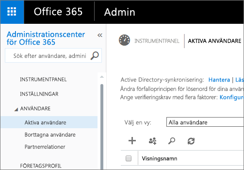

# Power BI-administratörsportalen
I administratörsportalen kan Power BI-klienterna i din organisation hanteras. Den innehåller sådant som användningsstatistik för åtkomst till Office 365-administrationscenter och inställningar.

Klient-hantering av Power BI för ditt företag görs via Power BI-administratörsportalen. Administrationsportal är tillgänglig för alla användare som är globala administratörer i Office 365 eller som har tilldelats rollen administratör i Power BI-tjänsten. Läs mer om administratörsrollen för Power BI-tjänsten i [Förstå administratörsrollen för Power BI](service-admin-role.md).

Alla användare kan se **administrationsportalen** under kugghjulsikonen. Om de inte är en administratör kan de bara se området **Premiuminställningar** och de ser bara de kapaciteter som de har behörighet att hantera.

## Navigera till administrationsportalen
Ditt konto måste vara markerat som **Global administratör** i Office 365 eller Azure Active Directory, eller ha tilldelats administratörsrollen för Power BI-tjänsten, för att ha åtkomst till Power BI-administratörsportalen. Läs mer om administratörsrollen för Power BI-tjänsten i [Förstå administratörsrollen för Power BI](service-admin-role.md). Gör följande för att gå till Power BI-administratörsportalen.

1. Välj kugghjulet längst upp till höger i Power BI-tjänsten.
2. Välj **Administratörsportalen**.

Det finns fem flikar i portalen. Dessa beskrivs nedan.

* [Användningsstatistik](#usage-metrics)
* [Användare](#users)
* [Granskningsloggar](#audit-logs)
* [Klientinställningar](#tenant-settings)
* [Premiuminställningar](#premium-settings)

## Användningsstatistik
Den första fliken i administrationsportalen är **Användningsstatistik**. Användningsstatistiken ger dig möjlighet att övervaka användningen inom Power BI för din organisation. Det ger också möjlighet att se vilka användare och grupper som är mest aktiva i Power BI för din organisation.

> [!NOTE]
> Första gången du använder instrumentpanelen eller när du kommer tillbaka efter en lång tid utan att visa instrumentpanelen visas antagligen en skärm för inläsning medan vi läser in instrumentpanelen.
> 
> 

När instrumentpanelerna har lästs in kommer du att se två områden med fönster. Det första området innehåller användningsdata för enskilda användare och det andra avsnittet har liknande information för grupper i din organisation.

Här är en uppdelning av vad som ska visas i varje sida vid sida:

* Räknar separat instrumentpaneler, rapporter och datauppsättningar på användararbetsytan
  
    
* Med använd instrumentpanel enligt antal användare med åtkomst till den. Till exempel, om du har en instrumentpanel som du har delat med 3 användare och du även har lagt till den i ett innehållspaket som två olika användare som är anslutna till, skulle antalet vara 6 (1 + 3 + 2)
  
    
* Det mest populära innehåll som användare är anslutna till. Det är något användarna kan nå genom processen Hämta data, det vill säga innehållspaket från SaaS, organisationsinnehållspaket, filer eller databaser.
  
    
* En vy över toppanvändarna baserat på hur många instrumentpaneler de har, såväl instrumentpaneler de skapat själva som instrumentpaneler som någon har delat med dem.
  
    
* En vy över toppanvändarna baserat på hur många rapporter de har
  
    

Det andra avsnittet visar samma typ av information, men baserat på grupper. Här kan du se vilka grupper i din organisation som är mest aktiva och vilken sorts information de använder.

Med den här informationen kommer du att kunna hämta verkliga insikter om hur personer använder Power BI inom organisationen och identifiera de användare och grupper som är mest aktiva i din organisation.

## Användare
Den andra fliken i administrationsportalen är **Hantera användare**. Användarhantering för Power BI sker i administrationscentret för Office 365, så det här avsnittet hjälper dig att snabbt nå området för att hantera användare, administratörer och grupper i Office 365.

När du klickar på **gå till administrationscentret för O365**, går du direkt till startsidan för Office 365 Administrationscenter för att hantera användare för din klient.

## Granskningsloggar
Den tredje fliken i administrationsportalen är **granskningsloggar**. Loggarna finns i säkerhet- och efterlevnadscentrum för Office 365. Detta avsnitt ger snabbåtkomst till detta område i Office 365. 

Mer information om granskningsloggarna finns i [granska Power BI i din organisation](service-admin-auditing.md)

## Klientinställningar
Den tredje fliken i administrationsportalen är **klientinställningar**. Klientinställningarna ger dig större kontroll över vilka funktioner som är tillgängliga för din organisation. Om du har frågor kring känsliga data, vissa av våra funktioner inte är lämpliga för din organisation eller om du bara vill att en viss funktion ska vara tillgänglig för en särskild grupp. Om så är fallet, kan du stänga av den i din klient.

> [!NOTE]
> Det kan ta upp till 10 minuter för att inställningen ska gälla för alla i din klient.
> 
> 

Inställningarna kan ha tre tillstånd baserat på de inställningar som du har angett.

### Har inaktiverats för hela organisationen
Du kan inaktivera en funktion så att användare inte kan använda den.

### Har aktiverats för hela organisationen
Du kan aktivera en funktion för hela organisationen så att alla användare har åtkomst till funktionen.

### Har aktiverats för en undergrupp i organisationen
Du kan även aktivera en funktion för en del av din organisation. Detta kan göras på ett par olika sätt. Du kan aktivera den för hela organisationen utom en viss användargrupp.

Du kan också endast aktivera funktionen för en viss grupp av användare och även inaktivera den för en grupp av användare. Därmed har vissa användare inte åtkomst till funktionen även om de finns i en tillåten grupp.

## Inställningar för export och delning
### Dela innehåll för externa användare
Användare i organisationen kan dela instrumentpaneler med användare utanför organisationen.

### Publicera på webben
Användare i organisationen kan publicera rapporter på webben. [Läs mer](service-publish-to-web.md)

> [!NOTE]
> Den här inställningen gäller för hela organisationen och kan inte begränsas till specifika grupper.
> 
> 

### Exportera data
Användare i organisationen kan exportera data från ett fönster eller en visualisering. [Läs mer](power-bi-visualization-export-data.md)

> [!NOTE]
> När du inaktiverar **Exportera data** kommer inte användare att kunna använda funktionen **Analysera i Excel** eller Power BI-tjänsten live-anslutning.
> 
> 

### Exportera rapporter som PowerPoint-presentationer
Användare i organisationen kan exportera Power BI-rapporter som PowerPoint-filer. [Läs mer](service-publish-to-powerpoint.md)

### Skriva ut instrumentpaneler och rapporter
Användare i organisationen kan skriva ut instrumentpaneler och rapporter. [Läs mer](service-print.md)

## Inställningar för innehållspaket
### Publicera innehållspaket för hela organisationen
Användare i organisationen kan publicera innehållspaket i hela organisationen.

### Skapa mall för organisationsinnehållspaket
Användare i organisationen kan skapa mallinnehållspaket som använder datauppsättningar som bygger på en datakälla i Power BI Desktop.

## Inställningar för integrering
### Ställ frågor om data med hjälp av Cortana
Användare i organisationen kan ställa frågor om sina data med hjälp av Cortana.

> [!NOTE]
> Den här inställningen gäller för hela organisationen och kan inte begränsas till specifika grupper.
> 
> 

### Analysera i Excel med lokala datauppsättningar
Användare i organisationen kan använda Excel för att visa och interagera med lokala Power BI-datauppsättningar. [Läs mer](service-analyze-in-excel.md)

> [!NOTE]
> När du inaktiverar **Exportera data** kan användare inte heller använda funktionen **Analysera i Excel**.
> 
> 

### ArcGIS-användarmappning för Power BI (förhandsgranskning)
Användare i organisationen kan använda ArcGIS-mappning för Power BI-visualiseringen (förhandsgranskning) som tillhandahålls av Esri. [Läs mer](power-bi-visualization-arcgis.md)

## Inställningar för R-visualisering
### Interagera med visuella dshare R-objekt
Användare i organisationen kan interagera med och dela visuella objekt som skapats med R-skript. [Läs mer](service-r-visuals.md)

> [!NOTE]
> Den här inställningen gäller för hela organisationen och kan inte begränsas till specifika grupper.
> 
> 

## Granskningsinställningar
### Skapa granskningsloggar för intern aktivitetsgranskning och efterlevnad
Användare i organisationen kan använda granskning för att övervaka åtgärder som vidtas i Power BI av andra användare i organisationen. [Läs mer](service-admin-auditing.md)

Den här inställningen måste vara aktiverad för att registrera granskningsloggposter.

> [!NOTE]
> Den här inställningen gäller för hela organisationen och kan inte begränsas till specifika grupper.
> 
> 

## Inställningar för instrumentpanelen
### Klassificering av instrumentpanelsdata
Användare i organisationen kan tagga instrumentpaneler med klassificeringar som anger instrumentpanelens säkerhetsnivåer. [Läs mer](service-data-classification.md)

> [!NOTE]
> Den här inställningen gäller för hela organisationen och kan inte begränsas till specifika grupper.
> 
> 

## Inställningar för utvecklare
### Bädda in innehåll i appar
Användare i organisationen kan bädda in Power BI-instrumentpaneler och rapporter i SaaS-program (programvara som en tjänst). När du inaktiverar den här inställningen kan användare inte använda REST-API: er för att bädda in Power BI-innehåll i sina program.

## Premiuminställningar
På fliken premiuminställningar kan du hantera alla premiumfunktioner för Power BI som har köpts för din organisation. Alla användare inom din organisation ser fliken premiuminställningar, men kan endast se innehåll om de är tilldelade som antingen **kapacitetadministratör** eller en användare som har tilldelningsbehörighet. Om en användare inte har några behörigheter visas följande meddelande.

Mer information om hur du hanterar premiuminställningar finns [hantera Power BI Premium](service-admin-premium-manage.md).

## Nästa steg
[Förstå Power BI-administratörsrollen](service-admin-role.md)  
[Granska Power BI i din organisation](service-admin-auditing.md)  
[Hantera Power BI Premium](service-admin-premium-manage.md)  
[Administrera Power BI i din organisation](service-admin-administering-power-bi-in-your-organization.md)  

Har du fler frågor? [Fråga Power BI Community](http://community.powerbi.com/)

