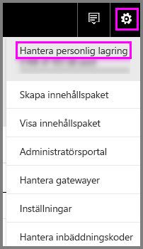
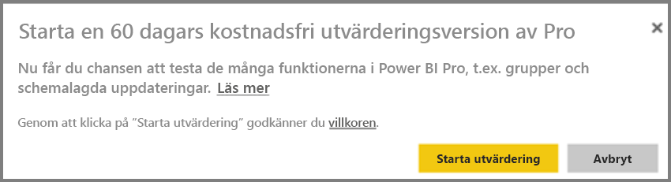
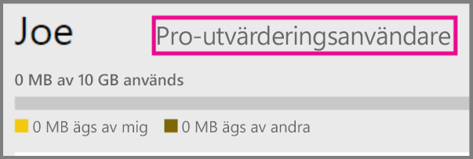
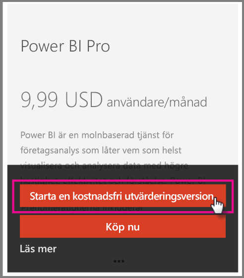

# Power BI Pro i din organisation

Power BI Pro är köpbara licenser som ger fler funktioner. Power BI Pro-licenser är avsedda för team som vill dela och samarbeta med andra för att fatta databaserade beslut.  Varje teammedlem som skapar eller visar delat Power BI-innehåll behöver en Pro-licens, såvida inte innehållet är associerat med en dedikerad kapacitet med hjälp av Power BI Premium.

Dessa funktioner kräver en Power BI Pro-licens:

* **Analysera data i Excel eller Power BI Desktop** – Använd Excel eller Power BI Desktop för att visa och interagera med en datauppsättning som publicerats i Power BI. Mer information finns i [Analysera i Excel](service-analyze-in-excel.md).

* **Dela instrumentpaneler och samarbeta med arbetsytor** – Med Power BI-arbetsytor blir det enklare att samarbeta med kollegor i instrumentpaneler, rapporter och datauppsättningar. Mer information finns i [Samarbeta på din Power BI-apparbetsyta](service-collaborate-power-bi-workspace.md).

* **Visa delat innehåll** – Pro-användare kan visa instrumentpaneler och rapporter som delas med dem, interagera med dessa och dela dessa på nytt (om det tillåts). Men Pro-användare kan inte redigera dessa instrumentpaneler eller rapporter. Mer information finns i [Dela Power BI-instrumentpaneler och -rapporter med kollegor och andra](service-share-dashboards.md).

* **Integrera innehåll med Microsoft Teams** – Du kan lägga till en Power BI-flik i en Microsoft (MS) Teams-kanal. MS Teams identifierar automatiskt alla rapporter i arbetsytan. Mer information finns i [Power BI teams up with Microsoft Teams](https://powerbi.microsoft.com/en-us/blog/power-bi-teams-up-with-microsoft-teams/). 

## 60 dagars utvärderingsversion av Power BI Pro för enskilda användare

När du har registrerat dig för ett kostnadsfritt konto kan du välja att testa Pro kostnadsfritt under 60 dagar. Du får åtkomst till alla Pro-funktioner under utvärderingsperioden. Power BI Pro innehåller alla funktionerna i den kostnadsfria versionen av Power BI och ytterligare funktioner för delning och samarbete. Mer information finns i [Power BI-prissättning](https://powerbi.microsoft.com/en-us/pricing/). Prova en utvärderingsversion av Power BI Pro i 60 dagar, logga in på Power BI och prova någon av dessa Power BI Pro-funktioner.

* [Skapa en arbetsyta](service-create-distribute-apps.md)
* [Dela en instrumentpanel](service-share-dashboards.md)

När du testar någon av dessa funktioner uppmanas du att starta den kostnadsfria utvärderingsversionen. Du kan också använda den genom att gå till kugghjulsikonen och välja Hantera personlig lagring. Välj sedan Testa Pro gratis till höger.

   
    
   

Sedan kan du välja Starta utvärdering.

   

> [!NOTE]
> Användare som utnyttjar denna Power BI Pro-utvärderingsversion visas inte i Office 365-administratörsportalen som Power BI Pro-utvärderingsanvändare (de visas som användare av den kostnadsfria Power BI-versionen). De visas dock som Power BI Pro-utvärderingsanvändare på sidan Hantera lagring i Power BI.
>

> [!NOTE]
> Om du är en IT-administratör och vill hämta och distribuera Power BI-utvärderingslicenser till flera användare i din organisation utan att de enskilda användarna ska behöva godkänna användningsvillkoren individuellt, så kan du registrera dig för en utvärderingsprenumeration på Power BI Pro. Du måste vara global administratör eller faktureringsadministratör för Office 365 eller skapa en ny klient för att kunna registrera dig för en administratörsutvärderingsversion. Mer information finns i [Köpa Power BI Pro](service-admin-purchasing-power-bi-pro.md).
>

När du använder tjänsten kan du sedan kontrollera att du har ett konto för en utvärderingsversion av Pro genom att gå till kugghjulsikonen och välja Hantera personlig lagring.

   

## Prenumerationsutvärdering i Office 365

Du kan hämta Power BI Pro som en utvärdering för din organisation. När du har prenumerationen, kan du tilldela Power BI Pro-licenser till dina användare. Mer information om hur du tilldelar licenser finns i [Tilldela licenser till användare i Office 365](https://support.office.com/en-us/article/assign-licenses-to-users-in-office-365-for-business-997596b5-4173-4627-b915-36abac6786dc?ui=en-US&rs=en-US&ad=US).

> [!NOTE]
> Det finns en gräns på en organisationsutvärdering per klientorganisation. Det innebär att om någon redan har använt Power BI Pro-utvärderingen för din klientorganisation så kan du inte göra det igen. Om du behöver hjälp med det här kan du kontakta [Office 365-faktureringsstöd](https://support.office.microsoft.com/en-us/article/contact-support-for-business-products-admin-help-32a17ca7-6fa0-4870-8a8d-e25ba4ccfd4b?CorrelationId=552bbf37-214f-4202-80cb-b94240dcd671&ui=en-US&rs=en-US&ad=US).
>

Följ dessa steg för att få en utvärderingsprenumeration i Office 365:

1. Gå till [administrationscentret för Office 365](https://portal.office.com/adminportal/home#/homepage).
2. Välj Fakturering i det vänstra navigeringsfönstret och klicka sedan på Prenumerationer.

   

3. Välj Lägg till prenumerationer på höger sida.

   

4. Under andra planer, hovrar du över ellipsen (...) för Power BI Pro och väljer starta kostnadsfri utvärdering.

    

5. Välj Testa nu på skärmen för att bekräfta din order.
6. Välj fortsätt på orderkvittot.

## Köp Power BI Pro

Du kan köpa Power BI Pro via Microsoft Office 365 eller en certifierad Microsoft-partner. Mer information om hur du köper Power BI Pro finns i [Köp Power BI Pro](service-admin-purchasing-power-bi-pro.md).

## Nästa steg
[Självregistrering för Power BI](service-admin-signing-up-for-power-bi-with-a-new-office-365-trial.md)
 
[Power BI (kostnadsfri) i din organisation](service-admin-service-free-in-your-organization.md)
 
[Köp Power BI Pro](service-admin-purchasing-power-bi-pro.md)
 
[Aktivering av utökad Pro-utvärderingsversion](service-extended-pro-trial.md)
 
[Tilldela Power BI Pro-licenser](service-admin-assigning-power-bi-pro-licenses.md)
 
[Power BI Premium – vad är det?](service-admin-premium-manage.md)
 
[Så här köper du Power BI Premium](service-admin-premium-purchase.md)
 
[Power BI Premium – white paper](https://aka.ms/pbipremiumwhitepaper)

Har du fler frågor? [Fråga Power BI Community](https://community.powerbi.com/)