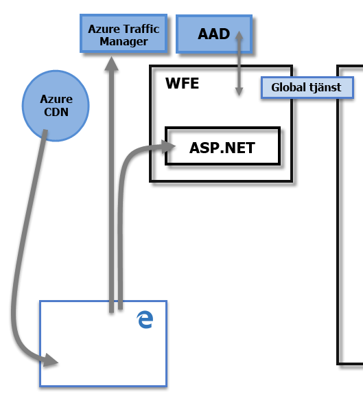
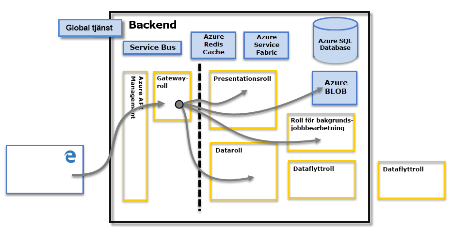

# Power BI-säkerhet
En detaljerad förklaring av Power BI-säkerheten får du om du [laddar ned white paper-dokumentet om Power BI-säkerhet](http://go.microsoft.com/fwlink/?LinkId=829185):

Power BI-tjänsten bygger på **Azure**, vilket är Microsofts infrastruktur och plattform för molntjänster. Power BI-tjänstens arkitektur baseras på två kluster – frontwebb (**WFE**) och **serverdel**. WFE-klustret är ansvarigt för den första anslutningen och autentiseringen till Power BI-tjänsten. Efter att den har autentiseras hanterar serverdelen alla efterföljande användarinteraktioner. Power BI använder Azure Active Directory (AAD) till att lagra och hantera användaridentiteter, samt hanterar lagringen av data och metadata med Azure-blobb och Azure SQL Database.

## Power BI-arkitektur
Varje Power BI-distribution består av två kluster – ett frontwebb (**WFE**) och ett **serverdel**.

**WFE**-klustret hanterar den första anslutningen och autentiseringsprocessen för Power BI, samt använder AAD för att autentisera klienter och tillhandahåller tokens för efterföljande klientanslutningar till Power BI-tjänsten. Power BI använder dessutom **Azure Traffic Manager** (ATM) till att dirigera användartrafik till det närmaste datacentret, vilket bestäms av DNS-posten för den klient som försöker att ansluta, för autentiseringen och för att ladda ned statiskt innehåll och filer. Power BI använder **Azure Content Delivery Network** (CDN) till att distribuera det statiska innehåll som krävs samt filer till användarna, baserat på nationella inställningar.

**Serverdelsklustret** avser hur autentiserade klienter interagerar med Power BI-tjänsten. **Serverdelsklustret** hanterar visualiseringar, instrumentpaneler för användare, datauppsättningar, rapporter, datalagring, dataanslutningar, datauppdatering och andra delar av interaktionen med Power BI-tjänsten. **Gatewayrollen** fungerar som en gateway mellan användarförfrågningar och Power BI-tjänsten. Användarna samverkar inte direkt med några andra roller än **gatewayrollen**. **Azure API Management** levererar slutligen **gatewayrollen**.

> [!IMPORTANT]
> Det är viktigt att observera att endast rollerna **Azure API Management** (APIM) och **Gateway** (GW) kan nås via ett offentligt Internet. De tillhandahåller funktioner för autentisering, auktorisering, DDoS-skydd, begränsning, belastningsutjämning, routning m.m.
> 
> 

## Säkerhet vid datalagring
Power BI använder två primära databaser för att lagra och hantera data: Data som laddas upp från användarna skickas vanligtvis till **Azure-blobb**lagringen, och alla metadata samt artefakter för själva systemet lagras i **Azure SQL Database**.

Den streckade linjen i bilden för **serverdelsklustret** ovan, visar gränsen mellan de enda två komponenter som är tillgängliga för användarna (till vänster om den streckade linjen) och de roller som endast kan nås av systemet. När en autentiserad användare ansluter till Power BI-tjänsten kommer anslutningen och alla förfrågningar av klienten accepteras och hanteras av **gatewayrollen** (så småningom hanteras den av **Azure API Management**), som sedan interagerar åt användaren med resten av Power BI-tjänsten. Om till exempel en klient försöker visa en instrumentpanel accepterar **gatewayrollen** förfrågan och skickar sedan separat en begäran till **presentationsrollen** om att hämta de data som behövs för att webbläsaren ska kunna återge instrumentpanelen.

## Användarautentisering
Power BI använder Azure Active Directory ([AAD](http://azure.microsoft.com/services/active-directory/)) till att autentisera användarna som loggar in på Power BI-tjänsten. Därefter används inloggningsuppgifterna för Power BI varje gång en användare försöker få åtkomst till resurser som kräver autentisering. När användarna loggar in på Power BI-tjänsten används den e-postadress som användes när deras Power BI-konton skapades. Power BI använder e-postinloggningen som *effektivt användarnamn* och skickar den till resurserna när en användare försöker att ansluta till data. Det *effektiva användarnamnet* mappas sedan till *Användarens huvudnamn* ([UPN](https://msdn.microsoft.com/library/windows/desktop/aa380525\(v=vs.85\).aspx)) och matchas med det associerade Windows-domänkonto som autentiseringen används för.

För organisationer som använt e-postadressen till arbetet vid Power BI-inloggning (t.ex *david@contoso.com*), är *effektiva användarnamn* som UPN-mappning enkel att använda. För organisationer som inte har använt e-postadressen till arbetet för Power BI-inloggning (t.ex *david@contoso.onmicrosoft.com*), kommer mappningen mellan AAD och lokala autentiseringsuppgifter kräva att [katalogsynkroniseringen](https://technet.microsoft.com/library/jj573653.aspx) fungerar som den ska.

Plattformssäkerheten för Power BI inkluderar även miljösäkerhet för flera klienter, nätverkssäkerhet och möjligheten att lägga till ytterligare AAD-baserade säkerhetsåtgärder.

## Data- och tjänstsäkerhet
Mer information finns i [Microsofts Säkerhetscenter](https://www.microsoft.com/trustcenter).

Enligt vad som tidigare beskrevs i den här artikeln används en användares Power BI-inloggning av lokala Active Directory-servrar till att mappa till ett UPN för autentiseringsuppgifter. Det är dock **viktigt** att notera att användarna ansvarar för de data som de delar: Om en användare ansluter till datakällor med sina autentiseringsuppgifter och sedan delar en rapport (eller instrumentpanel eller datauppsättning) baserat på dessa data, autentiseras inte användarna som den instrumentpanelen delas med mot den ursprungliga datakällan och de kommer att beviljas åtkomst till rapporten.

Ett undantag är anslutningar till **SQL Server Analysis Services** med hjälp av den **lokala datagatewayen**. Instrumentpaneler cachelagras i Power BI, men åtkomsten till underliggande rapporter eller datauppsättningar kräver autentisering för den användare som försöker få åtkomst till rapporten (eller datauppsättningen) och åtkomst beviljas enbart om användaren har tillräcklig behörighet för att få åtkomst till dessa data. Mer information finns i [Djupdykning i den lokala datagatewayen](service-gateway-onprem-indepth.md).

