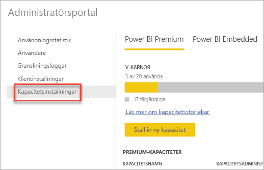
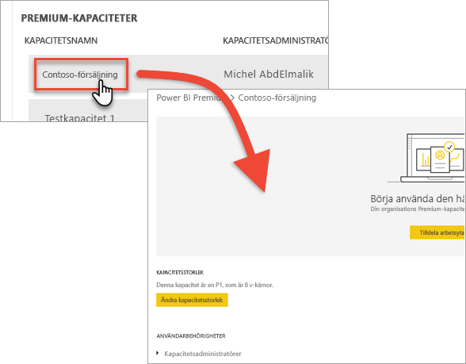
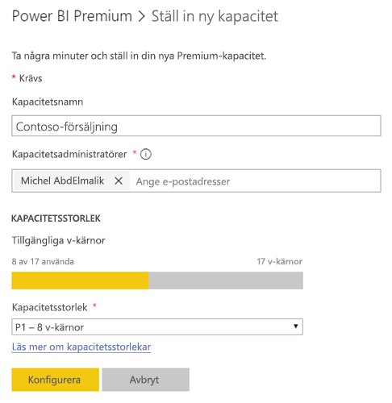
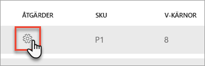
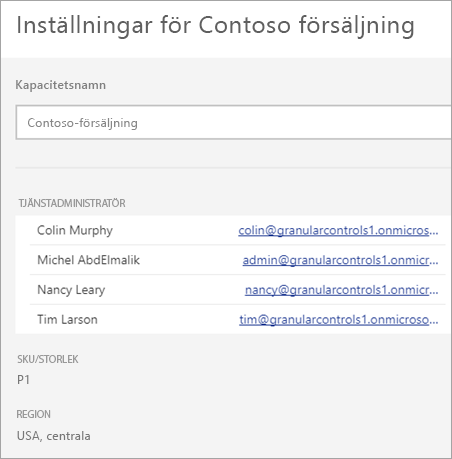
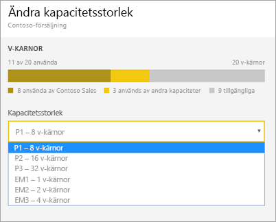
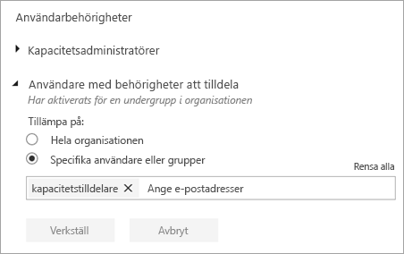
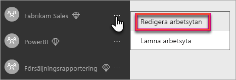
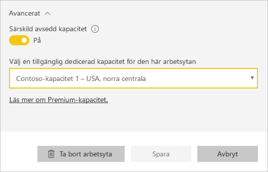
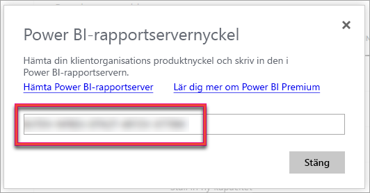

# Konfigurera och hantera kapaciteter i Power BI Premium

Hantering av Power BI Premium innebär att skapa, hantera och övervaka Premium-kapaciteter. Den här artikeln innehåller stegvisa instruktioner. En översikt över kapaciteter finns i [Hantera Premium-kapaciteter](service-premium-capacity-manage.md).

Lär dig hur du hanterar Power BI Premium- och Power BI Embedded-kapaciteter som tillhandahåller dedikerade resurser för ditt innehåll.

*Kapacitet* är i hjärtat av Power BI Premium- och Power BI Embedded-erbjudandena. Det är en uppsättning resurser som reserveras endast för din organisation. Med dedikerad kapacitet kan du publicera instrumentpaneler, rapporter och datauppsättningar för användare i hela organisationen utan att behöva köpa licenser per användare till dem. Det erbjuder även pålitlig och konsekvent prestanda för det innehåll som omfattas av kapaciteten. Mer information finns i [Vad är Power BI Premium?](service-premium.md).

## Hantera kapacitet

När du har köpt kapacitetsnoder i Office 365 konfigurerar du kapaciteten i administratörsportalen för Power BI. Du hanterar Power BI Premium-kapaciteter i avsnittet **Kapacitetsinställningar** i portalen.

Du hanterar en kapacitet genom att välja namnet på kapaciteten. Detta leder till skärmen för kapacitetshantering.

Om inga arbetsytor har tilldelats till kapaciteten visas ett meddelande om att [tilldela en arbetsyta till kapaciteten](#assign-a-workspace-to-a-capacity).

### Skapa en ny kapacitet (Power BI Premium)

Administratörsportalen visar antalet *virtuella kärnor* (v-kärnor) som du har använt och som du fortfarande har tillgängliga. Det totala antalet v-kärnor baseras på de Premium-SKU:er som du har köpt. Till exempel leder köp av en P3 och en P2 till 48 tillgängliga kärnor – 32 från P3 och 16 från P2.

Om du har tillgängliga v-kärnor konfigurerar du din nya kapacitet genom att följa dessa steg.

1. Välj **Konfigurera ny kapacitet**.

1. Ge din kapacitet ett namn.

1. Definiera vem administratören är för den här kapaciteten.

1. Välj storleken på din kapacitet. Tillgängliga alternativ är beroende av hur många tillgängliga v-kärnor du har. Du kan inte välja ett alternativ som är större än vad du har tillgängligt.

    

1. Välj **Konfigurera**.

    

Kapacitetsadministratörer samt Power BI-administratörer och globala Office 365-administratörer kan därefter se kapaciteten i listan i administratörsportalen.

### Kapacitetsinställningar

1. På skärmen för Premium-kapacitetshantering går du till **Åtgärder** och väljer **kugghjulsikonen** för att granska och uppdatera inställningarna. 

    

1. Du ser även vilka som är tjänsteadministratörer, SKU:n/storleken på kapaciteten samt vilken region kapaciteten befinner sig i.

    

1. Du kan även byta namn på eller ta bort en kapacitet.

    

> [!NOTE]
> Kapacitetsinställningarna för Power BI Embedded hanteras i Microsoft Azure-portalen.

### Ändra kapacitetsstorlek

Power BI-administratörer och globala Office 365-administratörer kan ändra Power BI Premium-kapacitet. Det här alternativet är inte tillgängligt för kapacitetsadministratörer som inte är Power BI-administratör eller global Office 365-administratör.

1. Välj **Ändra kapacitetsstorlek**.

    

1. På skärmen **Ändra kapacitetsstorlek** uppgraderar eller nedgraderar du kapaciteten efter behov.

    

    Administratörer kan skapa, ändra storlek på och ta bort noder, så länge som de har det nödvändiga antalet v-kärnor.

    P SKU:er kan inte nedklassificeras till EM SKU:er. Du kan hovra över inaktiverade alternativ för att se en förklaring.

### Hantera användarbehörigheter

Du kan tilldela ytterligare kapacitetsadministratörer och tilldela användare som har behörigheter för *kapacitetstilldelning*. Användare med tilldelningsbehörighet kan tilldela en arbetsyta till en kapacitet om användaren är administratör för arbetsytan. Användaren kan också tilldela sin personliga *Min arbetsyta* till kapaciteten. Användare med tilldelningsbehörighet har inte åtkomst till administratörsportalen.

> [!NOTE]
> För Power BI Embedded definieras kapacitetsadministratörer i Microsoft Azure-portalen.

Under **Användarbehörigheter** expanderar du **Användare med behörigheter att tilldela** och lägger sedan till användare eller grupper efter behov.

## Tilldela en arbetsyta till en kapacitet

Det finns två sätt att tilldela en arbetsyta till en kapacitet: i administratörsportalen och från en arbetsyta.

### Tilldela från administratörsportalen

Kapacitetsadministratörer, tillsammans med Power BI-administratörer och globala Office 365-administratörer, kan masstilldela arbetsytor i administratörsportalens avsnitt för premiumkapacitetshantering. När du hanterar en kapacitet visas avsnittet **Arbetsytor**, där du kan tilldela arbetsytor.

1. Välj **Tilldela arbetsytor**. Det här alternativet är tillgängligt på flera platser.

1. Välj ett alternativ för **Tillämpa på**.

    

   | Urval | Beskrivning |
   | --- | --- |
   | **Arbetsytor av användare** | När du tilldelar arbetsytor per användare eller grupp, tilldelas alla arbetsytor som ägs av dessa användare till Premium-kapacitet, inklusive användares personliga arbetsytor. Dessa användare får automatiskt behörighet för tilldelning av arbetsyta. Detta inkluderar arbetsytor som redan har tilldelats till en annan kapacitet. |
   | **Särskilda arbetsytor** | Ange namnet på en viss arbetsyta om du vill tilldela till den valda kapaciteten. |
   | **The entire organization's workspaces (Hela organisationens arbetsytor)** | Om du tilldelar hela organisationens arbetsytor till en Premium-kapacitet tilldelas alla arbetsytor och Mina arbetsytor i din organisation till den här Premium-kapaciteten. Dessutom kommer alla nuvarande och framtida användare ha behörigheten att omtilldela individuella arbetsytorna till den här kapaciteten. |
   | | |

1. Välj **Tillämpa**.

### Tilldela från arbetsyteinställningarna

Du kan också tilldela en arbetsyta till en Premium-kapacitet från arbetsytans inställningar. Du måste ha administratörsbehörighet för en arbetsyta och behörighet för kapacitetstilldelning för kapaciteten om du vill flytta en arbetsyta till en kapacitet. Observera att arbetsyteadministratörer alltid kan ta bort en arbetsyta från Premium-kapacitet.

1. Redigera en arbetsyta genom att välja ellipsen **(...)** och sedan **Redigera arbetsyta**.

    

1. Under **Redigera arbetsyta** expanderar du **Avancerat**.

1. Välj den kapacitet som du vill tilldela arbetsytan till.

    

1. Välj **Spara**.

När du har sparat flyttas arbetsytan och allt dess innehåll till Premium-kapacitet utan upplevelseavbrott för slutanvändarna.

## Produktnyckel för Power BI-rapportserver

På fliken **Kapacitetsinställningar** i Power BI-administratörsportalen får du åtkomst till din produktnyckel för Power BI-rapportservern. Den är endast tillgängligt för globala administratörer eller användare som har tilldelats rollen Power BI-tjänstadministratör och om du har köpt en Power BI Premium-SKU.

Om du väljer **Power BI-rapportservernyckel** visas en dialogruta med din produktnyckel. Du kan kopiera den och använda den med installationen.

Mer information finns i [Installera Power BI-rapportservern](report-server/install-report-server.md).

## Nästa steg

[Hantera Premium-kapaciteter](service-premium-capacity-manage.md)

Har du fler frågor? [Fråga Power BI Community](https://community.powerbi.com/)
