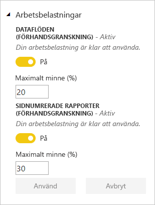

# Hantera kapacitet i Power BI Premium och Power BI Embedded

Lär dig hur du hanterar Power BI Premium- och Power BI Embedded-kapaciteter som tillhandahåller dedikerade resurser för ditt innehåll.

## Vad är kapacitet?

*Kapacitet* är i hjärtat av Power BI Premium- och Power BI Embedded-erbjudandena. Det är den uppsättning resurser som reserveras endast för din organisations användning. Med dedikerad kapacitet kan du publicera instrumentpaneler, rapporter och datauppsättningar för användare i hela organisationen utan att behöva köpa licenser per användare till dem. Det erbjuder även pålitlig och konsekvent prestanda för det innehåll som omfattas av kapaciteten. Mer information finns i [Vad är Power BI Premium?](service-premium.md).

### Kapacitetsadministratörer

När du tilldelas till en kapacitet som *kapacitetsadministratör* har du full kontroll över kapaciteten och dess administrativa funktioner. Från Power BI-administratörsportalen kan du lägga till fler kapacitetsadministratörer eller ge användare behörighet för kapacitetstilldelning. Du kan masstilldela arbetsytor till kapacitet och visa användningsstatistik för en kapacitet.

> [!NOTE]
> För Power BI Embedded definieras kapacitetsadministratörer i Microsoft Azure-portalen.

Varje kapacitet har sina egna administratörer. Vid tilldelning av en kapacitetsadministratör till en kapacitet ges denne inte åtkomst till alla kapaciteter inom organisationen. Kapacitetsadministratörer har inte åtkomst till alla Power BI-administratörsområden som standard, som användningsstatistik, granskningsloggar och klientinställningar. Kapacitetsadministratörer har heller inte behörighet att konfigurera nya kapaciteter eller ändra SKU:n för befintliga kapaciteter. Endast globala Office 365-administratörer eller Power BI-tjänstadministratörer har åtkomst till dessa objekt.

Alla globala Office 365-administratörer och Power BI-tjänstadministratörer är automatiskt kapacitetsadministratörer för både Power BI Premium- och Power BI Embedded-kapacitet.

## Köpa kapacitet

För att kunna använda dedikerad kapacitet behöver du köpa Power BI Premium i administrationscentret för Office 365 eller skapa en Power BI Embedded-resurs i Microsoft Azure-portalen. Mer information finns i följande artiklar:

* **Power BI Premium:** [Så här köper du Power BI Premium](service-admin-premium-purchase.md)

* **Power BI Embedded:** [Skapa Power BI Embedded-kapacitet i Azure Portal](https://docs.microsoft.com/azure/power-bi-embedded/create-capacity)

När du köper Power BI Premium- eller Embedded-SKU:er får din klientorganisation motsvarande antal v-kärnor för användning i kapaciteter som körs. Köp av en Power BI Premium P3 SKU ger till exempel klienten 32 v-kärnor. Mer information om SKU:er finns i [Premium-kapacitetsnoder](service-premium.md#premium-capacity-nodes).

## Hur Premium ser ut för användare

I de flesta fall behöver användarna inte känna till att de befinner sig i en Premium-kapacitet. Deras instrumentpaneler och rapporter fungerar helt enkel. Som en visuell indikation visas en diamantikon bredvid arbetsytor som är i en Premium-kapacitet.

## Konfigurera arbetsbelastningar

Som standard har kapaciteter för Power BI Premium och Power BI Embedded endast stöd för den arbetsbelastning som är associerad med Power BI-frågor som körs i molnet. Vi erbjuder nu stöd för förhandsversioner av två ytterligare arbetsbelastningar: **Sidnumrerade rapporter** och **dataflöden**. Mer information finns i [Workloads in Premium capacity (Arbetsbelastningar i Premium-kapacitet)](service-premium.md#workloads-in-premium-capacity).

Följ de här anvisningarna om du vill aktivera arbetsbelastningar i Power BI-administratörsportalen.

1. Under **Kapacitetsinställningar** väljer du en kapacitet.

1. Under **FLER ALTERNATIV** expanderar du **Arbetsbelastningar**.

1. Aktivera en eller flera arbetsbelastningar och ange ett värde för **Max minne**.

    

1. Välj **Tillämpa**.

## Övervaka kapacitetsanvändning

Power BI tillhandahåller en app för att övervaka kapacitetsanvändning. Mer information finns i [Övervaka Power BI Premium-kapaciteter i din organisation](service-admin-premium-monitor-capacity.md).

## Hantera kapacitet

När du har köpt kapacitetsnoder i Office 365 konfigurerar du kapaciteten i administratörsportalen för Power BI. Du hanterar Power BI Premium-kapaciteter i avsnittet **Kapacitetsinställningar** i portalen.

Du hanterar en kapacitet genom att välja namnet på kapaciteten. Detta leder till skärmen för kapacitetshantering.

Om inga arbetsytor har tilldelats till kapaciteten visas ett meddelande om att [tilldela en arbetsyta till kapaciteten](#assign-a-workspace-to-a-capacity).

### Skapa en ny kapacitet (Power BI Premium)

Administratörsportalen visar antalet *virtuella kärnor* (v-kärnor) som du har använt och som du fortfarande har tillgängliga. Det totala antalet v-kärnor baseras på de Premium-SKU:er som du har köpt. Till exempel leder köp av en P3 och en P2 till 48 tillgängliga kärnor – 32 från P3 och 16 från P2.

Om du har tillgängliga v-kärnor konfigurerar du din nya kapacitet genom att följa dessa steg.

1. Välj **Konfigurera ny kapacitet**.

1. Ge din kapacitet ett namn.

1. Definiera vem administratören är för den här kapaciteten.

1. Välj storleken på din kapacitet. Tillgängliga alternativ är beroende av hur många tillgängliga v-kärnor du har. Du kan inte välja ett alternativ som är större än vad du har tillgängligt.

    

1. Välj **Konfigurera**.

    

Kapacitetsadministratörer samt Power BI-administratörer och globala Office 365-administratörer kan därefter se kapaciteten i listan i administratörsportalen.

### Kapacitetsinställningar

1. På skärmen för Premium-kapacitetshantering går du till **Åtgärder** och väljer **kugghjulsikonen** för att granska och uppdatera inställningarna. 

    

1. Du ser även vilka som är tjänsteadministratörer, SKU:n/storleken på kapaciteten samt vilken region kapaciteten befinner sig i.

    

1. Du kan även byta namn på eller ta bort en kapacitet.

    

> [!NOTE]
> Kapacitetsinställningarna för Power BI Embedded hanteras i Microsoft Azure-portalen.

### Ändra kapacitetsstorlek

Power BI-administratörer och globala Office 365-administratörer kan ändra Power BI Premium-kapacitet. Det här alternativet är inte tillgängligt för kapacitetsadministratörer som inte är Power BI-administratör eller global Office 365-administratör.

1. Välj **Ändra kapacitetsstorlek**.

    

1. På skärmen **Ändra kapacitetsstorlek** uppgraderar eller nedgraderar du kapaciteten efter behov.

    

    Administratörer kan skapa, ändra storlek på och ta bort noder, så länge som de har det nödvändiga antalet v-kärnor.

    P SKU:er kan inte nedklassificeras till EM SKU:er. Du kan hovra över inaktiverade alternativ för att se en förklaring.

### Hantera användarbehörigheter

Du kan tilldela ytterligare kapacitetsadministratörer och tilldela användare som har behörigheter för *kapacitetstilldelning*. En användare som har tilldelningsbehörighet kan tilldela en apparbetsyta till en kapacitet om användaren är administratör för arbetsytan. Användaren kan också tilldela sin personliga *Min arbetsyta* till kapaciteten. Användare med tilldelningsbehörighet har inte åtkomst till administratörsportalen.

> [!NOTE]
> För Power BI Embedded definieras kapacitetsadministratörer i Microsoft Azure-portalen.

Under **Användarbehörigheter** expanderar du **Användare med behörigheter att tilldela** och lägger sedan till användare eller grupper efter behov.

## Tilldela en arbetsyta till en kapacitet

Det finns två sätt att tilldela en arbetsyta till en kapacitet: i administratörsportalen och från en apparbetsyta.

### Tilldela från administratörsportalen

Kapacitetsadministratörer, tillsammans med Power BI-administratörer och globala Office 365-administratörer, kan masstilldela arbetsytor i administratörsportalens avsnitt för premiumkapacitetshantering. När du hanterar en kapacitet visas avsnittet **Arbetsytor**, där du kan tilldela arbetsytor.

1. Välj **Tilldela arbetsytor**. Det här alternativet är tillgängligt på flera platser.

1. Välj ett alternativ för **Tillämpa på**.

    

   | Val | Beskrivning |
   | --- | --- |
   | **Arbetsytor av användare** | När du tilldelar arbetsytor per användare eller grupp, tilldelas alla arbetsytor som ägs av dessa användare till Premium-kapacitet, inklusive användares personliga arbetsytor. Dessa användare får automatiskt behörighet för tilldelning av arbetsyta. Detta inkluderar arbetsytor som redan har tilldelats till en annan kapacitet. |
   | **Särskilda arbetsytor** | Ange namnet på en viss arbetsyta om du vill tilldela till den valda kapaciteten. |
   | **The entire organization's workspaces (Hela organisationens arbetsytor)** | Om du tilldelar hela organisationens arbetsytor till Premium-kapacitet tilldelas alla app-arbetsytor och Mina arbetsytor i din organisation till den här Premium-kapaciteten. Dessutom kommer alla nuvarande och framtida användare ha behörigheten att omtilldela individuella arbetsytorna till den här kapaciteten. |
   | | |

1. Välj **Tillämpa**.

### Tilldela från inställningar för apparbetsyta

Du kan också tilldela en app-arbetsyta till en Premium-kapacitet från arbetsytans inställningar. Du måste ha administratörsbehörighet för en arbetsyta och behörighet för kapacitetstilldelning för kapaciteten om du vill flytta en arbetsyta till en kapacitet. Observera att arbetsyteadministratörer alltid kan ta bort en arbetsyta från Premium-kapacitet.

1. Redigera en apparbetsyta genom att välja ellipsen **(. . .)** och sedan **Redigera arbetsyta**.

    

1. Under **Redigera arbetsyta** expanderar du **Avancerat**.

1. Välj den kapacitet som du vill tilldela den här app-arbetsytan till.

    

1. Välj **Spara**.

När du har sparat flyttas arbetsytan och allt dess innehåll till Premium-kapacitet utan upplevelseavbrott för slutanvändarna.

## Produktnyckel för Power BI-rapportserver

På fliken **Kapacitetsinställningar** i Power BI-administratörsportalen får du åtkomst till din produktnyckel för Power BI-rapportservern. Den är endast tillgängligt för globala administratörer eller användare som har tilldelats rollen Power BI-tjänstadministratör och om du har köpt en Power BI Premium-SKU.

Om du väljer **Power BI-rapportservernyckel** visas en dialogruta med din produktnyckel. Du kan kopiera den och använda den med installationen.

Mer information finns i [Installera Power BI-rapportservern](report-server/install-report-server.md).

## Nästa steg

Dela publicerade appar med användare. Mer information finns i [Skapa och distribuera en app i Power BI](service-create-distribute-apps.md).

Har du fler frågor? [Fråga Power BI Community](http://community.powerbi.com/)
