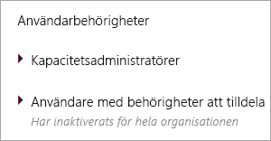
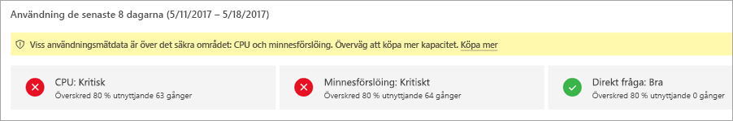
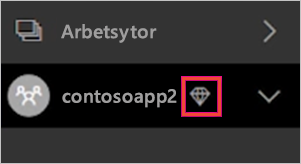

# Hantera kapacitet i Power BI Premium och Power BI Embedded
Lär dig hur du kan hantera Power BI Premium- och Power BI Embedded-kapaciteter som tillhandahåller dedikerade resurser för ditt innehåll.

Kapaciteten är hjärtat i Power BI Premium- och Power BI Embedded-erbjudandena.

## Vad är kapacitet?
Kapacitet är den uppsättning resurser som reserveras endast för din användning. Med kapacitet kan du publicera instrumentpaneler, rapporter och datauppsättningar för användare i hela organisationen utan att behöva köpa licenser till dem. Det garanterar även pålitlig och konsekvent prestanda för det innehåll som omfattas av kapaciteten.

Kapaciteten är helt transparent för dina slutanvändare. De fortsätter att använda Power BI eller programmet som vanligt. De behöver inte känna till att delar av (eller hela) innehållet finns i din dedikerade kapacitet. För dina användare fungerar allt precis som tidigare.

[!INCLUDE [powerbi-premium-illustration](./includes/powerbi-premium-illustration.md)]

Mer information finns i [Vad är Power BI Premium?](service-premium.md).

## Köpa kapacitet
Om du vill dra fördel av dedikerad kapacitet behöver du köpa en prenumeration på Power BI Premium i administrationscentret för Office 365 eller skapa en Power BI Embedded-resurs i Microsoft Azure Portal. Mer information finns i följande:

* **Power BI Premium:** [Så här köper du Power BI Premium](service-admin-premium-purchase.md)
* **Power BI Embedded:** Kommer snart.

När du köper Power BI Premium SKU:er får din klient motsvarande antal v-kärnor för användning i körkapacitet. Köp av en Power BI Premium P3 SKU ger till exempel klienten 32 v-kärnor.

## Kapacitetsadministratörer
> [!NOTE]
> Kapacitetsadministratörer för Power BI Embedded-kapacitet definieras i Microsoft Azure Portal.
> 
> 

När du tilldelats som kapacitetsadministratör för en kapacitet, har du full kontroll över den aktuella kapaciteten och dess administrativa funktioner. Från Power BI-administratörsportalen kan du lägga till fler kapacitetsadministratörer (endast Power BI Premium) eller ge användare behörighet för kapacitetstilldelning. Du kan masstilldela arbetsytor till kapacitet och visa användningsstatistik för en kapacitet.

Varje kapacitet har sina egna administratörer. När man definierar en kapacitetsadministratör för en kapacitet ger man inte den aktuella personen åtkomst till alla kapacitet inom organisationen. Kapacitetsadministratörer har inte åtkomst till alla Power BI-administratörsområden som standard, som användningsstatistik, granskningsloggar och klientinställningar. Kapacitetsadministratörer har inte heller behörighet att konfigurera nya kapaciteter eller ändra SKU:n för befintliga kapaciteter. Endast globala administratörer eller Power BI-tjänstadministratörer har åtkomst till dessa objekt.

Alla globala Office 365-administratörer och Power BI-administratörer är automatiskt kapacitetsadministratörer för både Power BI Premium- och Power BI Embedded-kapacitet.

## Hantera kapacitet
När du har köpt kapacitetsnoder i Office 365, måste du konfigurera en ny kapacitet. Detta görs via [Power BI-administratörsportalen](service-admin-portal.md). I administratörsportalen visas ett avsnitt som heter **Kapacitetsinställningar**. Det är här som du hanterar Power BI Premium-kapacitet för din organisation.

Om du väljer **Kapacitetsinställningar** förs du automatiskt till skärmen för kapacitetshantering i Power BI Premium.

### Skapa en ny kapacitet (Power BI Premium)
Antalet v-kärnor återspeglar den mängd som används och den mängd som finns tillgänglig för att skapa kapacitet. Mängden v-kärnor som är tillgänglig för din organisation baseras på de Premium-SKU:er som du har köpt. Till exempel leder köp av en P3 och en P2 till 48 tillgängliga kärnor – 32 från P3 och 16 från P2.

Om du har tillgängliga v-kärnor konfigurerar du din nya kapacitet genom att göra följande.

1. Välj **Konfigurera ny kapacitet**.
2. Ge din kapacitet ett **namn**.
3. Definiera vem kapacitetsadministratören är för den här kapaciteten.
   
    Kapacitetsadministratörer behöver inte vara en Power BI-administratör eller en global Office 365-administratör. Mer information finns i [Power BI Premium capacity admins (Kapacitetsadministratörer för Power BI Premium)](#capacity-admins)
4. Välj storleken på din kapacitet. Tillgängliga alternativ är beroende av hur många tillgängliga v-kärnor du har. Du kan inte välja ett alternativ som är större än vad du har tillgängligt.
   
    
5. Välj **Konfigurera**.

Kapacitetsadministratörer, samt Power BI-administratörer och globala Office 365-administratörer, kan därefter se kapaciteten i listan i administratörsportalen.

### Kapacitetsinställningar
På skärmen för Premium-kapacitetshantering kan du välja **kugghjulsikonen (inställningar)** under Åtgärder. Här kan du byta namn på eller ta bort en kapacitet. Det framgår även vilka som är tjänsteadministratörer, SKU/ kapacitetsstorlek och vilken region kapaciteten befinner sig i.

> [!NOTE]
> Kapacitetsinställningarna för Power BI Embedded hanteras i Microsoft Azure Portal.
> 
> 

### Ändra kapacitetsstorlek (Power BI Premium)
Power BI-administratörer och globala Office 365-administratörer kan ändra storleken på Power BI Premium-kapaciteten genom att välja **Ändra kapacitetsstorlek**. Det här alternativet är inte tillgängligt för kapacitetsadministratörer som inte är Power BI-administratör eller global Office 365-administratör.

På skärmen **Ändra kapacitetsstorlek** kan du uppgradera eller nedgradera storleken på din kapacitet om du har de tillgängliga resurserna. Administratörer kan skapa, ändra storlek på och ta bort noder, så länge som de har det nödvändiga antalet v-kärnor. 

P SKU:er kan inte nedklassificeras till EM SKU:er. Du kan hovra över inaktiverade alternativ för en förklaring.

### Tilldelning av kapacitet
Du kan hantera en kapacitet genom att välj namnet på kapaciteten. Detta tar dig till skärmen för kapacitetshantering.

Om inga arbetsytor har tilldelats till kapaciteten, visas ett meddelande så att du kan **tilldela arbetsytor**.

#### Användarbehörigheter
Du kan tilldela ytterligare **kapacitetsadministratörer** för Power BI Premium-kapaciteter. Samt tilldela användare som ska ha **behörighet för kapacitetstilldelning**. En användare som har tilldelningsbehörighet kan tilldela en app-arbetsyta till kapaciteten om han eller hon är administratör för arbetsytan. Användaren kan också tilldela sin personliga *Min arbetsyta* till kapaciteten. Användare med tilldelningsbehörighet har inte åtkomst till administratörsportalen.

> [!NOTE]
> Kapacitetsadministratörer för Power BI Embedded-kapacitet definieras i Microsoft Azure Portal.
> 
> 

## Användning av mätningar (Power BI Premium)
För varje kapacitet kan du mäta användningen av processor, minne och Direct Query. Varje KPI har tre indikationer: **bra (grönt)**, **på gränsen (gult)** och **kritiskt (rött)**. Vi rekommenderar att du övervakar de här måtten för att säkerställa att användarna får bra prestanda vid användning av Premium-innehåll.

**Användningen av Power BI Embedded-kapaciteten övervakas i Azure Portal.**

| Mått | Beskrivning |
| --- | --- |
| Processor |Processoranvändningen för dina kärnor. |
| Minne |Representerar minnesbelastningen på dina serverkärnor. Mer specifikt är detta ett mått på hur ofta modellerna avlägsnas från minnet på grund av minnesbelastning vid användning av flera modeller. |
| DQ/s |* Vi begränsar det totala antalet DirectQuery- och realtidsanslutningsfrågor per sekund. * Gränserna är 30/s för P1, 60/s för P2 och 120/s för P3. * DirectQuery- och realtidsanslutningsfrågor räknas som likvärdiga för ovanstående begränsning. Om du till exempel har 15 DirectQueries och 15 realtidsanslutningar på en sekund, når du begränsningen. * Detta gäller lika för både lokala anslutningar och molnanslutningar. |

När dessa mått är på gränsen/kritiska, kan användarna se en försämring av prestandan för rapporter och uppdatering, särskilt under tider med hög belastning.

Måtten återspeglar användningen under den gångna veckan och är utformade för att räkna antalet gånger då kapaciteten överbelastas och därmed tillhandahåller mindre än optimala prestanda för dina användare.

Varje förekomst av *belastning över 80 %* ska betraktas som ett potentiellt fall av försämrade prestanda. Allt för många fall är en god indikator på betydande prestandaproblem för användarna.

## Tilldela en arbetsyta till en kapacitet
Det finns några olika metoder för att tilldela en arbetsyta till en kapacitet.

### Kapacitetshantering i administratörsportalen
Kapacitetsadministratörer, tillsammans med Power BI-administratörer och globala Office 365-administratörer, kan masstilldela arbetsytor i administratörsportalens sektion för premiumkapacitetshantering. När du hanterar en kapacitet, visas sektionen **Arbetsytor** där du kan tilldela arbetsytor.

1. Välj **Tilldela arbetsytor**. Detta visas på flera platser och alla förekomster utför samma uppgift.
2. Välj antingen **The entire organization's workspaces (Hela organisationens arbetsytor)** eller **Specific workspaces by user (Specifika arbetsytor per användare)**.
   
   | Val | Beskrivning |
   | --- | --- |
   | **The entire organization's workspaces (Hela organisationens arbetsytor)** |Genom att tilldela hela organisationens arbetsytor till Premium-kapacitet, tilldelas alla app-arbetsytor och Mina arbetsytor i din organisation till den här Premium-kapaciteten. Dessutom kommer alla nuvarande och framtida användare ha behörigheten att omtilldela individuella arbetsytorna till den här kapaciteten. |
   | **Specific workspaces by user (Specifika arbetsytor per användare)** |När du tilldelar arbetsytor per användare eller grupp, tilldelas alla arbetsytor som ägs av dessa användare till Premium-kapacitet, inklusive användares personliga arbetsytor. Dessa användare får automatiskt behörighet för tilldelning av arbetsyta. Detta inkluderar arbetsytor som redan har tilldelats till en annan kapacitet. |
3. Välj **Tillämpa**.

Det här alternativet medger inte att du kan tilldela särskilda arbetsytor till en kapacitet.

### Inställningar för app-arbetsyta
Du kan också tilldela en app-arbetsyta till en Premium-kapacitet från arbetsytans inställningar. Gör följande om du vill tilldela en app-arbetsyta till en Premium-kapacitet.

Du måste ha administratörsbehörighet för arbetsytan och behörighet för kapacitetstilldelning för kapaciteten om du vill flytta en arbetsyta till en kapacitet. Observera att arbetsyteadministratörer alltid kan ta bort en arbetsyta från Premium-kapacitet.

1. Redigera en app-arbetsyta genom att välja **ellipsen (...)**  och sedan **Redigera arbetsyta**.
   
    
2. I **Redigera arbetsyta**, expanderar du **Avancerat**.
3. Om du har fått behörighet för kapacitetstilldelning för någon kapacitet, får du alternativet att aktivera **Premium** för den här arbetsytan.
4. Välj den kapacitet som du vill tilldela den här app-arbetsytan.
   
    
5. Välj **Spara**.

När du har sparat flyttas arbetsytan och allt dess innehåll till Premium-kapacitet utan upplevelseavbrott för slutanvändarna.

## Hur Premium ser ut för användare
I de flesta fall behöver användarna inte ens veta om att de befinner sig i Premium-kapacitet. Deras instrumentpaneler och rapporter bara fungerar. Som en visuell indikation visas en diamantikon bredvid arbetsytor som har Premium-kapacitet. 

## Produktnyckel för Power BI-rapportservern
På fliken **Kapacitetsinställningar** i Power BI-administratörsportalen får du åtkomst till din produktnyckel för Power BI-rapportservern. Den är endast tillgängligt för globala administratörer eller användare som har tilldelats rollen Power BI-tjänstadministratör och om du har köpt en Power BI Premium-SKU.

Om du väljer **Power BI-rapportservernyckel** visas en dialogruta med din produktnyckel. Du kan kopiera den och använda den med installationen.

Mer information finns i [Installera Power BI-rapportservern](report-server/install-report-server.md).

## Nästa steg
Dela publicerade appar med fria användare när du tilldelar arbetsytan till en Premium-kapacitet. Mer information finns i [Skapa och distribuera en app i Power BI](service-create-distribute-apps.md).

Har du fler frågor? [Fråga Power BI Community](http://community.powerbi.com/)

