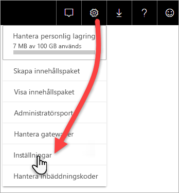
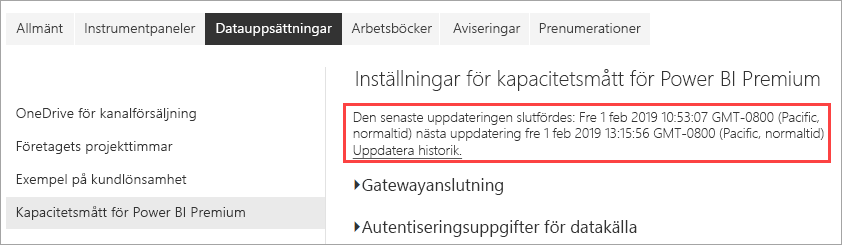
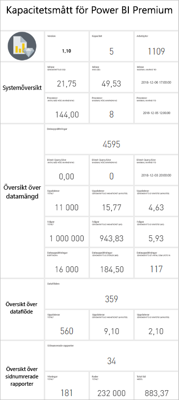

# Övervaka Premium-funktioner med appen

Övervakning av dina kapaciteter är viktigt för att fatta välgrundade beslut om hur du bäst använder dina Premium-kapacitetsresurser. Du kan övervaka kapacitet med administratörsportalen eller med appen **Power BI Premium Capacity Metrics**. I den här artikeln beskrivs appen Premium Capacity Metrics. Appen ger den mest djupgående informationen om hur kapaciteterna fungerar. För en översikt på högre nivå över genomsnittliga användningsmått de senaste sju dagarna kan du använda administratörsportalen. Mer information om övervakning i portalen finns i [Övervaka Premium-kapaciteter i administratörsportalen](service-admin-premium-monitor-portal.md).

Appen uppdateras regelbundet med nya funktioner. Kontrollera att du kör den senaste versionen. Om du redan har en tidigare version av appen installerad är det bäst att ta bort den från dina appar och sedan trycka på CTRL+F5 för att uppdatera. 

## Installera appen

Du kan gå direkt till [Premium Capacity Metrics-appen](https://app.powerbi.com/groups/me/getapps/services/capacitymetrics) eller installera den precis som andra appar i Power BI.

1. I Power BI klickar du på **Appar**.   
    

2. Till höger klickar du på **Hämta appar**.
3. I kategorin **Appar** söker du efter **Power BI Premium Capacity Metrics-appen**.
4. Prenumerera för att installera appen.

Ha tålamod. Det tar några minuter att installera och uppdatera mått. Om appen visar tomma mått trycker du på F5 för att uppdatera webbläsaren.

## Hämta uppdateringshistorik för appen

Om du vill kontrollera den senaste tiden som Premium Capacity Metrics-appen uppdaterades klickar du på **Inställningar** > **Datauppsättningar** > **Power BI Premium Capacity Metrics** > **Uppdateringshistorik**. 

Den senaste uppdateringen visas. Du kan också klicka på **Uppdateringshistorik** för att se schemalagda och uppdateringar och på begäran-uppdateringar.

## Övervaka funktioner med appen

Nu när du har installerat appen kan du se mått för kapaciteterna i din organisation. Appen innehåller en instrumentpanel med mått sammanfattningar och detaljerade mätvärden rapporter.

### Instrumentpanel

Se en instrumentpanel som sammanfattar viktiga mått för kapaciteter som du är administratör för, i **Instrumentpaneler** så klickar du på **Power BI Premium-kapacitetsmått**. En instrumentpanel visas.

Instrumentpanelen innehåller följande mått:

#### Överkant

| Mått | Beskrivning |
| --- | --- |
| Version | Appversion. | 
| Kapacitet | Antal kapaciteter som du är administratör för. | 
| Arbetsytor | Antal arbetsytor i dina kapaciteter som rapporterar mått.|
|||

#### Systemöversikt

| Mått | Beskrivning |
| --- | --- |
| Högsta utnyttjandekapacitet av processor | Kapacitet med det högsta antalet gånger som processorn översteg 80 % av tröskelvärdena under de senaste sju dagarna. |
| Högsta utnyttjandeantal för processorn | Antal gånger som processorn av den namngivna kapaciteten översteg 80 % av tröskelvärdena under de senaste sju dagarna. | 
| Högsta utnyttjandekapacitet för minne | Kapacitet med det maximala antalet gånger som den högsta minnesgränsen uppnåddes de senaste sju dagarna, uppdelat i treminuters bucketar.  |
| Antal max minnesutnyttjande| Antal gånger som den namngivna kapaciteten uppnådde den högsta minnesgränsen de senaste sju dagarna, uppdelat i treminuters bucketar. |
|||

#### Översikt över datamängd

| Mått | Beskrivning |
| --- | --- |
| Datauppsättningar | Totalt antal datauppsättningar för alla arbetsytor i dina kapaciteter.|
| Genomsnittlig storlek på datauppsättningarna (MB) | Genomsnittlig storlek för datauppsättningar för alla arbetsytor i dina kapaciteter.|  
| Genomsnittligt antal inlästa datauppsättningar | Genomsnittligt antal datauppsättningar som lästs in i minnet. |  
| Datauppsättningar – genomsnitt aktiva datauppsättning (%)| Genomsnitt aktiva datauppsättningar under de senaste sju dagarna. En datauppsättning definieras som aktiv om användaren har interagerat med den de senaste tre minuterna. |
| CPU – datauppsättningar max (%)| Max CPU-förbrukning efter datauppsättningens arbetsbelastning under de senaste sju dagarna. |
| CPU – datauppsättningar genomsnitt (%)| Genomsnittlig CPU-förbrukning efter datauppsättningens arbetsbelastning de senaste sju dagarna. |
| Minne – datauppsättningar genomsnitt (%) | Genomsnittlig minnesförbrukning efter datauppsättningens arbetsbelastning de senaste sju dagarna. |
| Minne – datauppsättningar max (GB) | Max minnesförbrukning efter datauppsättningens arbetsbelastning de senaste sju dagarna.|
| Datauppsättningar borttagna | Totalt antal datauppsättningar som tagits bort på grund av minnestryck. |
| DirectQuery/Live högt utnyttjande antal| Antal gånger som DirectQuery/Live-anslutningar har överskridit 80 % av tröskelvärdena under de senaste sju dagarna, uppdelat på treminuters bucketar. |
| DirectQuery/Live max utnyttjande antal| De flesta gånger som DirectQuery/Live-anslutningarna överskridit 80 % under de senaste sju dagarna, uppdelat på entimmes bucketar. |
| DirectQuery/Live max högt utnyttjande | Det maximala antalet gånger som DirectQuery/Live-anslutningar har överskridit 80 % av tröskelvärdena under de senaste sju dagarna, uppdelat på treminuters bucketar.|
| DirectQuery/Live tid när max inträffade | Tid i UTC då DirectQuery/Live-anslutningar överskred 80 % flest gånger under en timme. |
| Uppdateringar totalt | Totalt antal uppdateringar under de senaste sju dagarna. |
| Uppdateringstillförlitlighet (%) | Antal lyckade uppdateringar delat på det totala antalet uppdateringar under de senaste sju dagarna. |
| Genomsnittlig varaktighet för uppdateringar (minuter) | Genomsnittlig mängd tid för att slutföra uppdateringen. |
| Genomsnittlig väntetid för uppdateringar (minuter)| Genomsnittlig tid innan uppdateringen startar. |
| Totalt antal frågor |  Totalt antal frågor som körts under de senaste sju dagarna. |
| Frågor totalt vänteantal | Totalt antal frågor som var tvungen att vänta innan de kördes. |
| Genomsnittlig varaktighet för frågor (ms) | Genomsnittlig tid det tar att slutföra frågor. |
| Genomsnittlig väntetid för frågor (ms) | Genomsnittlig tid som frågor väntade på systemresurser innan de kördes. |
|||

#### Översikt över dataflöde

| Mått | Beskrivning |
| --- | --- |
| Dataflöden |  Totalt antal dataflöden för alla arbetsytor i dina kapaciteter.|
| Uppdateringar totalt | Totalt antal uppdateringar under de senaste sju dagarna.|  
| Genomsnittlig varaktighet för uppdateringar (minuter) | Den tid det tar att slutföra uppdateringen. |
| Genomsnittliga väntetider för uppdateringar (minuter) | Fördröjningen mellan den schemalagda tiden och den faktiska starttiden för uppdateringen.|
| CPU – dataflöden max (%) | Max CPU-förbrukning efter dataflödenas arbetsbelastning under de senaste sju dagarna. |
| CPU – dataflöden genomsnitt (%) | Genomsnittlig CPU-förbrukning efter dataflödenas arbetsbelastning under de senaste sju dagarna. |
| Minne – dataflöden max (GB) | Max minnesförbrukning efter dataflödenas arbetsbelastning under de senaste sju dagarna. |
| Minne – dataflöden genomsnitt (GB) | Genomsnittlig minnesförbrukning efter dataflödenas arbetsbelastning under de senaste sju dagarna. |
|||

#### Översikt över sidnumrerade rapporter

| Mått | Beskrivning |
| --- | --- |
| Sidnumrerade rapporter |  Totalt antal sidnumrerade rapporter för alla arbetsytor i dina kapaciteter. |
| Totalt antal visningar | Totalt antal gånger som alla rapporter har visats av användare. | 
| Totalt antal rader | Totalt antal rader med data i alla rapporter.|
| Total tid | Total tid det tar för alla faser (datahämtning, bearbetning och återgivning) för alla rapporter, i millisekunder. |
| CPU – sidnumrerade rapporter max (%) | Max CPU-förbrukning efter den sidnumrerade rapportens arbetsbelastning de senaste sju dagarna. |
| CPU – sidnumrerade rapporter genomsnitt (%) | Genomsnittlig CPU-förbrukning efter den sidnumrerade rapportens arbetsbelastning de senaste sju dagarna. |
| Minne – sidnumrerade rapporter max (GB) | Max minnesförbrukning efter den sidnumrerade rapportens arbetsbelastning de senaste sju dagarna. |
| Minne – sidnumrerade rapporter genomsnittligt (GB) | Genomsnittlig minnesförbrukning efter den sidnumrerade rapportens arbetsbelastning de senaste sju dagarna. |
|||

#### AI-sammanfattning

| Mått | Beskrivning |
| --- | --- |
| Uppdateringar totalt | Totalt antal uppdateringar under de senaste sju dagarna. |
| Uppdateringstillförlitlighet (%) | Antal lyckade uppdateringar delat på det totala antalet uppdateringar under de senaste sju dagarna. |
| Högsta antal CPU (%)| Max CPU-förbrukning av AI-arbetsbelastningen under de senaste sju dagarna. |
| Maximalt minne (GB) | Max minnesförbrukning av AI-arbetsbelastningen under de senaste sju dagarna.|
| Uppdaterar Maximal väntetid (MS) | Längsta tid innan du startar uppdateringen. |
| Uppdaterar Snittväntetid (MS)| Genomsnittlig tid innan uppdateringen startar. |
| Uppdaterar maximal varaktighet (MS) | Längsta tid att fullständiga uppdateringar. |
| Uppdaterar Genomsnittlig varaktighet (MS)| Genomsnittlig mängd tid för att slutföra uppdateringen. |
| | |

### Rapporter

Rapporter ger mer detaljerade mätvärden. Visa rapporter för kapaciteter som du är administratör för genom att gå till **Rapporter** och klicka på **Power BI Premium-kapacitetsmått**. Eller så klickar du på en måttcell från instrumentpanelen för att gå till den underliggande rapporten. 

Längst ned i rapporten finns det fem *flikar*:

[**Datauppsättningar**](#datasets) – Innehåller detaljerade mätvärden om hälsotillståndet för Power BI-datauppsättningarna i dina kapaciteter.
[**Sidnumrerade rapporter**](#paginated-reports) – Innehåller detaljerade mätvärden om hälsotillståndet för de sidnumrerade rapporterna i dina kapaciteter.
[**Dataflöden**](#dataflows) – Innehåller detaljerade uppdateringsmätvärden för dataflöden i dina kapaciteter.
[**AI** ](#ai) -innehåller detaljerade mätvärden om hälsotillståndet för AI-funktioner som används i din kapacitet.
[**Resursförbrukning**](#resource-consumption) – Innehåller detaljerade resursmått, inklusive minne och hög CPU-användning.
[**ID:n och info**](#ids-and-info) – Namn, ID:n och ägare för kapaciteter, arbetsytor och arbetsbelastningar.

Varje flik öppnar en sida där du kan filtrera mått efter kapacitet och datumintervall. Om inga filter har markerats använder rapporten standardinställningarna för att visa den senaste veckans mått för alla kapaciteter som rapporterar mått. 

### Datauppsättningar

Sidan Datauppsättningar har olika *områden* som inkluderar **Uppdateringar**, **Frågevaraktigheter**, **Frågeväntetid** och  **Datauppsättningar**. Använd knapparna överst på sidan för att gå till de olika områdena.

#### Området Uppdaterar

| Rapportavsnitt | Mått |
| --- | --- |
| Uppdaterar |  Totalt antal: Totalt antal uppdateringar för varje datauppsättning.   Tillförlitlighet: Procentandelen av uppdateringar som slutförts för varje datauppsättning.   Genomsnittlig väntetid: Den genomsnittliga fördröjningen mellan schemalagda tid och starttid för en uppdatering av datauppsättningen, i minuter.   Maximal väntetid: Den maximala väntetiden för datauppsättningen, i minuter.   Genomsnittlig varaktighet: Den genomsnittliga varaktigheten för uppdateringen för datauppsättningen, i minuter.   Maximal varaktighet: Varaktigheten för den långvarigaste uppdateringen av datauppsättningen, i minuter. |
| De 5 viktigaste datauppsättningarna efter genomsnittlig varaktighet (minuter) |  De fem datauppsättningarna med längst genomsnittlig uppdateringsvaraktighet, i minuter. |
| De viktigaste 5 datauppsättningarna efter genomsnittlig väntetid (minuter) |  De fem datauppsättningarna med den längsta genomsnittliga uppdateringsväntetiden, i minuter. |
| Antal uppdateringar och minnesförbrukning per timma (GB) |  Genomförda, misslyckade och minnesförbrukning, uppdelade i entimmes bucketar, rapporterade i UTC-tid. |
| Genomsnittlig uppdateringsväntetid varje timme (minuter) |  Den genomsnittliga uppdateringsväntetiden, uppdelat i entimmes bucketar, rapporterad i UTC-tid. Många toppar med långa uppdateringsväntetider tyder på att kapaciteten körs för hårt. |
|  |  |

#### Frågevaraktighetsområde

| Rapportavsnitt | Mått |
| --- | --- |
| Frågevaraktighet |  Data i det här avsnittet är indelade efter datauppsättningar, arbetsytor och timbucketar under de senaste sju dagarna.   Totalt: Det totala antal frågor som körts för datauppsättningen.   Genomsnitt: Den genomsnittliga frågevaraktigheten för datauppsättningen, mätt i millisekunder   Max: Varaktigheten för den långvarigaste frågan i datauppsättningen, i millisekunder.|
| Frågevaraktighetsfördelning |  Frågevaraktighetens histogram bucketeras efter frågevaraktighet (i millisekunder) i följande kategorier: intervall på < = 30 ms, 30-100 ms, 100-300 ms, 300 ms-1 sek, 1-3 sek, 3-10 sek, 10-30 sek och > 30 sek. Lång frågevaraktighet och långa väntetider är en tydlig indikation på kapaciteten utsätts för mycket hög belastning. Det kan också innebära att en enskild datauppsättning orsakar problem och ytterligare utredning krävs. |
| De 5 främsta datauppsättningarna efter genomsnittlig varaktighet |  De fem datauppsättningarna med den längsta genomsnittliga frågevaraktigheten, i millisekunder. |
| Frågevaraktighetsfördelning per timme |  Antal frågor och genomsnittlig varaktighet (i millisekunder) kontra minnesanvändning i GB, uppdelat i entimmes bucketar, rapporterade i UTC-tid. |
| DirectQuery/Live-anslutningar (> 80 % utnyttjande) |  Tiderna då en DirectQuery eller Live-anslutning överskred 80 % CPU-användning, uppdelat i entimmes bucketar, rapporterat i UTC-tid. |
|  |  |

#### Frågeväntansområde

| Rapportavsnitt | Mått |
| --- | --- |
| Frågeväntetider |  Data i det här avsnittet är indelade efter datauppsättningar, arbetsytor och timbucketar under de senaste sju dagarna.   Totalt: Det totala antal frågor som körts för datauppsättningen.   Antal väntande: Det antal frågor i den datauppsättning som väntade på systemresurser innan körningen startades.   Genomsnitt: Den genomsnittliga frågeväntetiden för datauppsättningen, i millisekunder.   Max: Varaktigheten för den längst väntande frågan i datauppsättningen, i millisekunder.|
| De 5 främsta datauppsättningarna efter genomsnittlig väntetid |  De fem datauppsättningarna med den längsta genomsnittliga väntetiden för att börja köra en fråga, i millisekunder. |
| Väntetidsfördelningar |  Histogrammet för frågevaraktighet bucketeras efter frågevaraktigheter (i millisekunder) i följande kategorier: intervall på <= 50 ms , 50-100 ms , 100-200 ms , 200-400 ms 400 ms-1 sek, 1-5 s och > 5 s. |
| Väntetidsfördelningar per timme |  Antal väntande frågor och genomsnittlig väntetid (i millisekunder) jämfört med minnesanvändningen i GB, uppdelat i entimmes bucketar rapporterade i UTC-tid. |
|  |  |

#### Området Datamängder

| **Rapportavsnitt** | **Mått** |
| --- | --- |
| Datauppsättningsstorlekar  |  Maxstorlek: Maxstorleken för datauppsättningen i MB för perioden som visas. |
| Antal borttagna datauppsättningar |  Totalt: Det totala antalet *avlägsnade* datauppsättningar för respektive kapacitet. När en kapacitet drabbas av minnesbelastning avlägsnar noden en eller flera datauppsättningar från minnet. Datamängder som är inaktiva (utan frågor/uppdateringsåtgärder som körs för tillfället) avlägsnas först. Avlägsnandeordern baseras sedan på ett mått på ”minst nyligen använd” (LRU, Least Recently Used).|
| Inlästa datauppsättningar per timme |  Antal datauppsättningar som lästes in i minnet jämfört med minnesförbrukning i GB, uppdelat i entimmes bucketar, rapporterat i UTC-tid. |
| Antal borttagna datauppsättningar och minnesförbrukning per timme |  Borttagna datauppsättningar jämfört med minnesförbrukning i GB, uppdelat i entimmes bucketar, rapporterat i UTC-tid. |
| Procent förbrukat minne |  Det totala antalet aktiva datauppsättningar i minnet som procent av det totala minnet. Delta mellan aktiva och alla definierade datauppsättningar som kan avlägsnas. Visas per timme, för de sju föregående dagarna. |
|  |  |

### Sidnumrerade rapporter

| **Rapportavsnitt** | **Mått** |
| --- | --- |
| Övergripande användning |  Totalt antal visningar: Antalet gånger som rapporten har visats av användare.   Radantal: Antalet rader data i rapporten.   Hämtning (medelvärde): Den genomsnittliga tid det tar att hämta data för rapporten, uttryckt i millisekunder. Långa varaktigheter kan indikera långsamma frågor eller andra problem med datakällan.    Bearbetning (medelvärde): Den genomsnittliga tid det tar att bearbeta data för en rapport, i millisekunder.  Återgivning (medelvärde): Den genomsnittliga tid det tar att återge en rapport i webbläsaren, i millisekunder.   Total tid: Den tid det tar för alla faser i en rapport, i millisekunder. |
| De 5 främsta rapporterna efter genomsnittlig datahämtningstid |  De fem rapporterna med den längsta genomsnittliga datahämtningstiden, i millisekunder. |
| De 5 främsta rapporterna efter genomsnittlig rapportbearbetningstid |  De fem rapporterna med den längsta genomsnittliga rapportbearbetningstiden, i millisekunder. |
| Resultat per timma |  Genomförda, misslyckade och minnesförbrukning, uppdelade i entimmes bucketar, rapporterade i UTC-tid. |
| Varaktighet per timma |  Datahämtning jämfört med tiden för bearbetning och återgivning, uppdelat i entimmes bucketar, rapporterat i UTC-tid. |
|  |  |

### Dataflöden

| **Rapportavsnitt** | **Mått** |
| --- | --- |
| Uppdaterar |  Totalt: Totalt antal uppdateringar för varje dataflöde.   Tillförlitlighet: Procentandelen av uppdateringar som slutförts för varje dataflöde.   Genomsnittlig väntetid: Den genomsnittliga fördröjningen mellan schemalagd tid och start av en uppdatering av dataflödet, i minuter.   Maximal väntetid: Maximal väntetid för dataflödet, i minuter.   Genomsnittlig varaktighet: Genomsnittlig varaktighet för uppdatering för dataflödet, i minuter.   Maximal varaktighet: Varaktigheten för den långvarigaste uppdateringen av dataflödet, i minuter. |
| De 5 viktigaste dataflödena efter genomsnittlig uppdateringsvaraktighet |  De fem dataflöden med den längsta genomsnittliga uppdateringsvaraktigheten, i minuter. |
| De 5 viktigaste dataflödena efter genomsnittlig väntetid |  De fem dataflödena med den längsta genomsnittliga uppdateringsväntetiden, i minuter. |
| Genomsnittlig uppdateringsväntetid uppdelad i timmar |  Den genomsnittliga uppdateringsväntetiden, uppdelat i entimmes bucketar, rapporterad i UTC-tid. Många toppar med långa uppdateringsväntetider tyder på att kapaciteten körs för hårt. |
| Antal uppdateringar och minnesförbrukning per timma |  Genomförda, misslyckade och minnesförbrukning, uppdelade i entimmes bucketar, rapporterade i UTC-tid. |
|  |  |

### AI

| **Rapportavsnitt** | **Mått** |
| --- | --- |
| Total användning | Totalt antal: Antalet AI-funktioner i en arbetsyta eller dataflöde.   Tillförlitlighet: Procentandelen av uppdateringar som har slutförts.  Genomsn. Väntetid: Genomsnittlig fördröjning mellan den schemalagda tiden och början av en uppdatering, i millisekunder.  Maximal väntetid: Maximal väntetid, i millisekunder.  Genomsn. Varaktighet: Den genomsnittliga varaktigheten för en uppdatering, i millisekunder.  Maximal varaktighet: Varaktigheten för den längsta löpande uppdatera i millisekunder.  Genomsn indata storlek: Genomsnittliga Ange storlek i byte för AI-funktion som körs av en uppdatering av dataflöde.  Genomsn storlek: Genomsnittlig utdata storlek i byte för AI-funktion som körs av en uppdatering av dataflöde. |
| 5 främsta AI-funktioner med Genomsnittlig varaktighet | De fem funktionerna med längsta medelvärdet uppdatera tid i millisekunder. |
| 5 främsta AI-funktioner med genomsnittliga Indatastorleken | De fem funktionerna med största genomsnittlig data Ange storlek i byte. |
| Antal uppdateringar och minnesförbrukning per timma | Genomförda, misslyckade och minnesförbrukning, uppdelade i entimmes bucketar, rapporterade i UTC-tid. |
| Per timme genomsnittliga varaktighetstiden | Den genomsnittliga varaktigheten för en uppdatering delas upp i en timme buckets rapporteras i UTC-tid. |
| | |

### Resursförbrukning

| **Rapportavsnitt** | **Mått** |
| --- | --- |
| CPU-förbrukning |  Förbrukning av arbetsbelastning som procentandel av total CPU-kapacitet. Visas per timme, för de sju föregående dagarna. |
| Minnesförbrukning |  Minnesförbrukning i GB per arbetsbelastning (heldragna linjer), med arbetsbelastningsbelastningar (streckad linje) ovanpå. Visas per timme, för de sju föregående dagarna. |
|  |  |

### ID:n och info

Fliken **ID:n och information** innehåller områden för **Kapaciteter**, **Arbetsytor**, **Datauppsättningar**, **Sidnumrerade rapporter**, och **Dataflöden**.

#### Kapaciteter-området

| Rapportavsnitt | Mått |
| --- | --- |
| SKU och information för arbetsbelastning | Inställningar för SKU och arbetsbelastning för kapaciteten. |
| Administratörer | Namnen på administratörerna för kapaciteten. |
|||

#### Arbetsytor-området

| Rapportavsnitt | Mått |
| --- | --- |
| Arbetsytor | Namn och ID:n för alla arbetsytor. |
|||

#### Området Datamängder

| Rapportavsnitt | Mått |
| --- | --- |
| Datauppsättningar | Arbetsytenamn och ID:n för alla datauppsättningar. |
|||

#### Sidnumrerade rapporter-området

| Rapportavsnitt | Mått |
| --- | --- |
| Sidnumrerade rapporter | Namn, arbetsytenamn och ID:n för alla sidnumrerade rapporter. |
|||

#### Dataflöden-området

| Rapportavsnitt | Mått |
| --- | --- |
| Dataflöden | Dataflödesnamn, arbetsytenamn och ID:n för alla dataflöden. |
|||

## Övervaka Power BI Embedded-kapacitet

Du kan använda appen Power BI Premium Capacity Metrics för att övervaka *A SKU*-kapaciteter i Power BI Embedded. De kapaciteterna visas i rapporten så länge du är administratör för kapaciteten. Uppdatering av rapporten misslyckas dock såvida inte du ger vissa behörigheter till Power BI för dina A-SKU:

1. Öppna kapaciteten i Azure Portal.

1. Klicka på **Åtkomstkontroll (IAM)** och lägg därefter till **Power BI Premium**-appen till läsarrollen. Om det inte går att hitta appen efter namn, du kan också lägga till den genom att klient-ID: `cb4dc29f-0bf4-402a-8b30-7511498ed654`.

    

> [!NOTE]
> Du kan övervaka kapacitetsförbrukningen för Power BI Embedded i appen eller Azure Portal, men inte i Power BI-administratörsportalen.

## Nästa steg

> [!div class="nextstepaction"]
> [Optimera Power BI Premium-kapaciteter](service-premium-capacity-optimize.md)
