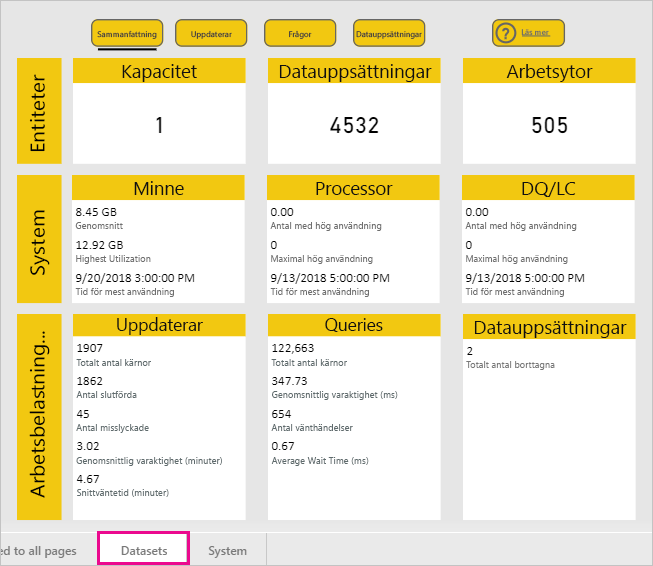
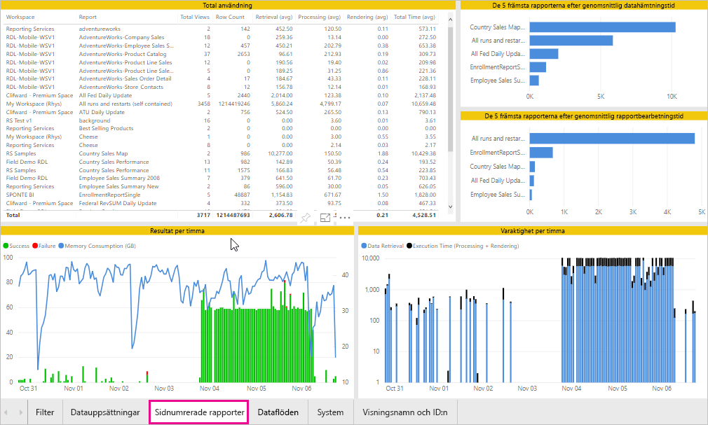
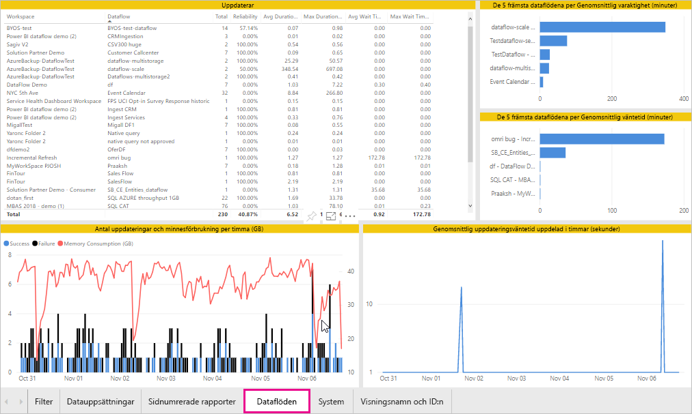
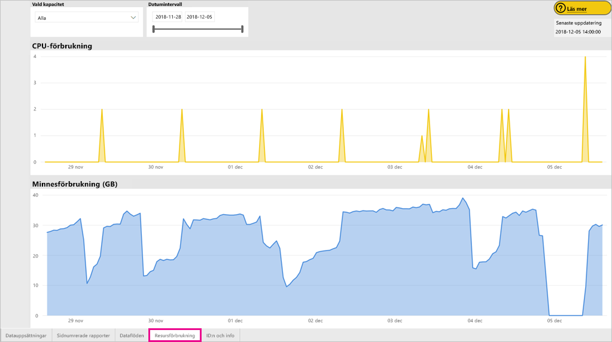
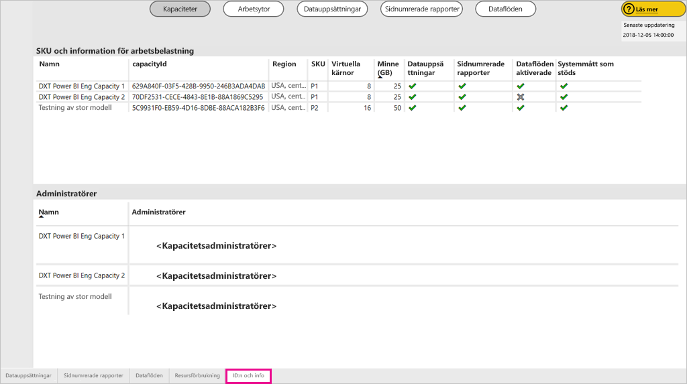
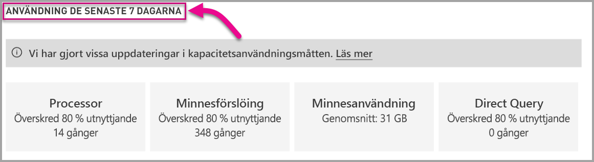

# Övervaka Power BI Premium- och Power BI Embedded-kapaciteter

Den här artikeln innehåller en översikt över övervakning av mått för dina Power BI Premium-kapaciteter. Genom att övervaka kapacitetsförbrukningen kan du hantera din kapacitet på ett genomtänkt sätt.

Du kan övervaka kapaciteten med appen Power BI Premium Capacity Metrics eller i administrationsportalen. Vi rekommenderar appen, eftersom det ger mycket mer detaljerad information, men den här artikeln beskriver båda alternativen.

**Den aktuella versionen av appen är 1.10 (släpptes den 13 december 2018).**

.

<iframe width="560" height="315" src="https://www.youtube.com/embed/UgsjMbhi_Bk?rel=0&amp;showinfo=0" frameborder="0" allowfullscreen></iframe>

## Installera appen Premium Capacity Metrics

Du kan gå direkt till [Premium Capacity Metrics-appen](https://app.powerbi.com/groups/me/getapps/services/capacitymetrics) eller installera den precis som andra appar i Power BI.

1. I Power BI klickar du på **Appar**.

    

1. Till höger klickar du på **Hämta appar**.

1. I kategorin **Appar** söker du efter **Power BI Premium Capacity Metrics-appen**.

1. Prenumerera för att installera appen.

Nu när du har installerat appen kan du se mått som gäller kapaciteterna i din organisation. Låt oss ta en titt på några av de viktigaste måtten som är tillgängliga.

## Använda måttappen

### Instrumentpanelen med mätvärden

När du öppnar appen visas först en instrumentpanel med en sammanfattning av alla kapaciteter som du har administratörsrättigheter till.

Instrumentpanelen innehåller följande mått.

| **Rapportavsnitt** | **Mått** |
| --- | --- |
| **Systemöversikt** | * Programmets version  * Antal kapaciteter du är administratör för  * Antal arbetsytor i dina kapaciteter som rapporterar mått  * Genomsnittlig minnesförbrukning i GB under de senaste sju dagarna  * Maximal minnesförbrukning i GB under de senaste sju dagarna  * Lokal tid då den maximala minnesförbrukningen inträffade  * Antal gånger som CPU har överskridit 80 % av tröskelvärdena under de senaste sju dagarna, uppdelat på tre minuter långa buckets  * De flesta gånger CPU överskred 80 % under de senaste sju dagarna, uppdelat på en timme långa buckets  * Lokal tid då CPU överskred 80 % flest gånger under en timme |
| **Översikt över datauppsättning** | * Totalt antal datauppsättningar för alla arbetsytor i dina kapaciteter  * Antal gånger som Direct Query/Live-anslutningar har överskridit 80 % av tröskelvärdena under de senaste sju dagarna, uppdelat på tre minuter långa buckets  * De flesta gånger Direct Query/Live-anslutningar har överskridit 80 % under de senaste sju dagarna, uppdelat på en timme långa buckets  * Lokal tid då Direct Query/Live-anslutningar överskred 80 % flest gånger i timmen  * Totalt antal uppdateringar under de senaste sju dagarna  * Genomsnittlig väntetid för uppdatering – den genomsnittliga fördröjningen, mätt i minuter, mellan den schemalagda tiden och uppdateringens start  * Genomsnittlig uppdateringstid – den tid, mätt i minuter, det tar att slutföra uppdateringen  * Totalt antal frågor som körts under de senaste sju dagarna  * Genomsnittlig väntetid för fråga – den tid, mätt i millisekunder, som en fråga väntade på systemresurser innan körningen startades  * Genomsnittlig frågevaraktighet – den tid, mätt i millisekunder, det tar att slutföra frågan  * Totalt antal modeller som tagits bort på grund av minnestryck  * Genomsnittlig storlek på datauppsättningar   * Genomsnittligt antal datauppsättningar som läses in i minnet |
| **Översikt över dataflöde** | * Totalt antal dataflöden för alla arbetsytor i dina kapaciteter  * Totalt antal uppdateringar under de senaste sju dagarna  * Genomsnittlig väntetid för uppdatering – den genomsnittliga fördröjningen, mätt i minuter, mellan den schemalagda tiden och uppdateringens start  * Genomsnittlig uppdateringstid – den tid, mätt i minuter, det tar att slutföra uppdateringen |
| **Översikt över sidnumrerade rapporter** | * Totalt antal sidnumrerade rapporter för alla arbetsytor i dina kapaciteter  * Totalt antal gånger som alla rapporter har setts av användare  * Totalt antal rader med data i alla rapporter  * Total tid det tar för alla faser (datahämtning, bearbetning och återgivning) för alla rapporter, i millisekunder |
|  |  |

### Måttrapport

Gå till den underliggande rapporten genom att klicka på instrumentpanelen. Rapporten har fem flikar som vi beskriver i detalj i följande avsnitt.

* **Dataumängder**: Innehåller detaljerade mätvärden om hälsotillståndet för Power BI-datamängderna i dina kapaciteter.

* **Sidnumrerade rapporter**: Innehåller detaljerade mätvärden om hälsotillståndet för sidnumrerade rapporter i dina kapaciteter.

* **Dataflöden**: Innehåller detaljerade uppdateringsmätvärden för dataflöden i dina kapaciteter.

* **Resursförbrukning**: Innehåller mätvärden för den totala kapaciteten, inklusive minne och hög CPU-användning.

* **ID:n och info**: Namn, ID:n och ägare för kapaciteter, arbetsytor och arbetsbelastningar.

Du kan filtrera mått efter kapacitet och datumintervall på varje flik. Om inga filter har markerats använder rapporten standardinställningarna för att visa den senaste veckans mått för alla kapaciteter som rapporterar mått.

#### Fliken Datauppsättningar

Navigera till olika områden genom att använda knapparna överst på fliken **Datauppsättningar**: **Sammanfattning**, **Uppdateringar**, **Frågevaraktigheter**, **Frågeväntan** och **Datauppsättningar**.

##### Området Uppdaterar

Området **Uppdateringar** innehåller följande mått.

| **Rapportavsnitt** | **Mått** |
| --- | --- |
| **Uppdateringstillförlitlighet** | * Totalt antal: Totalt antal uppdateringar för varje datauppsättning  * Tillförlitlighet: Procentandelen uppdateringar som har slutförts för varje datauppsättning  * Genomsnittlig väntetid: Den genomsnittliga fördröjningen, mätt i minuter, mellan den schemalagda tiden och starten av en uppdatering av datauppsättningen  * Maximal väntetid: Maximal väntetid för datauppsättningen, mätt i minuter   * Genomsnittlig varaktighet: Genomsnittlig varaktighet för uppdatering för datauppsättningen, mätt i minuter  * Maximal varaktighet: Varaktigheten för den långvarigaste uppdateringen av datauppsättningen, mätt i minuter |
| **De 5 främsta datauppsättningarna efter genomsnittlig uppdateringsvaraktighet** | * De fem datauppsättningarna med den längsta genomsnittliga uppdateringsvaraktigheten, mätt i minuter |
| **De 5 främsta datauppsättningarna efter genomsnittlig väntetid** | * De fem datauppsättningarna med den längsta genomsnittliga uppdateringsväntetiden, mätt i minuter |
| **Genomsnittlig uppdateringsväntetid uppdelad i timmar** | * Den genomsnittliga uppdateringsväntetiden, uppdelad i timbucketar, rapporterad i lokal tid. Många toppar med långa uppdateringsväntetider tyder på att kapaciteten körs för hårt. |
| **Antal uppdateringar och minnesförbrukning per timma** | * Lyckade och misslyckade åtgärder och minnesförbrukning, uppdelade i timbucketar, rapportede i lokal tid |
|  |  |

##### Frågevaraktighetsområde

Området **Frågevaraktighet** innehåller följande mått.

| **Rapportavsnitt** | **Mått** |
| --- | --- |
| **Frågevaraktighet** | * Data i det här avsnittet är indelade i datauppsättningar, arbetsytor och timbucketar under de senaste sju dagarna  * Totalt: Det totala antal frågor som körs för datauppsättningen  * Medelvärde: Den genomsnittliga frågevaraktigheten för datauppsättningen, mätt i millisekunder  * Max: Varaktigheten för den långvarigaste frågan i datauppsättningen, mätt i millisekunder|
| **Frågevaraktighetsfördelning** | * Frågevaraktighetens histogram bucketeras efter frågevaraktighet (i millisekunder) i följande kategorier: intervall på < = 30 ms, 30-100 ms, 100-300 ms, 300 ms-1 sek, 1-3 sek, 3-10 sek, 10-30 sek och > 30 sek. Lång frågevaraktighet och långa väntetider är en tydlig indikation på kapaciteten utsätts för mycket hög belastning. Det kan också innebära att en enskild datauppsättning orsakar problem och ytterligare utredning krävs. |
| **De 5 främsta datauppsättningarna efter genomsnittlig varaktighet** | * De fem datauppsättningarna med den längsta genomsnittliga frågevaraktigheten, mätt i millisekunder |
| **Direct Query/Live-anslutningar (> 80 % utnyttjande)** | * De tider som en direktfråga eller live-anslutning har överskridit 80 % CPU-belastning, uppdelat i timbucketar, rapporterat i lokal tid |
| **Frågevaraktighetsfördelning per timma** | * Antal frågor och genomsnittlig varaktighet (i millisekunder) jämfört med minnesanvändningen i GB, uppdelat i timbucketar uttryckta i lokal tid |
|  |  |

##### Frågeväntansområde

Området **Frågeväntan** innehåller följande mått.

| **Rapportavsnitt** | **Mått** |
| --- | --- |
| **Fråga väntetider** | * Data i det här avsnittet är indelade i datauppsättningar, arbetsytor och timbucketar under de senaste sju dagarna  * Totalt: Det totala antal frågor som körs för datauppsättningen  * Antal väntande: Det antal frågor i den datauppsättning som väntade på systemresurser innan körningen startades   * Medelvärde: Den genomsnittliga frågeväntetiden för datauppsättningen, mätt i millisekunder  * Max: Varaktigheten för den längst väntande frågan i datauppsättningen, mätt i millisekunder|
| **Väntetidsfördelning** | * Frågevaraktighetens histogram bucketeras efter frågevaraktigheter (i millisekunder) i följande kategorier: intervall på <= 50 ms , 50-100 ms , 100-200 ms , 200-400 ms 400 ms-1 sek, 1-5 sek och > 5 sek |
| **De 5 främsta datauppsättningarna efter genomsnittlig väntetid** | * De fem datauppsättningarna med den längsta genomsnittliga väntetiden för att börja köra en fråga, mätt i millisekunder |
| **Antal väntande frågor och väntetid per timma** | * Antal väntande frågor och genomsnittlig väntetid (i millisekunder) jämfört med minnesanvändningen i GB, uppdelat i timbucketar uttryckta i lokal tid |
|  |  |

##### Området Datamängder

Området **Datauppsättningar** innehåller följande mått.

| **Rapportavsnitt** | **Mått** |
| --- | --- |
| **Antal borttagna datauppsättningar** | * Totalt: Det totala antalet *avlägsnade* datauppsättningar för respektive kapacitet. När en kapacitet drabbas av minnesbelastning avlägsnar noden en eller flera datauppsättningar från minnet. Datamängder som är inaktiva (utan frågor/uppdateringsåtgärder som körs för tillfället) avlägsnas först. Avlägsnandeordern baseras sedan på ett mått på ”minst nyligen använd” (LRU, Least Recently Used).|
| **Antal borttagna datauppsättningar och minnesförbrukning per timma** | * Borttagna datauppsättningar jämfört med minnesförbrukning i GB, uppdelat i timbucketar, uttryckt i lokal tid |
| **Inlästa datauppsättningar per timme** | * Antal datauppsättningar som läses in i minnet jämfört med minnesförbrukning i GB, uppdelat i timbucketar, uttryckt i lokal tid |
| **Datastorlekar**  | * Maxstorlek: Maxstorleken för datauppsättningen i MB för perioden som visas |
|  |  |

#### Fliken Sidnumrerade rapporter

Fliken **Sidnumrerade rapporter** innehåller detaljerade mätvärden om hälsotillståndet för sidnumrerade rapporter i dina kapaciteter.

Fliken **Sidnumrerade rapporter** fliken innehåller följande mått.

| **Rapportavsnitt** | **Mått** |
| --- | --- |
| **Total användning** | * Totalt antal visningar: Det antal gånger som rapporten har setts av användare  * Radantal: Antalet rader med data i rapporten  * Hämtning (medelvärde): Den genomsnittliga tid det tar att hämta data för rapporten, uttryckt i millisekunder. Långa varaktigheter kan indikera långsamma frågor eller andra problem med datakällan.   * Bearbetning (medelvärde): Den genomsnittliga tid det tar att bearbeta data för en rapport, uttryckt i millisekunder * Återgivning (medelvärde): Den genomsnittliga tid det tar att återge en rapport i webbläsaren, uttryckt i millisekunder  * Total tid: Den tid det tar för alla faser i en rapport, uttryckt i millisekunder|
| **De 5 främsta rapporterna efter genomsnittlig datahämtningstid** | * De fem rapporterna med den längsta genomsnittliga datahämtningstiden, uttryckt i millisekunder |
| **De 5 främsta rapporterna efter genomsnittlig rapportbearbetningstid** | * De fem rapporterna med den längsta genomsnittliga rapportbearbetningstiden, uttryckt i millisekunder |
| **Varaktighet per timma** | * Datahämtning jämfört med tiden för bearbetning och återgivning, uppdelat i entimmasbucketar, utryckt i lokal tid |
| **Resultat per timma** | * Lyckade och misslyckade åtgärder och minnesförbrukning, uppdelade i timbucketar, rapportede i lokal tid |
|  |  |

#### Fliken Dataflöden

Fliken **Dataflöden** innehåller detaljerade uppdateringsmätvärden för dataflöden i dina kapaciteter.

Fliken **Dataflöden** innehåller följande mått.

| **Rapportavsnitt** | **Mått** |
| --- | --- |
| **Uppdatera** | * Totalt: Totalt antal uppdateringar för varje dataflöde  * Tillförlitlighet: Procentandelen uppdateringar som har slutförts för respektive dataflöde  * Genomsnittlig väntetid: Den genomsnittliga fördröjningen, mätt i minuter, mellan den schemalagda tiden och starten av en uppdatering av dataflödet  * Maximal väntetid: Maximal väntetid för dataflödet, mätt i minuter   * Genomsnittlig varaktighet: Genomsnittlig varaktighet för uppdatering för dataflödet, mätt i minuter  * Maximal varaktighet: Varaktigheten för den långvarigaste uppdateringen av dataflödet, mätt i minuter |
| **De 5 främsta dataflödena efter genomsnittlig uppdateringsvaraktighet** | * De fem dataflöden med den längsta genomsnittliga uppdateringsvaraktigheten, mätt i minuter |
| **De 5 främsta dataflödena efter genomsnittlig väntetid** | * De fem dataflödena med den längsta genomsnittliga uppdateringsväntetiden, mätt i minuter |
| **Genomsnittlig uppdateringsväntetid uppdelad i timmar** | * Den genomsnittliga uppdateringsväntetiden, uppdelad i timbucketar, rapporterad i lokal tid. Många toppar med långa uppdateringsväntetider tyder på att kapaciteten körs för hårt. |
| **Antal uppdateringar och minnesförbrukning per timma** | * Lyckade och misslyckade åtgärder och minnesförbrukning, uppdelade i timbucketar, rapportede i lokal tid |
|  |  |

#### Fliken Resursförbrukning

Fliken **Resursförbrukning** visar CPU-användning och minnesförbrukning för alla kapaciteter och arbetsbelastningar.

Fliken **Resursförbrukning** innehåller följande mätvärden.

| **Rapportavsnitt** | **Mått** |
| --- | --- |
| **CPU-förbrukning** | * Antalet gånger som CPU har överskridit 80 % av tröskelvärdena under de senaste sju dagarna, uppdelat på tre minuter långa buckets |
| **Minnesförbrukning** | * Minnesförbrukning under de senaste sju dagarna, uppdelad i bucketar på tre minuter |
|  |  |

#### Fliken ID:n och info

Fliken **ID:n and info** innehåller namn, ID:n och ägare för kapaciteter, arbetsytor och arbetsbelastningar.

## Övervaka Power BI Embedded-kapacitet

Du kan också använda appen Power BI Premium Capacity Metrics för att övervaka *A SKU*-kapaciteter i Power BI Embedded. De kapaciteterna visas i rapporten så länge du är administratör för kapaciteten. Uppdatering av rapporten misslyckas dock såvida inte du ger vissa behörigheter till Power BI för dina A-SKU:

1. Öppna kapaciteten i Azure Portal.

1. Klicka på **Åtkomstkontroll (IAM)**, och Lägg till ”Power BI Premium”-appen till läsarrollen. Om det inte går att hitta appen genom att ange namnet kan du också lägga till den med hjälp av dess klient-ID: cb4dc29f-0bf4-402a-8b30-7511498ed654.

    

> [!NOTE]
> Du kan övervaka kapacitetsförbrukningen för Power BI Embedded i appen eller Azure Portal, men inte i Power BI-administratörsportalen.

## Grundläggande övervakning i adminportalen

Området **Kapacitetsinställningar** i adminportalen innehåller fyra mätare som anger belastningen på och de resurser som använts av din kapacitet under de senaste sju dagarna. Dessa fyra paneler har tidsfönster på en timme som anger hur många timmar under de senaste sju dagarna då motsvarande mått översteg 80 %. Det här måttet anger en potentiell försämring av slutanvändarens upplevelse.

| **Mått** | **Beskrivning** |
| --- | --- |
| Processor |Antalet gånger processorn överskridit 80 % användning. |
| Minnesförslöing |Representerar minnesbelastningen på dina serverkärnor. Mer specifikt är detta ett mått på hur många gånger datauppsättningar avlägsnas från minnet på grund av minnesbelastning från användningen av flera datauppsättningar. |
| Minnesanvändning |Genomsnittlig minnesanvändning, representerat i gigabyte (GB). |
| DQ/s | Antalet gånger som Direct Query och Live-anslutningar överskridit 80 % av gränsvärdet.   * Vi begränsar det totala antalet DirectQuery- och Live-anslutningsfrågor per sekund.* Gänserna är 30/s för P1, 60/s för P2 och 120/s för P3. * Antalet frågor för Direct Query och Live-anslutningar räknas in mot ovanstående begränsning. Om du till exempel har 15 DirectQueries och 15 Live-anslutningar på en sekund når du begränsningen. * Detta gäller lika för både lokala anslutningar och molnanslutningar. |
|  |  |

Måtten återspeglar användningen under den senaste veckan.  Om du vill visa en mer detaljerad vy över måtten kan du göra det genom att klicka på någon av sammanfattningspanelerna.  När du gör det öppnas detaljerade diagram för varje mått för din Premium-kapacitet. Följande diagram visar information om CPU-mått.

Dessa diagram visar timbaserade sammanfattningar för den senaste veckan och kan hjälpa dig att isolera tidpunkter med specifika prestandarelaterade händelser i din Premium-kapacitet.

Du kan också exportera underliggande data för valfria mätvärdena till en CSV-fil.  Den här exporten ger detaljerad information i 3-minutersintervall för varje dag den senaste veckan.

## Nästa steg

Nu när du vet hur du övervakar Power BI Premium-kapacitet kan du lära dig mer om hur du optimerar kapaciteter.

> [!div class="nextstepaction"]
> [Resurshantering och -optimering av Power BI Premium-kapacitet](service-premium-understand-how-it-works.md)
