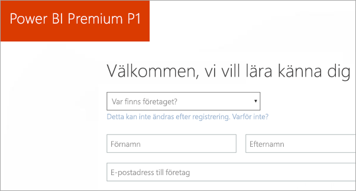
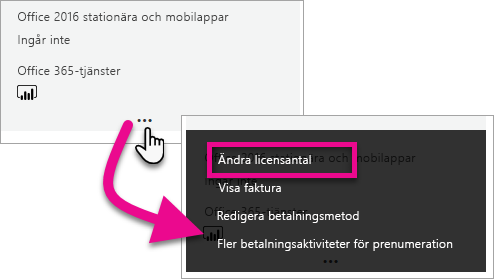
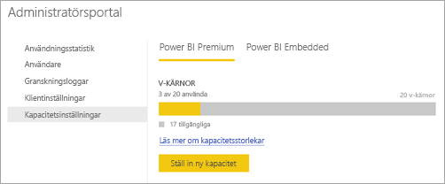
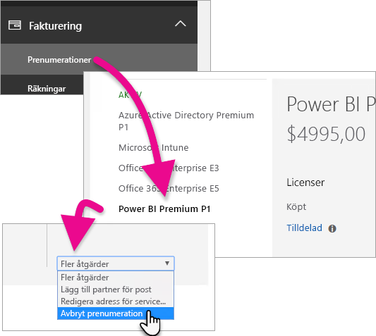
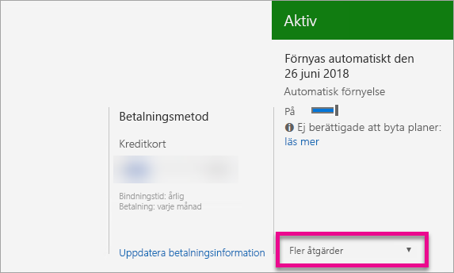

# Så här köper du Power BI Premium
Lär dig mer om hur du kan köpa Power BI Premium-kapacitet till din organisation.

<iframe width="640" height="360" src="https://www.youtube.com/embed/NkvYs5Qp4iA?rel=0&amp;showinfo=0" frameborder="0" allowfullscreen></iframe>

Du kan köpa Power BI Premium-kapacitetsnod via Administrationscenter för Office 365. Du kan dessutom ha vilken kombination av premiumkapacitets-SKU:er du vill (från P1 till P3) i din organisation. De tillhandahåller olika resursfunktioner.

Mer information om vad Power BI Premium är finns i [Power BI Premium – vad är det?](service-premium.md). Information om aktuell prissättning för Power BI finns på sidan [Power BI-prissättning](https://powerbi.microsoft.com/pricing/). Du kan också planera dina kostnader för Power BI Premium med hjälp av [Power BI Premium-kalkylatorn](https://powerbi.microsoft.com/calculator/).

> [!IMPORTANT]
> Innehållsförfattare behöver fortfarande en Power BI Pro-licens, även om du köper Power BI Premium.
> 
> 

## Skapa en ny klient med Power BI Premium P1
Om du inte har någon befintlig klient och vill skapa en, så kan du köpa Power BI Premium samtidigt. Följande länk vägleder dig genom processen med att skapa en ny klient för användning med Office 365, och ger dig möjlighet att köpa Power BI Premium. Du måste köpa en Power BI Pro-licens för en användare efter det att klienten har skapats. När du skapar klienten blir du automatiskt dess globala administratör.

Hur du genomför det här köpet beskrivs i [Power BI Premium P1-erbjudande](https://signup.microsoft.com/Signup?OfferId=b3ec5615-cc11-48de-967d-8d79f7cb0af1).

## Köp Power BI Premium-kapacitet för en befintlig organisation
Om du har en befintlig organisation måste du antingen vara global administratör eller faktureringsadministratör för att kunna köpa prenumerationer och licenser. Mer information finns i [Om Office 365-administratörsroller](https://support.office.com/article/About-Office-365-admin-roles-da585eea-f576-4f55-a1e0-87090b6aaa9d).

Om du vill köpa Premium-kapacitet måste du göra följande.

1. Välj **Office 365-appväljaren** > **Admin** i Power BI-tjänsten. Du kan också bläddra till Administrationscenter för Office 365. Du kommer dit genom att gå till https://portal.office.com och välja **Admin**.
   
    
2. Välj **Fakturering** > **Köp tjänster**.
3. Sök efter Power BI Premium-erbjudanden under **Andra alternativ**. Här visas en lista över med P1 till P3, EM3 och P1 (månad för månad).
4. Hovra över **ellipsen (...)**  och välj sedan **Köp nu**.
   
    
5. Slutför köpet genom att följa stegen.

Du kan också välja följande länkar som leder dig direkt till motsvarande objekts köpsidor. Mer information om dessa SKU:er finns i [Power BI Premium – vad är det?](service-premium.md#premiumskus).

Om du vill köpa en Power BI Premium-SKU ***måste vara global administratör eller faktureringsadministratör*** för din klient. Om du väljer någon av länkarna nedan, men inte är administratör, så genereras ett fel.

| Direktköpslänkar |
| --- |
| [EM3-SKU (månad för månad)](https://portal.office.com/commerce/completeorder.aspx?OfferId=4004702D-749C-4F74-BF47-3048F1833780&adminportal=1) |
| [P1-SKU](https://portal.office.com/commerce/completeorder.aspx?OfferId=b3ec5615-cc11-48de-967d-8d79f7cb0af1&adminportal=1) |
| [P1-SKU (månad för månad)](https://portal.office.com/commerce/completeorder.aspx?OfferId=E4C8EDD3-74A1-4D42-A738-C647972FBE81&adminportal=1) |
| [P2-SKU](https://portal.office.com/commerce/completeorder.aspx?OfferId=062F2AA7-B4BC-4B0E-980F-2072102D8605&adminportal=1) |
| [P3-SKU](https://portal.office.com/commerce/completeorder.aspx?OfferId=40c7d673-375c-42a1-84ca-f993a524fed0&adminportal=1) |

När du har slutfört köpet visas skärmen Köptjänster med information om att objektet har köpts och har aktiverats.

Nu kan du hantera den här kapaciteten i Administrationscenter för Power BI. Mer information finns i [Hantera Power BI Premium](service-admin-premium-manage.md).

## Köp mer kapacitet
När du är i avsnittet för **Premium-inställningar** i Power BI-administratörsportalen, och om du är administratör, visas knappen **Köp mer**. Den här knappen för dig till Office 365-portalen. När du är i Administrationscenter för Office 365 kan göra du följande.

1. Välj **Fakturering** > **Köp tjänster**.
2. Söka efter det Power BI Premium-objekt som du vill köpa mer av under **Andra alternativ**.
3. Hovra över **ellipsen (...)**  och välj sedan **Ändra licenskvantitet**.
   
    
4. Ändra det antal instanser av objektet som du vill ha. Välj **Skicka** när du är klar.
   
   > [!IMPORTANT]
   > När du väljer **Skicka** debiteras det anslutna kreditkortet.
   > 
   > 

Sidan **Köp tjänster** visar sedan hur många instanser du har. De tillgängliga v-kärnorna återspeglar den nya kapacitet som köpts under **Kapacitetsinställningar** i Power BI-administratörsportalen.

Nu kan du hantera den här kapaciteten i Administrationscenter för Power BI. Mer information finns i [Hantera Power BI Premium](service-admin-premium-manage.md).

## Avbryt din prenumeration
Du kan avbryta prenumerationen från Administrationscenter för Office 365. Gör följande om du vill avbryta din Premium-prenumeration.

1. Bläddra fram till Administrationscenter för Office 365.
2. Välj **Fakturering** > **Prenumerationer**.
3. Välj din Power BI Premium-prenumeration i listan.
4. Välj **Avbryt prenumeration** i listrutan **Fler åtgärder**.
   
    
5. Sidan **Avbryt prenumeration** visar huruvida du är skyldig att betala en [avgift för tidig uppsägning](https://support.office.com/article/early-termination-fees-6487d4de-401a-466f-8bc3-c0beb5cc40d3) eller inte. På den här sidan anges även när data tas bort för prenumerationen.
6. Läs igenom informationen och välj **Avbryt prenumeration** om du vill fortsätta.

## Nästa steg
[Power BI-prissättningsida](https://powerbi.microsoft.com/pricing/)  
[Power BI Premium-kalkylator](https://powerbi.microsoft.com/calculator/)  
[Power BI Premium – vad är det?](service-premium.md)  
[Hantera Power BI Premium](service-admin-premium-manage.md)  
[Vanliga frågor och svar om Power BI Premium](service-premium-faq.md)  
[Viktig information om Power BI Premium](service-premium-release-notes.md)  
[Microsoft Power BI Premium – white paper](https://aka.ms/pbipremiumwhitepaper)  
[Planera ett white paper för en företagsdistribution för Power BI](https://aka.ms/pbienterprisedeploy)  
[Power BI-administratörsportalen](service-admin-portal.md)  
[Administrera Power BI i din organisation](service-admin-administering-power-bi-in-your-organization.md)  

Har du fler frågor? [Fråga Power BI Community](http://community.powerbi.com/)

