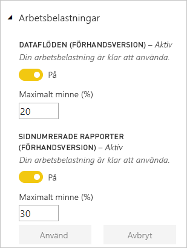

# Konfigurera arbetsbelastningar i en Premium-kapacitet

I den här artikeln beskrivs aktivering och konfigurering av arbetsbelastningar för Power BI Premium-kapaciteter. Som standard stöder kapaciteterna endast arbetsbelastningen som är associerad med att köra Power BI-frågor. Du kan också aktivera och konfigurera ytterligare arbetsbelastningar för **[AI (Cognitive Services)](service-cognitive-services.md)** , **[Dataflöden](service-dataflows-overview.md#dataflow-capabilities-on-power-bi-premium)** och **[Sidnumrerade rapporter](paginated-reports-save-to-power-bi-service.md)** .

## Standardinställningar för minne

Frågearbetsbelastningar är optimerade för och begränsade av resurser som bestäms av din Premium-kapacitets SKU. Premium-kapaciteter har också stöd för ytterligare arbetsbelastningar som kan använda din kapacitets resurser. Standardminnet för dessa arbetsbelastningar baseras på tillgängliga kapacitetsnoder för din SKU. De maximala minnesinställningarna är inte kumulativa. Minnet upp till det högsta värde som har angetts allokeras dynamiskt för AI och dataflöden, men allokeras statiskt för sidnumrerade rapporter. 

### Microsoft Office-SKU:er för SaaS-scenarier (programvara som en tjänst)

|                     | EM2                      | EM3                       | P1                      | P2                       | P3                       |
|---------------------|--------------------------|--------------------------|-------------------------|--------------------------|--------------------------|
| AI | Saknas | Saknas | 20 % standard, 20 % minimum | 20 % standard, 10 % minimum | 20 % standard, 5 % minimum |
| Dataflöden | Saknas |20 % standard, 12 % minimum  | 20 % standard, 5 % minimum  | 20 % standard, 3 % minimum | 20 % standard, 2 % minimum  |
| Sidnumrerade rapporter | Saknas |Saknas | 20 % standard, 10 % minimum | 20 % standard, 5 % minimum | 20 % standard, 2,5 % minimum |
| | | | | | |

### Microsoft Azure-SKU:er för PaaS-scenarier (plattform som en tjänst)

|                  | A1                       | A2                       | A3                      | A4                       | A5                      | A6                        |
|-------------------|--------------------------|--------------------------|-------------------------|--------------------------|-------------------------|---------------------------|
| AI | Saknas                      | 20% standard. 100% minsta                     | 20% standard. 50% minsta                     | 20 % standard, 20 % minimum | 20 % standard, 10 % minimum | 20 % standard, 5 % minimum |
| Dataflöden         | 40 % standard, 40 % minimum | 24 % standard, 24 % minimum | 20 % standard, 12 % minimum | 20 % standard, 5 % minimum  | 20 % standard, 3 % minimum | 20 % standard, 2 % minimum   |
| Sidnumrerade rapporter | Saknas                      | Saknas                      | Saknas                     | 20 % standard, 10 % minimum | 20 % standard, 5 % minimum | 20 % standard, 2,5 % minimum |
| | | | | | |

## Inställningar för arbetsbelastning

### AI (förhandsversion)

Förutom den **Max Memory** inställningen AI-arbetsbelastning har en ytterligare inställning **tillåta användning från Power BI Desktop**. Standardvärdet är **av**. Den här inställningen är reserverad för framtida användning och får inte visas i alla klienter.

### Datauppsättningar (förhandsversion)

Som standard arbetsbelastningen datauppsättningar är aktiverad och kan inte inaktiveras. Den här arbetsbelastningen innehåller en ytterligare inställning **XMLA-slutpunkten**. Standardvärdet är **1**, betydelse aktiverat. Den här inställningen anger anslutningar från klientappar respektera medlemskap i säkerhetsgruppen ange på arbetsytan och app. Mer information finns i [Anslut till datauppsättningar med program och verktyg](service-premium-connect-tools.md).

### Dataflöden

Förutom den **Max Memory** inställningen dataflöden-arbetsbelastning har en ytterligare inställning **behållarstorlek**. Den här inställningen gör det möjligt för dig att optimera dataflödet arbetsbelastningens prestanda för bearbetning av mer komplexa, beräkning omfattande dataflöden.

När du uppdaterar en dataflöde tio arbetsbelastningen dataflöde en behållare för varje entitet i dataströmmen. Varje behållare kan ta minne upp till volymen i anges i inställningen behållare storlek. Standardvärdet för alla SKU: er är **700 MB**. Du kanske vill ändra den här inställningen om:

- Dataflöden tar för lång tid att uppdatera eller dataflöde uppdateringen misslyckas på en tidsgräns.
- Dataflöde entiteter innehåller beräkning steg, till exempel en koppling.  

Det är det rekommenderas att du använder den [Power BI Premium-kapacitet](service-admin-premium-monitor-capacity.md) app för att analysera dataflöde arbetsbelastningens prestanda. 

I vissa fall kan kan öka storleken på behållaren inte förbättra prestanda. Till exempel om dataflödet blir data endast från en källa utan att utföra stora beräkningar, hjälpa ändra behållarstorlek förmodligen inte. Öka behållarstorlek leda till om det möjliggör arbetsbelastningen dataflöde att allokera mer minne för entiteten uppdateringsåtgärder. Det kan minska den tid det tar för att uppdatera kraftigt beräknade entiteter genom att använda mer minne som allokeras. 

Behållarstorlek värdet får inte överskrida det högsta mängd minnet för arbetsbelastningen dataflöden. Till exempel har en P1-kapacitet 25GB minne. Om arbetsbelastningen dataflöde Max Memory (%) har angetts till 20 procent, Container storlek (MB) får inte överskrida 5000. I samtliga fall får inte behållarens storlek överskrida Max Memory, även om du anger ett högre värde. 

### Sidnumrerade rapporter (förhandsgranskning)

Sidnumrerade rapporter kan anpassad kod som ska köras vid återgivningen av en rapport. Till exempel dynamiskt ändra textfärg baserat på innehåll, vilket kan ta mer minne. I Power BI Premium körs sidnumrerade rapporter i ett inneslutet område inom kapaciteten. Max Memory anges används *huruvida* arbetsbelastningen är aktiv. Om du ändrar inställningen maximalt minne från standard måste du ange det låga påverka nog att den inte andra arbetsbelastningar.

I vissa fall kan arbetsbelastningen sidnumrerade rapporter att vara tillgänglig. I det här fallet arbetsbelastningen visar ett feltillstånd i Admin portal och användarna ser tidsgränser för rapportåtergivning. För att lösa det här problemet, inaktivera arbetsbelastningen och sedan aktivera det igen.

## Konfigurera arbetsbelastningar

Maximera din kapacitets tillgängliga resurser genom att aktivera arbetsbelastningar endast om de ska användas. Ändra endast minnesinställningar när du har fastställt att standardinställningarna inte uppfyller dina kapacitetskrav för resursen.  

### Konfigurera arbetsbelastningar i Power BI-administratörsportalen

1. I **Kapacitetsinställningar** > **PREMIUM-KAPACITETER** väljer du en kapacitet.

1. Under **FLER ALTERNATIV** expanderar du **Arbetsbelastningar**.

1. Aktivera en eller flera arbetsbelastningar och ange ett värde för **Max minne**.   

    
    

1. Klicka på **Godkänn**.

### REST-API

Arbetsbelastningar kan aktiveras och tilldelas till en kapacitet med hjälp av [Kapaciteter](https://docs.microsoft.com/rest/api/power-bi/capacities) REST API:er.

## Övervaka arbetsbelastningar

[Power BI Premium-appen för kapacitetsmått](service-admin-premium-monitor-capacity.md) ger mått på datauppsättning, dataflöden och sidnumrerade rapporter för att övervaka arbetsbelastningar som aktiverats för din kapacitet. 

## Nästa steg

[Optimera Power BI Premium-kapaciteter](service-premium-capacity-optimize.md)     
[Dataförberedelser med självbetjäning i Power BI med dataflöden](service-dataflows-overview.md)   
[Vad är sidnumrerade rapporter i Power BI Premium?](paginated-reports-report-builder-power-bi.md)   

Har du fler frågor? [Fråga Power BI Community](http://community.powerbi.com/)